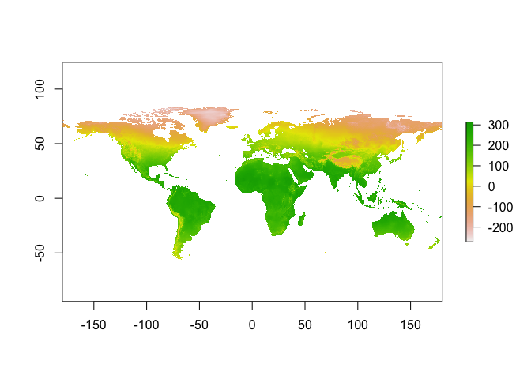
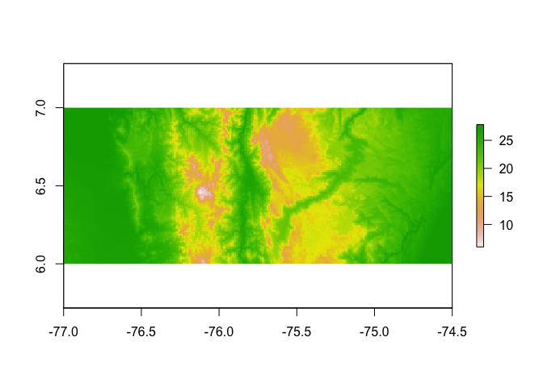
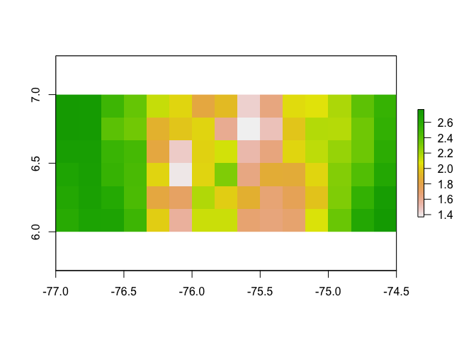
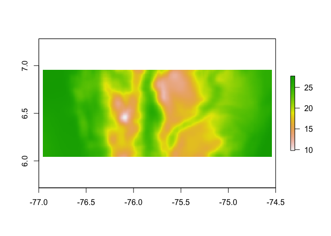
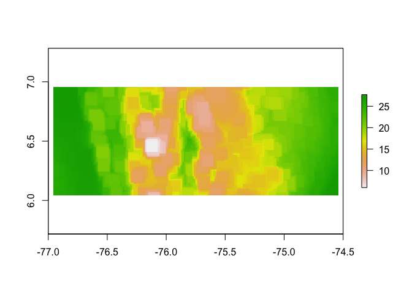

# Introduction to Raster Package
Adam M. Wilson  
February 23, 2015  


----

This script is available:

  * [SpatialAnalysisTutorials repository](http://github.com/adammwilson/SpatialAnalysisTutorials/blob/master/R_RasterIntroduction)
  * Plain text (.R) with commented text 
  [here](https://raw.githubusercontent.com/adammwilson/SpatialAnalysisTutorials/master/R_RasterIntroduction/R_RasterIntroduction.R)
 

## Starting R on Omega

On the cluster, using software can be a little more complicated because the system is set up to host many different versions of software simutaneously and thus you need to load the correct `modules` before starting the software.  If the following lines are not in your .bashrc file, you'll need to run them before starting R.   


```r
module load Apps/R/3.0.2     
module load Rpkgs/RGDAL
module load Rpkgs/GGPLOT2/1.0.0
```

We've added those modules to your `.bashrc` so you shouldn't have to run them separately.   To start R, simply type `R`:

```r
[aw524@login-0-0 ~]$ R

R version 3.0.2 (2013-09-25) -- "Frisbee Sailing"
Copyright (C) 2013 The R Foundation for Statistical Computing
Platform: x86_64-unknown-linux-gnu (64-bit)

R is free software and comes with ABSOLUTELY NO WARRANTY.
You are welcome to redistribute it under certain conditions.
Type 'license()' or 'licence()' for distribution details.

  Natural language support but running in an English locale

R is a collaborative project with many contributors.
Type 'contributors()' for more information and
'citation()' on how to cite R or R packages in publications.

Type 'demo()' for some demos, 'help()' for on-line help, or
'help.start()' for an HTML browser interface to help.
Type 'q()' to quit R.
>
```


## Loading packages
Loading packages works pretty much the same way on the cluster as it does on your computer (e.g. `library(...)`), but you will need to specify the location of the library on disk if there is no R package module available.    However, this only works for packages that you already have installed on your system.  To install new packages, you can use `install.packages()` (or use the package manager if you are working in RStudio). 

R may ask you to choose a CRAN mirror. CRAN is the distributed network of servers that provides access to R's software.  It doesn't really matter which you chose, but closer ones are likely to be faster.  From RStudio, you can select the mirror under Tools→Options or just wait until it asks you.

If you run `install.packages(raster)` on Omega, you will probably see something like this:


```r
install.packages("raster")
Installing package into ‘/lustre/home/client/apps/fas/Rpkgs/GGPLOT2/1.0.0/3.0’
(as ‘lib’ is unspecified)
Warning in install.packages("raster") :
  'lib = "/lustre/home/client/apps/fas/Rpkgs/GGPLOT2/1.0.0/3.0"' is not writable
Would you like to use a personal library instead?  (y/n) y
Would you like to create a personal library
~/R/x86_64-unknown-linux-gnu-library/3.0
to install packages into?  (y/n) y
--- Please select a CRAN mirror for use in this session ---
```

Which is fine, you can install a personal copy of a library in any directory you choose (the default location is usually fine).  Once the package is installed, you can simply type `library(package)` where `package` is the name of the package you want to load.  


```r
library(raster)
```

Alternatively, you can point to Adam's personal library to avoid this extra step:


```r
library(raster,lib.loc="/lustre/scratch/client/fas/geodata/aw524/R/")
```

Below we'll run though several of the examples from the excellant [Raster vignette](http://cran.r-project.org/web/packages/raster/vignettes/Raster.pdf) by Robert J. Hijmans.


```r
x <- raster()
x
```

```
## class       : RasterLayer 
## dimensions  : 180, 360, 64800  (nrow, ncol, ncell)
## resolution  : 1, 1  (x, y)
## extent      : -180, 180, -90, 90  (xmin, xmax, ymin, ymax)
## coord. ref. : +proj=longlat +datum=WGS84 +ellps=WGS84 +towgs84=0,0,0
```


```r
x <- raster(ncol=36, nrow=18, xmn=-1000, xmx=1000, ymn=-100, ymx=900)
res(x)
```

```
## [1] 55.55556 55.55556
```

```r
res(x) <- 100
res(x)
```

```
## [1] 100 100
```

```r
ncol(x)
```

```
## [1] 20
```


```r
# change the numer of columns (affects resolution)
ncol(x) <- 18
ncol(x)
```

```
## [1] 18
```

```r
res(x)
```

```
## [1] 111.1111 100.0000
```

## Spatial Projections and data storage
Raster package uses the standard [coordinate reference system (CRS)](http://www.spatialreference.org).  For example, see the projection format for the [_standard_ WGS84](http://www.spatialreference.org/ref/epsg/4326/).

```r
projection(x) <- "+proj=longlat +ellps=WGS84 +datum=WGS84 +no_defs "
x
```

```
## class       : RasterLayer 
## dimensions  : 10, 18, 180  (nrow, ncol, ncell)
## resolution  : 111.1111, 100  (x, y)
## extent      : -1000, 1000, -100, 900  (xmin, xmax, ymin, ymax)
## coord. ref. : +proj=longlat +ellps=WGS84 +datum=WGS84 +no_defs +towgs84=0,0,0
```


```r
r <- raster(ncol=10, nrow=10)
ncell(r)
```

```
## [1] 100
```

```r
hasValues(r)
```

```
## [1] FALSE
```


Use the 'values' function > # e.g.,

```r
values(r) <- 1:ncell(r)
hasValues(r)
```

```
## [1] TRUE
```

```r
inMemory(r)
```

```
## [1] TRUE
```

```r
values(r)[1:10]
```

```
##  [1]  1  2  3  4  5  6  7  8  9 10
```

```r
plot(r, main='Raster with 100 cells')
```

 

> You can change the memory options using the `maxmemory` option in `rasterOptions()` 

## Work with climate data

First set the path to the data directory.  You'll need to uncomment the line setting the directory to `lustre/...`.


```r
datadir="data/"
#datadir="/lustre/scratch/client/fas/geodata/aw524/data/"
```


```r
## we can use the paste0() command to construct a filename
paste0(datadir,"worldclim/bio_1.bil")
```

```
## [1] "data/worldclim/bio_1.bil"
```

```r
## now use that to load the raster dataset:
tmean=raster(paste0(datadir,"worldclim/bio_1.bil"))
## and inspect the object
tmean
```

```
## class       : RasterLayer 
## dimensions  : 18000, 43200, 777600000  (nrow, ncol, ncell)
## resolution  : 0.008333333, 0.008333333  (x, y)
## extent      : -180, 180, -60, 90  (xmin, xmax, ymin, ymax)
## coord. ref. : +proj=longlat +ellps=WGS84 +towgs84=0,0,0,0,0,0,0 +no_defs 
## data source : /Users/adamw/repos/SpatialAnalysisTutorials/R_RasterIntroduction/data/worldclim/bio_1.bil 
## names       : bio_1 
## values      : -290, 320  (min, max)
```

Note the min/max of the raster.  What are the units?  It's always important to read over the documentation for any dataset to be sure you are using it correctly.  In this case, the [WorldClim temperature dataset](http://www.worldclim.org/formats) has a `gain` of 0.1, meaning that to convert back to degrees Celsius, you need to multiply by 0.1.  You can do this in the raster package with `gain()` 

```r
gain(tmean)=0.1
plot(tmean)
```

 

Let's dig a little deeper into the data object:


```r
## is it held in RAM?
inMemory(tmean)
```

```
## [1] FALSE
```

```r
## How big is it?
object.size(tmean)
```

```
## 11728 bytes
```

```r
## can we work with it directly in RAM?
canProcessInMemory(tmean)
```

```
## [1] FALSE
```

```r
## And the full data structure:
str(tmean)
```

```
## Formal class 'RasterLayer' [package "raster"] with 12 slots
##   ..@ file    :Formal class '.RasterFile' [package "raster"] with 13 slots
##   .. .. ..@ name        : chr "/Users/adamw/repos/SpatialAnalysisTutorials/R_RasterIntroduction/data/worldclim/bio_1.bil"
##   .. .. ..@ datanotation: chr "INT2S"
##   .. .. ..@ byteorder   : chr "little"
##   .. .. ..@ nodatavalue : num -Inf
##   .. .. ..@ NAchanged   : logi FALSE
##   .. .. ..@ nbands      : int 1
##   .. .. ..@ bandorder   : chr "BIL"
##   .. .. ..@ offset      : int 0
##   .. .. ..@ toptobottom : logi TRUE
##   .. .. ..@ blockrows   : int 1
##   .. .. ..@ blockcols   : int 43200
##   .. .. ..@ driver      : chr "gdal"
##   .. .. ..@ open        : logi FALSE
##   ..@ data    :Formal class '.SingleLayerData' [package "raster"] with 13 slots
##   .. .. ..@ values    : logi(0) 
##   .. .. ..@ offset    : num 0
##   .. .. ..@ gain      : num 0.01
##   .. .. ..@ inmemory  : logi FALSE
##   .. .. ..@ fromdisk  : logi TRUE
##   .. .. ..@ isfactor  : logi FALSE
##   .. .. ..@ attributes: list()
##   .. .. ..@ haveminmax: logi TRUE
##   .. .. ..@ min       : num -290
##   .. .. ..@ max       : num 320
##   .. .. ..@ band      : int 1
##   .. .. ..@ unit      : chr ""
##   .. .. ..@ names     : chr "bio_1"
##   ..@ legend  :Formal class '.RasterLegend' [package "raster"] with 5 slots
##   .. .. ..@ type      : chr(0) 
##   .. .. ..@ values    : logi(0) 
##   .. .. ..@ color     : logi(0) 
##   .. .. ..@ names     : logi(0) 
##   .. .. ..@ colortable: logi(0) 
##   ..@ title   : chr(0) 
##   ..@ extent  :Formal class 'Extent' [package "raster"] with 4 slots
##   .. .. ..@ xmin: num -180
##   .. .. ..@ xmax: num 180
##   .. .. ..@ ymin: num -60
##   .. .. ..@ ymax: num 90
##   ..@ rotated : logi FALSE
##   ..@ rotation:Formal class '.Rotation' [package "raster"] with 2 slots
##   .. .. ..@ geotrans: num(0) 
##   .. .. ..@ transfun:function ()  
##   ..@ ncols   : int 43200
##   ..@ nrows   : int 18000
##   ..@ crs     :Formal class 'CRS' [package "sp"] with 1 slot
##   .. .. ..@ projargs: chr "+proj=longlat +ellps=WGS84 +towgs84=0,0,0,0,0,0,0 +no_defs"
##   ..@ history : list()
##   ..@ z       : list()
```


# Modifying raster* objects

## Spatial cropping

```r
## crop to a latitude/longitude box
r1 <- crop(tmean, extent(-77,-74.5,6,7))
r1
```

```
## class       : RasterLayer 
## dimensions  : 120, 300, 36000  (nrow, ncol, ncell)
## resolution  : 0.008333333, 0.008333333  (x, y)
## extent      : -77, -74.5, 6, 7  (xmin, xmax, ymin, ymax)
## coord. ref. : +proj=longlat +ellps=WGS84 +towgs84=0,0,0,0,0,0,0 +no_defs 
## data source : in memory
## names       : bio_1 
## values      : 0.6, 2.78  (min, max)
```

```r
plot(r1)
```

 

## Spatial aggregation

```r
## aggregate using a function
ra <- aggregate(r1, 20, fun=mean)
plot(ra)
```

 

> Now try to aggregate to the minimum (`min`) value with each 10 pixel window

## Focal ("moving window") operation

```r
## apply a function over a moving window
rf <- focal(r1, w=matrix(1,11,11), fun=mean)
plot(rf)
```

 


```r
## apply a function over a moving window
rf_min <- focal(r1, w=matrix(1,11,11), fun=min)
rf_max <- focal(r1, w=matrix(1,11,11), fun=max)
rf_range=rf_max-rf_min

## or just use the range function
rf_range2 <- focal(r1, w=matrix(1,11,11), fun=range)
plot(rf_range2)
```

 


## Raster calculations

the `raster` package has many options for _raster algebra_, including `+`, `-`, `*`, `/`, logical operators such as `>`, `>=`, `<`, `==`, `!` and functions such as `abs`, `round`, `ceiling`, `floor`, `trunc`, `sqrt`, `log`, `log10`, `exp`, `cos`, `sin`, `max`, `min`, `range`, `prod`, `sum`, `any`, `all`.

So, for example, you can 

```r
cellStats(r1,range)
```

```
## [1] 0.60 2.78
```

```r
## add 10
s = r1 + 10
cellStats(s,range)
```

```
## [1] 10.60 12.78
```

```r
## take the square root
s = sqrt(r1)
cellStats(s,range)
```

```
## [1] 0.7745967 1.6673332
```

```r
# round values
r = round(r1)
cellStats(r,range)
```

```
## [1] 1 3
```

```r
# find cells with values less than 2 degrees C
r = r1 < 2
cellStats(r,range)
```

```
## [1] 0 1
```

```r
plot(r)
```

 

```r
# multiply s time r and add 5
s = s * r1 + 5
cellStats(s,range)
```

```
## [1] 5.464758 9.635186
```


