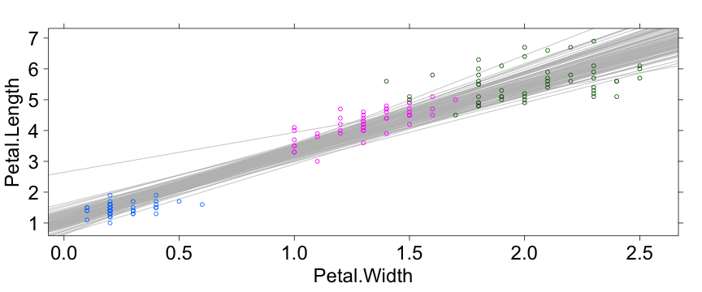

ParallelR
========================================================
author: Adam M. Wilson
date: November 5, 2013


R for "embarrassingly parallel" jobs
========================================================
Single instruction -- multiple data (SIMD)
- same program on different subsets/datasets
  - e.g. species or climate projections
  - MCMC chains
- each job independent


Two methods:
==========================
1. Parallel loops within an R script
  - starts on single processor
  - runs looped elements on multiple 'slave' processors
  - returns results of all iterations to the original instance
  - foreach, multicore, plyr, raster
2. Run many instances of same R script in parallel
  - need another operation to combine the results
  - preferable for long, complex jobs

the foreach {…} loop
========================================================
Register the "parallel backend:"
<small style="font-size:.7em"> 

```r
## use the multicore library
library(doMC)
ProcCount <- 8
# registers specified number of workers  or
registerDoMC(ProcCount)
# Or, reserve all all available cores 
registerDoMC()		
# check how many cores (workers) are registered
getDoParWorkers() 	
```

```
[1] 2
```

</small>

the foreach {…} loop
========================================================
<small style="font-size:.7em"> 

```r
## number of replicates
trials <- 100

Result <- foreach(1:trials,.combine = cbind) %dopar% 
    {
    	ind <- sample(150, 10, replace = TRUE)
    	result1 <- lm(Petal.Length~Petal.Width,
                    data=iris[ind,])
    	coefficients(result1)
    }

# Result contains  output
Result[,1:4]
```

```
            result.1 result.2 result.3 result.4
(Intercept)   0.8536    1.161   0.9671    1.202
Petal.Width   2.4738    2.222   2.3046    2.215
```

</small>

the foreach {…} loop
========================================================
<small style="font-size:.7em"> 

```r
xyplot(Petal.Length~Petal.Width,groups=Species,
       data=iris)+
layer(lapply(1:ncol(Result),function(i) 
  panel.abline(a=Result[1,i],b=Result[2,i],
               col="grey")),
      under=T)
```

 

</small>

Foreach Documentation
========================================================
 [doMC](http://cran.r-project.org/web/packages/doMC/index.html) works great on multicore machines, but not all...
### Other backends:
- [doMPI](http://cran.r-project.org/web/packages/doMPI/vignettes/doMPI.pdf): Interface to MPI (Message-Passing Interface)
- [doSNOW](http://cran.r-project.org/web/packages/doSNOW/doSNOW.pdf): Simple Network of Workstations

### Documentation for foreach:
- [foreach](http://cran.r-project.org/web/packages/foreach/vignettes/foreach.pdf)
- [Nested Loops](http://cran.r-project.org/web/packages/foreach/vignettes/nested.pdf)


QSUB and R
=====================
Need to edit R script to 'behave' like a normal #! (linux command line) script.  This is easy with [getopt](http://cran.r-project.org/web/packages/getopt/index.html) package. 
<small style="font-size:.7em"> 

```r
library(getopt)
## get options
opta <- getopt(matrix(c(
                        'date', 'd', 1, 'character',
                        'help', 'h', 0, 'logical'
                        ), ncol=4, byrow=TRUE))
if ( !is.null(opta$help) )
  {
       prg <- commandArgs()[1];
          cat(paste("Usage: ", prg,  " --date | -d <file> :: The date to process\n", sep=""));
          q(status=1);
     }
## extract value
 date=opta$date 
```

```{R,eval=F}
Rscript script.R --date 20131105 
```
</small>

Driving cluster from R
======================
Possible to drive the cluster from within R via QSUB.  First, define the jobs:
<small style="font-size:.7em"> 

```r
script="/path/to/Rscript.r"

write.table(
  paste(script,"--date",dates),                     
  file="process.txt",
  row.names=F,col.names=F,quote=F)

### Set up submission script
queue="devel"
nodes=120
walltime=24
```

</small>

Write the QSUB script
======================
<small style="font-size:.7em"> 

```r
### write qsub script to disk from R
cat(paste("
#PBS -S /bin/bash
#PBS -l select=",nodes,":ncpus=8:mpiprocs=8
#PBS -l walltime=",walltime,":00:00
#PBS -q ",queue,"

CORES=",nodes*8,"

source $HDIR/etc/environ.sh
IDIR=/nobackupp1/awilso10/mod35/
WORKLIST=$IDIR/process.txt
EXE=Rscript
LOGSTDOUT=$IDIR/log/mod35_stdout
LOGSTDERR=$IDIR/log/mod35_stderr
          
### use mpiexec to parallelize across days
mpiexec -np $CORES pxargs -a $WORKLIST -p $EXE 1> $LOGSTDOUT 2> $LOGSTDERR
",sep=""),file=paste("mod35_qsub",sep=""))

## run it!
system(paste("qsub mod35_qsub",sep=""))
```

</small>

Choose your method
==================================
### Run from master process (e.g. foreach)
- easier to implement and collect results
- fragile (one failure can kill it)
- clumsy for *big* jobs

### Run as separate R processes via pxargs
- safer for big jobs: each job totally independent
- easy to re-run incomplete submissions
- compatible with qsub
- forces you to have a clean processing script

