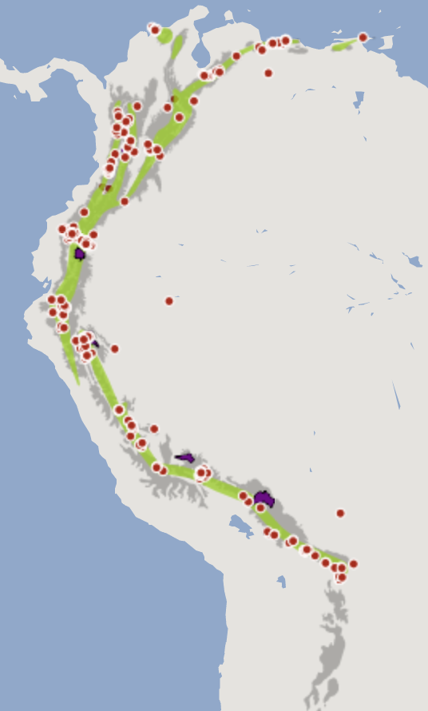

```{r setup, echo=FALSE, message=FALSE, results='hide', purl=FALSE}
## This chunk automatically generates a text .R version of this script when running within knitr.  You do not need to run this...
library(knitr)
input  = knitr::current_input()  # filename of input document
input="SDM_intro/SDM.Rmd"
output = paste(tools::file_path_sans_ext(input), 'R', sep = '.')
#knitr::purl(input,output,documentation=2,quiet=T)
repo="adammwilson/SpatialAnalysisTutorials/blob/master"
knitr::opts_chunk$set(cache=T)

#Sys.setenv(PATH="/Library/Frameworks/GDAL.framework/Programs/:/Library/Frameworks/Python.framework/Versions/2.7/bin:/Applications/:${PATH}")
```


This script is available:

  * [SpatialAnalysisTutorials repository](`r paste0("http://github.com/",repo)`)
  * Plain text (.R) with commented text 
  [here](`r paste0("https://raw.githubusercontent.com/adammwilson/SpatialAnalysisTutorials/master/",output)`)


## Objectives

In this session we will:

 1. Process some raster environmental data
 2. Process occurrence data from various sources
 3. Fit a Bayesian species distribution model using the observations and environmental data
 4. Predict across the landscape and write the results to disk as a geotif (for use in GIS, etc.)


## Starting R on Omega

Remember to `source` the .bashrc file at the `$` prompt and then start `R`.
```{}
source .bashrc
R
```

And load some packages (either from your own privaite library or from mine).
```{r,results='hide',message=FALSE}
library(rgdal)
packages=c("raster","dismo","maptools","sp","maps","rgeos","doParallel","rMOL","reshape","rasterVis","ggplot2","knitr")
.libPaths(new="/lustre/scratch/client/fas/geodata/aw524/R/")
needpackages=packages[!packages%in%rownames(installed.packages())]
lapply(needpackages,install.packages)
lapply(packages, require, character.only=T,quietly=T)

rasterOptions(chunksize=1000,maxmemory=1000)
```

## Load climate data

First set the path to the data directory.  You'll need to uncomment the line setting the directory to `lustre/...`.

```{r}
datadir="~/work/env/"
#datadir="/lustre/scratch/client/fas/geodata/aw524/data"
```

And create an output directory `outputdir` to hold the outputs.  It's a good idea to define these as variables so it's easy to change them later if you move to a different machine.  
```{r}
outputdir="~/scratch/data/tmp"
## check that the directory exists, and if it doesn't then create it.
if(!file.exists(outputdir)) dir.create(outputdir,recursive=T)
```

## Example Species: *Montane Woodcreeper* (_Lepidocolaptes lacrymiger_)


<br><span style="color:grey; font-size:1em;">Figure from [hbw.com](http://www.hbw.com/species/montane-woodcreeper-lepidocolaptes-lacrymiger) </span>

> This species has a large range, occurring from the coastal cordillera of Venezuela along the Andes south to south-east Peru and central Bolivia. [birdlife.org](http://www.birdlife.org/datazone/speciesfactsheet.php?id=31946)



<br><span style="color:grey; font-size:1em;">Data via [MOL.org](http://map.mol.org/maps/Lepidocolaptes%20lacrymiger) </span>


Set species name:
```{r}
species="Lepidocolaptes_lacrymiger"

## Extract data from MOL
dsp=MOLget(species,type=c("points","range"))
```

## Explore dsp object

```{r}
names(dsp)

range=dsp[["range"]]
range

points=dsp[["points"]]
points@data[,c("lon","lat")]=coordinates(points)
points
```

## Load eBird sampling dataset

```{r}
## link to global sampling raster
gsampling=raster(file.path(datadir,"eBirdSampling_filtered.tif"))
## crop to species range to create modelling domain
sampling=crop(gsampling,range,file.path(outputdir,"sampling.grd"),overwrite=T)   
## assign projection
projection(sampling)="+proj=longlat +datum=WGS84 +no_defs +ellps=WGS84 +towgs84=0,0,0"

## convert to points within data region
samplingp=as(sampling,"SpatialPointsDataFrame")
samplingp=samplingp[samplingp$eBirdSampling_filtered>0,]

## edit column names to allow aligning with presence observations
colnames(samplingp@data)=c("observation")
samplingp$presence=0
```

## Create a combined presence-nondetection point dataset
```{r}
pdata=rbind(points[,"presence"],samplingp[,"presence"])
pdata@data[,c("lon","lat")]=coordinates(pdata)
table(pdata$presence)
```


## Environmental data processing

```{r}
## list of environmental rasters to use (names are used to re-name rasters):
fenv=c(
  cld="cloud/meanannual.tif",
  cld_intra="cloud/intra.tif",
  elev="elevation_mn_GMTED2010_mn.tif",
  forest="tree_mn_percentage_GFC2013.tif")
```
> If you want to explore using other variables, you can use `list.files(datadir,recursive=T)` to see all the available files.


To facilitate modelling, let's crop the global rasters to a smaller domain.  We can use the extent of the expert range and the `crop()` function in raster package.
```{r,results='hide'}
## crop to species domain and copy to project folder 
env=foreach(i=1:length(fenv))%do%{
  fo=file.path(outputdir,paste0(names(fenv)[i],"_clipped.grd"))
  crop(raster(file.path(datadir,fenv[i])),range,file=fo,overwrite=T)   
}
```

Read the environmental data in as a raster stack
```{r,ImportRaster}
env=stack(list.files(path = outputdir, pattern="*_clipped.grd$" , full.names = TRUE ))
env
## rename layers for convenience
names(env)=names(fenv)
## mask by elevation to set ocean to 0
env=mask(env,env[["elev"]],maskvalue=0)
## check out the plot
plot(env)
```

Variable selection is tricky business and we're not going to dwell on it here... We'll use the following variables.
```{r}
vars=c("cld","cld_intra","elev","forest")
```

Scaling and centering the environmental variables to zero mean and variance of 1, using the ```scale``` function is typically a good idea.  However, with so many people using this node at the same time, we'll skip this memory intensive step and use the unstandardized variables.  The downside of this is the regression coefficients are more difficult to interpret.  
```{r scaledata}
#senv=scale(env[[vars]])
senv=env[[vars]]
```


## Annotate the point records with the scaled environmental data
Add the (scaled) environmental data to each point
```{r}
pointsd=raster::extract(senv,pdata,sp=T)
pointsd=na.exclude(pointsd)
```

## Explore the data
Plotting the response (presence/absence data) and the predictors:
```{r,warning=FALSE}
## convert to 'long' format for easier plotting
pointsdl=reshape::melt(pointsd@data,id.vars=c("lat","lon","presence"),variable.name="variable")

ggplot(pointsdl,aes(x=value,y=presence))+facet_wrap(~variable)+
  geom_point()+
  stat_smooth(method = "lm", formula = y ~ x + I(x^2), col="red")+
  geom_smooth(method="gam",formula=y ~ s(x, bs = "cs"))
```

## Fit a simple GLM to the data
```{r,results='asis'}
kable(head(pointsd))
```

```{r}
m1=glm(presence~cld+cld_intra+elev*I(elev^2)+forest,data=pointsd,family=binomial(logit))
summary(m1)
```

### Prediction

## Calculate estimates of p(occurrence) for each cell.  
We can use the `predict` function in the `raster` package to make the predictions across the full raster grid and save the output.

```{r}
p1=raster::predict(senv,m1,type="response",file=file.path(outputdir,"prediction.grd"),overwrite=T)
```

Plot the results as a map:
```{r}
gplot(p1,max=1e5)+geom_tile(aes(fill=value))+
  scale_fill_gradientn(colours=c("blue","green","yellow","orange","red"),na.value = "transparent")+
  geom_polygon(aes(x=long,y=lat,group=group),
               data=fortify(range),fill="transparent",col="darkred")+
  geom_point(aes(x = lon, y = lat), data = points@data,col="black",size=1)+
  coord_equal()
```


# Summary

In this script we have illustrated a complete workflow, including:

 1. Extracting species data from an online database
 2. Pre-processing large spatial datasets for analysis
 3. Running a (simple) logistic GLM Species Distribution Model to make a prediction of p(occurrence|environment)
 4. Writing results to disk
 
