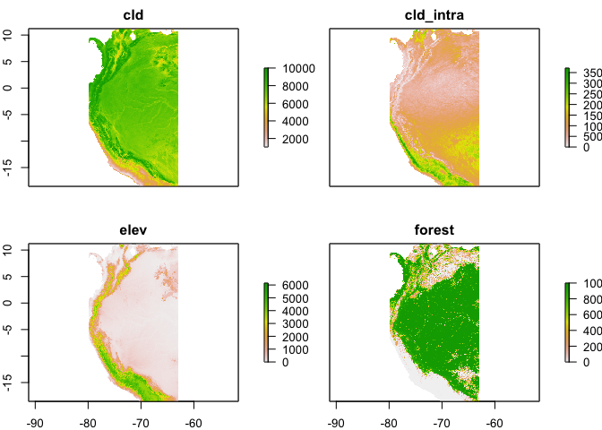
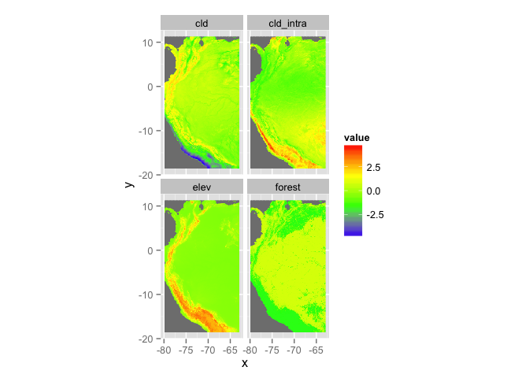
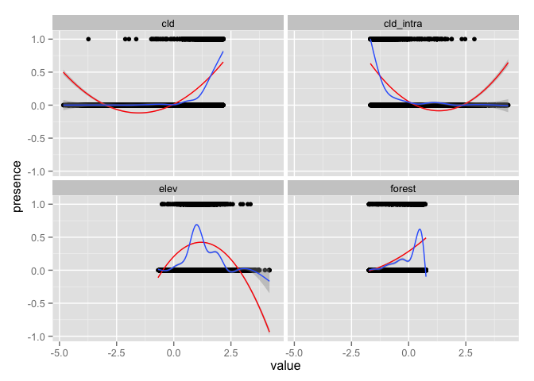
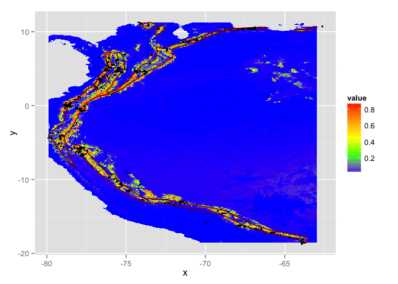

This script is available:

-   [SpatialAnalysisTutorials repository](http://github.com/adammwilson/SpatialAnalysisTutorials/blob/master/SDM_intro)
-   Plain text (.R) with commented text [here](https://raw.githubusercontent.com/adammwilson/SpatialAnalysisTutorials/master/Woodcreeper/SDM.R)

In this session we will perform a simple species distribution model workflow for the Solitary Tinamou (Tinamus solitarius).
 Illustration by Joseph Smit, 1895

Objectives
----------

In this session we will:

1.  Process some raster environmental data
2.  Process occurrence data from various sources
3.  Fit a Bayesian species distribution model using the observations and environmental data
4.  Predict across the landscape and write the results to disk as a geotif (for use in GIS, etc.)

Starting R on Omega
-------------------

Remember to `source` the .bashrc file at the `$` prompt and then start `R`.

    source .bashrc
    R

And load some packages (either from your own privaite library or from mine).

``` {.r}
packages=c("raster","dismo","maptools","sp","maps","dplyr","rgdal","rgeos","doParallel","rMOL","tidyr","rasterVis","knitr")

needpackages=packages[!packages%in%rownames(installed.packages())]
lapply(needpackages,install.packages)
lapply(packages, require, character.only=T,quietly=T)
lapply(packages, require, character.only=T,quietly=T, lib.loc="/lustre/scratch/client/fas/geodata/aw524/R/")
```

Load climate data
-----------------

First set the path to the data directory. You'll need to uncomment the line setting the directory to `lustre/...`.

``` {.r}
datadir="~/work/env/"
#datadir="/lustre/scratch/client/fas/geodata/aw524/data/worldclim"
```

And create an output directory `outputdir` to hold the outputs. It's a good idea to define these as variables so it's easy to change them later if you move to a different machine.

``` {.r}
outputdir="~/scratch/data/tmp"
## check that the directory exists, and if it doesn't then create it.
if(!file.exists(outputdir)) dir.create(outputdir,recursive=T)
```

``` {.r}
species="Lepidocolaptes_lacrymiger"

## Extract data from MOL
dsp=MOLget(species,type=c("points","range"))
```

    ## OGR data source with driver: GeoJSON 
    ## Source: "http://mol.cartodb.com/api/v2/sql?q=SELECT%20ST_TRANSFORM(the_geom_webmercator,4326)%20as%20the_geom,%20*%20FROM%20get_detail_map('Lepidocolaptes%20lacrymiger')%20WHERE%20type='points'%20AND%20ST_GeometryType(the_geom_webmercator)%20=%20'ST_Point'&format=geojson", layer: "OGRGeoJSON"
    ## with 3441 features and 7 fields
    ## Feature type: wkbPoint with 2 dimensions
    ## OGR data source with driver: GeoJSON 
    ## Source: "http://mol.cartodb.com/api/v2/sql?q=SELECT%20ST_TRANSFORM(the_geom_webmercator,4326)%20as%20the_geom,%20*%20FROM%20get_species_tile('Lepidocolaptes%20lacrymiger')%20WHERE%20type='range'%20AND%20ST_GeometryType(the_geom_webmercator)%20=%20'ST_MultiPolygon'&format=geojson", layer: "OGRGeoJSON"
    ## with 2 features and 5 fields
    ## Feature type: wkbMultiPolygon with 2 dimensions

``` {.r}
## Explore dsp object
str(dsp)
```

    ## List of 2
    ##  $ points:Formal class 'SpatialPointsDataFrame' [package "sp"] with 5 slots
    ##   .. ..@ data       :'data.frame':   3441 obs. of  7 variables:
    ##   .. .. ..$ cartodb_id : Factor w/ 3441 levels "ebird_sep2014-100145",..: 2613 3264 3296 184 325 359 406 408 411 412 ...
    ##   .. .. ..$ type       : Factor w/ 1 level "points": 1 1 1 1 1 1 1 1 1 1 ...
    ##   .. .. ..$ provider   : Factor w/ 2 levels "ebird","gbif": 1 1 1 1 1 1 1 1 1 1 ...
    ##   .. .. ..$ seasonality: int [1:3441] 0 0 0 0 0 0 0 0 0 0 ...
    ##   .. .. ..$ presence   : int [1:3441] 1 1 1 1 1 1 1 1 1 1 ...
    ##   .. .. ..$ uncertainty: Factor w/ 177 levels "0","100","1000",..: 171 96 NA 3 58 33 NA NA NA NA ...
    ##   .. .. ..$ date       : Factor w/ 1886 levels "1918-10-24T02:00:00+0200",..: 141 147 78 249 196 219 129 127 228 354 ...
    ##   .. ..@ coords.nrs : num(0) 
    ##   .. ..@ coords     : num [1:3441, 1:2] -78.8 -77.9 -73.8 -66.5 -79.1 ...
    ##   .. .. ..- attr(*, "dimnames")=List of 2
    ##   .. .. .. ..$ : NULL
    ##   .. .. .. ..$ : chr [1:2] "coords.x1" "coords.x2"
    ##   .. ..@ bbox       : num [1:2, 1:2] -79.9 -18.7 -62.6 11.2
    ##   .. .. ..- attr(*, "dimnames")=List of 2
    ##   .. .. .. ..$ : chr [1:2] "coords.x1" "coords.x2"
    ##   .. .. .. ..$ : chr [1:2] "min" "max"
    ##   .. ..@ proj4string:Formal class 'CRS' [package "sp"] with 1 slot
    ##   .. .. .. ..@ projargs: chr "+proj=longlat +datum=WGS84 +no_defs +ellps=WGS84 +towgs84=0,0,0"
    ##  $ range :Formal class 'SpatialPolygonsDataFrame' [package "sp"] with 5 slots
    ##   .. ..@ data       :'data.frame':   2 obs. of  5 variables:
    ##   .. .. ..$ cartodb_id : Factor w/ 2 levels "iucn_birds-10817",..: 2 1
    ##   .. .. ..$ type       : Factor w/ 1 level "range": 1 1
    ##   .. .. ..$ provider   : Factor w/ 2 levels "iucn","jetz": 2 1
    ##   .. .. ..$ seasonality: int [1:2] 1 1
    ##   .. .. ..$ presence   : int [1:2] 1 1
    ##   .. ..@ polygons   :List of 2
    ##   .. .. ..$ :Formal class 'Polygons' [package "sp"] with 5 slots
    ##   .. .. .. .. ..@ Polygons :List of 5
    ##   .. .. .. .. .. ..$ :Formal class 'Polygon' [package "sp"] with 5 slots
    ##   .. .. .. .. .. .. .. ..@ labpt  : num [1:2] -71.9 -12.6
    ##   .. .. .. .. .. .. .. ..@ area   : num 10.4
    ##   .. .. .. .. .. .. .. ..@ hole   : logi FALSE
    ##   .. .. .. .. .. .. .. ..@ ringDir: int 1
    ##   .. .. .. .. .. .. .. ..@ coords : num [1:363, 1:2] -76 -76 -76 -76 -76 ...
    ##   .. .. .. .. .. ..$ :Formal class 'Polygon' [package "sp"] with 5 slots
    ##   .. .. .. .. .. .. .. ..@ labpt  : num [1:2] -75.83 2.28
    ##   .. .. .. .. .. .. .. ..@ area   : num 18
    ##   .. .. .. .. .. .. .. ..@ hole   : logi FALSE
    ##   .. .. .. .. .. .. .. ..@ ringDir: int 1
    ##   .. .. .. .. .. .. .. ..@ coords : num [1:771, 1:2] -66.2 -66.2 -66.2 -66.3 -66.3 ...
    ##   .. .. .. .. .. ..$ :Formal class 'Polygon' [package "sp"] with 5 slots
    ##   .. .. .. .. .. .. .. ..@ labpt  : num [1:2] -63.8 10.3
    ##   .. .. .. .. .. .. .. ..@ area   : num 0.311
    ##   .. .. .. .. .. .. .. ..@ hole   : logi FALSE
    ##   .. .. .. .. .. .. .. ..@ ringDir: int 1
    ##   .. .. .. .. .. .. .. ..@ coords : num [1:51, 1:2] -63.9 -64.1 -64.1 -64.1 -64.2 ...
    ##   .. .. .. .. .. ..$ :Formal class 'Polygon' [package "sp"] with 5 slots
    ##   .. .. .. .. .. .. .. ..@ labpt  : num [1:2] -72.9 10.2
    ##   .. .. .. .. .. .. .. ..@ area   : num 0.416
    ##   .. .. .. .. .. .. .. ..@ hole   : logi FALSE
    ##   .. .. .. .. .. .. .. ..@ ringDir: int 1
    ##   .. .. .. .. .. .. .. ..@ coords : num [1:52, 1:2] -73.1 -73.1 -73.1 -73.1 -73.2 ...
    ##   .. .. .. .. .. ..$ :Formal class 'Polygon' [package "sp"] with 5 slots
    ##   .. .. .. .. .. .. .. ..@ labpt  : num [1:2] -73.5 10.8
    ##   .. .. .. .. .. .. .. ..@ area   : num 0.554
    ##   .. .. .. .. .. .. .. ..@ hole   : logi FALSE
    ##   .. .. .. .. .. .. .. ..@ ringDir: int 1
    ##   .. .. .. .. .. .. .. ..@ coords : num [1:63, 1:2] -73.5 -73.5 -73.6 -73.6 -73.6 ...
    ##   .. .. .. .. ..@ plotOrder: int [1:5] 2 1 5 4 3
    ##   .. .. .. .. ..@ labpt    : num [1:2] -75.83 2.28
    ##   .. .. .. .. ..@ ID       : chr "0"
    ##   .. .. .. .. ..@ area     : num 29.6
    ##   .. .. ..$ :Formal class 'Polygons' [package "sp"] with 5 slots
    ##   .. .. .. .. ..@ Polygons :List of 5
    ##   .. .. .. .. .. ..$ :Formal class 'Polygon' [package "sp"] with 5 slots
    ##   .. .. .. .. .. .. .. ..@ labpt  : num [1:2] -75.83 2.28
    ##   .. .. .. .. .. .. .. ..@ area   : num 18
    ##   .. .. .. .. .. .. .. ..@ hole   : logi FALSE
    ##   .. .. .. .. .. .. .. ..@ ringDir: int 1
    ##   .. .. .. .. .. .. .. ..@ coords : num [1:160, 1:2] -72 -72.1 -72.1 -72.1 -72.1 ...
    ##   .. .. .. .. .. ..$ :Formal class 'Polygon' [package "sp"] with 5 slots
    ##   .. .. .. .. .. .. .. ..@ labpt  : num [1:2] -71.9 -12.6
    ##   .. .. .. .. .. .. .. ..@ area   : num 10.4
    ##   .. .. .. .. .. .. .. ..@ hole   : logi FALSE
    ##   .. .. .. .. .. .. .. ..@ ringDir: int 1
    ##   .. .. .. .. .. .. .. ..@ coords : num [1:59, 1:2] -76.1 -76 -75.7 -75.6 -75.6 ...
    ##   .. .. .. .. .. ..$ :Formal class 'Polygon' [package "sp"] with 5 slots
    ##   .. .. .. .. .. .. .. ..@ labpt  : num [1:2] -73.5 10.8
    ##   .. .. .. .. .. .. .. ..@ area   : num 0.555
    ##   .. .. .. .. .. .. .. ..@ hole   : logi FALSE
    ##   .. .. .. .. .. .. .. ..@ ringDir: int 1
    ##   .. .. .. .. .. .. .. ..@ coords : num [1:361, 1:2] -73.5 -73.5 -73.5 -73.6 -73.6 ...
    ##   .. .. .. .. .. ..$ :Formal class 'Polygon' [package "sp"] with 5 slots
    ##   .. .. .. .. .. .. .. ..@ labpt  : num [1:2] -72.9 10.2
    ##   .. .. .. .. .. .. .. ..@ area   : num 0.417
    ##   .. .. .. .. .. .. .. ..@ hole   : logi FALSE
    ##   .. .. .. .. .. .. .. ..@ ringDir: int 1
    ##   .. .. .. .. .. .. .. ..@ coords : num [1:16, 1:2] -73 -73.1 -73.2 -73.2 -73 ...
    ##   .. .. .. .. .. ..$ :Formal class 'Polygon' [package "sp"] with 5 slots
    ##   .. .. .. .. .. .. .. ..@ labpt  : num [1:2] -63.8 10.3
    ##   .. .. .. .. .. .. .. ..@ area   : num 0.312
    ##   .. .. .. .. .. .. .. ..@ hole   : logi FALSE
    ##   .. .. .. .. .. .. .. ..@ ringDir: int 1
    ##   .. .. .. .. .. .. .. ..@ coords : num [1:12, 1:2] -63.9 -64.1 -64.3 -64.3 -64.2 ...
    ##   .. .. .. .. ..@ plotOrder: int [1:5] 1 2 3 4 5
    ##   .. .. .. .. ..@ labpt    : num [1:2] -75.83 2.28
    ##   .. .. .. .. ..@ ID       : chr "1"
    ##   .. .. .. .. ..@ area     : num 29.6
    ##   .. ..@ plotOrder  : int [1:2] 2 1
    ##   .. ..@ bbox       : num [1:2, 1:2] -79.9 -18.6 -63 11.2
    ##   .. .. ..- attr(*, "dimnames")=List of 2
    ##   .. .. .. ..$ : chr [1:2] "x" "y"
    ##   .. .. .. ..$ : chr [1:2] "min" "max"
    ##   .. ..@ proj4string:Formal class 'CRS' [package "sp"] with 1 slot
    ##   .. .. .. ..@ projargs: chr "+proj=longlat +datum=WGS84 +no_defs +ellps=WGS84 +towgs84=0,0,0"

``` {.r}
## Define global modeling grid (will be subset by species)
domain=raster(xmn=-180, xmx=180, ymn=-90, ymx=90, 
              crs="+proj=longlat +ellps=WGS84 +towgs84=0,0,0,0,0,0,0 +no_defs", 
              resolution=30/3600, vals=NULL)

range=dsp[["range"]]
points=dsp[["points"]]
points@data[,c("lon","lat")]=coordinates(points)
```

Data processing
---------------

``` {.r}
## list of environmental rasters to use (names are used to re-name rasters):
fenv=c(
  cld="cloud/meanannual.tif",
  cld_intra="cloud/intra.tif",
  elev="elevation_mn_GMTED2010_mn.tif",
  forest="tree_mn_percentage_GFC2013.tif")

## crop to species domain and copy to project folder 
foreach(i=1:length(fenv))%do%{
  fo=file.path(outputdir,paste0(names(fenv)[i],"_clipped.tif"))
  crop(raster(file.path(datadir,fenv[i])),range,file=fo,overwrite=T)   
}
```

    ## [[1]]
    ## class       : RasterLayer 
    ## dimensions  : 3575, 2031, 7260825  (nrow, ncol, ncell)
    ## resolution  : 0.008333333, 0.008333333  (x, y)
    ## extent      : -79.88333, -62.95833, -18.56667, 11.225  (xmin, xmax, ymin, ymax)
    ## coord. ref. : +proj=longlat +datum=WGS84 +no_defs +ellps=WGS84 +towgs84=0,0,0 
    ## data source : /Users/adamw/scratch/data/tmp/cld_clipped.tif 
    ## names       : cld_clipped 
    ## values      : 1010, 10000  (min, max)
    ## 
    ## 
    ## [[2]]
    ## class       : RasterLayer 
    ## dimensions  : 3575, 2031, 7260825  (nrow, ncol, ncell)
    ## resolution  : 0.008333333, 0.008333333  (x, y)
    ## extent      : -79.88333, -62.95833, -18.56667, 11.225  (xmin, xmax, ymin, ymax)
    ## coord. ref. : +proj=longlat +datum=WGS84 +no_defs +ellps=WGS84 +towgs84=0,0,0 
    ## data source : /Users/adamw/scratch/data/tmp/cld_intra_clipped.tif 
    ## names       : cld_intra_clipped 
    ## values      : 0, 3790  (min, max)
    ## 
    ## 
    ## [[3]]
    ## class       : RasterLayer 
    ## dimensions  : 3575, 2031, 7260825  (nrow, ncol, ncell)
    ## resolution  : 0.008333333, 0.008333333  (x, y)
    ## extent      : -79.88333, -62.95833, -18.56667, 11.225  (xmin, xmax, ymin, ymax)
    ## coord. ref. : +proj=longlat +datum=WGS84 +no_defs +ellps=WGS84 +towgs84=0,0,0 
    ## data source : /Users/adamw/scratch/data/tmp/elev_clipped.tif 
    ## names       : elev_clipped 
    ## values      : -72, 6460  (min, max)
    ## 
    ## 
    ## [[4]]
    ## class       : RasterLayer 
    ## dimensions  : 3575, 2031, 7260825  (nrow, ncol, ncell)
    ## resolution  : 0.008333333, 0.008333333  (x, y)
    ## extent      : -79.88333, -62.95833, -18.56667, 11.225  (xmin, xmax, ymin, ymax)
    ## coord. ref. : +proj=longlat +datum=WGS84 +no_defs +ellps=WGS84 +towgs84=0,0,0 
    ## data source : /Users/adamw/scratch/data/tmp/forest_clipped.tif 
    ## names       : forest_clipped 
    ## values      : 0, 10000  (min, max)

Load eBird sampling dataset
---------------------------

``` {.r}
## link to global sampling raster
gsampling=raster(file.path(datadir,"eBirdSampling_filtered.tif"))
## crop to species range to create modelling domain
sampling=crop(gsampling,range,
              file=file.path(outputdir,"eBirdSampling_filtered.tif"),overwrite=T)   
## assign projection
projection(sampling)="+proj=longlat +datum=WGS84 +no_defs +ellps=WGS84 +towgs84=0,0,0"

## convert to points within data region
samplingp=as(sampling,"SpatialPointsDataFrame")
samplingp=samplingp[samplingp$eBirdSampling_filtered>0,]

## edit column names to allow aligning with presence observations
colnames(samplingp@data)=c("observation")
samplingp$presence=0
```

Read them in as a raster stack

``` {.r}
env=stack(list.files(path = outputdir, pattern="*_clipped.tif$" , full.names = TRUE ))
## rename layers for convenience
names(env)=sub("_clipped","",names(env))
## mask by elevation to set ocean to 0
env=mask(env,env[["elev"]],maskvalue=0)
## check out the plot
plot(env)
```



Variable selection is tricky business and we're not going to dwell on it here... We'll use the following variables

``` {.r}
vars=c("cld","cld_intra","elev","forest")
```

Scaling and centering the environmental variables to zero mean and variance of 1, using the `scale` function:

``` {.r}
senv=scale(env[[vars]])
## Plot the rasters
gplot(senv)+geom_tile(aes(fill=value))+facet_wrap(~variable)+
  scale_fill_gradientn(colours=c("blue","green","yellow","red"))
```

    ## Loading required package: ggplot2
    ## 
    ## Attaching package: 'ggplot2'
    ## 
    ## The following object is masked from 'package:latticeExtra':
    ## 
    ##     layer



Create a combined presence-nondetection point dataset
-----------------------------------------------------

``` {.r}
pdata=rbind(points[,"presence"],samplingp[,"presence"])
pdata@data[,c("lon","lat")]=coordinates(pdata)
table(pdata$presence)
```

    ## 
    ##     0     1 
    ## 13188  3441

Add the (scaled) environmental data to each point

``` {.r}
pointsd=raster::extract(senv,pdata,sp=T)
pointsd=na.exclude(pointsd)
```

Explore the data
----------------

Plotting the response (presence/absence data) and the predictors:

``` {.r}
## convert to 'long' format for easier plotting
pointsdl=gather(pointsd@data,variable,value, -lat, -lon, -presence)

ggplot(pointsdl,aes(x=value,y=presence))+facet_wrap(~variable)+
  geom_point()+
  stat_smooth(method = "lm", formula = y ~ x + I(x^2), col="red")+
  geom_smooth(method="gam",formula=y ~ s(x, bs = "cs"))
```

    ## Warning: Removed 273 rows containing missing values (stat_smooth).

    ## Warning: Removed 273 rows containing missing values (stat_smooth).

    ## Warning: Removed 273 rows containing missing values (stat_smooth).

    ## Warning: Removed 273 rows containing missing values (stat_smooth).

    ## Warning: Removed 273 rows containing missing values (stat_smooth).

    ## Warning: Removed 273 rows containing missing values (stat_smooth).

    ## Warning: Removed 273 rows containing missing values (stat_smooth).

    ## Warning: Removed 273 rows containing missing values (stat_smooth).

    ## Warning: Removed 273 rows containing missing values (geom_point).

    ## Warning: Removed 273 rows containing missing values (geom_point).

    ## Warning: Removed 273 rows containing missing values (geom_point).

    ## Warning: Removed 273 rows containing missing values (geom_point).



Fit a simple GLM to the data
----------------------------

``` {.r}
kable(head(pointsd))
```

|presence|lon|lat|cld|cld\_intra|elev|forest|
|-------:|--:|--:|--:|---------:|---:|-----:|
|1|-78.77841|-0.051069|1.714173|-1.1243775|0.4390431|-0.1884475|
|1|-77.88925|-0.464082|1.557595|-1.1792226|0.9121285|-1.3271736|
|1|-73.80932|4.262556|1.932123|-1.4106003|0.9138091|0.3638360|
|1|-66.47900|-16.691000|1.297156|-0.3188402|1.2667325|0.5830040|
|1|-79.13255|-4.494885|1.797576|-1.3540413|1.5011744|0.2808065|
|1|-77.88129|-0.589837|1.641785|-1.4123142|1.1112781|0.4575870|

``` {.r}
m1=glm(presence~cld*cld_intra*elev*I(elev^2)*forest,data=pointsd,family=binomial(logit))
summary(m1)
```

    ## 
    ## Call:
    ## glm(formula = presence ~ cld * cld_intra * elev * I(elev^2) * 
    ##     forest, family = binomial(logit), data = pointsd)
    ## 
    ## Deviance Residuals: 
    ##     Min       1Q   Median       3Q      Max  
    ## -2.0979  -0.2399  -0.0555  -0.0056   4.8712  
    ## 
    ## Coefficients:
    ##                                     Estimate Std. Error z value Pr(>|z|)
    ## (Intercept)                         -4.81714    0.23272 -20.699  < 2e-16
    ## cld                                  1.03742    0.27158   3.820 0.000133
    ## cld_intra                            0.28319    0.27437   1.032 0.302015
    ## elev                                 3.78409    0.43006   8.799  < 2e-16
    ## I(elev^2)                            0.35651    0.73681   0.484 0.628491
    ## forest                               0.42209    0.26624   1.585 0.112886
    ## cld:cld_intra                       -0.19025    0.19362  -0.983 0.325814
    ## cld:elev                             1.57141    0.45652   3.442 0.000577
    ## cld_intra:elev                      -0.07923    0.44964  -0.176 0.860134
    ## cld:I(elev^2)                       -2.24757    0.71452  -3.146 0.001658
    ## cld_intra:I(elev^2)                  0.18444    0.72639   0.254 0.799562
    ## elev:I(elev^2)                      -0.82315    0.32670  -2.520 0.011748
    ## cld:forest                           0.19594    0.26649   0.735 0.462177
    ## cld_intra:forest                     0.57863    0.32795   1.764 0.077671
    ## elev:forest                         -0.16362    0.52886  -0.309 0.757037
    ## I(elev^2):forest                     1.97051    0.53741   3.667 0.000246
    ## cld:cld_intra:elev                  -0.34052    0.33808  -1.007 0.313826
    ## cld:cld_intra:I(elev^2)              0.49523    0.46548   1.064 0.287362
    ## cld:elev:I(elev^2)                   0.67795    0.29839   2.272 0.023086
    ## cld_intra:elev:I(elev^2)            -0.14709    0.30657  -0.480 0.631365
    ## cld:cld_intra:forest                 0.20007    0.17284   1.158 0.247029
    ## cld:elev:forest                      0.33835    0.48579   0.696 0.486118
    ## cld_intra:elev:forest               -1.30041    0.57894  -2.246 0.024693
    ## cld:I(elev^2):forest                -1.19310    0.53197  -2.243 0.024910
    ## cld_intra:I(elev^2):forest           0.44824    0.54176   0.827 0.408017
    ## elev:I(elev^2):forest               -0.79390    0.19198  -4.135 3.54e-05
    ## cld:cld_intra:elev:I(elev^2)        -0.15740    0.19011  -0.828 0.407707
    ## cld:cld_intra:elev:forest           -0.58486    0.34153  -1.712 0.086811
    ## cld:cld_intra:I(elev^2):forest       0.43314    0.33686   1.286 0.198499
    ## cld:elev:I(elev^2):forest            0.40455    0.18407   2.198 0.027963
    ## cld_intra:elev:I(elev^2):forest     -0.07047    0.18753  -0.376 0.707067
    ## cld:cld_intra:elev:I(elev^2):forest -0.12689    0.11941  -1.063 0.287962
    ##                                        
    ## (Intercept)                         ***
    ## cld                                 ***
    ## cld_intra                              
    ## elev                                ***
    ## I(elev^2)                              
    ## forest                                 
    ## cld:cld_intra                          
    ## cld:elev                            ***
    ## cld_intra:elev                         
    ## cld:I(elev^2)                       ** 
    ## cld_intra:I(elev^2)                    
    ## elev:I(elev^2)                      *  
    ## cld:forest                             
    ## cld_intra:forest                    .  
    ## elev:forest                            
    ## I(elev^2):forest                    ***
    ## cld:cld_intra:elev                     
    ## cld:cld_intra:I(elev^2)                
    ## cld:elev:I(elev^2)                  *  
    ## cld_intra:elev:I(elev^2)               
    ## cld:cld_intra:forest                   
    ## cld:elev:forest                        
    ## cld_intra:elev:forest               *  
    ## cld:I(elev^2):forest                *  
    ## cld_intra:I(elev^2):forest             
    ## elev:I(elev^2):forest               ***
    ## cld:cld_intra:elev:I(elev^2)           
    ## cld:cld_intra:elev:forest           .  
    ## cld:cld_intra:I(elev^2):forest         
    ## cld:elev:I(elev^2):forest           *  
    ## cld_intra:elev:I(elev^2):forest        
    ## cld:cld_intra:elev:I(elev^2):forest    
    ## ---
    ## Signif. codes:  0 '***' 0.001 '**' 0.01 '*' 0.05 '.' 0.1 ' ' 1
    ## 
    ## (Dispersion parameter for binomial family taken to be 1)
    ## 
    ##     Null deviance: 16789.3  on 16355  degrees of freedom
    ## Residual deviance:  7653.9  on 16324  degrees of freedom
    ##   (273 observations deleted due to missingness)
    ## AIC: 7717.9
    ## 
    ## Number of Fisher Scoring iterations: 10

### Prediction

Calculate estimates of p(occurrence) for each cell.
---------------------------------------------------

We can use the `predict` function in the `raster` package to make the predictions across the full raster grid.

``` {.r}
p1=raster::predict(senv,m1,type="response")
gplot(p1,max=1e5)+geom_tile(aes(fill=value))+
  scale_fill_gradientn(colours=c("blue","green","yellow","orange","red"),na.value = "transparent")+
  geom_polygon(aes(x=long,y=lat,group=group),
               data=fortify(range),fill="transparent",col="darkred")+
  geom_point(aes(x = lon, y = lat), data = points@data,col="black",size=1)
```

    ## Regions defined for each Polygons



Save results
------------

Save the results to a geotif for storage and/or use in another GIS.

``` {.r}
writeRaster(p1,file=file.path(outputdir,"prediction.tif"),overwrite=T)
```

    ## class       : RasterLayer 
    ## dimensions  : 3575, 2031, 7260825  (nrow, ncol, ncell)
    ## resolution  : 0.008333333, 0.008333333  (x, y)
    ## extent      : -79.88333, -62.95833, -18.56667, 11.225  (xmin, xmax, ymin, ymax)
    ## coord. ref. : +proj=longlat +datum=WGS84 +no_defs +ellps=WGS84 +towgs84=0,0,0 
    ## data source : /Users/adamw/scratch/data/tmp/prediction.tif 
    ## names       : prediction 
    ## values      : 2.220446e-16, 0.9346972  (min, max)

Summary
=======

In this script we have illustrated a complete workflow, including:

1.  Extracting species data from an online database
2.  Pre-processing large spatial datasets for analysis
3.  Running a (simple) logistic GLM Species Distribution Model to make a prediction of p(occurrence|environment)
4.  Writing results to disk as a geotif (for use in GIS, etc.)
