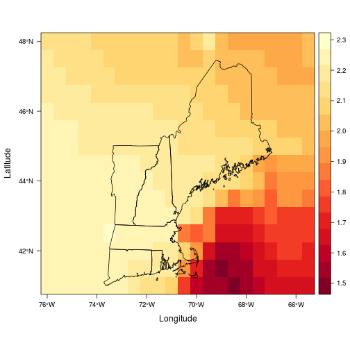
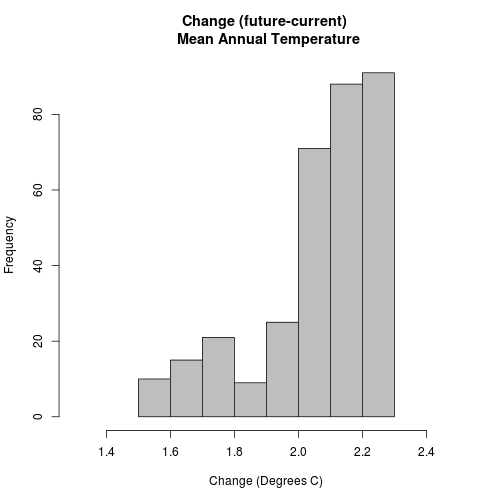

Example integration of R and CDO to process global climate model output
======


Explore the data for this exercise
-----------------

First, set the working directory and load libraries.

```r
setwd("/home/user/ost4sem/exercise/SpatialAnalysisTutorials/climate/RCM")
library(ncdf)
library(rasterVis)
library(sp)
library(rgdal)
library(reshape)
library(lattice)
library(xtable)
library(plyr)
```

If you get the error: Error in library(xx): there is no package called 'xx'
 then run the following for the missing package (replace ncdf with the package that is missing):
 install.packages("ncdf")
 and then re-run the lines above to load the newly installed libraries

Look at the files in the data directory:

```r
list.files("../data")
```

```
## [1] "GFDL_Current.nc"      "GFDL_Future.nc"       "gfdl_RCM3_Current.nc"
## [4] "gfdl_RCM3_Future.nc"  "NewEngland.dbf"       "NewEngland.prj"      
## [7] "NewEngland.shp"       "NewEngland.shx"       "README.md"
```


If we had used the Earth System Fedaration Grid (ESFG) to generate a CMIP5 download script, we could download the data with it from R.  One disadvantage of RStudio is that the terminal (console) is 'wrapped' by Java, so some interactive features don't work correctly.  In this case, the ESFG script must be provided with all parameters (inluding the openid) to download the files. To see the various options available for this, run it with the help flag:

```r
system("bash ../CMIP5/wget-20131009120214.sh -o ")
```


Like other non-R programs (like GDAL, etc.), to run a CDO command from R, we have to 'wrap' it with a "system" call.  
Try this:

```r
system("cdo -V")
```


That command tells R to run the command "cdo -V" at the system level (at the linux prompt rather than R).
 "-V says you want to see what version of CDO you are have installed.
 If it worked, you should see a list of the various components of CDO
 and their version numbers and dates in the R console.

Let's take a closer look at one of those files using the "variable description" (VARDES) command:

```r
system("cdo vardes ../data/gfdl_RCM3_Future.nc")
```

note that there is a "../data/" command before the filename. This tells cdo to go up one level
in the directory tree, then go down into the data directory to find the file.  Using relative paths like this allow the top-level folder to be moved without breaking links (even on other computers).

 What is the output?  What variables are in that file?
 You can also explore the file with panoply with this command:

```r
system("/usr/local/PanoplyJ/panoply.sh ../data/gfdl_RCM3_Future.nc &")
```

 
Adding the "&" on the end tells linux to start panoply and not wait for it to close/finish, but it remains a 'sub' process of R here, so if you close R, the panoply window will also die. See nohup [http://en.wikipedia.org/wiki/Nohup] for ways to spawn an independant process.

 CDO commands generally have the following syntax:  cdo command inputfile outputfile 
 and create a new file (outputfile) that is the result of running the command on the 
 inputfile.  Pretty easy, right?  

 What if you wanted to select only one variable (selvar) out of the netcdf file?  
 Try this:

```r
system("cdo selvar,tmean ../data/gfdl_RCM3_Future.nc gfdl_RCM3_Future_tmean.nc")
```


 Now inspect the resulting file (gfdl_RCM3_Future_tmean.nc) with Panoply or using the vardes command above.  You can open additional files using the panoply menus).  What's different about it?  Can you guess what the selvar command does?  

 One powerful feature of the CDO tools is the ability to string together commands to perform multiple operations at once.  You just have to add a dash ("-") before any subsequent commands.  The inner-most commands are run first. If you have a multi-core processor, these separate commands will be run in parallel if possible (up to 128 threads).  This comes in 
 handy when you are working with hundreds of GB of data.  Now convert the daily data  to mean annual temperature with the following command:

```r
system("cdo timmean -selvar,tmean ../data/gfdl_RCM3_Future.nc gfdl_RCM3_Future_mat.nc")
```


 That command:
 * first uses selvar to subset only tmean (mean temperatures), 
 * uses timmean to take the average over the entire 'future' timeseries.

Now explore the new file (gfdl_RCM3_Future_mat.nc) with Panoply.
* How many time steps does it have?
* What do the values represent?

 Now calculate the same thing (mean annual temperature) from the model output for the "Current" 
 time period:

```r
system("cdo timmean -selvar,tmean ../data/gfdl_RCM3_Current.nc gfdl_RCM3_Current_mat.nc")
```


 And calculate the difference between them:

```r
system("cdo sub gfdl_RCM3_Future_mat.nc gfdl_RCM3_Current_mat.nc gfdl_RCM3_mat_dif.nc")
```

Look at this file in Panoply.  
 * How much (mean annual) temperature change is projected for this model?

Or you can string the commands above together and do all of the previous  operations in one step with the following command  (and if you have a dual core - or more - processor it will use all of them, isn't that cool!):

```r
system("cdo sub -timmean -selvar,tmean ../data/gfdl_RCM3_Future.nc -timmean -selvar,tmean ../data/gfdl_RCM3_Current.nc gfdl_RCM3_mat_dif.nc")
```


Now load these summarized data into R as a 'raster' class (defined by the raster library) 
 using the raster package which allows you to read directly from a netcdf file.
 You could also use the rgdal package if it has netcdf support (which it doesn't by default in windows)

```r
mat_dif = raster("gfdl_RCM3_mat_dif.nc", varname = "tmean", band = 1)
```


Also load a polygon (shapefile) of New England to overlay on the grid so you know what you are looking at
 the shapefile has polygons, but since we just want this for an overlay, let's convert to lines as well

```r
ne = as(readOGR("../data/NewEngland.shp", "NewEngland"), "SpatialLines")
```

```
## OGR data source with driver: ESRI Shapefile 
## Source: "../data/NewEngland.shp", layer: "NewEngland"
## with 6 features and 7 fields
## Feature type: wkbPolygon with 2 dimensions
```


Take a look at the data:

```r
levelplot(mat_dif, margin = F) + layer(sp.lines(ne))
```

 


Questions:
* So how much does that model say it will warm by mid-century?  
* What patterns do you see at this grain?
* Any difference between water and land?
* Why would this be?

 The previous plot shows the information over space, but how about a distribution of values:

```r
hist(mat_dif, col = "grey", main = "Change (future-current) \n Mean Annual Temperature", 
    xlab = "Change (Degrees C)", xlim = c(1.3, 2.5))
```

 


 We now need to calculate the change in mean annual temp and precipitation in the GCM output.

```r
system("cdo sub -timmean ../data/GFDL_Future.nc -timmean ../data/GFDL_Current.nc GFDL_dif.nc")
```

You might see some warnings about missing "scanVarAttributes", this is due to how IRI writes it's netCDF files
 in this example we don't need to worry about them


## Comparison of RCM & GCM output
_____________________________________________

Calculate the mean change (future-current) for all the variables in the GFDL_RCM3 dataset (tmin, tmax, tmean, and precipitation) like we did for just temperature above (Hint: do them one by one or simply don't subset a variable). After you run the command, check the output file with Panoply to check that it has the correct number of variables and only one time step.


```r
system("cdo sub -timmean ../data/gfdl_RCM3_Future.nc -timmean ../data/gfdl_RCM3_Current.nc GFDL_RCM3_dif.nc")
```


Let's compare the GCM and RCM data and resolutions by plotting them.  First we need to read them in.  Let's use the raster package again:

```r
gcm = brick(raster("GFDL_dif.nc", varname = "tmean"), raster("GFDL_dif.nc", 
    varname = "ptot"))
rcm = brick(raster("GFDL_RCM3_dif.nc", varname = "tmean"), raster("GFDL_RCM3_dif.nc", 
    varname = "ptot"))
```


It would be nice if we could combine the two model types in a single two-panel plot with common color-bar to facilitate comparison.  For understandable reasons, it's not possible to merge rasters of different resolutions as a single raster stack or brick object.  But you can combine the plots easily with functions in the rasterVis/latticeExtra packages like this:

```r
c(levelplot(gcm[[1]], margin = F, main = "Projected change in \n mean annual temperature (C)"), 
    levelplot(rcm[[1]], margin = F)) + layer(sp.lines(ne))
```

 

```r

c(levelplot(gcm[[2]], margin = F, main = "Projected change in \n mean annual precipitation (mm)"), 
    levelplot(rcm[[2]], margin = F)) + layer(sp.lines(ne))
```

 


* Do you see differences in patterns or absolute values?
* How do you think the differences in resolution would affect analysis of biological/anthropological data?
* Is the increased resolution useful?

## Calculate the mean change BY SEASON for all the variables in the GFDL_RCM3 dataset
The desired output will be a netcdf file with 4 time steps, the mean change for each of the 4 seasons.
  

```r
system("cdo sub -yseasmean ../data/GFDL_Future.nc -yseasmean ../data/GFDL_Current.nc  gfdl_seasdif.nc")
```


Read the file into R using the 'brick' command to read in all 4 time steps from tmean as separate raster images.  Then update update the column names (to spring, summer, etc.) and plot the change in each of the four seasons.


```r
difseas = brick("gfdl_seasdif.nc", varname = "tmean", band = 1:4)
names(difseas) = c("Winter", "Spring", "Summer", "Fall")
## and make a plot of the differences
levelplot(difseas, col.regions = rev(heat.colors(20))) + layer(sp.lines(ne))
```

 


Which season is going to warm the most?
Let's marginalize across space and look at the data in a few different ways:
* density plot (like a histogram) with the four seasons.
* "violin" plot

```r
densityplot(difseas, auto.key = T, xlab = "Temperature Change (C)")
```

 

```r
bwplot(difseas, ylab = "Temperature Change (C)", xlab = "Season", scales = list(y = list(lim = c(1, 
    5))))
```

 


We can also look at the relationship between variables with a scatterplot matrix:

```r
splom(difseas, colramp = colorRampPalette("blue"))
```

 


Or with a tabular correlation matrix:

```r
print(xtable(layerStats(difseas, stat = "pearson")[[1]], caption = "Pearson Correlation between seasonal change", 
    digits = 3), type = "html")
```

<!-- html table generated in R 3.0.1 by xtable 1.7-1 package -->
<!-- Tue Oct  8 11:51:37 2013 -->
<TABLE border=1>
<CAPTION ALIGN="bottom"> Pearson Correlation between seasonal change </CAPTION>
<TR> <TH>  </TH> <TH> Winter </TH> <TH> Spring </TH> <TH> Summer </TH> <TH> Fall </TH>  </TR>
  <TR> <TD align="right"> Winter </TD> <TD align="right"> 1.000 </TD> <TD align="right"> 0.835 </TD> <TD align="right"> -0.164 </TD> <TD align="right"> -0.348 </TD> </TR>
  <TR> <TD align="right"> Spring </TD> <TD align="right"> 0.835 </TD> <TD align="right"> 1.000 </TD> <TD align="right"> 0.229 </TD> <TD align="right"> 0.002 </TD> </TR>
  <TR> <TD align="right"> Summer </TD> <TD align="right"> -0.164 </TD> <TD align="right"> 0.229 </TD> <TD align="right"> 1.000 </TD> <TD align="right"> 0.899 </TD> </TR>
  <TR> <TD align="right"> Fall </TD> <TD align="right"> -0.348 </TD> <TD align="right"> 0.002 </TD> <TD align="right"> 0.899 </TD> <TD align="right"> 1.000 </TD> </TR>
   </TABLE>


===  Climate Metrics =====

Explore the files

Show which years are in each dataset using cdo "showyear"

```r
system("cdo -s showyear ../data/gfdl_RCM3_Current.nc")  # -s tells it to 'be quiet' and only report the values
```

That confirms that the 'current' period has years 1967 to 2000.

```r
system("cdo -s showyear ../data/gfdl_RCM3_Future.nc")
```

And the future period has 2037 to 2070

We are going to need to save these vectors of years so we can use them later to calculate year-by-year metrics.  We'll do this by adding the "intern=T" command to the system() call, which tells R that we want to save what cdo returns as an R object instead of just printing it to the screen.  

```r
cyears = system("cdo -s showyear ../data/gfdl_RCM3_Current.nc", intern = T)
cyears
```

```
## [1] " 1967 1968 1969 1970 1971 1972 1973 1974 1975 1976 1977 1978 1979 1980 1981 1982 1983 1984 1985 1986 1987 1988 1989 1990 1991 1992 1993 1994 1995 1996 1997 1998 1999 2000"
```

This is unfortunately a little complicated because CDO returns a single string of characters (separated by white space) rather than the years as separate values.  So we'll need to split the string using 'strsplit()' to isolate each year as an element and then return a simple vector of numbers.  We also need to throw out the first  empty element and first year which has incomplete data by adding the [-c(1,2)] subsetting index on the end and converting to a numeric vector (instead of a character vector)

```r
cyears = as.numeric(strsplit(cyears, " ")[[1]][-c(1:2)])
cyears
```

```
##  [1] 1968 1969 1970 1971 1972 1973 1974 1975 1976 1977 1978 1979 1980 1981
## [15] 1982 1983 1984 1985 1986 1987 1988 1989 1990 1991 1992 1993 1994 1995
## [29] 1996 1997 1998 1999 2000
```

Note that we just overwrote the previous value of cyears with the updated version.  R allows this sort of behavior, but you need to be careful to run the commands in order...  Perhaps it would be better to combine those two commands into one:

```r
cyears = as.numeric(strsplit(system("cdo -s showyear ../data/gfdl_RCM3_Current.nc", 
    intern = T), " ")[[1]][-c(1, 2)])
cyears
```

```
##  [1] 1968 1969 1970 1971 1972 1973 1974 1975 1976 1977 1978 1979 1980 1981
## [15] 1982 1983 1984 1985 1986 1987 1988 1989 1990 1991 1992 1993 1994 1995
## [29] 1996 1997 1998 1999 2000
```

 Great, we got a vector of years that we can use to build the next commands.  Let's do the same thing for the 'future' years.

```r
fyears = as.numeric(strsplit(system("cdo -s showyear ../data/gfdl_RCM3_Future.nc", 
    intern = T), " ")[[1]][-c(1, 2)])
fyears
```

```
##  [1] 2038 2039 2040 2041 2042 2043 2044 2045 2046 2047 2048 2049 2050 2051
## [15] 2052 2053 2054 2055 2056 2057 2058 2059 2060 2061 2062 2063 2064 2065
## [29] 2066 2067 2068 2069 2070
```

Now we have the two vectors (cyears and fyears) of which years are in which datasets.

 --- Calculating mean annual climate metrics ------
 Calculating the mean annual climate metrics is a fairly complex exercise.  You have to
 1) extract just the variable needed (such as tmean):
   cdo selname,tmean ../data/gfdl_RCM3_Current.nc gfdl_RCM3_Current_tmean.nc
 2) extract one year of data (such as 1970):
   cdo selyear,1970 ../data/gfdl_RCM3_Current_tmean.nc gfdl_RCM3_Current_tmean_1970.nc
 3) calculate the metric of interest (such as
  'consecutive frost days') for that year:
  cdo -eca_cfd gfdl_RCM3_Current_tmean_1970.nc
       gfdl_RCM3_Current_tmean_1970_HD.nc
 4) merge the separate years back together into a single file
 5) calculate the mean of the metric across years (if you
    are not interested in variability)

 You could do these steps one at a time (as listed above), but it would take
 many lines of code because you would have a line for each variable, for each time
 period, for each year. That would be 33 years * 2 time periods *
 4 metrics = 264 lines!   Fortunately, CDO's ability to string commands
 together with R's ability to build a command from various parts
 makes this easier (but slightly more complex).  

 First, use the 'paste' command to build a character string
 that says to select tmean, then extract a single year, then calculate the consecutive frost days:

```r
c1 = paste("-eca_cfd -selyear,", cyears, " -selname,tmin ../data/gfdl_RCM3_Current.nc ", 
    sep = "", collapse = " ")
c1
```

```
## [1] "-eca_cfd -selyear,1968 -selname,tmin ../data/gfdl_RCM3_Current.nc  -eca_cfd -selyear,1969 -selname,tmin ../data/gfdl_RCM3_Current.nc  -eca_cfd -selyear,1970 -selname,tmin ../data/gfdl_RCM3_Current.nc  -eca_cfd -selyear,1971 -selname,tmin ../data/gfdl_RCM3_Current.nc  -eca_cfd -selyear,1972 -selname,tmin ../data/gfdl_RCM3_Current.nc  -eca_cfd -selyear,1973 -selname,tmin ../data/gfdl_RCM3_Current.nc  -eca_cfd -selyear,1974 -selname,tmin ../data/gfdl_RCM3_Current.nc  -eca_cfd -selyear,1975 -selname,tmin ../data/gfdl_RCM3_Current.nc  -eca_cfd -selyear,1976 -selname,tmin ../data/gfdl_RCM3_Current.nc  -eca_cfd -selyear,1977 -selname,tmin ../data/gfdl_RCM3_Current.nc  -eca_cfd -selyear,1978 -selname,tmin ../data/gfdl_RCM3_Current.nc  -eca_cfd -selyear,1979 -selname,tmin ../data/gfdl_RCM3_Current.nc  -eca_cfd -selyear,1980 -selname,tmin ../data/gfdl_RCM3_Current.nc  -eca_cfd -selyear,1981 -selname,tmin ../data/gfdl_RCM3_Current.nc  -eca_cfd -selyear,1982 -selname,tmin ../data/gfdl_RCM3_Current.nc  -eca_cfd -selyear,1983 -selname,tmin ../data/gfdl_RCM3_Current.nc  -eca_cfd -selyear,1984 -selname,tmin ../data/gfdl_RCM3_Current.nc  -eca_cfd -selyear,1985 -selname,tmin ../data/gfdl_RCM3_Current.nc  -eca_cfd -selyear,1986 -selname,tmin ../data/gfdl_RCM3_Current.nc  -eca_cfd -selyear,1987 -selname,tmin ../data/gfdl_RCM3_Current.nc  -eca_cfd -selyear,1988 -selname,tmin ../data/gfdl_RCM3_Current.nc  -eca_cfd -selyear,1989 -selname,tmin ../data/gfdl_RCM3_Current.nc  -eca_cfd -selyear,1990 -selname,tmin ../data/gfdl_RCM3_Current.nc  -eca_cfd -selyear,1991 -selname,tmin ../data/gfdl_RCM3_Current.nc  -eca_cfd -selyear,1992 -selname,tmin ../data/gfdl_RCM3_Current.nc  -eca_cfd -selyear,1993 -selname,tmin ../data/gfdl_RCM3_Current.nc  -eca_cfd -selyear,1994 -selname,tmin ../data/gfdl_RCM3_Current.nc  -eca_cfd -selyear,1995 -selname,tmin ../data/gfdl_RCM3_Current.nc  -eca_cfd -selyear,1996 -selname,tmin ../data/gfdl_RCM3_Current.nc  -eca_cfd -selyear,1997 -selname,tmin ../data/gfdl_RCM3_Current.nc  -eca_cfd -selyear,1998 -selname,tmin ../data/gfdl_RCM3_Current.nc  -eca_cfd -selyear,1999 -selname,tmin ../data/gfdl_RCM3_Current.nc  -eca_cfd -selyear,2000 -selname,tmin ../data/gfdl_RCM3_Current.nc "
```


 See how this added the command for consecutive frost days (-eca_cfd) to the extract year command (-selyear,1970) for each year, to the select variable command (-selname,tmean) and strung them all together (and saved a lot of typing)?  

Now we just have to add the 'mergetime' to put the individual years back together in a single file and add an output filename:

```r
hd = paste("cdo -O mergetime ", c1, " gfdl_RCM3_Current_CFD.nc", sep = "")
## now look at that line, see how it added 'cdo mergetime' to the c1 string:
hd
```

```
## [1] "cdo -O mergetime -eca_cfd -selyear,1968 -selname,tmin ../data/gfdl_RCM3_Current.nc  -eca_cfd -selyear,1969 -selname,tmin ../data/gfdl_RCM3_Current.nc  -eca_cfd -selyear,1970 -selname,tmin ../data/gfdl_RCM3_Current.nc  -eca_cfd -selyear,1971 -selname,tmin ../data/gfdl_RCM3_Current.nc  -eca_cfd -selyear,1972 -selname,tmin ../data/gfdl_RCM3_Current.nc  -eca_cfd -selyear,1973 -selname,tmin ../data/gfdl_RCM3_Current.nc  -eca_cfd -selyear,1974 -selname,tmin ../data/gfdl_RCM3_Current.nc  -eca_cfd -selyear,1975 -selname,tmin ../data/gfdl_RCM3_Current.nc  -eca_cfd -selyear,1976 -selname,tmin ../data/gfdl_RCM3_Current.nc  -eca_cfd -selyear,1977 -selname,tmin ../data/gfdl_RCM3_Current.nc  -eca_cfd -selyear,1978 -selname,tmin ../data/gfdl_RCM3_Current.nc  -eca_cfd -selyear,1979 -selname,tmin ../data/gfdl_RCM3_Current.nc  -eca_cfd -selyear,1980 -selname,tmin ../data/gfdl_RCM3_Current.nc  -eca_cfd -selyear,1981 -selname,tmin ../data/gfdl_RCM3_Current.nc  -eca_cfd -selyear,1982 -selname,tmin ../data/gfdl_RCM3_Current.nc  -eca_cfd -selyear,1983 -selname,tmin ../data/gfdl_RCM3_Current.nc  -eca_cfd -selyear,1984 -selname,tmin ../data/gfdl_RCM3_Current.nc  -eca_cfd -selyear,1985 -selname,tmin ../data/gfdl_RCM3_Current.nc  -eca_cfd -selyear,1986 -selname,tmin ../data/gfdl_RCM3_Current.nc  -eca_cfd -selyear,1987 -selname,tmin ../data/gfdl_RCM3_Current.nc  -eca_cfd -selyear,1988 -selname,tmin ../data/gfdl_RCM3_Current.nc  -eca_cfd -selyear,1989 -selname,tmin ../data/gfdl_RCM3_Current.nc  -eca_cfd -selyear,1990 -selname,tmin ../data/gfdl_RCM3_Current.nc  -eca_cfd -selyear,1991 -selname,tmin ../data/gfdl_RCM3_Current.nc  -eca_cfd -selyear,1992 -selname,tmin ../data/gfdl_RCM3_Current.nc  -eca_cfd -selyear,1993 -selname,tmin ../data/gfdl_RCM3_Current.nc  -eca_cfd -selyear,1994 -selname,tmin ../data/gfdl_RCM3_Current.nc  -eca_cfd -selyear,1995 -selname,tmin ../data/gfdl_RCM3_Current.nc  -eca_cfd -selyear,1996 -selname,tmin ../data/gfdl_RCM3_Current.nc  -eca_cfd -selyear,1997 -selname,tmin ../data/gfdl_RCM3_Current.nc  -eca_cfd -selyear,1998 -selname,tmin ../data/gfdl_RCM3_Current.nc  -eca_cfd -selyear,1999 -selname,tmin ../data/gfdl_RCM3_Current.nc  -eca_cfd -selyear,2000 -selname,tmin ../data/gfdl_RCM3_Current.nc  gfdl_RCM3_Current_CFD.nc"
```


 And then run the command with system()

```r
system(hd)
```

Amazing! That just calculated the longest consecutive period of minimum temps <= 0C for each pixel for each year and made a new netCDF file with these values for each year. The CDO tools are a great resource for this type of work (if they do what you want).

Go to your working directory and open up the gfdl_RCM3_Current_CFD.nc in Panoply to look at the file:

```r
system("/usr/local/PanoplyJ/panoply.sh gfdl_RCM3_Current_CFD.nc &")
```


Flip through the various years.  Are the numbers believable (given what you know about the region)?  

 You can also build the command and run it all at the same time as follows (this is identical to what you just did above)

== Consecutive Frost Days [https://code.zmaw.de/embedded/cdo/1.4.7/cdo.html#x1-6440002.16.2] ==
 The largest number of consecutive days where TN < 0C per time period [https://code.zmaw.de/embedded/cdo/1.4.7/cdo.html#x1-6440002.16.2]

Current Time Period:

```r
system(paste("cdo -O ", paste("mergetime ", paste("-eca_cfd -selyear,", cyears, 
    " -selname,tmin gfdl_RCM3_Current.nc ", sep = "", collapse = " ")), " gfdl_RCM3_Current_CFD.nc", 
    sep = ""))
```


 Now calculate the same thing for the Future time by changing the two places it says "Current" to "Future" (note the capital letters) and the "cyears" to "fyears" to extract the future years from the Future Dataset and save it as with Future in the file name

Future Time Period:

```r
system(paste("cdo -O ", paste("mergetime ", paste("-eca_cfd -selyear,", fyears, 
    " -selname,tmin ../data/gfdl_RCM3_Future.nc ", sep = "", collapse = " ")), 
    " gfdl_RCM3_Future_CFD.nc", sep = ""))
```


We aren't going to work with interannual variability (though it is interesting) in this exercise. So now let's calculate the mean over each time period:

```r
system("cdo -O timmean gfdl_RCM3_Future_CFD.nc gfdl_RCM3_Future_CFD_mean.nc")
system("cdo -O timmean gfdl_RCM3_Current_CFD.nc gfdl_RCM3_Current_CFD_mean.nc")
```


Now we have a file for the annual timeseries for each pixel for both time periods
and the overall mean for each pixel for both time periods (current and future).
Check in your working directory to confirm that all these files are here.

```r
list.files(, pattern = "nc")
```

```
##  [1] "GFDL_dif.nc"                     "gfdl_RCM3_Current_CDD_mean.nc"  
##  [3] "gfdl_RCM3_Current_CDD.nc"        "gfdl_RCM3_Current_CFD_mean.nc"  
##  [5] "gfdl_RCM3_Current_CFD.nc"        "gfdl_RCM3_Current_CSU_mean.nc"  
##  [7] "gfdl_RCM3_Current_CSU.nc"        "gfdl_RCM3_Current_MAP.nc"       
##  [9] "gfdl_RCM3_Current_mat.nc"        "gfdl_RCM3_Current_MAT.nc"       
## [11] "gfdl_RCM3_Current_r20mm_mean.nc" "gfdl_RCM3_Current_r20mm.nc"     
## [13] "GFDL_RCM3_dif.nc"                "gfdl_RCM3_Future_CDD_mean.nc"   
## [15] "gfdl_RCM3_Future_CDD.nc"         "gfdl_RCM3_Future_CFD_mean.nc"   
## [17] "gfdl_RCM3_Future_CFD.nc"         "gfdl_RCM3_Future_CSU_mean.nc"   
## [19] "gfdl_RCM3_Future_CSU.nc"         "gfdl_RCM3_Future_MAP.nc"        
## [21] "gfdl_RCM3_Future_mat.nc"         "gfdl_RCM3_Future_MAT.nc"        
## [23] "gfdl_RCM3_Future_r20mm_mean.nc"  "gfdl_RCM3_Future_r20mm.nc"      
## [25] "gfdl_RCM3_Future_tmean.nc"       "gfdl_RCM3_mat_dif.nc"           
## [27] "gfdl_seasdif.nc"
```


Now we are going to repeat this exercise for several more indices

== Summer Heat Waves (CSU) ===
 ECACSU - Consecutive summer days index per time period. [https://code.zmaw.de/embedded/cdo/1.4.7/cdo.html#x1-6480002.16.3]
 The largest number of consecutive days where daily temps are greater than 25 ℃.


```r
# Current Time Period:
system(paste("cdo -O ", paste("mergetime ", paste("-eca_csu -selyear,", cyears, 
    " -selname,tmax ../data/gfdl_RCM3_Current.nc ", sep = "", collapse = " ")), 
    " gfdl_RCM3_Current_CSU.nc", sep = ""))
## Future
system(paste("cdo -O ", paste("mergetime ", paste("-eca_csu -selyear,", fyears, 
    " -selname,tmax ../data/gfdl_RCM3_Future.nc ", sep = "", collapse = " ")), 
    " gfdl_RCM3_Future_CSU.nc", sep = ""))
```


Now let's calculate the mean over each time period:

```r
system("cdo -O timmean gfdl_RCM3_Future_CSU.nc gfdl_RCM3_Future_CSU_mean.nc")
system("cdo -O timmean gfdl_RCM3_Current_CSU.nc gfdl_RCM3_Current_CSU_mean.nc")
```


== Consecutive dry days (CDD) ===
 The largest number of consecutive days where RR is < 1 mm per year
 [https://code.zmaw.de/embedded/cdo/1.4.7/cdo.html#x1-6400002.16.1]


```r
# Current:
system(paste("cdo -O ", paste("mergetime ", paste("-eca_cdd -selyear,", cyears, 
    " -selname,ptot ../data/gfdl_RCM3_Current.nc ", sep = "", collapse = " ")), 
    " gfdl_RCM3_Current_CDD.nc", sep = ""))
## Future
system(paste("cdo -O ", paste("mergetime ", paste("-eca_cdd -selyear,", fyears, 
    " -selname,ptot ../data/gfdl_RCM3_Future.nc ", sep = "", collapse = " ")), 
    " gfdl_RCM3_Future_CDD.nc", sep = ""))
## Mean within each period:
system("cdo -O timmean gfdl_RCM3_Future_CDD.nc gfdl_RCM3_Future_CDD_mean.nc")
system("cdo -O timmean gfdl_RCM3_Current_CDD.nc gfdl_RCM3_Current_CDD_mean.nc")
```


== Precipitation Days Index (r20mm) ==
 The number of days per year where daily precipitation is at least 20 mm
 [https://code.zmaw.de/embedded/cdo/1.4.7/cdo.html#x1-6980002.16.14]


```r
## Current
system(paste("cdo -O ", paste("mergetime ", paste("-eca_r20mm -selyear,", cyears, 
    " -selname,ptot ../data/gfdl_RCM3_Current.nc ", sep = "", collapse = " ")), 
    " gfdl_RCM3_Current_r20mm.nc", sep = ""))
## Future
system(paste("cdo -O ", paste("mergetime ", paste("-eca_r20mm -selyear,", fyears, 
    " -selname,ptot ../data/gfdl_RCM3_Future.nc ", sep = "", collapse = " ")), 
    " gfdl_RCM3_Future_r20mm.nc", sep = ""))
## Mean within each period:
system("cdo -O timmean gfdl_RCM3_Future_r20mm.nc gfdl_RCM3_Future_r20mm_mean.nc")
system("cdo -O timmean gfdl_RCM3_Current_r20mm.nc gfdl_RCM3_Current_r20mm_mean.nc")
```


== Mean Annual Temperature (MAT) ==
 This is much easier (shorter) because there is a built in function that
 calculates the overall mean (timmean) and converts the values to degrees C by subtracting 273.15

```r
## Current
system(paste("cdo -O -subc,273.15 -timmean -selname,tmean ../data/gfdl_RCM3_Current.nc gfdl_RCM3_Current_MAT.nc", 
    sep = ""))
## Future
system(paste("cdo -O -subc,273.15 -timmean -selname,tmean ../data/gfdl_RCM3_Future.nc gfdl_RCM3_Future_MAT.nc", 
    sep = ""))
```


== Mean Annual Precipitation (MAP)==
 This is much easier (shorter) because there is a built in function that
 calculates the annual sum (yearsum).

```r
## Current
system(paste("cdo -O timmean -yearsum -selname,ptot ../data/gfdl_RCM3_Current.nc  gfdl_RCM3_Current_MAP.nc", 
    sep = ""))
## Future
system(paste("cdo -O timmean -yearsum -selname,ptot ../data/gfdl_RCM3_Future.nc  gfdl_RCM3_Future_MAP.nc", 
    sep = ""))
```


=== Analysis===

 Now the indices have all been calculated and we are ready to do some analysis
 We have essentially 6 variables (4 'extremes and 2 'means') that we are interested in:
 1) Consecutive Dry Days (<1mm) (CDD)
 2) Consecutive Frost Days (<0 ℃) (CFD)
 3) Consecutive Days over 25 ℃ (CSU)
 4) Days with Precipitation >20mm (r20mm)
 5) Mean Annual Temperature (MAT)
 6) Annual mean precipitation (MAP)

 We'll make two spatialgrid data objects, one for the current and one for the future data

First we read one in and keep the spatial information

```r
future = as(raster("gfdl_RCM3_Future_CDD_mean.nc", varname = "consecutive_dry_days_index_per_time_period"), 
    "SpatialGridDataFrame")
colnames(future@data) = "CDD"
## You can see all the information in that object by running
str(future)
```

```
## Formal class 'SpatialGridDataFrame' [package "sp"] with 4 slots
##   ..@ data       :'data.frame':	330 obs. of  1 variable:
##   .. ..$ CDD: num [1:330] 10.2 10.2 10.2 10.5 10.1 ...
##   ..@ grid       :Formal class 'GridTopology' [package "sp"] with 3 slots
##   .. .. ..@ cellcentre.offset: Named num [1:2] -76 41
##   .. .. .. ..- attr(*, "names")= chr [1:2] "s1" "s2"
##   .. .. ..@ cellsize         : num [1:2] 0.5 0.5
##   .. .. ..@ cells.dim        : int [1:2] 22 15
##   ..@ bbox       : num [1:2, 1:2] -76.2 40.8 -65.2 48.2
##   .. ..- attr(*, "dimnames")=List of 2
##   .. .. ..$ : chr [1:2] "s1" "s2"
##   .. .. ..$ : chr [1:2] "min" "max"
##   ..@ proj4string:Formal class 'CRS' [package "sp"] with 1 slots
##   .. .. ..@ projargs: chr "+proj=longlat +datum=WGS84 +ellps=WGS84 +towgs84=0,0,0"
```


It has the CDD data, and all the spatial information that define the raster. Now we just want to add all the additional Future data to
this existing object.  We can do this as follows:


```r
future$R20mm = as(raster("gfdl_RCM3_Future_r20mm_mean.nc", varname = "very_heavy_precipitation_days_index_per_time_period"), 
    "SpatialGridDataFrame")@data[, 1]
future$MAP = as(raster("gfdl_RCM3_Future_MAP.nc", varname = "ptot"), "SpatialGridDataFrame")@data[, 
    1]
future$CFD = as(raster("gfdl_RCM3_Future_CFD_mean.nc", varname = "consecutive_frost_days_index_per_time_period"), 
    "SpatialGridDataFrame")@data[, 1]
future$MAT = as(raster("gfdl_RCM3_Future_MAT.nc", varname = "tmean"), "SpatialGridDataFrame")@data[, 
    1]
future$CSU = as(raster("gfdl_RCM3_Future_CSU.nc", varname = "consecutive_summer_days_index_per_time_period"), 
    "SpatialGridDataFrame")@data[, 1]

## now look at the structure (str) again
str(future)
```

```
## Formal class 'SpatialGridDataFrame' [package "sp"] with 4 slots
##   ..@ data       :'data.frame':	330 obs. of  6 variables:
##   .. ..$ CDD  : num [1:330] 10.2 10.2 10.2 10.5 10.1 ...
##   .. ..$ R20mm: num [1:330] 10.5 10 10.1 10 11.5 ...
##   .. ..$ MAP  : num [1:330] 1257 1242 1213 1200 1230 ...
##   .. ..$ CFD  : num [1:330] 85.7 85.4 87.4 87.5 84.6 ...
##   .. ..$ MAT  : num [1:330] 1.25 1.15 1.07 1.03 1.09 ...
##   .. ..$ CSU  : num [1:330] 2 2 2 2 2 2 1 2 1 1 ...
##   ..@ grid       :Formal class 'GridTopology' [package "sp"] with 3 slots
##   .. .. ..@ cellcentre.offset: Named num [1:2] -76 41
##   .. .. .. ..- attr(*, "names")= chr [1:2] "s1" "s2"
##   .. .. ..@ cellsize         : num [1:2] 0.5 0.5
##   .. .. ..@ cells.dim        : int [1:2] 22 15
##   ..@ bbox       : num [1:2, 1:2] -76.2 40.8 -65.2 48.2
##   .. ..- attr(*, "dimnames")=List of 2
##   .. .. ..$ : chr [1:2] "s1" "s2"
##   .. .. ..$ : chr [1:2] "min" "max"
##   ..@ proj4string:Formal class 'CRS' [package "sp"] with 1 slots
##   .. .. ..@ projargs: chr "+proj=longlat +datum=WGS84 +ellps=WGS84 +towgs84=0,0,0"
```


See how the data 'slot' now has a column for each of the variables?
It is now analagous to a multiband raster where each band is a separate variable

Do the same thing for the current data:

```r
current = as(raster("gfdl_RCM3_Current_CDD_mean.nc", varname = "consecutive_dry_days_index_per_time_period"), 
    "SpatialGridDataFrame")
colnames(current@data) = "CDD"
current$R20mm = as(raster("gfdl_RCM3_Current_r20mm_mean.nc", varname = "very_heavy_precipitation_days_index_per_time_period"), 
    "SpatialGridDataFrame")@data[, 1]
current$MAP = as(raster("gfdl_RCM3_Current_MAP.nc", varname = "ptot"), "SpatialGridDataFrame")@data[, 
    1]
current$CFD = as(raster("gfdl_RCM3_Current_CFD_mean.nc", varname = "consecutive_frost_days_index_per_time_period"), 
    "SpatialGridDataFrame")@data[, 1]
current$MAT = as(raster("gfdl_RCM3_Current_MAT.nc", varname = "tmean"), "SpatialGridDataFrame")@data[, 
    1]
current$CSU = as(raster("gfdl_RCM3_Current_CSU.nc", varname = "consecutive_summer_days_index_per_time_period"), 
    "SpatialGridDataFrame")@data[, 1]
```


Since we are interested  mostly in land processes, let's subset the data to only areas inside New England using a shapefile of the region:

```r
# first convert to spatial pixels:
fullgrid(future) = F
fullgrid(current) = F
## load a polygon (shapefile) of New England to overlay on the grid so you
## know what you are looking at
ne = readOGR("../data/NewEngland.shp", "NewEngland")
```

```
## OGR data source with driver: ESRI Shapefile 
## Source: "../data/NewEngland.shp", layer: "NewEngland"
## with 6 features and 7 fields
## Feature type: wkbPolygon with 2 dimensions
```

```r
### now keep only pixels that are inside the polygon
future = future[!is.na(overlay(future, ne)), ]
current = current[!is.na(overlay(current, ne)), ]
```


Convert the data to 'long' format for easy plotting:

```r
futurel = cbind(period = "future", coordinates(future), future@data)
currentl = cbind(period = "current", coordinates(current), current@data)
d = rbind(futurel, currentl)
d = melt(d, measure.vars = c("CDD", "CFD", "R20mm", "MAP", "MAT", "CSU"))
## now look at the d object
head(d)
```

```
##   period    s1   s2 variable value
## 1 future -69.5 47.0      CDD 11.03
## 2 future -69.0 47.0      CDD 10.94
## 3 future -68.5 47.0      CDD 11.70
## 4 future -68.0 47.0      CDD 12.48
## 5 future -70.0 46.5      CDD 10.55
## 6 future -69.5 46.5      CDD 10.64
```

See how we added a column for time period, latitude, longitude, variable, and value?
That makes it easy to create summary plots:


################################################
## 1) Is there evidence that these climate metrics are going to change in the future?  Are the changes statistically significant?
## 2) Is any evidence in these data for 'decoupling' between commonly used variables like Mean Annual Temperature
## and Mean Annual Preciptation and the other metrics calculated above as we go from the 'current' time period to
## the future one?  Discuss each variable (Consecutive Dry Days, Consecutive Frost Days, Consecutive
## Days over 25 ℃,Days with Precipitation >20mm) briefly.
##
## 3) Do you think that any observed 'decoupling' will lead to errors in predictions using ecological models? Are the
## differences large enough to matter?  Or will the 'noise' in the relationship swamp the decoupling? Please speculate.
##
## 4) In this exercise we looked at only one model and one scenario.
## How confident are you in the results and why?
################################################

## Ok, now let's get started:

### Look at current and future values of each metric
### Densityplots of metrics
bwplot(value~factor(as.character(period),ordered=T)|variable,data=d,scales=list(relation="free"),auto.key=T,
       ylab="Metric Value",xlab="Time Period",notch=T,
       sub="The notches are a rough indicator of statistical significance.  If the notches do not overlap, the means are probably different.",
       main="Comparison of Current and Future values of various climate metrics")


##################
## Now let's look at the relationships between the 'extreme' metrics and the mean values.
## First 'reshape' the data so each variable is in it's own column
d2=cast(d,period+s1+s2~variable)
head(d2)
## see how easy that was?  Imagine doing that in Excel...

####################
##  Relationship between Consecutive Frost Days (CFD)
##  and Mean Annual Temperature 
xyplot(MAT~CFD,groups=period,data=d2,type=c("p","r","g"),auto.key=T,
       ylab="Mean Annual Temperature",xlab="Consecutive Frost Days",
       main="Climate metric relationship between current and future")

## There might be a significant difference, let's run a regression:
lm_CFD=lm(MAT~CFD*period,data=d2)
summary(lm_CFD)
## The coefficient estimate for CFD:periodcurrent represents the
## difference in slope between the two time periods.
## So it's quite small but is significantly different from zero (p<0.01).

####################
##  Relationship between Consecutive Warm Days (CSU)
##  and Mean Annual Temperature 
xyplot(MAT~CSU,groups=period,data=d2,type=c("p","r","g"),auto.key=T,
       ylab="Mean Annual Temperature",xlab="Consecutive Warm Days",
       main="Climate metric relationship between current and future")

## It's much noisier.  Let's run a regression:
lm_CSU=lm(MAT~CSU*period,data=d2)
summary(lm_CSU)
## The coefficient estimate for CSU:periodcurrent represents the
## difference in slope between the two time periods.

###################
## Now let's do the same thing for precipitation
## Correlations between max consecutive dry days (CDD)
## and 'future' mean precipitation
xyplot(MAP~CDD,groups=period,data=d2,type=c("p","r","g"),pch=16,auto.key=T,
       ylab="Mean Annual Precipitation",xlab="Consecutive Dry Days",
       main="Climate metric relationship between current and future")

## Wow, the relationship is much noisier.  What about the regression:
lm_CDD=lm(MAP~CDD*period,data=d2)
summary(lm_CDD)


###################
## Correlations between the number of rainy days (r20mm)
## and 'future' mean precipitation
xyplot(MAP~R20mm,groups=period,data=d2,type=c("p","r"),auto.key=T,
       ylab="Mean Annual Precipitation",xlab="Number of Rainy Days",
       main="Climate metric relationship between current and future")

## And the regression:
lm_R20mm=lm(MAP~R20mm*period,data=d2)
summary(lm_R20mm)


## Now return to the questions above and fill in your responses
## When you are finished.  Start here and finish the script.


###############################################################
###############################################################
###############################################################
###############################################################
###  Export these climate metrics to use in ecological modeling
###  (such as a species distribution model) 

###  Typically for this type of work, you'll want to have the data
###  in some generic format that many programs (including GIS) can read.
###  netCDF is becoming more common (arcGIS can now read them), but
###  z GeoTiff is a more universal format that most spatially aware programs
##   can easily open.
###  For this we'll use rgdal (the R interface to the
##   Geospatial Data Abstraction Library - GDAL)

## Since we made SpatialGrid objects, writing them out to
## geotiffs is really easy:
writeGDAL(future,"future.tif")
## but remember that our data 'future' has several columns of data:
head(future@data)
## and that may be confusing when you read the multiband
## raster in to another program.  If you want a separate raster file for each
## variable (which is the typical way to store spatial data),
## you can do it with a quick loop:

for(i in colnames(future@data)){
  temp=future #make a copy
  temp@data=data.frame(future@data[,i]) #copy only the variable of interest
  writeGDAL(future,paste("future_",i,".tif",sep="")) #write it
}

for(i in colnames(current@data)){
  temp=current #make a copy
  temp@data=data.frame(current@data[,i]) #copy only the variable of interest
  writeGDAL(current,paste("current_",i,".tif",sep="")) #write it
}

## Now look in your working directory and you'll find all the geotifs

############################################
## That's all folks, I hope this was useful! 
