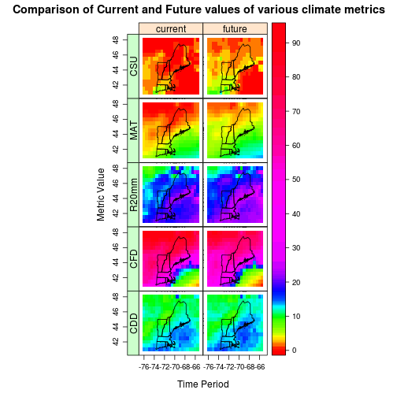
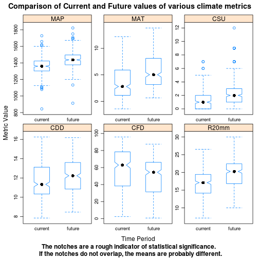

Generating Climate Metrics from gridded daily weather data (or climate model output)
========================================================


```r
setwd("/home/user/ost4sem/exercise/SpatialAnalysisTutorials/climate/RCM")
```

```
## Error: cannot change working directory
```

```r
library(ncdf)
library(rasterVis)
library(sp)
library(rgdal)
library(reshape)
library(lattice)
library(xtable)
library(plyr)
```

# Explore the files

Show which years are in each dataset using cdo "showyear" ("-s" tells it to 'be quiet' and only report the values)

```r
system("cdo -s showyear ../data/gfdl_RCM3_Current.nc")
```

That confirms that the 'current' period has years 1967 to 2000.

```r
system("cdo -s showyear ../data/gfdl_RCM3_Future.nc")
```

And the future period has 2037 to 2070.

We are going to need to save these vectors of years so we can use them later to calculate year-by-year metrics.  We'll do this by adding the "intern=T" command to the system() call, which tells R that we want to save what cdo returns as an R object instead of just printing it to the screen.  

```r
cyears = system("cdo -s showyear ../data/gfdl_RCM3_Current.nc", intern = T)
cyears
```

```
## [1] " 1967 1968 1969 1970 1971 1972 1973 1974 1975 1976 1977 1978 1979 1980 1981 1982 1983 1984 1985 1986 1987 1988 1989 1990 1991 1992 1993 1994 1995 1996 1997 1998 1999 2000"
```

This is unfortunately a little complicated because CDO returns a single string of characters (separated by white space) rather than the years as separate values.  So we'll need to split the string using 'strsplit()' to isolate each year as an element and then return a simple vector of numbers.  We also need to throw out the first  empty element and first year which has incomplete data by adding the [-c(1,2)] subsetting index on the end and converting to a numeric vector (instead of a character vector)

```r
cyears = as.numeric(strsplit(cyears, " ")[[1]][-c(1:2)])
cyears
```

```
##  [1] 1968 1969 1970 1971 1972 1973 1974 1975 1976 1977 1978 1979 1980 1981
## [15] 1982 1983 1984 1985 1986 1987 1988 1989 1990 1991 1992 1993 1994 1995
## [29] 1996 1997 1998 1999 2000
```

Note that we just overwrote the previous value of cyears with the updated version.  R allows this sort of behavior, but you need to be careful to run the commands in order...  Perhaps it would be better to combine those two commands into one:

```r
cyears = as.numeric(strsplit(system("cdo -s showyear ../data/gfdl_RCM3_Current.nc", 
    intern = T), " ")[[1]][-c(1, 2)])
cyears
```

```
##  [1] 1968 1969 1970 1971 1972 1973 1974 1975 1976 1977 1978 1979 1980 1981
## [15] 1982 1983 1984 1985 1986 1987 1988 1989 1990 1991 1992 1993 1994 1995
## [29] 1996 1997 1998 1999 2000
```

 Great, we got a vector of years that we can use to build the next commands.  Let's do the same thing for the 'future' years (and call it 'fyears' for future years)

```r
fyears = as.numeric(strsplit(system("cdo -s showyear ../data/gfdl_RCM3_Future.nc", 
    intern = T), " ")[[1]][-c(1, 2)])
fyears
```

```
##  [1] 2038 2039 2040 2041 2042 2043 2044 2045 2046 2047 2048 2049 2050 2051
## [15] 2052 2053 2054 2055 2056 2057 2058 2059 2060 2061 2062 2063 2064 2065
## [29] 2066 2067 2068 2069 2070
```

Now we have the two vectors (cyears and fyears) of which years are in which datasets.

# Calculating mean annual climate metrics 
 Calculating the mean annual climate metrics is a fairly complex exercise.  You have to:
 1. extract just the variable needed (such as tmean):
 
   cdo selname,tmean ../data/gfdl_RCM3_Current.nc gfdl_RCM3_Current_tmean.nc
 2. extract one year of data (such as 1970):
 
   cdo selyear,1970 ../data/gfdl_RCM3_Current_tmean.nc gfdl_RCM3_Current_tmean_1970.nc
 3. calculate the metric of interest (such as 'consecutive frost days') for that year:
 
  `cdo -eca_cfd gfdl_RCM3_Current_tmean_1970.nc gfdl_RCM3_Current_tmean_1970_HD.nc`
 4. merge the separate years back together into a single file
 5. calculate the mean of the metric across years (if you are not interested in variability)


## CDO is great at 'piping' operators
 You could do these steps one at a time (as listed above), but it would take
 many lines of code because you would have a line for each variable, for each time
 period, for each year. That would be 33 years * 2 time periods *
 4 metrics = 264 lines!   Fortunately, CDO's ability to string commands
 together with R's ability to build a command from various parts
 makes this easier (but slightly more complex).  

 First, use the 'paste' command to build a character string
 that says to select tmean, then extract a single year, then calculate the consecutive frost days:

```r
c1 = paste("-eca_cfd -selyear,", cyears, " -selname,tmin ../data/gfdl_RCM3_Current.nc ", 
    sep = "", collapse = " ")
c1
```

```
## [1] "-eca_cfd -selyear,1968 -selname,tmin ../data/gfdl_RCM3_Current.nc  -eca_cfd -selyear,1969 -selname,tmin ../data/gfdl_RCM3_Current.nc  -eca_cfd -selyear,1970 -selname,tmin ../data/gfdl_RCM3_Current.nc  -eca_cfd -selyear,1971 -selname,tmin ../data/gfdl_RCM3_Current.nc  -eca_cfd -selyear,1972 -selname,tmin ../data/gfdl_RCM3_Current.nc  -eca_cfd -selyear,1973 -selname,tmin ../data/gfdl_RCM3_Current.nc  -eca_cfd -selyear,1974 -selname,tmin ../data/gfdl_RCM3_Current.nc  -eca_cfd -selyear,1975 -selname,tmin ../data/gfdl_RCM3_Current.nc  -eca_cfd -selyear,1976 -selname,tmin ../data/gfdl_RCM3_Current.nc  -eca_cfd -selyear,1977 -selname,tmin ../data/gfdl_RCM3_Current.nc  -eca_cfd -selyear,1978 -selname,tmin ../data/gfdl_RCM3_Current.nc  -eca_cfd -selyear,1979 -selname,tmin ../data/gfdl_RCM3_Current.nc  -eca_cfd -selyear,1980 -selname,tmin ../data/gfdl_RCM3_Current.nc  -eca_cfd -selyear,1981 -selname,tmin ../data/gfdl_RCM3_Current.nc  -eca_cfd -selyear,1982 -selname,tmin ../data/gfdl_RCM3_Current.nc  -eca_cfd -selyear,1983 -selname,tmin ../data/gfdl_RCM3_Current.nc  -eca_cfd -selyear,1984 -selname,tmin ../data/gfdl_RCM3_Current.nc  -eca_cfd -selyear,1985 -selname,tmin ../data/gfdl_RCM3_Current.nc  -eca_cfd -selyear,1986 -selname,tmin ../data/gfdl_RCM3_Current.nc  -eca_cfd -selyear,1987 -selname,tmin ../data/gfdl_RCM3_Current.nc  -eca_cfd -selyear,1988 -selname,tmin ../data/gfdl_RCM3_Current.nc  -eca_cfd -selyear,1989 -selname,tmin ../data/gfdl_RCM3_Current.nc  -eca_cfd -selyear,1990 -selname,tmin ../data/gfdl_RCM3_Current.nc  -eca_cfd -selyear,1991 -selname,tmin ../data/gfdl_RCM3_Current.nc  -eca_cfd -selyear,1992 -selname,tmin ../data/gfdl_RCM3_Current.nc  -eca_cfd -selyear,1993 -selname,tmin ../data/gfdl_RCM3_Current.nc  -eca_cfd -selyear,1994 -selname,tmin ../data/gfdl_RCM3_Current.nc  -eca_cfd -selyear,1995 -selname,tmin ../data/gfdl_RCM3_Current.nc  -eca_cfd -selyear,1996 -selname,tmin ../data/gfdl_RCM3_Current.nc  -eca_cfd -selyear,1997 -selname,tmin ../data/gfdl_RCM3_Current.nc  -eca_cfd -selyear,1998 -selname,tmin ../data/gfdl_RCM3_Current.nc  -eca_cfd -selyear,1999 -selname,tmin ../data/gfdl_RCM3_Current.nc  -eca_cfd -selyear,2000 -selname,tmin ../data/gfdl_RCM3_Current.nc "
```


 See how this added the command for consecutive frost days (-eca_cfd) to the extract year command (-selyear,1970) for each year, to the select variable command (-selname,tmean) and strung them all together (and saved a lot of typing)?  

Now we just have to add the 'mergetime' to put the individual years back together in a single file and add an output filename:

```r
hd = paste("cdo -O mergetime ", c1, " gfdl_RCM3_Current_CFD.nc", sep = "")
## now look at that line, see how it added 'cdo mergetime' to the c1 string:
hd
```

```
## [1] "cdo -O mergetime -eca_cfd -selyear,1968 -selname,tmin ../data/gfdl_RCM3_Current.nc  -eca_cfd -selyear,1969 -selname,tmin ../data/gfdl_RCM3_Current.nc  -eca_cfd -selyear,1970 -selname,tmin ../data/gfdl_RCM3_Current.nc  -eca_cfd -selyear,1971 -selname,tmin ../data/gfdl_RCM3_Current.nc  -eca_cfd -selyear,1972 -selname,tmin ../data/gfdl_RCM3_Current.nc  -eca_cfd -selyear,1973 -selname,tmin ../data/gfdl_RCM3_Current.nc  -eca_cfd -selyear,1974 -selname,tmin ../data/gfdl_RCM3_Current.nc  -eca_cfd -selyear,1975 -selname,tmin ../data/gfdl_RCM3_Current.nc  -eca_cfd -selyear,1976 -selname,tmin ../data/gfdl_RCM3_Current.nc  -eca_cfd -selyear,1977 -selname,tmin ../data/gfdl_RCM3_Current.nc  -eca_cfd -selyear,1978 -selname,tmin ../data/gfdl_RCM3_Current.nc  -eca_cfd -selyear,1979 -selname,tmin ../data/gfdl_RCM3_Current.nc  -eca_cfd -selyear,1980 -selname,tmin ../data/gfdl_RCM3_Current.nc  -eca_cfd -selyear,1981 -selname,tmin ../data/gfdl_RCM3_Current.nc  -eca_cfd -selyear,1982 -selname,tmin ../data/gfdl_RCM3_Current.nc  -eca_cfd -selyear,1983 -selname,tmin ../data/gfdl_RCM3_Current.nc  -eca_cfd -selyear,1984 -selname,tmin ../data/gfdl_RCM3_Current.nc  -eca_cfd -selyear,1985 -selname,tmin ../data/gfdl_RCM3_Current.nc  -eca_cfd -selyear,1986 -selname,tmin ../data/gfdl_RCM3_Current.nc  -eca_cfd -selyear,1987 -selname,tmin ../data/gfdl_RCM3_Current.nc  -eca_cfd -selyear,1988 -selname,tmin ../data/gfdl_RCM3_Current.nc  -eca_cfd -selyear,1989 -selname,tmin ../data/gfdl_RCM3_Current.nc  -eca_cfd -selyear,1990 -selname,tmin ../data/gfdl_RCM3_Current.nc  -eca_cfd -selyear,1991 -selname,tmin ../data/gfdl_RCM3_Current.nc  -eca_cfd -selyear,1992 -selname,tmin ../data/gfdl_RCM3_Current.nc  -eca_cfd -selyear,1993 -selname,tmin ../data/gfdl_RCM3_Current.nc  -eca_cfd -selyear,1994 -selname,tmin ../data/gfdl_RCM3_Current.nc  -eca_cfd -selyear,1995 -selname,tmin ../data/gfdl_RCM3_Current.nc  -eca_cfd -selyear,1996 -selname,tmin ../data/gfdl_RCM3_Current.nc  -eca_cfd -selyear,1997 -selname,tmin ../data/gfdl_RCM3_Current.nc  -eca_cfd -selyear,1998 -selname,tmin ../data/gfdl_RCM3_Current.nc  -eca_cfd -selyear,1999 -selname,tmin ../data/gfdl_RCM3_Current.nc  -eca_cfd -selyear,2000 -selname,tmin ../data/gfdl_RCM3_Current.nc  gfdl_RCM3_Current_CFD.nc"
```


 And then run the command with system()

```r
system(hd)
```

Amazing! That just calculated the longest consecutive period of minimum temps <= 0C for each pixel for each year and made a new netCDF file with these values for each year. The CDO tools are a great resource for this type of work (if they do what you want).

Go to your working directory and open up the gfdl_RCM3_Current_CFD.nc in Panoply to look at the file:

```r
system("/usr/local/PanoplyJ/panoply.sh gfdl_RCM3_Current_CFD.nc &")
```


Flip through the various years.  Are the numbers believable (given what you know about the region)?  

 You can also build the command and run it all at the same time as follows (this is identical to what you just did above)

## Consecutive Frost Days 
 The largest number of consecutive days where TN < 0C per time period [https://code.zmaw.de/embedded/cdo/1.4.7/cdo.html#x1-6440002.16.2]

### Current Time Period:

```r
system(paste("cdo -O ", paste("mergetime ", paste("-eca_cfd -selyear,", cyears, 
    " -selname,tmin gfdl_RCM3_Current.nc ", sep = "", collapse = " ")), " gfdl_RCM3_Current_CFD.nc", 
    sep = ""))
```


 Now calculate the same thing for the Future time by changing the two places it says "Current" to "Future" (note the capital letters) and the "cyears" to "fyears" to extract the future years from the Future Dataset and save it as with Future in the file name

### Future Time Period:

```r
system(paste("cdo -O ", paste("mergetime ", paste("-eca_cfd -selyear,", fyears, 
    " -selname,tmin ../data/gfdl_RCM3_Future.nc ", sep = "", collapse = " ")), 
    " gfdl_RCM3_Future_CFD.nc", sep = ""))
```


We aren't going to work with interannual variability (though it is interesting) in this exercise. So now let's calculate the mean over each time period:

```r
system("cdo -O timmean gfdl_RCM3_Future_CFD.nc gfdl_RCM3_Future_CFD_mean.nc")
system("cdo -O timmean gfdl_RCM3_Current_CFD.nc gfdl_RCM3_Current_CFD_mean.nc")
```


Now we have a file for the annual timeseries for each pixel for both time periods
and the overall mean for each pixel for both time periods (current and future).
Check in your working directory to confirm that all these files are here.

```r
list.files(, pattern = ".*CFD.*nc")
```

```
## [1] "gfdl_RCM3_Current_CFD_mean.nc" "gfdl_RCM3_Current_CFD.nc"     
## [3] "gfdl_RCM3_Future_CFD_mean.nc"  "gfdl_RCM3_Future_CFD.nc"
```

Now we are going to repeat this exercise for several more indices

## Summer Heat Waves (CSU)
 ECACSU - Consecutive summer days index per time period. [https://code.zmaw.de/embedded/cdo/1.4.7/cdo.html#x1-6480002.16.3]
 The largest number of consecutive days where daily temps are greater than 25 ℃.

### Current Time Period:

```r
system(paste("cdo -O ", paste("mergetime ", paste("-eca_csu -selyear,", cyears, 
    " -selname,tmax ../data/gfdl_RCM3_Current.nc ", sep = "", collapse = " ")), 
    " gfdl_RCM3_Current_CSU.nc", sep = ""))
```


### Future

```r
system(paste("cdo -O ", paste("mergetime ", paste("-eca_csu -selyear,", fyears, 
    " -selname,tmax ../data/gfdl_RCM3_Future.nc ", sep = "", collapse = " ")), 
    " gfdl_RCM3_Future_CSU.nc", sep = ""))
```


Now let's calculate the mean over each time period:

```r
system("cdo -O timmean gfdl_RCM3_Future_CSU.nc gfdl_RCM3_Future_CSU_mean.nc")
system("cdo -O timmean gfdl_RCM3_Current_CSU.nc gfdl_RCM3_Current_CSU_mean.nc")
```


## Consecutive dry days (CDD)
 The largest number of consecutive days where RR is < 1 mm per year
 [https://code.zmaw.de/embedded/cdo/1.4.7/cdo.html#x1-6400002.16.1]


```r
# Current:
system(paste("cdo -O ", paste("mergetime ", paste("-eca_cdd -selyear,", cyears, 
    " -selname,ptot ../data/gfdl_RCM3_Current.nc ", sep = "", collapse = " ")), 
    " gfdl_RCM3_Current_CDD.nc", sep = ""))
## Future
system(paste("cdo -O ", paste("mergetime ", paste("-eca_cdd -selyear,", fyears, 
    " -selname,ptot ../data/gfdl_RCM3_Future.nc ", sep = "", collapse = " ")), 
    " gfdl_RCM3_Future_CDD.nc", sep = ""))
## Mean within each period:
system("cdo -O timmean gfdl_RCM3_Future_CDD.nc gfdl_RCM3_Future_CDD_mean.nc")
system("cdo -O timmean gfdl_RCM3_Current_CDD.nc gfdl_RCM3_Current_CDD_mean.nc")
```


## Precipitation Days Index (r20mm)
 The number of days per year where daily precipitation is at least 20 mm
 [https://code.zmaw.de/embedded/cdo/1.4.7/cdo.html#x1-6980002.16.14]


```r
## Current
system(paste("cdo -O ", paste("mergetime ", paste("-eca_r20mm -selyear,", cyears, 
    " -selname,ptot ../data/gfdl_RCM3_Current.nc ", sep = "", collapse = " ")), 
    " gfdl_RCM3_Current_r20mm.nc", sep = ""))
## Future
system(paste("cdo -O ", paste("mergetime ", paste("-eca_r20mm -selyear,", fyears, 
    " -selname,ptot ../data/gfdl_RCM3_Future.nc ", sep = "", collapse = " ")), 
    " gfdl_RCM3_Future_r20mm.nc", sep = ""))
## Mean within each period:
system("cdo -O timmean gfdl_RCM3_Future_r20mm.nc gfdl_RCM3_Future_r20mm_mean.nc")
system("cdo -O timmean gfdl_RCM3_Current_r20mm.nc gfdl_RCM3_Current_r20mm_mean.nc")
```


## Mean Annual Temperature (MAT)
 This is much easier (shorter) because there is a built in function that
 calculates the overall mean (timmean) and converts the values to degrees C by subtracting 273.15

```r
## Current
system(paste("cdo -O -subc,273.15 -timmean -selname,tmean ../data/gfdl_RCM3_Current.nc gfdl_RCM3_Current_MAT.nc", 
    sep = ""))
## Future
system(paste("cdo -O -subc,273.15 -timmean -selname,tmean ../data/gfdl_RCM3_Future.nc gfdl_RCM3_Future_MAT.nc", 
    sep = ""))
```


# Mean Annual Precipitation (MAP)
 This is much easier (shorter) because there is a built in function that
 calculates the annual sum (yearsum).

```r
## Current
system(paste("cdo -O timmean -yearsum -selname,ptot ../data/gfdl_RCM3_Current.nc  gfdl_RCM3_Current_MAP.nc", 
    sep = ""))
## Future
system(paste("cdo -O timmean -yearsum -selname,ptot ../data/gfdl_RCM3_Future.nc  gfdl_RCM3_Future_MAP.nc", 
    sep = ""))
```


# Analysis

 Now the indices have all been calculated and we are ready to do some analysis
 We have essentially 6 variables (4 'extremes and 2 'means') that we are interested in:
 1) Consecutive Dry Days (<1mm) (CDD)
 2) Consecutive Frost Days (<0 ℃) (CFD)
 3) Consecutive Days over 25 ℃ (CSU)
 4) Days with Precipitation >20mm (r20mm)
 5) Mean Annual Temperature (MAT)
 6) Annual mean precipitation (MAP)

 We'll make two spatialgrid data objects, one for the current and one for the future data

First we read one in and keep the spatial information:

```r
future = as(raster("gfdl_RCM3_Future_CDD_mean.nc", varname = "consecutive_dry_days_index_per_time_period"), 
    "SpatialGridDataFrame")
colnames(future@data) = "CDD"
## You can see all the information in that object by running
str(future)
```

```
## Formal class 'SpatialGridDataFrame' [package "sp"] with 4 slots
##   ..@ data       :'data.frame':	330 obs. of  1 variable:
##   .. ..$ CDD: num [1:330] 10.2 10.2 10.2 10.5 10.1 ...
##   ..@ grid       :Formal class 'GridTopology' [package "sp"] with 3 slots
##   .. .. ..@ cellcentre.offset: Named num [1:2] -76 41
##   .. .. .. ..- attr(*, "names")= chr [1:2] "s1" "s2"
##   .. .. ..@ cellsize         : num [1:2] 0.5 0.5
##   .. .. ..@ cells.dim        : int [1:2] 22 15
##   ..@ bbox       : num [1:2, 1:2] -76.2 40.8 -65.2 48.2
##   .. ..- attr(*, "dimnames")=List of 2
##   .. .. ..$ : chr [1:2] "s1" "s2"
##   .. .. ..$ : chr [1:2] "min" "max"
##   ..@ proj4string:Formal class 'CRS' [package "sp"] with 1 slots
##   .. .. ..@ projargs: chr "+proj=longlat +datum=WGS84 +ellps=WGS84 +towgs84=0,0,0"
```


It has the CDD data, and all the spatial information that define the raster. Now we just want to add all the additional Future data to
this existing object.  We can do this as follows:

```r
future$R20mm = as(raster("gfdl_RCM3_Future_r20mm_mean.nc", varname = "very_heavy_precipitation_days_index_per_time_period"), 
    "SpatialGridDataFrame")@data[, 1]
future$MAP = as(raster("gfdl_RCM3_Future_MAP.nc", varname = "ptot"), "SpatialGridDataFrame")@data[, 
    1]
future$CFD = as(raster("gfdl_RCM3_Future_CFD_mean.nc", varname = "consecutive_frost_days_index_per_time_period"), 
    "SpatialGridDataFrame")@data[, 1]
future$MAT = as(raster("gfdl_RCM3_Future_MAT.nc", varname = "tmean"), "SpatialGridDataFrame")@data[, 
    1]
future$CSU = as(raster("gfdl_RCM3_Future_CSU.nc", varname = "consecutive_summer_days_index_per_time_period"), 
    "SpatialGridDataFrame")@data[, 1]

## now look at the structure (str) again
str(future)
```

```
## Formal class 'SpatialGridDataFrame' [package "sp"] with 4 slots
##   ..@ data       :'data.frame':	330 obs. of  6 variables:
##   .. ..$ CDD  : num [1:330] 10.2 10.2 10.2 10.5 10.1 ...
##   .. ..$ R20mm: num [1:330] 10.5 10 10.1 10 11.5 ...
##   .. ..$ MAP  : num [1:330] 1257 1242 1213 1200 1230 ...
##   .. ..$ CFD  : num [1:330] 85.7 85.4 87.4 87.5 84.6 ...
##   .. ..$ MAT  : num [1:330] 1.25 1.15 1.07 1.03 1.09 ...
##   .. ..$ CSU  : num [1:330] 2 2 2 2 2 2 1 2 1 1 ...
##   ..@ grid       :Formal class 'GridTopology' [package "sp"] with 3 slots
##   .. .. ..@ cellcentre.offset: Named num [1:2] -76 41
##   .. .. .. ..- attr(*, "names")= chr [1:2] "s1" "s2"
##   .. .. ..@ cellsize         : num [1:2] 0.5 0.5
##   .. .. ..@ cells.dim        : int [1:2] 22 15
##   ..@ bbox       : num [1:2, 1:2] -76.2 40.8 -65.2 48.2
##   .. ..- attr(*, "dimnames")=List of 2
##   .. .. ..$ : chr [1:2] "s1" "s2"
##   .. .. ..$ : chr [1:2] "min" "max"
##   ..@ proj4string:Formal class 'CRS' [package "sp"] with 1 slots
##   .. .. ..@ projargs: chr "+proj=longlat +datum=WGS84 +ellps=WGS84 +towgs84=0,0,0"
```


See how the data 'slot' now has a column for each of the variables?
It is now analagous to a multiband raster where each band is a separate variable

Do the same thing for the current data:

```r
current = as(raster("gfdl_RCM3_Current_CDD_mean.nc", varname = "consecutive_dry_days_index_per_time_period"), 
    "SpatialGridDataFrame")
colnames(current@data) = "CDD"
current$R20mm = as(raster("gfdl_RCM3_Current_r20mm_mean.nc", varname = "very_heavy_precipitation_days_index_per_time_period"), 
    "SpatialGridDataFrame")@data[, 1]
current$MAP = as(raster("gfdl_RCM3_Current_MAP.nc", varname = "ptot"), "SpatialGridDataFrame")@data[, 
    1]
current$CFD = as(raster("gfdl_RCM3_Current_CFD_mean.nc", varname = "consecutive_frost_days_index_per_time_period"), 
    "SpatialGridDataFrame")@data[, 1]
current$MAT = as(raster("gfdl_RCM3_Current_MAT.nc", varname = "tmean"), "SpatialGridDataFrame")@data[, 
    1]
current$CSU = as(raster("gfdl_RCM3_Current_CSU.nc", varname = "consecutive_summer_days_index_per_time_period"), 
    "SpatialGridDataFrame")@data[, 1]
```


####  Let's make a plot of these the two time periods for these variables:
First load a polygon (shapefile) of New England to overlay on the grid so you know what you are looking at

```r
ne = as(readOGR("../data/NewEngland.shp", "NewEngland"), "SpatialLines")
```

```
## OGR data source with driver: ESRI Shapefile 
## Source: "../data/NewEngland.shp", layer: "NewEngland"
## with 6 features and 7 fields
## Feature type: wkbPolygon with 2 dimensions
```


Then add a column to indicate which time period the data come from and combine (row-bind: rbind) the current and future data to a dataframe:

```r
futurel = cbind(period = "future", coordinates(future), future@data)
currentl = cbind(period = "current", coordinates(current), current@data)
d = rbind(futurel, currentl)
# Convert the data to 'long' format for easy plotting:
dl = melt(d, measure.vars = c("CDD", "CFD", "R20mm", "MAP", "MAT", "CSU"))
## now look at the d object
head(dl)
```

```
##   period    s1 s2 variable  value
## 1 future -76.0 48      CDD 10.182
## 2 future -75.5 48      CDD 10.182
## 3 future -75.0 48      CDD 10.242
## 4 future -74.5 48      CDD 10.515
## 5 future -74.0 48      CDD 10.061
## 6 future -73.5 48      CDD  9.545
```

See how we added a column for time period, latitude, longitude, variable, and value?

## Explore the data
Look at current and future values for CFD


```r
useOuterStrips(combineLimits(levelplot(value ~ s1 * s2 | factor(as.character(period), 
    ordered = T) + variable, data = dl[dl$variable != "MAP", ], scales = list(relation = "free"), 
    auto.key = T, ylab = "Metric Value", xlab = "Time Period", asp = 1, col.regions = rainbow(100), 
    at = unique(quantile(dl$value[dl$variable != "MAP"], seq(0, 1, len = 100))), 
    main = "Comparison of Current and Future values of various climate metrics"))) + 
    layer(sp.lines(ne))
```

 


### Densityplots of metrics

```r
bwplot(value ~ factor(as.character(period), ordered = T) | variable, data = dl, 
    scales = list(relation = "free"), auto.key = T, ylab = "Metric Value", xlab = "Time Period", 
    notch = T, sub = "The notches are a rough indicator of statistical significance. \n If the notches do not overlap, the means are probably different.", 
    main = "Comparison of Current and Future values of various climate metrics")
```

 

#### Questions:
* Is there evidence that these climate metrics are going to change in the future?
* Are the changes statistically significant?


### Export these climate metrics for archival

Typically for this type of work, you'll want to have the data in some generic format that many programs (including GIS) can read.  netCDF is becoming more common (arcGIS can now read them), but
a GeoTiff is a more universal format that most spatially aware programs can easily open. For this we'll use rgdal (the R interface to the Geospatial Data Abstraction Library - GDAL)

 Since we made SpatialGrid objects, writing them out to geotiffs is really easy:

```r
writeGDAL(future, "future.tif")
```


But remember that our data 'future' has several columns of data:

```r
head(future@data)
```

```
##      CDD R20mm  MAP   CFD   MAT CSU
## 1 10.182 10.55 1257 85.70 1.253   2
## 2 10.182 10.03 1242 85.39 1.147   2
## 3 10.242 10.09 1213 87.42 1.071   2
## 4 10.515 10.03 1200 87.45 1.033   2
## 5 10.061 11.52 1230 84.58 1.093   2
## 6  9.545 12.42 1268 86.09 1.245   2
```

And that may be confusing when you read the multiband raster in to another program.  If you want a separate raster file for each variable (which is the typical way to store spatial data), you can do it with a quick loop:


```r
for (i in colnames(future@data)) {
    temp = future  #make a copy
    temp@data = data.frame(temp@data[, i])  #copy only the variable of interest
    writeGDAL(temp, paste("future_", i, ".tif", sep = ""))  #write it
}

for (i in colnames(current@data)) {
    temp = current  #make a copy
    temp@data = data.frame(temp@data[, i])  #copy only the variable of interest
    writeGDAL(temp, paste("current_", i, ".tif", sep = ""))  #write it
}
```


Now look in your working directory and you'll find all the geotifs:

```r
list.files(pattern = "*.tif")
```

```
##  [1] "current_CDD.tif"   "current_CFD.tif"   "current_CSU.tif"  
##  [4] "current_MAP.tif"   "current_MAT.tif"   "current_R20mm.tif"
##  [7] "future_CDD.tif"    "future_CFD.tif"    "future_CSU.tif"   
## [10] "future_MAP.tif"    "future_MAT.tif"    "future_R20mm.tif" 
## [13] "future.tif"
```


