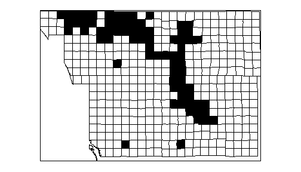
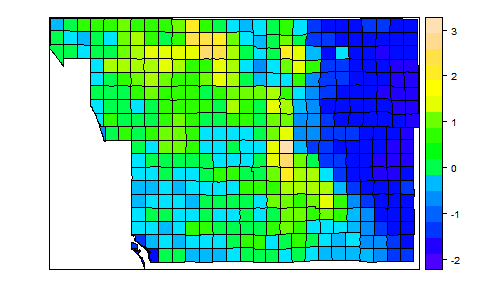
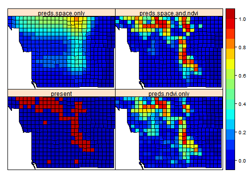

Spatially-explicit logistic regression
========================================================


```r
library(rgdal)
library(raster)
library(sp)
library(gam)
library(colorRamps)
library(ncf)
```


Loading the San Diego bird atlas data for Purple finch:

```r
finch <- readOGR("finch", layer = "finch")
```

```
## OGR data source with driver: ESRI Shapefile 
## Source: "finch", layer: "finch"
## with 414 features and 26 fields
## Feature type: wkbPolygon with 2 dimensions
```


Scaling and centering the environmental variables:

```r
envi <- finch@data[, 15:25]
envi.scaled <- as.numeric(scale(envi))
finch@data[, 15:25] <- envi.scaled
```


Plotting the response (presence/absence data) and the predictor (NDVI):

```r
spplot(finch, zcol = c("present"), col.regions = c("white", "black"), colorkey = FALSE)
```

 

```r
spplot(finch, zcol = c("ndvi"), col.regions = topo.colors(20))
```

 


Now we will do the actual modelling. The first simple model links the presences and absences to NDVI.

This is the model that we will fit:

$\log ( \frac{p_i}{1-p_i} ) = \beta_0 + \beta_1 NDVI_i$

$o_i \sim Bernoulli(p_i)$

It can be fitted by simple glm() in R:

```r
ndvi.only <- glm(present ~ ndvi, data = finch@data, family = "binomial")
summary(ndvi.only)
```

```
## 
## Call:
## glm(formula = present ~ ndvi, family = "binomial", data = finch@data)
## 
## Deviance Residuals: 
##     Min       1Q   Median       3Q      Max  
## -1.8376  -0.4842  -0.2227  -0.0439   2.6604  
## 
## Coefficients:
##             Estimate Std. Error z value Pr(>|z|)    
## (Intercept)   -2.939      0.296   -9.93   <2e-16 ***
## ndvi           2.652      0.322    8.23   <2e-16 ***
## ---
## Signif. codes:  0 '***' 0.001 '**' 0.01 '*' 0.05 '.' 0.1 ' ' 1
## 
## (Dispersion parameter for binomial family taken to be 1)
## 
##     Null deviance: 385.67  on 413  degrees of freedom
## Residual deviance: 228.61  on 412  degrees of freedom
## AIC: 232.6
## 
## Number of Fisher Scoring iterations: 6
```

```r
## and let's extract predictions and residuals:
preds.ndvi.only <- predict(ndvi.only, type = "response")
resid.ndvi.only <- residuals(ndvi.only)
```


Now let's plot the logistic curve:

```r
newx <- data.frame(ndvi = seq(-2, 3, by = 0.1))
newy <- predict(ndvi.only, newdata = newx, type = "response")
plot(newx[, 1], newy, type = "l", xlab = "(Scaled) NDVI", ylab = "P of presence", 
    col = "red")
points(finch@data$ndvi, finch@data$present)
```

 


The second model fits only the spatial trend in the data (using GAM and splines):

```r
space.only <- gam(present ~ s(X_CEN, 5) + s(Y_CEN, 5), data = finch@data, family = "binomial")
summary(space.only)
```

```
## 
## Call: gam(formula = present ~ s(X_CEN, 5) + s(Y_CEN, 5), family = "binomial", 
##     data = finch@data)
## Deviance Residuals:
##     Min      1Q  Median      3Q     Max 
## -1.7776 -0.5682 -0.3386 -0.0396  2.6354 
## 
## (Dispersion Parameter for binomial family taken to be 1)
## 
##     Null Deviance: 385.7 on 413 degrees of freedom
## Residual Deviance: 270.6 on 403 degrees of freedom
## AIC: 292.6 
## 
## Number of Local Scoring Iterations: 12 
## 
## Anova for Parametric Effects
##              Df Sum Sq Mean Sq F value  Pr(>F)    
## s(X_CEN, 5)   1    0.2     0.2    0.22    0.64    
## s(Y_CEN, 5)   1   36.7    36.7   50.63 5.1e-12 ***
## Residuals   403  292.2     0.7                    
## ---
## Signif. codes:  0 '***' 0.001 '**' 0.01 '*' 0.05 '.' 0.1 ' ' 1
## 
## Anova for Nonparametric Effects
##             Npar Df Npar Chisq  P(Chi)    
## (Intercept)                               
## s(X_CEN, 5)       4       37.2 1.6e-07 ***
## s(Y_CEN, 5)       4       11.1   0.025 *  
## ---
## Signif. codes:  0 '***' 0.001 '**' 0.01 '*' 0.05 '.' 0.1 ' ' 1
```

```r
preds.space.only <- predict(space.only, type = "response")
```


The third model uses both the NDVI and spatial trends to explain the finch's occurrences:

```r
space.and.ndvi <- gam(present ~ ndvi + s(X_CEN, 5) + s(Y_CEN, 5), data = finch@data, 
    family = "binomial")
summary(space.and.ndvi)
```

```
## 
## Call: gam(formula = present ~ ndvi + s(X_CEN, 5) + s(Y_CEN, 5), family = "binomial", 
##     data = finch@data)
## Deviance Residuals:
##     Min      1Q  Median      3Q     Max 
## -2.2184 -0.3275 -0.1376 -0.0373  3.3394 
## 
## (Dispersion Parameter for binomial family taken to be 1)
## 
##     Null Deviance: 385.7 on 413 degrees of freedom
## Residual Deviance: 175.3 on 402 degrees of freedom
## AIC: 199.3 
## 
## Number of Local Scoring Iterations: 12 
## 
## Anova for Parametric Effects
##              Df Sum Sq Mean Sq F value  Pr(>F)    
## ndvi          1     54    53.8   48.44 1.4e-11 ***
## s(X_CEN, 5)   1      1     1.2    1.04    0.31    
## s(Y_CEN, 5)   1     30    29.8   26.87 3.4e-07 ***
## Residuals   402    446     1.1                    
## ---
## Signif. codes:  0 '***' 0.001 '**' 0.01 '*' 0.05 '.' 0.1 ' ' 1
## 
## Anova for Nonparametric Effects
##             Npar Df Npar Chisq P(Chi)  
## (Intercept)                            
## ndvi                                   
## s(X_CEN, 5)       4      10.98  0.027 *
## s(Y_CEN, 5)       4       6.81  0.147  
## ---
## Signif. codes:  0 '***' 0.001 '**' 0.01 '*' 0.05 '.' 0.1 ' ' 1
```

```r
preds.space.and.ndvi <- predict(space.and.ndvi, type = "response")
resid.space.and.ndvi <- residuals(space.and.ndvi)
```


Now let's put all of the predictions and residuals together. We will use this for plotting:

```r
predictions <- data.frame(RC = finch@data$RC, preds.ndvi.only, resid.ndvi.only, 
    preds.space.only, preds.space.and.ndvi, resid.space.and.ndvi)
finch.preds <- merge(finch, predictions, by = "RC")
```


Here we will plot the predictions of the three models, together with the actual observed presences and absences:

```r
spplot(finch.preds, zcol = c("present", "preds.ndvi.only", "preds.space.only", 
    "preds.space.and.ndvi"), col.regions = matlab.like2(50))
```

 


It is always useful to check the magnitude of spatial correlation in residuals:

```r
ndvi.only.cor <- correlog(finch.preds@data$X_CEN, finch.preds@data$Y_CEN, finch.preds@data$resid.ndvi.only, 
    increment = 0.2, resamp = 1)
```

```
## 1  of  1
```

```r
space.and.envi.cor <- correlog(finch.preds@data$X_CEN, finch.preds@data$Y_CEN, 
    finch.preds@data$resid.space.and.ndvi, increment = 0.2, resamp = 1)
```

```
## 1  of  1
```


And we can plot the correlograms:

```r
plot(ndvi.only.cor$mean.of.class, ndvi.only.cor$correlation, type = "b", xlab = "Distance class", 
    ylab = "Moran's I", main = "Residual correlograms")
points(space.and.envi.cor$mean.of.class, space.and.envi.cor$correlation, col = "red", 
    type = "b")
abline(h = 0, lty = 2)
legend("topright", legend = c("ndvi.only", "space.and.ndvi"), col = c("black", 
    "red"), lwd = c(2, 2))
```

 


