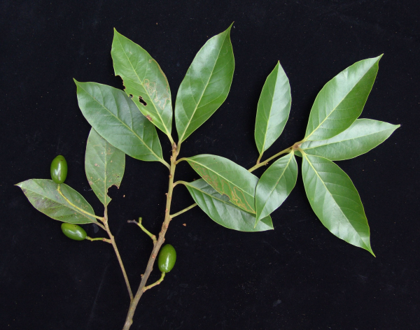
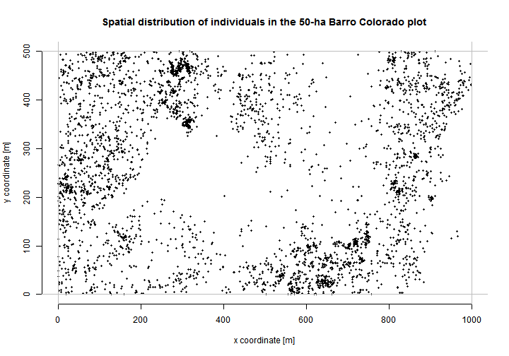
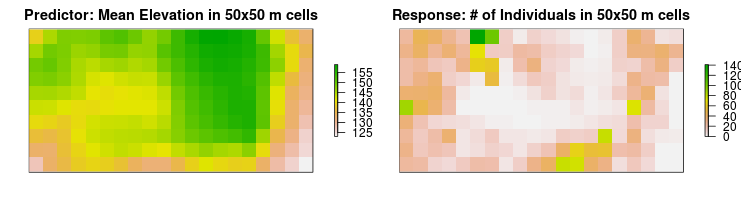
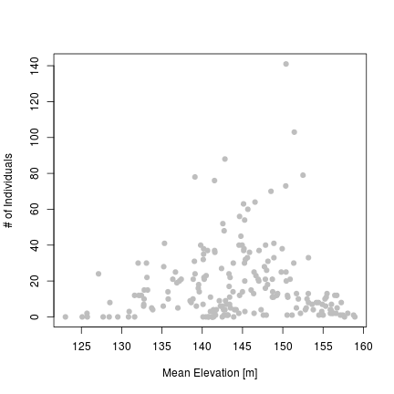
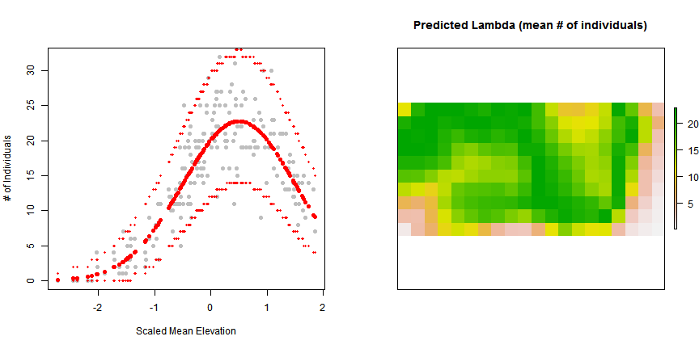
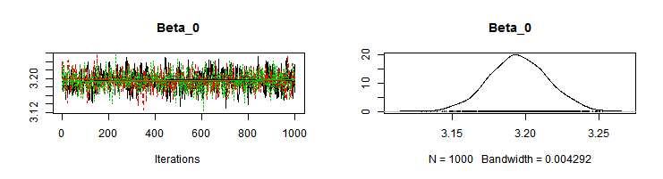
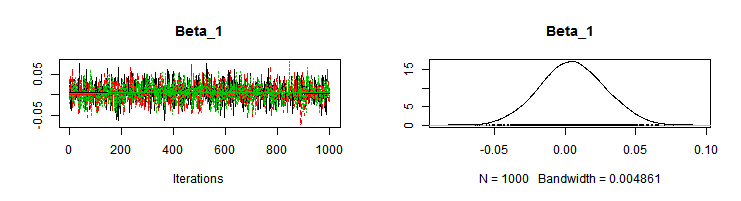
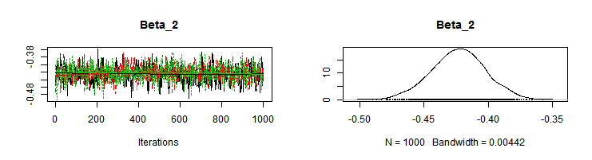
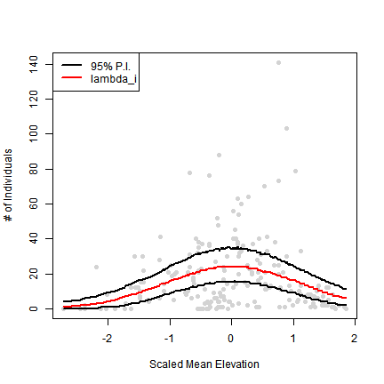

Poisson log-linear regression - fitted by glm(), maximum likelihood, and MCMC
=============================================================================

The goal of this post is to demonstrate how a simple statistical model (Poisson log-linear regression) can be fitted using three different approaches. I want to demonstrate that both frequentists and Bayesians use the same models, and that it is the fitting procedure and the inference that differs. This is also for those who understand the likelihood methods and do not have a clue about MCMC, and vice versa. I use an ecological dataset for the demonstration.

-------

The data
========  
  
I will use the data on the distribution of 3605 individual trees of *Beilschmiedia pendula* in 50-ha (500 x 1000 m) forest plot in Barro Colorado (Panama). Photo: Rolando Perez, Smithsonian Tropical Research Institute. 



The dataset is freely available as a part of the R's `spatstat` library. 

First, I will load the necessary libraries:

```r
library(spatstat)
library(raster)
library(sp)
library(googleVis)
library(rgdal)
library(knitr)
opts_chunk$set(cache = FALSE)
```


Let's plot the spatial distribution of the individuals in the plot:

```r
plot(bei$x, bei$y, pch = 19, cex = 0.5, main = "Spatial distribution of individuals in the 50-ha Barro Colorado plot", 
    xlab = "x coordinate [m]", ylab = "y coordinate [m]", frame = FALSE)
abline(h = 0, col = "grey")
abline(h = 500, col = "grey")
abline(v = 0, col = "grey")
abline(v = 1000, col = "grey")
```

 


Adam has created a little script that puts the individuals on Google Map:
<!-- Map generated in R 3.0.1 by googleVis 0.4.7 package -->
<!-- Thu Nov 21 00:14:52 2013 -->


<!-- jsHeader -->
<script type="text/javascript">
 
// jsData 
function gvisDataMapID9846dd14b3b () {
var data = new google.visualization.DataTable();
var datajson =
[
 [
 9.150763941,
-79.85537591,
"9.15076394111139" 
],
[
 9.153262125,
-79.84638427,
"9.15326212467393" 
],
[
 9.153289799,
-79.84655526,
"9.15328979874906" 
],
[
 9.153219981,
-79.84649725,
"9.15321998096399" 
],
[
 9.153124447,
-79.8468834,
"9.15312444695587" 
],
[
 9.153082048,
-79.8469163,
"9.15308204828743" 
],
[
 9.153039244,
-79.84682179,
"9.15303924424431" 
],
[
 9.152890324,
-79.84691418,
"9.15289032436322" 
],
[
 9.152805182,
-79.84687169,
"9.15280518246517" 
],
[
 9.151967315,
-79.84701089,
"9.15196731469617" 
],
[
 9.152740486,
-79.84700203,
"9.15274048565512" 
],
[
 9.153239871,
-79.84706412,
"9.15323987140657" 
],
[
 9.153467406,
-79.84695237,
"9.15346740610786" 
],
[
 9.153399202,
-79.8471173,
"9.15339920204327" 
],
[
 9.153077352,
-79.84714564,
"9.15307735196256" 
],
[
 9.152653456,
-79.84721889,
"9.15265345585324" 
],
[
 9.152778356,
-79.84725125,
"9.15277835584023" 
],
[
 9.152600872,
-79.8471772,
"9.15260087230049" 
],
[
 9.150362338,
-79.84735913,
"9.15036233820564" 
],
[
 9.152380595,
-79.84729621,
"9.1523805951609" 
],
[
 9.15229331,
-79.84743299,
"9.15229331049152" 
],
[
 9.153768968,
-79.84736909,
"9.15376896822333" 
],
[
 9.153508121,
-79.84752736,
"9.15350812123451" 
],
[
 9.153310122,
-79.84754256,
"9.15331012204147" 
],
[
 9.153235287,
-79.84761287,
"9.15323528652644" 
],
[
 9.153295867,
-79.84760995,
"9.15329586710889" 
],
[
 9.152755169,
-79.84763808,
"9.1527551692285" 
],
[
 9.152573863,
-79.84749943,
"9.15257386301971" 
],
[
 9.152334187,
-79.84749019,
"9.15233418708443" 
],
[
 9.150235888,
-79.8476926,
"9.15023588829164" 
],
[
 9.15154829,
-79.847763,
"9.15154829022201" 
],
[
 9.151924324,
-79.84771083,
"9.15192432429011" 
],
[
 9.152786979,
-79.84768803,
"9.1527869794786" 
],
[
 9.152845827,
-79.84770877,
"9.15284582665889" 
],
[
 9.152938215,
-79.84775488,
"9.15293821459634" 
],
[
 9.153164491,
-79.84781603,
"9.15316449069604" 
],
[
 9.153329799,
-79.84775817,
"9.1533297985067" 
],
[
 9.153269891,
-79.84768829,
"9.15326989075994" 
],
[
 9.153179633,
-79.84774318,
"9.1531796326282" 
],
[
 9.153250216,
-79.84775752,
"9.15325021568084" 
],
[
 9.153422978,
-79.84776879,
"9.153422977921" 
],
[
 9.153580497,
-79.84782106,
"9.15358049696657" 
],
[
 9.153621165,
-79.84781274,
"9.15362116521029" 
],
[
 9.153819944,
-79.84775841,
"9.15381994432467" 
],
[
 9.153503743,
-79.8478568,
"9.15350374282267" 
],
[
 9.153386566,
-79.84797821,
"9.15338656632755" 
],
[
 9.153193521,
-79.84784506,
"9.15319352143583" 
],
[
 9.153156563,
-79.84788249,
"9.15315656303695" 
],
[
 9.152976809,
-79.84794768,
"9.15297680925716" 
],
[
 9.152773121,
-79.84788008,
"9.15277312085772" 
],
[
 9.152491367,
-79.84800475,
"9.1524913672062" 
],
[
 9.152260558,
-79.84793998,
"9.15226055797155" 
],
[
 9.151247766,
-79.84795689,
"9.15124776570009" 
],
[
 9.151475865,
-79.84802258,
"9.15147586486247" 
],
[
 9.151980627,
-79.84806919,
"9.15198062736" 
],
[
 9.153521553,
-79.84805422,
"9.15352155262821" 
],
[
 9.153364355,
-79.84810295,
"9.15336435469127" 
],
[
 9.15369164,
-79.84807733,
"9.15369163952834" 
],
[
 9.153654655,
-79.84810657,
"9.15365465507632" 
],
[
 9.153813159,
-79.84818432,
"9.15381315940169" 
],
[
 9.15372464,
-79.84821737,
"9.15372464041104" 
],
[
 9.153350747,
-79.84837418,
"9.15335074748792" 
],
[
 9.152936081,
-79.84822172,
"9.15293608128331" 
],
[
 9.151798936,
-79.84837827,
"9.15179893551315" 
],
[
 9.151044428,
-79.84828423,
"9.15104442807419" 
],
[
 9.152630058,
-79.84839288,
"9.15263005838857" 
],
[
 9.152505847,
-79.8485771,
"9.15250584659927" 
],
[
 9.152133678,
-79.84870752,
"9.15213367819158" 
],
[
 9.152103059,
-79.84874766,
"9.15210305857299" 
],
[
 9.151870719,
-79.84905508,
"9.15187071853751" 
],
[
 9.151767369,
-79.84925926,
"9.15176736920495" 
],
[
 9.151125017,
-79.84945606,
"9.15112501729795" 
],
[
 9.151980664,
-79.84978911,
"9.15198066363266" 
],
[
 9.14939074,
-79.84981108,
"9.14939073963129" 
],
[
 9.152502926,
-79.84993576,
"9.15250292590679" 
],
[
 9.153077194,
-79.8499421,
"9.15307719391265" 
],
[
 9.153098724,
-79.85017227,
"9.1530987237821" 
],
[
 9.152075533,
-79.85004724,
"9.15207553279308" 
],
[
 9.149512708,
-79.85034486,
"9.14951270826908" 
],
[
 9.152769685,
-79.85021519,
"9.15276968476345" 
],
[
 9.153012889,
-79.8501962,
"9.15301288862098" 
],
[
 9.153007575,
-79.85051655,
"9.15300757454011" 
],
[
 9.150234307,
-79.85061281,
"9.15023430706744" 
],
[
 9.152674138,
-79.85059861,
"9.15267413795013" 
],
[
 9.152922086,
-79.85064968,
"9.15292208568341" 
],
[
 9.15283706,
-79.85064359,
"9.15283705955581" 
],
[
 9.15309909,
-79.85057267,
"9.15309908964193" 
],
[
 9.153391132,
-79.85084019,
"9.15339113151584" 
],
[
 9.152998496,
-79.85079049,
"9.1529984957341" 
],
[
 9.153019183,
-79.85075493,
"9.1530191825134" 
],
[
 9.152941931,
-79.85091898,
"9.15294193053169" 
],
[
 9.152645768,
-79.85077797,
"9.15264576827209" 
],
[
 9.152586571,
-79.85093195,
"9.15258657088894" 
],
[
 9.152783252,
-79.85107146,
"9.1527832522981" 
],
[
 9.152742558,
-79.85107159,
"9.1527425579657" 
],
[
 9.152787471,
-79.8509759,
"9.15278747096179" 
],
[
 9.152928703,
-79.8510255,
"9.15292870332456" 
],
[
 9.15282564,
-79.85103493,
"9.15282563986844" 
],
[
 9.152883326,
-79.85097468,
"9.15288332583375" 
],
[
 9.15348086,
-79.85118844,
"9.15348085977897" 
],
[
 9.153349754,
-79.85119523,
"9.15334975378961" 
],
[
 9.153187245,
-79.85128038,
"9.15318724472733" 
],
[
 9.153147016,
-79.85114219,
"9.15314701624044" 
],
[
 9.152834341,
-79.85121235,
"9.15283434127073" 
],
[
 9.152791608,
-79.85113969,
"9.15279160752696" 
],
[
 9.152667094,
-79.85122927,
"9.15266709426126" 
],
[
 9.152723889,
-79.85145841,
"9.15272388883301" 
],
[
 9.152824919,
-79.851378,
"9.15282491872141" 
],
[
 9.15382059,
-79.85195085,
"9.15382059024272" 
],
[
 9.153266528,
-79.85204272,
"9.15326652824684" 
],
[
 9.152716668,
-79.85231931,
"9.1527166684961" 
],
[
 9.149747643,
-79.85256816,
"9.14974764256364" 
],
[
 9.149757118,
-79.85241888,
"9.1497571176883" 
],
[
 9.152775075,
-79.85248656,
"9.15277507511425" 
],
[
 9.153096935,
-79.85246096,
"9.1530969348564" 
],
[
 9.153328717,
-79.85254758,
"9.15332871712222" 
],
[
 9.153815589,
-79.85265613,
"9.15381558935404" 
],
[
 9.153725068,
-79.85262821,
"9.15372506813962" 
],
[
 9.152594646,
-79.85262455,
"9.15259464637429" 
],
[
 9.150605476,
-79.85273558,
"9.15060547568356" 
],
[
 9.150103435,
-79.85269169,
"9.15010343455891" 
],
[
 9.149710658,
-79.85259739,
"9.14971065764468" 
],
[
 9.152799564,
-79.85279498,
"9.15279956405905" 
],
[
 9.153343976,
-79.85279687,
"9.15334397563863" 
],
[
 9.153527463,
-79.85305382,
"9.1535274632589" 
],
[
 9.153258679,
-79.85299098,
"9.15325867887546" 
],
[
 9.152672925,
-79.85307021,
"9.15267292489587" 
],
[
 9.152907668,
-79.85323508,
"9.15290766766193" 
],
[
 9.152988737,
-79.8531338,
"9.15298873674402" 
],
[
 9.153166464,
-79.85328521,
"9.15316646419956" 
],
[
 9.15335962,
-79.85345385,
"9.15335961973889" 
],
[
 9.151113452,
-79.85351201,
"9.15111345182572" 
],
[
 9.153093946,
-79.85351658,
"9.15309394565303" 
],
[
 9.153531711,
-79.85382459,
"9.1535317105822" 
],
[
 9.153312373,
-79.85366968,
"9.15331237310188" 
],
[
 9.152836693,
-79.85366847,
"9.15283669250998" 
],
[
 9.152335967,
-79.8537547,
"9.15233596726685" 
],
[
 9.150679047,
-79.85369449,
"9.15067904691217" 
],
[
 9.149687897,
-79.85397886,
"9.14968789745724" 
],
[
 9.150581331,
-79.85396508,
"9.15058133065236" 
],
[
 9.151734995,
-79.85388312,
"9.15173499487238" 
],
[
 9.15319291,
-79.85392668,
"9.15319291028624" 
],
[
 9.153405181,
-79.85384865,
"9.15340518070709" 
],
[
 9.153889544,
-79.85402182,
"9.15388954414221" 
],
[
 9.153782025,
-79.8540522,
"9.15378202510236" 
],
[
 9.153641052,
-79.8540845,
"9.15364105199412" 
],
[
 9.152603193,
-79.85418247,
"9.15260319250347" 
],
[
 9.152114765,
-79.854154,
"9.15211476503054" 
],
[
 9.151914046,
-79.85416738,
"9.15191404637445" 
],
[
 9.151606258,
-79.85406736,
"9.15160625839743" 
],
[
 9.151607517,
-79.85417928,
"9.15160751657397" 
],
[
 9.150145998,
-79.85414028,
"9.15014599806687" 
],
[
 9.15005846,
-79.85419789,
"9.15005846027122" 
],
[
 9.149419095,
-79.8541963,
"9.14941909477939" 
],
[
 9.150020199,
-79.85439548,
"9.15002019860979" 
],
[
 9.150234946,
-79.85424283,
"9.15023494640841" 
],
[
 9.15029936,
-79.85430814,
"9.1502993601812" 
],
[
 9.151908885,
-79.85425112,
"9.15190888511964" 
],
[
 9.152170538,
-79.85434674,
"9.15217053839013" 
],
[
 9.152623556,
-79.85433073,
"9.1526235564619" 
],
[
 9.153288848,
-79.8542376,
"9.15328884793113" 
],
[
 9.153771786,
-79.85424606,
"9.1537717861762" 
],
[
 9.153765449,
-79.85453001,
"9.15376544921142" 
],
[
 9.152531618,
-79.85442658,
"9.15253161790438" 
],
[
 9.152262168,
-79.85443927,
"9.15226216806058" 
],
[
 9.152068494,
-79.85439257,
"9.15206849409908" 
],
[
 9.149432565,
-79.85473862,
"9.14943256464056" 
],
[
 9.152201175,
-79.85459781,
"9.1522011747658" 
],
[
 9.153089214,
-79.85459406,
"9.15308921376124" 
],
[
 9.153458135,
-79.85486588,
"9.15345813461779" 
],
[
 9.153386429,
-79.85478239,
"9.15338642880109" 
],
[
 9.153136842,
-79.85478501,
"9.15313684232816" 
],
[
 9.151939848,
-79.85489167,
"9.15193984795419" 
],
[
 9.153051887,
-79.8550874,
"9.15305188655817" 
],
[
 9.153465747,
-79.85527172,
"9.15346574714616" 
],
[
 9.153236698,
-79.85519146,
"9.15323669839536" 
],
[
 9.151373079,
-79.85525566,
"9.15137307916109" 
],
[
 9.151202636,
-79.85511971,
"9.15120263590636" 
],
[
 9.150760929,
-79.85528128,
"9.15076092929737" 
],
[
 9.150470821,
-79.85533863,
"9.15047082075578" 
],
[
 9.151975546,
-79.8553138,
"9.15197554589243" 
],
[
 9.153010981,
-79.85530685,
"9.15301098063434" 
],
[
 9.153200199,
-79.85537449,
"9.15320019905278" 
],
[
 9.152723331,
-79.84672635,
"9.15272333062143" 
],
[
 9.152781932,
-79.84666974,
"9.15278193168821" 
],
[
 9.152899684,
-79.84672942,
"9.15289968404101" 
],
[
 9.153106648,
-79.84668963,
"9.15310664813025" 
],
[
 9.153083069,
-79.84666877,
"9.15308306927727" 
],
[
 9.152999878,
-79.84667086,
"9.15299987789809" 
],
[
 9.153330843,
-79.84666524,
"9.1533308434661" 
],
[
 9.153202349,
-79.84664018,
"9.15320234935076" 
],
[
 9.153259266,
-79.8466227,
"9.15325926629753" 
],
[
 9.153346139,
-79.84664062,
"9.15334613865918" 
],
[
 9.153317867,
-79.84656609,
"9.15331786733386" 
],
[
 9.153258162,
-79.84655992,
"9.15325816213496" 
],
[
 9.153349695,
-79.8466215,
"9.15334969510634" 
],
[
 9.15335415,
-79.84660056,
"9.15335415007686" 
],
[
 9.153532367,
-79.84662091,
"9.15353236714915" 
],
[
 9.153621912,
-79.84662608,
"9.15362191191385" 
],
[
 9.153162155,
-79.85392405,
"9.15316215479353" 
],
[
 9.153604063,
-79.85439857,
"9.15360406321665" 
],
[
 9.149519059,
-79.84778773,
"9.14951905947337" 
],
[
 9.14964762,
-79.84783372,
"9.14964762007186" 
],
[
 9.149839095,
-79.84775758,
"9.14983909535218" 
],
[
 9.149944228,
-79.84783004,
"9.14994422757224" 
],
[
 9.150019208,
-79.84780523,
"9.15001920784332" 
],
[
 9.150093373,
-79.84780863,
"9.15009337345481" 
],
[
 9.150080537,
-79.84775316,
"9.15008053657644" 
],
[
 9.149922217,
-79.84773365,
"9.14992221736831" 
],
[
 9.149945779,
-79.84774904,
"9.1499457787958" 
],
[
 9.150310508,
-79.84783887,
"9.15031050801305" 
],
[
 9.150344855,
-79.8478333,
"9.15034485472774" 
],
[
 9.150406244,
-79.84780034,
"9.15040624419912" 
],
[
 9.150371611,
-79.84771582,
"9.15037161113092" 
],
[
 9.150537477,
-79.84783359,
"9.15053747726467" 
],
[
 9.150576218,
-79.84778797,
"9.15057621829988" 
],
[
 9.150497502,
-79.84777548,
"9.15049750217765" 
],
[
 9.150666621,
-79.84777857,
"9.15066662113048" 
],
[
 9.151072778,
-79.84781458,
"9.15107277830323" 
],
[
 9.151171323,
-79.84780607,
"9.15117132288176" 
],
[
 9.151115171,
-79.84777986,
"9.15111517130841" 
],
[
 9.151348558,
-79.84780186,
"9.15134855754711" 
],
[
 9.151348479,
-79.84777729,
"9.15134847944407" 
],
[
 9.151234382,
-79.84772943,
"9.15123438212027" 
],
[
 9.151290302,
-79.84768284,
"9.15129030226793" 
],
[
 9.151199885,
-79.84768768,
"9.15119988498331" 
],
[
 9.153008895,
-79.84666264,
"9.15300889500451" 
],
[
 9.151513588,
-79.84765664,
"9.15151358768092" 
],
[
 9.151488273,
-79.84765854,
"9.15148827257789" 
],
[
 9.151407881,
-79.84768792,
"9.15140788089916" 
],
[
 9.151775424,
-79.84780959,
"9.15177542434184" 
],
[
 9.151741727,
-79.84773507,
"9.15174172737863" 
],
[
 9.151982574,
-79.84782803,
"9.15198257379904" 
],
[
 9.152405606,
-79.84776752,
"9.15240560633879" 
],
[
 9.152344898,
-79.8477304,
"9.15234489845089" 
],
[
 9.152727549,
-79.8477683,
"9.15272754913857" 
],
[
 9.152916361,
-79.84770763,
"9.15291636052418" 
],
[
 9.152992636,
-79.84780567,
"9.15299263566376" 
],
[
 9.153125631,
-79.84782435,
"9.15312563108477" 
],
[
 9.153100879,
-79.84771887,
"9.15310087889109" 
],
[
 9.153169474,
-79.84767679,
"9.15316947391294" 
],
[
 9.153226611,
-79.84772847,
"9.15322661083888" 
],
[
 9.153354377,
-79.84780905,
"9.15335437710434" 
],
[
 9.153563315,
-79.84782112,
"9.15356331493558" 
],
[
 9.153863433,
-79.84778375,
"9.15386343257836" 
],
[
 9.153870632,
-79.84777281,
"9.15387063239523" 
],
[
 9.153858787,
-79.84774464,
"9.15385878656852" 
],
[
 9.153846866,
-79.84769281,
"9.15384686550362" 
],
[
 9.150418524,
-79.84682751,
"9.15041852433077" 
],
[
 9.151571685,
-79.84687293,
"9.15157168513734" 
],
[
 9.152756199,
-79.84682453,
"9.15275619877222" 
],
[
 9.152760506,
-79.84675717,
"9.15276050607948" 
],
[
 9.152933558,
-79.84685944,
"9.15293355785898" 
],
[
 9.15290093,
-79.8468368,
"9.15290093005285" 
],
[
 9.152857636,
-79.84687243,
"9.15285763575558" 
],
[
 9.152972992,
-79.84674739,
"9.15297299164344" 
],
[
 9.152931408,
-79.84675207,
"9.15293140753552" 
],
[
 9.152888896,
-79.84674948,
"9.15288889594387" 
],
[
 9.153023181,
-79.84688919,
"9.15302318080853" 
],
[
 9.153055507,
-79.84681719,
"9.15305550747422" 
],
[
 9.153176886,
-79.84687959,
"9.15317688576787" 
],
[
 9.153293638,
-79.84690925,
"9.15329363823202" 
],
[
 9.153275474,
-79.84688473,
"9.15327547370931" 
],
[
 9.153311615,
-79.84687461,
"9.15331161454306" 
],
[
 9.153750977,
-79.84683042,
"9.15375097656016" 
],
[
 9.151515309,
-79.84706058,
"9.15151530948599" 
],
[
 9.151480856,
-79.84703248,
"9.15148085569636" 
],
[
 9.151640117,
-79.84706381,
"9.15164011684867" 
],
[
 9.151958552,
-79.84709919,
"9.15195855231354" 
],
[
 9.152085024,
-79.84705692,
"9.15208502357368" 
],
[
 9.152310291,
-79.84708532,
"9.15231029120155" 
],
[
 9.152272371,
-79.84710455,
"9.15227237066659" 
],
[
 9.152351832,
-79.84706698,
"9.15235183189871" 
],
[
 9.152436678,
-79.84701666,
"9.15243667849831" 
],
[
 9.152439484,
-79.84704577,
"9.15243948408839" 
],
[
 9.152418471,
-79.8469785,
"9.1524184705627" 
],
[
 9.152505641,
-79.84709015,
"9.15250564109508" 
],
[
 9.152551428,
-79.84698535,
"9.15255142835277" 
],
[
 9.152490738,
-79.84695369,
"9.15249073777073" 
],
[
 9.152448264,
-79.84696293,
"9.15244826381378" 
],
[
 9.152689215,
-79.84708865,
"9.15268921459899" 
],
[
 9.152793003,
-79.84702279,
"9.15279300264016" 
],
[
 9.15269791,
-79.84697942,
"9.15269791036833" 
],
[
 9.152678781,
-79.8469358,
"9.15267878073713" 
],
[
 9.152957571,
-79.8470168,
"9.15295757099972" 
],
[
 9.153083309,
-79.84702822,
"9.15308330872653" 
],
[
 9.153101349,
-79.84701361,
"9.15310134874741" 
],
[
 9.153097708,
-79.84700634,
"9.15309770831698" 
],
[
 9.153139214,
-79.84697708,
"9.15313921425878" 
],
[
 9.153200989,
-79.84706516,
"9.15320098866223" 
],
[
 9.153317576,
-79.84704294,
"9.15331757609627" 
],
[
 9.15328134,
-79.84702304,
"9.15328133971423" 
],
[
 9.153227037,
-79.84700956,
"9.15322703725483" 
],
[
 9.153315536,
-79.84697015,
"9.15331553583892" 
],
[
 9.15321602,
-79.84695773,
"9.15321602041582" 
],
[
 9.153177926,
-79.84692236,
"9.15317792617393" 
],
[
 9.153367209,
-79.84701002,
"9.15336720931223" 
],
[
 9.153688033,
-79.84694347,
"9.15368803343067" 
],
[
 9.150512119,
-79.84725309,
"9.15051211923461" 
],
[
 9.151109977,
-79.84728392,
"9.15110997720214" 
],
[
 9.151165141,
-79.84728375,
"9.15116514056172" 
],
[
 9.151174132,
-79.84726734,
"9.15117413164447" 
],
[
 9.151170523,
-79.84727008,
"9.15117052305689" 
],
[
 9.151169581,
-79.84725825,
"9.15116958111794" 
],
[
 9.151149686,
-79.84725832,
"9.151149686136" 
],
[
 9.151138837,
-79.84725926,
"9.15113883722163" 
],
[
 9.151176764,
-79.84724185,
"9.15117676356472" 
],
[
 9.151150507,
-79.84723192,
"9.15115050652708" 
],
[
 9.15118767,
-79.8472591,
"9.15118767035912" 
],
[
 9.151204609,
-79.84718261,
"9.15120460928559" 
],
[
 9.151535888,
-79.84727527,
"9.15153588752665" 
],
[
 9.151662498,
-79.84727668,
"9.15166249774304" 
],
[
 9.15193381,
-79.84728127,
"9.1519338103085" 
],
[
 9.152073055,
-79.84727445,
"9.1520730549172" 
],
[
 9.152108335,
-79.84727798,
"9.15210833486959" 
],
[
 9.152125935,
-79.84712504,
"9.15212593495258" 
],
[
 9.152399366,
-79.84722699,
"9.15239936585311" 
],
[
 9.152290654,
-79.84716637,
"9.15229065384738" 
],
[
 9.152324977,
-79.84715352,
"9.15232497737951" 
],
[
 9.152435426,
-79.84719138,
"9.15243542565903" 
],
[
 9.152326662,
-79.84711438,
"9.15232666154379" 
],
[
 9.15246363,
-79.84724498,
"9.15246363026941" 
],
[
 9.152552871,
-79.84715461,
"9.15255287111929" 
],
[
 9.152480503,
-79.84714756,
"9.15248050258117" 
],
[
 9.152743862,
-79.84721041,
"9.15274386152912" 
],
[
 9.152742972,
-79.84721496,
"9.15274297168481" 
],
[
 9.152731158,
-79.8471968,
"9.15273115766825" 
],
[
 9.152760844,
-79.84714757,
"9.15276084382423" 
],
[
 9.152860698,
-79.84726645,
"9.15286069791904" 
],
[
 9.152829731,
-79.84719739,
"9.15282973114429" 
],
[
 9.152952617,
-79.84716515,
"9.15295261697525" 
],
[
 9.153255688,
-79.8472033,
"9.15325568772609" 
],
[
 9.153232019,
-79.84715424,
"9.15323201915712" 
],
[
 9.153361678,
-79.8472612,
"9.15336167810579" 
],
[
 9.153426499,
-79.84716999,
"9.15342649946809" 
],
[
 9.153760523,
-79.84727266,
"9.15376052253636" 
],
[
 9.153808855,
-79.84711507,
"9.15380885483693" 
],
[
 9.150515783,
-79.84726764,
"9.15051578280454" 
],
[
 9.149601152,
-79.84743984,
"9.1496011517205" 
],
[
 9.150235133,
-79.84745509,
"9.15023513324531" 
],
[
 9.150169011,
-79.84742163,
"9.15016901102088" 
],
[
 9.150652754,
-79.84739915,
"9.15065275430751" 
],
[
 9.150951269,
-79.8474264,
"9.15095126875661" 
],
[
 9.151205945,
-79.84731819,
"9.15120594481096" 
],
[
 9.151597659,
-79.84736243,
"9.1515976589268" 
],
[
 9.151843685,
-79.84737802,
"9.15184368534082" 
],
[
 9.15183099,
-79.84736714,
"9.15183099017087" 
],
[
 9.152016164,
-79.84730012,
"9.15201616396281" 
],
[
 9.152020654,
-79.84729009,
"9.15202065371374" 
],
[
 9.152251631,
-79.84740765,
"9.15225163086329" 
],
[
 9.152093011,
-79.8472935,
"9.1520930106766" 
],
[
 9.152610827,
-79.84746382,
"9.15261082717067" 
],
[
 9.152534616,
-79.84738581,
"9.15253461562943" 
],
[
 9.152489264,
-79.84734318,
"9.15248926373864" 
],
[
 9.15255629,
-79.84737664,
"9.15255629030433" 
],
[
 9.152501771,
-79.84729491,
"9.15250177078602" 
],
[
 9.152684967,
-79.84745903,
"9.15268496672383" 
],
[
 9.152745368,
-79.84739969,
"9.15274536787304" 
],
[
 9.152646638,
-79.84734996,
"9.15264663810573" 
],
[
 9.152680973,
-79.84734074,
"9.15268097322133" 
],
[
 9.15285577,
-79.84742299,
"9.15285576983391" 
],
[
 9.152903826,
-79.84746288,
"9.15290382599104" 
],
[
 9.153149546,
-79.84738201,
"9.15314954561677" 
],
[
 9.153251875,
-79.84742627,
"9.15325187529072" 
],
[
 9.153257336,
-79.84743717,
"9.153257335925" 
],
[
 9.153286987,
-79.84737701,
"9.15328698737433" 
],
[
 9.153218352,
-79.84740635,
"9.1532183518772" 
],
[
 9.153196683,
-79.84741734,
"9.15319668299263" 
],
[
 9.153205532,
-79.84735635,
"9.15320553224777" 
],
[
 9.153216364,
-79.84734994,
"9.15321636379455" 
],
[
 9.153284248,
-79.84736883,
"9.15328424837323" 
],
[
 9.153198124,
-79.84730177,
"9.15319812404301" 
],
[
 9.153437009,
-79.8473465,
"9.15343700852799" 
],
[
 9.153683243,
-79.84742761,
"9.15368324332558" 
],
[
 9.153655111,
-79.84739676,
"9.15365511108084" 
],
[
 9.153617136,
-79.8473987,
"9.15361713554381" 
],
[
 9.15357265,
-79.84734424,
"9.15357265032979" 
],
[
 9.153644889,
-79.84731034,
"9.15364488861144" 
],
[
 9.153747314,
-79.84738463,
"9.15374731381529" 
],
[
 9.1538648,
-79.84736059,
"9.15386479980226" 
],
[
 9.149649674,
-79.84762624,
"9.14964967357518" 
],
[
 9.149738216,
-79.84760047,
"9.1497382157012" 
],
[
 9.149884721,
-79.84760182,
"9.14988472092766" 
],
[
 9.149808657,
-79.84757021,
"9.14980865700897" 
],
[
 9.149781435,
-79.84754118,
"9.14978143491349" 
],
[
 9.149765981,
-79.84751575,
"9.14976598051544" 
],
[
 9.149959054,
-79.847658,
"9.14995905431089" 
],
[
 9.150034922,
-79.84762773,
"9.15003492152693" 
],
[
 9.150032272,
-79.84764776,
"9.15003227221315" 
],
[
 9.150053961,
-79.84764314,
"9.15005396137082" 
],
[
 9.150004963,
-79.84759142,
"9.15000496333882" 
],
[
 9.150163401,
-79.84764824,
"9.15016340114885" 
],
[
 9.150604694,
-79.84764227,
"9.15060469363629" 
],
[
 9.150543691,
-79.84751234,
"9.15054369066601" 
],
[
 9.150893006,
-79.84758947,
"9.15089300601904" 
],
[
 9.151311867,
-79.84763909,
"9.15131186702289" 
],
[
 9.151281022,
-79.84760825,
"9.15128102186331" 
],
[
 9.151366033,
-79.84760979,
"9.1513660334913" 
],
[
 9.151490965,
-79.84765216,
"9.1514909652787" 
],
[
 9.151562305,
-79.84762008,
"9.15156230509819" 
],
[
 9.151653517,
-79.84758066,
"9.15165351675019" 
],
[
 9.151853966,
-79.84748264,
"9.15185396561482" 
],
[
 9.151964764,
-79.84763061,
"9.15196476397479" 
],
[
 9.151979152,
-79.84760509,
"9.15197915204048" 
],
[
 9.151987109,
-79.84754773,
"9.15198710861062" 
],
[
 9.152099516,
-79.84763291,
"9.15209951595281" 
],
[
 9.152395684,
-79.84749091,
"9.15239568355971" 
],
[
 9.15260994,
-79.84746928,
"9.15260994021678" 
],
[
 9.152674592,
-79.84760922,
"9.1526745923863" 
],
[
 9.152844422,
-79.84755134,
"9.15284442175314" 
],
[
 9.152967394,
-79.84754639,
"9.15296739444604" 
],
[
 9.153144687,
-79.84756038,
"9.15314468695007" 
],
[
 9.153100419,
-79.84757418,
"9.15310041880662" 
],
[
 9.153130088,
-79.84751948,
"9.15313008764728" 
],
[
 9.153244246,
-79.84758645,
"9.15324424578065" 
],
[
 9.153190934,
-79.84760028,
"9.15319093446283" 
],
[
 9.153392725,
-79.84763967,
"9.15339272456094" 
],
[
 9.153398684,
-79.84752317,
"9.15339868436719" 
],
[
 9.153455743,
-79.84755028,
"9.15345574317915" 
],
[
 9.153677214,
-79.84752227,
"9.1536772141039" 
],
[
 9.153677252,
-79.8475341,
"9.15367725172707" 
],
[
 9.153815951,
-79.84764012,
"9.15381595087351" 
],
[
 9.153736021,
-79.84753027,
"9.15373602077662" 
],
[
 9.150059182,
-79.84757851,
"9.15005918189082" 
],
[
 9.152902948,
-79.84747107,
"9.15290294771972" 
],
[
 9.153505411,
-79.84752828,
"9.15350541117655" 
],
[
 9.153722482,
-79.8475385,
"9.15372248206362" 
],
[
 9.15044702,
-79.84668818,
"9.15044701954616" 
],
[
 9.150538411,
-79.84670518,
"9.15053841059324" 
],
[
 9.153290803,
-79.84772372,
"9.15329080290738" 
],
[
 9.152079965,
-79.84717251,
"9.15207996528796" 
],
[
 9.149490847,
-79.84801623,
"9.1494908471618" 
],
[
 9.149513449,
-79.84801434,
"9.14951344932081" 
],
[
 9.149402071,
-79.84796828,
"9.14940207077428" 
],
[
 9.14940199,
-79.8479428,
"9.14940198980727" 
],
[
 9.149405462,
-79.84789729,
"9.14940546248949" 
],
[
 9.149712957,
-79.84790449,
"9.14971295651585" 
],
[
 9.149838616,
-79.84789135,
"9.14983861617982" 
],
[
 9.14973813,
-79.847858,
"9.14973812991923" 
],
[
 9.149959145,
-79.84797104,
"9.14995914491255" 
],
[
 9.150038482,
-79.84789435,
"9.15003848194281" 
],
[
 9.150329173,
-79.84802081,
"9.15032917277154" 
],
[
 9.150391527,
-79.84800696,
"9.15039152731135" 
],
[
 9.150394942,
-79.84794325,
"9.15039494214606" 
],
[
 9.150387742,
-79.84795419,
"9.15038774230917" 
],
[
 9.150385015,
-79.84794965,
"9.15038501489632" 
],
[
 9.150380571,
-79.84797424,
"9.15038057139139" 
],
[
 9.150488263,
-79.84799846,
"9.15048826327127" 
],
[
 9.150563281,
-79.84798548,
"9.15056328114715" 
],
[
 9.150546917,
-79.84795823,
"9.15054691667004" 
],
[
 9.150634393,
-79.84788151,
"9.15063439253748" 
],
[
 9.150624361,
-79.84785515,
"9.1506243611679" 
],
[
 9.150723958,
-79.84789305,
"9.15072395757772" 
],
[
 9.15077373,
-79.84790381,
"9.15077372975187" 
],
[
 9.150874285,
-79.847959,
"9.15087428542791" 
],
[
 9.150948327,
-79.84792327,
"9.15094832667508" 
],
[
 9.150957115,
-79.84784316,
"9.15095711532435" 
],
[
 9.150931006,
-79.84787964,
"9.1509310058109" 
],
[
 9.151136671,
-79.84800001,
"9.15113667056916" 
],
[
 9.151336276,
-79.84792111,
"9.15133627602194" 
],
[
 9.151330781,
-79.84789929,
"9.15133078069904" 
],
[
 9.151476309,
-79.84787789,
"9.15147630929771" 
],
[
 9.151440018,
-79.8478407,
"9.15144001800105" 
],
[
 9.15175314,
-79.84791158,
"9.15175314038135" 
],
[
 9.151773032,
-79.8479106,
"9.15177303247468" 
],
[
 9.151770181,
-79.84786693,
"9.15177018067784" 
],
[
 9.151928882,
-79.84800656,
"9.15192888169175" 
],
[
 9.151999418,
-79.84800634,
"9.15199941846142" 
],
[
 9.151919691,
-79.84796018,
"9.15191969100387" 
],
[
 9.151923028,
-79.8478719,
"9.15192302769501" 
],
[
 9.152216362,
-79.84797652,
"9.15221636211495" 
],
[
 9.152236046,
-79.84791002,
"9.15223604594117" 
],
[
 9.152392745,
-79.84798869,
"9.15239274452961" 
],
[
 9.152437891,
-79.8479667,
"9.15243789098442" 
],
[
 9.152377992,
-79.84789956,
"9.15237799197041" 
],
[
 9.152517592,
-79.84800467,
"9.15251759241463" 
],
[
 9.15253118,
-79.84801191,
"9.15253118031782" 
],
[
 9.152542792,
-79.84796637,
"9.15254279181684" 
],
[
 9.152503808,
-79.84793555,
"9.15250380781302" 
],
[
 9.152535161,
-79.84784172,
"9.15253516096455" 
],
[
 9.15246463,
-79.84784377,
"9.15246462998691" 
],
[
 9.152948506,
-79.84786314,
"9.15294850637381" 
],
[
 9.153096814,
-79.84786266,
"9.15309681443746" 
],
[
 9.153277219,
-79.84800222,
"9.15327721912507" 
],
[
 9.15330527,
-79.84800759,
"9.153305270324" 
],
[
 9.153274497,
-79.8479995,
"9.15327449749425" 
],
[
 9.153352223,
-79.84798469,
"9.15335222251324" 
],
[
 9.153330464,
-79.84796747,
"9.15333046392932" 
],
[
 9.153312334,
-79.84795388,
"9.15331233418637" 
],
[
 9.153269733,
-79.84792308,
"9.15326973290523" 
],
[
 9.15320375,
-79.8479333,
"9.15320374955225" 
],
[
 9.153294138,
-79.84791936,
"9.15329413790492" 
],
[
 9.153291309,
-79.84788297,
"9.15329130923119" 
],
[
 9.153362228,
-79.84800286,
"9.15336222786202" 
],
[
 9.153774406,
-79.84794147,
"9.15377440569373" 
],
[
 9.14971799,
-79.84806555,
"9.14971798993559" 
],
[
 9.14988994,
-79.84810595,
"9.1498899404137" 
],
[
 9.150052085,
-79.84819096,
"9.15005208507182" 
],
[
 9.149956083,
-79.84814577,
"9.149956082828" 
],
[
 9.149940597,
-79.84811033,
"9.14994059666186" 
],
[
 9.150075343,
-79.84811081,
"9.15007534288921" 
],
[
 9.15018033,
-79.84813777,
"9.1501803304856" 
],
[
 9.15018183,
-79.8480404,
"9.15018182972108" 
],
[
 9.150432731,
-79.84816699,
"9.15043273053925" 
],
[
 9.150297031,
-79.84815105,
"9.15029703083958" 
],
[
 9.15028053,
-79.84808103,
"9.15028053047174" 
],
[
 9.150429841,
-79.84811149,
"9.15042984120227" 
],
[
 9.150370858,
-79.84804798,
"9.15037085813673" 
],
[
 9.15032828,
-79.84802445,
"9.15032828002109" 
],
[
 9.150306605,
-79.84803362,
"9.15030660531533" 
],
[
 9.150667914,
-79.84818534,
"9.15066791385837" 
],
[
 9.150808565,
-79.84805203,
"9.15080856522641" 
],
[
 9.151081239,
-79.84820039,
"9.151081239083" 
],
[
 9.151360482,
-79.84813943,
"9.15136048238367" 
],
[
 9.151353268,
-79.84814583,
"9.15135326808535" 
],
[
 9.151306954,
-79.84808501,
"9.15130695413037" 
],
[
 9.151347622,
-79.84807668,
"9.15134762239536" 
],
[
 9.152487436,
-79.84819041,
"9.15248743564536" 
],
[
 9.152508972,
-79.84813756,
"9.1525089715241" 
],
[
 9.15247988,
-79.84808942,
"9.15247988007265" 
],
[
 9.152492436,
-79.84805662,
"9.15249243639383" 
],
[
 9.152661778,
-79.84812979,
"9.15266177805553" 
],
[
 9.153163654,
-79.8481218,
"9.15316365404973" 
],
[
 9.153150101,
-79.84812548,
"9.1531501008564" 
],
[
 9.153127412,
-79.84810008,
"9.15312741192929" 
],
[
 9.15324335,
-79.84815794,
"9.15324334968958" 
],
[
 9.153339309,
-79.84818949,
"9.1533393085818" 
],
[
 9.153189879,
-79.84812172,
"9.15318987925829" 
],
[
 9.151446314,
-79.84811459,
"9.15144631447754" 
],
[
 9.151431051,
-79.84814922,
"9.15143105096911" 
],
[
 9.151415536,
-79.84810468,
"9.15141553586728" 
],
[
 9.15145068,
-79.84806543,
"9.15145067989856" 
],
[
 9.151372854,
-79.84804839,
"9.15137285363565" 
],
[
 9.151710624,
-79.848192,
"9.15171062392461" 
],
[
 9.151784743,
-79.84818084,
"9.15178474326811" 
],
[
 9.151898175,
-79.8480194,
"9.15189817538706" 
],
[
 9.151765301,
-79.84803894,
"9.15176530144108" 
],
[
 9.151737331,
-79.84805905,
"9.15173733122393" 
],
[
 9.150180036,
-79.84804495,
"9.15018003554428" 
],
[
 9.151436436,
-79.84813646,
"9.15143643638905" 
],
[
 9.152877864,
-79.84811453,
"9.15287786367453" 
],
[
 9.153391557,
-79.84812562,
"9.15339155653012" 
],
[
 9.153664684,
-79.84813202,
"9.15366468356178" 
],
[
 9.153580524,
-79.84811409,
"9.15358052418133" 
],
[
 9.153639117,
-79.84805475,
"9.15363911679526" 
],
[
 9.153745257,
-79.84815997,
"9.15374525748985" 
],
[
 9.153848208,
-79.84811505,
"9.15384820794873" 
],
[
 9.153720636,
-79.84809544,
"9.15372063554226" 
],
[
 9.153734105,
-79.84806536,
"9.15373410484494" 
],
[
 9.15378195,
-79.84803882,
"9.15378194978043" 
],
[
 9.149959279,
-79.84829773,
"9.14995927860901" 
],
[
 9.149958212,
-79.84824678,
"9.14995821239201" 
],
[
 9.150117416,
-79.84825991,
"9.15011741568025" 
],
[
 9.150204126,
-79.84822688,
"9.15020412609889" 
],
[
 9.150121879,
-79.8482417,
"9.15012187944565" 
],
[
 9.150106408,
-79.84821081,
"9.15010640774282" 
],
[
 9.150285824,
-79.84832398,
"9.15028582404667" 
],
[
 9.150620159,
-79.8482401,
"9.15062015850606" 
],
[
 9.151256789,
-79.84823532,
"9.15125678948175" 
],
[
 9.151530879,
-79.84825992,
"9.15153087869827" 
],
[
 9.151745193,
-79.8482565,
"9.15174519330799" 
],
[
 9.151774131,
-79.8482564,
"9.15177413147279" 
],
[
 9.152098912,
-79.84829631,
"9.15209891163323" 
],
[
 9.152141114,
-79.84820153,
"9.15214111381529" 
],
[
 9.152088785,
-79.84823992,
"9.15208878485152" 
],
[
 9.152557218,
-79.8482375,
"9.15255721848481" 
],
[
 9.152698726,
-79.84837355,
"9.15269872580545" 
],
[
 9.153210237,
-79.84826725,
"9.15321023700751" 
],
[
 9.153220112,
-79.84824447,
"9.15322011219788" 
],
[
 9.153257178,
-79.84824071,
"9.15325717764969" 
],
[
 9.153234659,
-79.84826899,
"9.15323465936637" 
],
[
 9.153363867,
-79.848234,
"9.15336386687718" 
],
[
 9.153692952,
-79.84820564,
"9.15369295169619" 
],
[
 9.153556498,
-79.84823702,
"9.15355649808613" 
],
[
 9.149761155,
-79.84855863,
"9.14976115541508" 
],
[
 9.149816345,
-79.84856664,
"9.14981634481616" 
],
[
 9.149787967,
-79.84845845,
"9.14978796700513" 
],
[
 9.149891755,
-79.84839259,
"9.14989175542625" 
],
[
 9.14995975,
-79.84844606,
"9.14995974981078" 
],
[
 9.150106313,
-79.84846561,
"9.15010631288794" 
],
[
 9.150142457,
-79.84845639,
"9.15014245669344" 
],
[
 9.150186734,
-79.84844533,
"9.15018673357712" 
],
[
 9.150180435,
-79.84845536,
"9.15018043515009" 
],
[
 9.15031053,
-79.8484149,
"9.15031052971821" 
],
[
 9.150605514,
-79.84846947,
"9.15060551365059" 
],
[
 9.150860653,
-79.84850687,
"9.15086065267498" 
],
[
 9.150921109,
-79.84846481,
"9.15092110898788" 
],
[
 9.151795642,
-79.8484802,
"9.1517956420612" 
],
[
 9.151838026,
-79.84844275,
"9.15183802645591" 
],
[
 9.151828354,
-79.84852923,
"9.15182835361631" 
],
[
 9.151841759,
-79.84847914,
"9.1518417593737" 
],
[
 9.152416888,
-79.84847183,
"9.15241688808442" 
],
[
 9.152424926,
-79.84843995,
"9.15242492574566" 
],
[
 9.152569446,
-79.8483858,
"9.15256944597326" 
],
[
 9.152884594,
-79.84852492,
"9.15288459380641" 
],
[
 9.152873699,
-79.84851131,
"9.15287369862395" 
],
[
 9.152904081,
-79.84839655,
"9.15290408109281" 
],
[
 9.149461361,
-79.84869792,
"9.14946136116891" 
],
[
 9.149382333,
-79.84858715,
"9.14938233293731" 
],
[
 9.149679383,
-79.8487227,
"9.14967938269915" 
],
[
 9.149615037,
-79.84867922,
"9.14961503741401" 
],
[
 9.14963846,
-79.84865094,
"9.14963846009003" 
],
[
 9.149723466,
-79.84865066,
"9.14972346597068" 
],
[
 9.149757894,
-79.84867057,
"9.14975789363043" 
],
[
 9.149771363,
-79.8486405,
"9.14977136302741" 
],
[
 9.150007737,
-79.84874894,
"9.15000773679198" 
],
[
 9.149996371,
-79.848587,
"9.14999637054357" 
],
[
 9.149939419,
-79.84859355,
"9.14993941875114" 
],
[
 9.150377357,
-79.8486704,
"9.150377357149" 
],
[
 9.150316823,
-79.84868789,
"9.15031682276572" 
],
[
 9.150324973,
-79.8486915,
"9.15032497318695" 
],
[
 9.150340225,
-79.84865323,
"9.15034022520328" 
],
[
 9.150352845,
-79.84864045,
"9.15035284518976" 
],
[
 9.150459601,
-79.84865467,
"9.15045960093923" 
],
[
 9.150516871,
-79.84874821,
"9.15051687064922" 
],
[
 9.150629746,
-79.84869598,
"9.15062974564449" 
],
[
 9.150553771,
-79.84869258,
"9.15055377138449" 
],
[
 9.150555519,
-79.84867347,
"9.15055551932569" 
],
[
 9.150507657,
-79.84869455,
"9.15050765695446" 
],
[
 9.150532865,
-79.84865898,
"9.15053286513562" 
],
[
 9.150522947,
-79.84866811,
"9.15052294654191" 
],
[
 9.15048053,
-79.84869555,
"9.15048053030904" 
],
[
 9.1504714,
-79.84866828,
"9.15047140042479" 
],
[
 9.150470516,
-79.84867465,
"9.15047051633846" 
],
[
 9.150464149,
-79.84866284,
"9.15046414854065" 
],
[
 9.150677724,
-79.84871129,
"9.15067772362369" 
],
[
 9.150806914,
-79.84867084,
"9.15080691390361" 
],
[
 9.150710227,
-79.84869481,
"9.1507102270424" 
],
[
 9.150664939,
-79.84867221,
"9.15066493889407" 
],
[
 9.150870022,
-79.84860967,
"9.15087002249342" 
],
[
 9.151942864,
-79.84870723,
"9.15194286424939" 
],
[
 9.152166187,
-79.84869286,
"9.15216618738065" 
],
[
 9.152642601,
-79.84864036,
"9.15264260094753" 
],
[
 9.153237431,
-79.84857202,
"9.15323743094177" 
],
[
 9.153482758,
-79.84865222,
"9.15348275835708" 
],
[
 9.149408607,
-79.84888737,
"9.14940860744499" 
],
[
 9.149460702,
-79.84877527,
"9.14946070247864" 
],
[
 9.149734847,
-79.84881716,
"9.14973484662398" 
],
[
 9.149699494,
-79.84879088,
"9.14969949442506" 
],
[
 9.149835341,
-79.84885323,
"9.14983534149817" 
],
[
 9.149826125,
-79.84879866,
"9.14982612494119" 
],
[
 9.149975684,
-79.84890738,
"9.14997568414999" 
],
[
 9.150065009,
-79.8488434,
"9.150065009356" 
],
[
 9.149954711,
-79.84885285,
"9.14995471146534" 
],
[
 9.150004267,
-79.84879536,
"9.1500042669011" 
],
[
 9.149994325,
-79.84879721,
"9.14999432518361" 
],
[
 9.149991627,
-79.84880177,
"9.1499916266786" 
],
[
 9.149988893,
-79.84879541,
"9.14998889349664" 
],
[
 9.150028785,
-79.84882713,
"9.1500287846251" 
],
[
 9.150034254,
-79.84884076,
"9.15003425387768" 
],
[
 9.150040575,
-79.84883801,
"9.15004057543416" 
],
[
 9.15004948,
-79.84879431,
"9.15004947990673" 
],
[
 9.150055955,
-79.84883979,
"9.15005595461814" 
],
[
 9.150016838,
-79.84876711,
"9.15001683776806" 
],
[
 9.150162936,
-79.84892498,
"9.15016293575406" 
],
[
 9.150316641,
-79.84891539,
"9.15031664090821" 
],
[
 9.150344709,
-79.84892622,
"9.1503447094387" 
],
[
 9.150346524,
-79.84892803,
"9.15034652385364" 
],
[
 9.15035097,
-79.84890436,
"9.15035097031463" 
],
[
 9.150337458,
-79.84892078,
"9.15033745755797" 
],
[
 9.1503338,
-79.84890805,
"9.15033379983235" 
],
[
 9.150373567,
-79.84890064,
"9.15037356670436" 
],
[
 9.150375453,
-79.84892521,
"9.15037545335889" 
],
[
 9.150422478,
-79.84892506,
"9.1504224778913" 
],
[
 9.150405166,
-79.84888416,
"9.15040516581814" 
],
[
 9.15041492,
-79.84882316,
"9.15041491970253" 
],
[
 9.150581285,
-79.84881353,
"9.1505812852961" 
],
[
 9.150709993,
-79.84890593,
"9.15070999319707" 
],
[
 9.151126843,
-79.84889185,
"9.15112684329051" 
],
[
 9.151201595,
-79.84879515,
"9.15120159533328" 
],
[
 9.152087983,
-79.84884144,
"9.15208798288316" 
],
[
 9.153839762,
-79.84887221,
"9.15383976204737" 
],
[
 9.150272272,
-79.84889733,
"9.15027227153819" 
],
[
 9.150320186,
-79.84889263,
"9.1503201859403" 
],
[
 9.150342881,
-79.84891985,
"9.15034288057602" 
],
[
 9.15043109,
-79.84878944,
"9.15043109049965" 
],
[
 9.150602339,
-79.84889354,
"9.15060233890994" 
],
[
 9.150540712,
-79.84885188,
"9.15054071236418" 
],
[
 9.151125913,
-79.84888366,
"9.15112591296371" 
],
[
 9.14953284,
-79.84899435,
"9.14953283993739" 
],
[
 9.149607043,
-79.84900958,
"9.14960704312792" 
],
[
 9.149691153,
-79.84901204,
"9.14969115336883" 
],
[
 9.149710043,
-79.84898013,
"9.14971004292597" 
],
[
 9.149913569,
-79.84899676,
"9.14991356936665" 
],
[
 9.149848271,
-79.84893782,
"9.14984827066898" 
],
[
 9.149927452,
-79.84909682,
"9.14992745193781" 
],
[
 9.14993111,
-79.84910955,
"9.14993110965534" 
],
[
 9.149972619,
-79.8490812,
"9.149972618725" 
],
[
 9.149958063,
-79.84905395,
"9.1499580629651" 
],
[
 9.149955084,
-79.84897024,
"9.14995508420471" 
],
[
 9.150271,
-79.8490666,
"9.15027100032601" 
],
[
 9.150165886,
-79.84899959,
"9.15016588563796" 
],
[
 9.150216591,
-79.84901945,
"9.15021659100835" 
],
[
 9.150220197,
-79.8490158,
"9.15022019672315" 
],
[
 9.150303677,
-79.84910471,
"9.15030367711659" 
],
[
 9.150291808,
-79.84906926,
"9.15029180830709" 
],
[
 9.150286385,
-79.84907019,
"9.15028638528835" 
],
[
 9.150300797,
-79.84905194,
"9.15030079659236" 
],
[
 9.150387415,
-79.84898978,
"9.15038741464455" 
],
[
 9.150394641,
-79.84898703,
"9.15039464051997" 
],
[
 9.150407211,
-79.84895878,
"9.15040721139864" 
],
[
 9.150365561,
-79.84894253,
"9.1503655607626" 
],
[
 9.150335756,
-79.84895446,
"9.15033575583383" 
],
[
 9.150327605,
-79.84895084,
"9.15032760541448" 
],
[
 9.150328582,
-79.84897359,
"9.15032858196847" 
],
[
 9.150314893,
-79.8489345,
"9.15031489295251" 
],
[
 9.152537729,
-79.84893464,
"9.1525377294276" 
],
[
 9.153066201,
-79.84904305,
"9.15306620074944" 
],
[
 9.150257542,
-79.84910031,
"9.15025754245354" 
],
[
 9.150262015,
-79.84908482,
"9.15026201492891" 
],
[
 9.150887364,
-79.84894449,
"9.150887363764" 
],
[
 9.149555064,
-79.84915808,
"9.14955506357382" 
],
[
 9.149877059,
-79.84917524,
"9.14987705857156" 
],
[
 9.149879763,
-79.8491725,
"9.14987976285936" 
],
[
 9.149911472,
-79.8491906,
"9.14991147176581" 
],
[
 9.14992241,
-79.84921787,
"9.14992241024352" 
],
[
 9.149938642,
-79.84920325,
"9.14993864174922" 
],
[
 9.150036944,
-79.84911831,
"9.15003694375228" 
],
[
 9.14993848,
-79.84915229,
"9.14993847997759" 
],
[
 9.150251406,
-79.8491613,
"9.15025140579024" 
],
[
 9.150274106,
-79.84919035,
"9.15027410618502" 
],
[
 9.150342256,
-79.84929296,
"9.15034225646476" 
],
[
 9.150291401,
-79.84922578,
"9.15029140089116" 
],
[
 9.151118939,
-79.84925042,
"9.15111893854153" 
],
[
 9.152185658,
-79.84912869,
"9.152185658119" 
],
[
 9.149381472,
-79.8494553,
"9.14938147176925" 
],
[
 9.149411254,
-79.84943609,
"9.14941125362142" 
],
[
 9.149426572,
-79.84941875,
"9.149426572158" 
],
[
 9.149555112,
-79.84945838,
"9.1495551124052" 
],
[
 9.149591302,
-79.84946372,
"9.14959130245866" 
],
[
 9.149565077,
-79.84946381,
"9.14956507723249" 
],
[
 9.149611226,
-79.84947276,
"9.14961122633727" 
],
[
 9.149639148,
-79.84943718,
"9.14963914756814" 
],
[
 9.149838167,
-79.84945838,
"9.14983816686982" 
],
[
 9.149905578,
-79.84932803,
"9.1499055777127" 
],
[
 9.149906511,
-79.84933713,
"9.14990651091459" 
],
[
 9.149962032,
-79.84944979,
"9.14996203246023" 
],
[
 9.149980087,
-79.84943972,
"9.14998008705329" 
],
[
 9.150055186,
-79.84945222,
"9.15005518589076" 
],
[
 9.149957228,
-79.84936063,
"9.14995722782464" 
],
[
 9.14996274,
-79.84938791,
"9.149962740382" 
],
[
 9.149977181,
-79.84937876,
"9.14997718058885" 
],
[
 9.150033997,
-79.84932944,
"9.15003399665705" 
],
[
 9.149964376,
-79.8493333,
"9.1499643757185" 
],
[
 9.150154496,
-79.84940003,
"9.15015449625453" 
],
[
 9.150279026,
-79.84931591,
"9.15027902641524" 
],
[
 9.150432313,
-79.8494592,
"9.15043231253542" 
],
[
 9.15031634,
-79.84939041,
"9.15031634030923" 
],
[
 9.150311709,
-79.84935585,
"9.1503117089594" 
],
[
 9.150319932,
-79.84938221,
"9.15031993158619" 
],
[
 9.15035494,
-79.8493002,
"9.15035494002636" 
],
[
 9.1503676,
-79.84930016,
"9.1503676004791" 
],
[
 9.150905008,
-79.84937487,
"9.1509050080434" 
],
[
 9.149427314,
-79.84965262,
"9.14942731430225" 
],
[
 9.149517749,
-79.84965324,
"9.14951774901063" 
],
[
 9.149535691,
-79.84960768,
"9.14953569099891" 
],
[
 9.149523779,
-79.84955858,
"9.14952377893028" 
],
[
 9.149541839,
-79.84955033,
"9.14954183930442" 
],
[
 9.149517336,
-79.84952311,
"9.14951733608133" 
],
[
 9.149521739,
-79.84948579,
"9.14952173927117" 
],
[
 9.149582886,
-79.84966122,
"9.14958288590861" 
],
[
 9.14958015,
-79.84965395,
"9.14958014985429" 
],
[
 9.149600897,
-79.8496375,
"9.14960089719799" 
],
[
 9.149630792,
-79.84965379,
"9.14963079167366" 
],
[
 9.14964156,
-79.84962736,
"9.14964155975386" 
],
[
 9.149700309,
-79.84961716,
"9.14970030867281" 
],
[
 9.14972279,
-79.84957705,
"9.14972278957045" 
],
[
 9.149705674,
-79.84959803,
"9.14970567394175" 
],
[
 9.149666811,
-79.84960544,
"9.149666811361" 
],
[
 9.149604471,
-79.84962384,
"9.14960447115771" 
],
[
 9.149635169,
-79.84960827,
"9.14963516888733" 
],
[
 9.149592626,
-79.84959567,
"9.149592625506" 
],
[
 9.149577269,
-79.84960118,
"9.14957726942251" 
],
[
 9.149562699,
-79.84956937,
"9.14956269926415" 
],
[
 9.149563586,
-79.84956391,
"9.14956358625621" 
],
[
 9.14957163,
-79.84953386,
"9.1495716298246" 
],
[
 9.149561708,
-79.84954208,
"9.14956170831459" 
],
[
 9.149576195,
-79.84954749,
"9.14957619473176" 
],
[
 9.149621396,
-79.8495428,
"9.14962139620144" 
],
[
 9.149590502,
-79.84949648,
"9.14959050210533" 
],
[
 9.149610449,
-79.8495128,
"9.1496104490861" 
],
[
 9.149804955,
-79.84953675,
"9.14980495546138" 
],
[
 9.149868136,
-79.84949832,
"9.14986813644018" 
],
[
 9.150010579,
-79.84964438,
"9.15001057932576" 
],
[
 9.15004835,
-79.84957782,
"9.15004834988527" 
],
[
 9.150042023,
-79.84957875,
"9.15004202254598" 
],
[
 9.14993904,
-79.84961367,
"9.14993904000943" 
],
[
 9.149925394,
-79.84958823,
"9.14992539438086" 
],
[
 9.150005792,
-79.84956067,
"9.15000579206332" 
],
[
 9.150009366,
-79.84954701,
"9.15000936601807" 
],
[
 9.150053649,
-79.84953777,
"9.15005364872831" 
],
[
 9.150064449,
-79.84952135,
"9.15006444856319" 
],
[
 9.150087848,
-79.84948579,
"9.15008784820244" 
],
[
 9.150151561,
-79.8496148,
"9.15015156055447" 
],
[
 9.150118601,
-79.84948751,
"9.1501186007948" 
],
[
 9.152393917,
-79.84949657,
"9.15239391704834" 
],
[
 9.152866251,
-79.84958333,
"9.15286625125785" 
],
[
 9.149548132,
-79.84953848,
"9.14954813199105" 
],
[
 9.149593515,
-79.84959112,
"9.14959351538605" 
],
[
 9.149513554,
-79.84975608,
"9.14951355368717" 
],
[
 9.149499914,
-79.84973247,
"9.14949991384584" 
],
[
 9.149508007,
-79.84971788,
"9.14950800651361" 
],
[
 9.149503537,
-79.84973427,
"9.14950353689327" 
],
[
 9.149542215,
-79.84966863,
"9.14954221468873" 
],
[
 9.149705312,
-79.84976912,
"9.14970531246166" 
],
[
 9.149734207,
-79.84975537,
"9.14973420733642" 
],
[
 9.149660082,
-79.84976471,
"9.14966008211379" 
],
[
 9.149644688,
-79.84975839,
"9.14964468849323" 
],
[
 9.149632935,
-79.84975934,
"9.1496329352434" 
],
[
 9.149592264,
-79.84976675,
"9.14959226402038" 
],
[
 9.149625542,
-79.84970931,
"9.14962554189687" 
],
[
 9.149722264,
-79.84969626,
"9.1497222635226" 
],
[
 9.149735742,
-79.84966892,
"9.14973574167229" 
],
[
 9.149661593,
-79.84967098,
"9.14966159335454" 
],
[
 9.149650776,
-79.84968193,
"9.14965077618532" 
],
[
 9.149644397,
-79.84966648,
"9.14964439687135" 
],
[
 9.149626311,
-79.84966654,
"9.14962631050724" 
],
[
 9.149620009,
-79.84967566,
"9.14962000915421" 
],
[
 9.149622786,
-79.84969567,
"9.14962278563176" 
],
[
 9.149615502,
-79.84968023,
"9.14961550200027" 
],
[
 9.149597361,
-79.84966299,
"9.14959736077482" 
],
[
 9.149593752,
-79.84966573,
"9.14959375216435" 
],
[
 9.149583825,
-79.84967214,
"9.14958382487611" 
],
[
 9.14984727,
-79.84976229,
"9.14984727021303" 
],
[
 9.149829167,
-79.84975689,
"9.1498291665248" 
],
[
 9.149917495,
-79.84966378,
"9.1499174951921" 
],
[
 9.150069712,
-79.84975521,
"9.1500697122836" 
],
[
 9.150034294,
-79.849708,
"9.1500342937275" 
],
[
 9.150059719,
-79.84974068,
"9.15005971858508" 
],
[
 9.150190122,
-79.84979759,
"9.15019012231114" 
],
[
 9.150247135,
-79.84981015,
"9.15024713478116" 
],
[
 9.150278858,
-79.84983279,
"9.15027885810062" 
],
[
 9.150248886,
-79.84979194,
"9.15024888567137" 
],
[
 9.150357135,
-79.84970696,
"9.1503571353216" 
],
[
 9.151206336,
-79.84971879,
"9.15120633628017" 
],
[
 9.153149063,
-79.84979172,
"9.15314906283342" 
],
[
 9.149954823,
-79.84974284,
"9.14995482344737" 
],
[
 9.149527832,
-79.84998081,
"9.14952783152932" 
],
[
 9.149497975,
-79.84997635,
"9.14949797459187" 
],
[
 9.149488882,
-79.84996091,
"9.14948888233564" 
],
[
 9.149441904,
-79.84997562,
"9.14944190396987" 
],
[
 9.14945971,
-79.8498873,
"9.14945971032255" 
],
[
 9.149383647,
-79.84985569,
"9.14938364654622" 
],
[
 9.14967074,
-79.84998854,
"9.14967073980194" 
],
[
 9.149582937,
-79.84996243,
"9.1495829372127" 
],
[
 9.149594618,
-79.84993873,
"9.1495946182956" 
],
[
 9.149655991,
-79.84990032,
"9.14965599069268" 
],
[
 9.149911003,
-79.84989768,
"9.14991100267164" 
],
[
 9.149952676,
-79.8499212,
"9.14995267637244" 
],
[
 9.15027119,
-79.84998115,
"9.1502711898262" 
],
[
 9.150269407,
-79.84998935,
"9.15026940717135" 
],
[
 9.150265721,
-79.84996752,
"9.15026572061332" 
],
[
 9.150155143,
-79.8498887,
"9.15015514261821" 
],
[
 9.150275342,
-79.84986466,
"9.15027534187973" 
],
[
 9.150287537,
-79.85000294,
"9.1502875368394" 
],
[
 9.150403252,
-79.84999074,
"9.15040325204962" 
],
[
 9.15028457,
-79.84992287,
"9.15028456983588" 
],
[
 9.150427452,
-79.84992241,
"9.1504274521196" 
],
[
 9.150290692,
-79.84985733,
"9.15029069219236" 
],
[
 9.150300634,
-79.84985547,
"9.15030063391855" 
],
[
 9.150319607,
-79.84984995,
"9.1503196072782" 
],
[
 9.150548515,
-79.84988562,
"9.15054851527849" 
],
[
 9.150704052,
-79.8498833,
"9.15070405223888" 
],
[
 9.150827872,
-79.84986015,
"9.1508278716519" 
],
[
 9.151398592,
-79.84988835,
"9.15139859171918" 
],
[
 9.151622137,
-79.84994405,
"9.15162213733245" 
],
[
 9.151755838,
-79.84989994,
"9.1517558378258" 
],
[
 9.151765751,
-79.84988899,
"9.1517657506751" 
],
[
 9.152380129,
-79.84999621,
"9.15238012921734" 
],
[
 9.152397152,
-79.84994611,
"9.15239715244702" 
],
[
 9.152694407,
-79.84986143,
"9.15269440743886" 
],
[
 9.153295028,
-79.84990773,
"9.15329502772446" 
],
[
 9.153328294,
-79.84984666,
"9.15332829399253" 
],
[
 9.149392155,
-79.84997214,
"9.14939215491609" 
],
[
 9.149488689,
-79.84989994,
"9.14948868892342" 
],
[
 9.1496654,
-79.85001586,
"9.14966540049084" 
],
[
 9.150277581,
-79.85000024,
"9.15027758067786" 
],
[
 9.150140933,
-79.84997065,
"9.15014093335216" 
],
[
 9.149458915,
-79.85020671,
"9.14945891482902" 
],
[
 9.149480503,
-79.85017024,
"9.14948050302631" 
],
[
 9.149485062,
-79.85018206,
"9.14948506213789" 
],
[
 9.149503833,
-79.85011284,
"9.14950383347188" 
],
[
 9.149655996,
-79.85018697,
"9.1496559956274" 
],
[
 9.149672366,
-79.85021603,
"9.14967236571411" 
],
[
 9.149713025,
-79.85020498,
"9.14971302540772" 
],
[
 9.149600518,
-79.85008796,
"9.14960051760387" 
],
[
 9.14962115,
-79.85003511,
"9.14962114951092" 
],
[
 9.14982421,
-79.85019007,
"9.14982421038835" 
],
[
 9.149755873,
-79.85002831,
"9.14975587273461" 
],
[
 9.149755113,
-79.85007381,
"9.14975511274279" 
],
[
 9.149984252,
-79.85018227,
"9.1499842516478" 
],
[
 9.150038095,
-79.85005106,
"9.1500380950995" 
],
[
 9.150028073,
-79.85002743,
"9.15002807254534" 
],
[
 9.149991102,
-79.85006122,
"9.14999110229991" 
],
[
 9.14998292,
-79.8500476,
"9.14998292013619" 
],
[
 9.149932316,
-79.85005959,
"9.1499323158363" 
],
[
 9.149942295,
-79.85006957,
"9.14994229508987" 
],
[
 9.15015652,
-79.85003794,
"9.15015652038406" 
],
[
 9.150549269,
-79.85012313,
"9.15054926875817" 
],
[
 9.150633163,
-79.85005734,
"9.15063316251753" 
],
[
 9.150644821,
-79.85002636,
"9.15064482050291" 
],
[
 9.150691175,
-79.85009992,
"9.15069117456481" 
],
[
 9.151863108,
-79.85007614,
"9.1518631075155" 
],
[
 9.152026009,
-79.85011474,
"9.15202600894187" 
],
[
 9.149613389,
-79.85015434,
"9.14961338876126" 
],
[
 9.149967688,
-79.85009224,
"9.14996768816582" 
],
[
 9.150195917,
-79.85019888,
"9.15019591698113" 
],
[
 9.152896888,
-79.85011832,
"9.1528968875871" 
],
[
 9.153022651,
-79.85013793,
"9.15302265133658" 
],
[
 9.153842672,
-79.85007342,
"9.15384267155177" 
],
[
 9.149461304,
-79.85038961,
"9.14946130351519" 
],
[
 9.149455788,
-79.85036142,
"9.14945578815023" 
],
[
 9.149442218,
-79.85035964,
"9.14944221760237" 
],
[
 9.149445771,
-79.85033961,
"9.14944577139107" 
],
[
 9.149517935,
-79.85028205,
"9.14951793505963" 
],
[
 9.149550366,
-79.85024282,
"9.14955036642705" 
],
[
 9.149581555,
-79.85038195,
"9.14958155478285" 
],
[
 9.149590595,
-79.85038101,
"9.14959059508156" 
],
[
 9.14958876,
-79.85037282,
"9.14958876047375" 
],
[
 9.14959874,
-79.8503828,
"9.14959873971879" 
],
[
 9.149616742,
-79.85035635,
"9.14961674240256" 
],
[
 9.149691824,
-79.85036339,
"9.14969182391768" 
],
[
 9.149644473,
-79.85026071,
"9.14964447325957" 
],
[
 9.149660855,
-79.85029342,
"9.14966085488427" 
],
[
 9.149767576,
-79.85029672,
"9.14976757599933" 
],
[
 9.149786526,
-79.85028392,
"9.14978652628257" 
],
[
 9.150079551,
-79.85029117,
"9.15007955141447" 
],
[
 9.150066813,
-79.85026664,
"9.15006681303361" 
],
[
 9.149942754,
-79.85021426,
"9.1499427540212" 
],
[
 9.149931894,
-79.85021156,
"9.14993189354228" 
],
[
 9.149934673,
-79.85023248,
"9.14993467287898" 
],
[
 9.150181569,
-79.85023715,
"9.15018156910982" 
],
[
 9.150120093,
-79.85024281,
"9.15012009277823" 
],
[
 9.150306795,
-79.85037234,
"9.15030679506697" 
],
[
 9.150729598,
-79.85023903,
"9.15072959757324" 
],
[
 9.15094577,
-79.85025108,
"9.15094577006351" 
],
[
 9.151762748,
-79.85036766,
"9.151762747627" 
],
[
 9.151786257,
-79.85036668,
"9.15178625701702" 
],
[
 9.152203168,
-79.85037171,
"9.15220316796398" 
],
[
 9.152266464,
-79.85036968,
"9.15226646447202" 
],
[
 9.152928192,
-79.85029385,
"9.15292819162207" 
],
[
 9.152952464,
-79.85024827,
"9.15295246386572" 
],
[
 9.152913474,
-79.85021563,
"9.15291347424768" 
],
[
 9.153052947,
-79.85028071,
"9.15305294712144" 
],
[
 9.153056544,
-79.85027433,
"9.15305654418541" 
],
[
 9.153059121,
-79.85023155,
"9.15305912144846" 
],
[
 9.153499519,
-79.85022831,
"9.15349951863939" 
],
[
 9.153584701,
-79.85028355,
"9.15358470066928" 
],
[
 9.149384563,
-79.8504299,
"9.14938456340981" 
],
[
 9.149731316,
-79.85055437,
"9.14973131556471" 
],
[
 9.149726782,
-79.85055074,
"9.14972678243125" 
],
[
 9.149734812,
-79.85051614,
"9.14973481165569" 
],
[
 9.149565361,
-79.85040839,
"9.14956536073359" 
],
[
 9.149586143,
-79.85040286,
"9.1495861427443" 
],
[
 9.149762967,
-79.85055427,
"9.14976296671162" 
],
[
 9.149762998,
-79.85056428,
"9.14976299844945" 
],
[
 9.149771987,
-79.85054696,
"9.14977198681419" 
],
[
 9.149910252,
-79.85051648,
"9.14991025232372" 
],
[
 9.149884871,
-79.85049745,
"9.14988487081279" 
],
[
 9.149833403,
-79.85052219,
"9.14983340256648" 
],
[
 9.149897358,
-79.85044281,
"9.14989735813984" 
],
[
 9.150207039,
-79.85056922,
"9.15020703901793" 
],
[
 9.150622855,
-79.85051419,
"9.15062285525823" 
],
[
 9.151195442,
-79.85056059,
"9.15119544175853" 
],
[
 9.15189693,
-79.85047552,
"9.15189693020446" 
],
[
 9.151830097,
-79.85050304,
"9.15183009722871" 
],
[
 9.152032575,
-79.85047418,
"9.15203257507041" 
],
[
 9.152185154,
-79.85039452,
"9.15218515375931" 
],
[
 9.152868356,
-79.85053155,
"9.15286835570106" 
],
[
 9.152827188,
-79.85038244,
"9.15282718799532" 
],
[
 9.153093231,
-79.85043619,
"9.1530932307667" 
],
[
 9.153090342,
-79.85038069,
"9.15309034172466" 
],
[
 9.15332098,
-79.85039178,
"9.15332098040827" 
],
[
 9.153389983,
-79.85047801,
"9.15338998283217" 
],
[
 9.153456729,
-79.85042319,
"9.15345672918352" 
],
[
 9.153502974,
-79.85046217,
"9.15350297354344" 
],
[
 9.153467431,
-79.85037584,
"9.15346743088818" 
],
[
 9.149770201,
-79.85055424,
"9.14977020125948" 
],
[
 9.153325879,
-79.84652603,
"9.15332587874349" 
],
[
 9.153346693,
-79.84653051,
"9.1533466925174" 
],
[
 9.15335813,
-79.84643037,
"9.15335813001028" 
],
[
 9.153651045,
-79.84640304,
"9.15365104470219" 
],
[
 9.149553722,
-79.85073057,
"9.14955372162401" 
],
[
 9.149526514,
-79.85070609,
"9.14952651417836" 
],
[
 9.149714558,
-79.85068819,
"9.14971455762116" 
],
[
 9.149637569,
-79.85065022,
"9.14963756937862" 
],
[
 9.14971619,
-79.85063268,
"9.14971619027392" 
],
[
 9.149640993,
-79.85058924,
"9.1496409933532" 
],
[
 9.149790477,
-79.8506743,
"9.1497904771029" 
],
[
 9.149815755,
-79.85066057,
"9.14981575474639" 
],
[
 9.149745071,
-79.85061438,
"9.1497450707644" 
],
[
 9.1500163,
-79.85059258,
"9.15001629995283" 
],
[
 9.151960905,
-79.85068735,
"9.15196090490088" 
],
[
 9.152131873,
-79.85070318,
"9.15213187302237" 
],
[
 9.152292594,
-79.8506244,
"9.15229259352138" 
],
[
 9.152393923,
-79.85063864,
"9.15239392335389" 
],
[
 9.15280074,
-79.85059729,
"9.15280073963278" 
],
[
 9.153237048,
-79.85073057,
"9.1532370482097" 
],
[
 9.153183177,
-79.85056785,
"9.1531831768142" 
],
[
 9.153501034,
-79.85070606,
"9.1535010341338" 
],
[
 9.153720844,
-79.85072447,
"9.15372084409834" 
],
[
 9.153802189,
-79.85071056,
"9.15380218945689" 
],
[
 9.153895369,
-79.85072118,
"9.15389536887861" 
],
[
 9.149393338,
-79.85091581,
"9.14939333847068" 
],
[
 9.149469365,
-79.85093559,
"9.14946936468766" 
],
[
 9.149924171,
-79.8509132,
"9.14992417060587" 
],
[
 9.149854353,
-79.85085518,
"9.14985435346835" 
],
[
 9.150060659,
-79.85089274,
"9.1500606592535" 
],
[
 9.149939362,
-79.85085582,
"9.14993936229864" 
],
[
 9.151290267,
-79.85080507,
"9.15129026705236" 
],
[
 9.151770818,
-79.85091637,
"9.15177081791812" 
],
[
 9.151856359,
-79.85079962,
"9.15185635887452" 
],
[
 9.151901615,
-79.85081221,
"9.15190161519157" 
],
[
 9.151942509,
-79.85087487,
"9.15194250860262" 
],
[
 9.151935953,
-79.85080391,
"9.15193595332513" 
],
[
 9.152043507,
-79.85078446,
"9.15204350662781" 
],
[
 9.152158785,
-79.85091968,
"9.15215878497497" 
],
[
 9.15226641,
-79.85092297,
"9.15226641041422" 
],
[
 9.152129552,
-79.85082695,
"9.15212955249238" 
],
[
 9.152231567,
-79.85077202,
"9.15223156735156" 
],
[
 9.152299882,
-79.8509265,
"9.1522998817383" 
],
[
 9.152392888,
-79.85088253,
"9.15239288805076" 
],
[
 9.152551956,
-79.85085289,
"9.15255195576695" 
],
[
 9.152657905,
-79.85089805,
"9.15265790529236" 
],
[
 9.153135952,
-79.85079005,
"9.15313595212985" 
],
[
 9.153167727,
-79.85082908,
"9.15316772735823" 
],
[
 9.153143172,
-79.85078547,
"9.15314317224826" 
],
[
 9.153164856,
-79.85077903,
"9.15316485568924" 
],
[
 9.153303398,
-79.85083592,
"9.1533033982032" 
],
[
 9.153274399,
-79.8508169,
"9.15327439941516" 
],
[
 9.153692235,
-79.8508283,
"9.15369223490856" 
],
[
 9.149533177,
-79.85109646,
"9.14953317746573" 
],
[
 9.149483958,
-79.85097467,
"9.14948395780512" 
],
[
 9.149611914,
-79.85111531,
"9.14961191375014" 
],
[
 9.14964535,
-79.85110793,
"9.14964535047018" 
],
[
 9.149610499,
-79.85095425,
"9.14961049896065" 
],
[
 9.149614113,
-79.85095333,
"9.1496141133509" 
],
[
 9.149573382,
-79.85094163,
"9.14957338151819" 
],
[
 9.14975638,
-79.85104387,
"9.14975637978845" 
],
[
 9.149785142,
-79.85098827,
"9.1497851420537" 
],
[
 9.149809538,
-79.85098182,
"9.14980953846699" 
],
[
 9.14995349,
-79.85103323,
"9.14995348952533" 
],
[
 9.151736072,
-79.8510812,
"9.15173607164004" 
],
[
 9.152120398,
-79.85107723,
"9.15212039836642" 
],
[
 9.152217221,
-79.85109603,
"9.15221722102774" 
],
[
 9.152236799,
-79.85099587,
"9.15223679870654" 
],
[
 9.152234906,
-79.85096948,
"9.15223490640551" 
],
[
 9.152229486,
-79.85097132,
"9.15222948626455" 
],
[
 9.152324647,
-79.85103654,
"9.15232464742179" 
],
[
 9.152300968,
-79.85098383,
"9.15230096781531" 
],
[
 9.152468529,
-79.8510661,
"9.15246852926469" 
],
[
 9.152634883,
-79.85105283,
"9.1526348834813" 
],
[
 9.152613021,
-79.85100285,
"9.15261302116392" 
],
[
 9.152604744,
-79.8509592,
"9.15260474381343" 
],
[
 9.153463138,
-79.85101832,
"9.15346313822368" 
],
[
 9.153381692,
-79.85100038,
"9.1533816918582" 
],
[
 9.153492048,
-79.85100913,
"9.15349204756111" 
],
[
 9.153683498,
-79.85092479,
"9.15368349760746" 
],
[
 9.149595245,
-79.85127735,
"9.14959524497721" 
],
[
 9.149613346,
-79.85128184,
"9.14961334576863" 
],
[
 9.149612084,
-79.851169,
"9.1496120838912" 
],
[
 9.149692609,
-79.85118148,
"9.1496926086257" 
],
[
 9.149598369,
-79.85112173,
"9.14959836915672" 
],
[
 9.149576769,
-79.85115456,
"9.14957676932345" 
],
[
 9.149870771,
-79.85118455,
"9.14987077094078" 
],
[
 9.149895029,
-79.85113442,
"9.14989502893651" 
],
[
 9.149854401,
-79.85115549,
"9.14985440092449" 
],
[
 9.152330437,
-79.85115118,
"9.1523304368072" 
],
[
 9.152577255,
-79.85113128,
"9.15257725518999" 
],
[
 9.15262072,
-79.85114934,
"9.15262072017301" 
],
[
 9.152815313,
-79.85120058,
"9.15281531308178" 
],
[
 9.152799041,
-79.85120246,
"9.15279904111731" 
],
[
 9.152790646,
-79.85112149,
"9.15279064551306" 
],
[
 9.15284987,
-79.85126144,
"9.15284987044998" 
],
[
 9.152973716,
-79.85124649,
"9.15297371593918" 
],
[
 9.152872401,
-79.8512368,
"9.15287240053241" 
],
[
 9.152904864,
-79.85120758,
"9.15290486369361" 
],
[
 9.152849628,
-79.851185,
"9.1528496281474" 
],
[
 9.152906384,
-79.85111657,
"9.15290638385809" 
],
[
 9.153065127,
-79.85126985,
"9.15306512710969" 
],
[
 9.153180903,
-79.85127676,
"9.15318090295945" 
],
[
 9.153123544,
-79.851155,
"9.15312354434698" 
],
[
 9.153015815,
-79.85111895,
"9.15301581505148" 
],
[
 9.153237532,
-79.85116829,
"9.15323753175089" 
],
[
 9.153273609,
-79.85113814,
"9.15327360929057" 
],
[
 9.153220168,
-79.85111101,
"9.15322016795184" 
],
[
 9.153438562,
-79.85125318,
"9.1534385616263" 
],
[
 9.153459459,
-79.85128406,
"9.15345945902975" 
],
[
 9.153682557,
-79.85119871,
"9.15368255742185" 
],
[
 9.15382893,
-79.8511582,
"9.15382893007821" 
],
[
 9.149530572,
-79.85141588,
"9.14953057227678" 
],
[
 9.149493435,
-79.85139688,
"9.14949343466327" 
],
[
 9.149482568,
-79.85139237,
"9.14948256842273" 
],
[
 9.149471763,
-79.85140696,
"9.14947176272647" 
],
[
 9.149582858,
-79.85136384,
"9.14958285842764" 
],
[
 9.149901545,
-79.85147839,
"9.14990154478308" 
],
[
 9.149892927,
-79.85132735,
"9.14989292730622" 
],
[
 9.149868479,
-79.85131742,
"9.14986847898359" 
],
[
 9.150287525,
-79.85142528,
"9.15028752455221" 
],
[
 9.150555281,
-79.85144899,
"9.15055528074453" 
],
[
 9.150599587,
-79.85144703,
"9.15059958659556" 
],
[
 9.150667848,
-79.85129939,
"9.15066784769202" 
],
[
 9.151833973,
-79.85144034,
"9.15183397296144" 
],
[
 9.151956513,
-79.85129889,
"9.15195651329314" 
],
[
 9.152520411,
-79.85145724,
"9.15252041137395" 
],
[
 9.152586202,
-79.85138605,
"9.15258620168401" 
],
[
 9.152468741,
-79.85141828,
"9.15246874120425" 
],
[
 9.152486813,
-79.85141367,
"9.15248681315691" 
],
[
 9.152719367,
-79.85145842,
"9.15271936723989" 
],
[
 9.152711963,
-79.85140476,
"9.15271196253559" 
],
[
 9.152740707,
-79.85134369,
"9.15274070749349" 
],
[
 9.152708895,
-79.85129284,
"9.15270889482374" 
],
[
 9.15290286,
-79.85143145,
"9.15290286028301" 
],
[
 9.152930963,
-79.8514532,
"9.15293096337648" 
],
[
 9.152895542,
-79.85140508,
"9.15289554209587" 
],
[
 9.152899038,
-79.85136685,
"9.15289903823548" 
],
[
 9.152983143,
-79.85136749,
"9.15298314274793" 
],
[
 9.152827412,
-79.85130884,
"9.1528274124745" 
],
[
 9.153017827,
-79.85146839,
"9.15301782699111" 
],
[
 9.153069359,
-79.85146367,
"9.15306935873182" 
],
[
 9.153069347,
-79.85146003,
"9.15306934719573" 
],
[
 9.153069957,
-79.85136721,
"9.15306995733151" 
],
[
 9.153094267,
-79.85133346,
"9.15309426721352" 
],
[
 9.153074271,
-79.85130167,
"9.15307427125152" 
],
[
 9.153012858,
-79.85132735,
"9.15301285835215" 
],
[
 9.153188709,
-79.85145692,
"9.15318870859915" 
],
[
 9.153452807,
-79.8514679,
"9.15345280712207" 
],
[
 9.1534264,
-79.85141065,
"9.15342640017884" 
],
[
 9.153420971,
-79.85140976,
"9.15342097138315" 
],
[
 9.153387555,
-79.85142352,
"9.15338755485947" 
],
[
 9.15340201,
-79.85141892,
"9.15340200953557" 
],
[
 9.153427969,
-79.85133512,
"9.15342796941416" 
],
[
 9.149631191,
-79.85149108,
"9.14963119094645" 
],
[
 9.150476709,
-79.851482,
"9.1504767088104" 
],
[
 9.152453743,
-79.85153663,
"9.15245374268068" 
],
[
 9.152406629,
-79.85150857,
"9.15240662871663" 
],
[
 9.152461263,
-79.8516267,
"9.15246126269977" 
],
[
 9.152574973,
-79.85155262,
"9.15257497328681" 
],
[
 9.152509784,
-79.85152826,
"9.15250978448454" 
],
[
 9.152692826,
-79.85164415,
"9.15269282595224" 
],
[
 9.152643696,
-79.85155058,
"9.15264369573753" 
],
[
 9.152739435,
-79.85151296,
"9.15273943528126" 
],
[
 9.152924257,
-79.85161975,
"9.15292425656139" 
],
[
 9.153066848,
-79.85152738,
"9.15306684765171" 
],
[
 9.153057712,
-79.85149829,
"9.15305771218087" 
],
[
 9.15332936,
-79.85160844,
"9.15332935959745" 
],
[
 9.153238518,
-79.85147951,
"9.15323851822357" 
],
[
 9.153457456,
-79.85150793,
"9.15345745561453" 
],
[
 9.153475441,
-79.85147602,
"9.15347544104393" 
],
[
 9.153452845,
-79.85147973,
"9.15345284461555" 
],
[
 9.150242916,
-79.85019054,
"9.15024291555824" 
],
[
 9.150181283,
-79.85014706,
"9.1501812833652" 
],
[
 9.15052209,
-79.85010775,
"9.15052209013664" 
],
[
 9.15092573,
-79.84792698,
"9.1509257303044" 
],
[
 9.152975922,
-79.84795314,
"9.15297592229654" 
],
[
 9.151395785,
-79.84786541,
"9.15139578454101" 
],
[
 9.151996248,
-79.84786257,
"9.15199624848675" 
],
[
 9.14952003,
-79.85179902,
"9.14952002968639" 
],
[
 9.149480957,
-79.85174,
"9.1494809566355" 
],
[
 9.14943651,
-79.85169737,
"9.14943650954511" 
],
[
 9.15011148,
-79.85180531,
"9.15011148017144" 
],
[
 9.151213908,
-79.8518218,
"9.15121390824832" 
],
[
 9.152591594,
-79.85166086,
"9.15259159416051" 
],
[
 9.152695643,
-79.8516769,
"9.152695642711" 
],
[
 9.153173169,
-79.85168993,
"9.15317316911104" 
],
[
 9.153541625,
-79.85181433,
"9.15354162472297" 
],
[
 9.153541547,
-79.85178976,
"9.1535415468734" 
],
[
 9.149857704,
-79.8519126,
"9.14985770376574" 
],
[
 9.149900019,
-79.85185331,
"9.14990001942592" 
],
[
 9.149885536,
-79.85184881,
"9.14988553591342" 
],
[
 9.150146424,
-79.85198811,
"9.15014642357422" 
],
[
 9.152333107,
-79.85199384,
"9.15233310694293" 
],
[
 9.153143264,
-79.85195575,
"9.15314326415311" 
],
[
 9.153025622,
-79.85193065,
"9.15302562199543" 
],
[
 9.153199263,
-79.85193373,
"9.15319926272771" 
],
[
 9.153190081,
-79.85189008,
"9.15319008115948" 
],
[
 9.15351131,
-79.85195093,
"9.15351131035309" 
],
[
 9.15344509,
-79.85188653,
"9.15344509039234" 
],
[
 9.153473084,
-79.8518737,
"9.15347308390934" 
],
[
 9.153577363,
-79.85196255,
"9.15357736309926" 
],
[
 9.153615883,
-79.85184685,
"9.15361588265354" 
],
[
 9.149813355,
-79.85218665,
"9.14981335516125" 
],
[
 9.150065683,
-79.85219312,
"9.15006568321045" 
],
[
 9.150071066,
-79.85217946,
"9.15007106590534" 
],
[
 9.15002566,
-79.85211954,
"9.15002565978712" 
],
[
 9.149961465,
-79.85212339,
"9.14996146466588" 
],
[
 9.150320439,
-79.8521095,
"9.15032043895287" 
],
[
 9.150349334,
-79.85209575,
"9.15034933393575" 
],
[
 9.150538239,
-79.85206421,
"9.15053823861683" 
],
[
 9.152842844,
-79.85218331,
"9.15284284372748" 
],
[
 9.153052649,
-79.85218355,
"9.15305264858116" 
],
[
 9.153169685,
-79.85201755,
"9.15316968542332" 
],
[
 9.153293594,
-79.85202261,
"9.15329359439174" 
],
[
 9.153410724,
-79.85217148,
"9.15341072424917" 
],
[
 9.153446744,
-79.85212313,
"9.15344674423345" 
],
[
 9.153632308,
-79.85217896,
"9.15363230829935" 
],
[
 9.153466798,
-79.85217312,
"9.15346679778039" 
],
[
 9.1537634,
-79.85216762,
"9.15376339993644" 
],
[
 9.1497088,
-79.85229619,
"9.1497087998791" 
],
[
 9.149612755,
-79.85223735,
"9.14961275480056" 
],
[
 9.150048801,
-79.85228782,
"9.1500488007868" 
],
[
 9.149960033,
-79.8522426,
"9.14996003347078" 
],
[
 9.150378869,
-79.85228403,
"9.15037886858275" 
],
[
 9.150546381,
-79.85235083,
"9.15054638079804" 
],
[
 9.150740527,
-79.85226103,
"9.15074052702976" 
],
[
 9.15348182,
-79.85234779,
"9.15348182025374" 
],
[
 9.153527877,
-79.85232762,
"9.15352787711267" 
],
[
 9.153717479,
-79.85223055,
"9.15371747856161" 
],
[
 9.153625163,
-79.85220719,
"9.15362516310209" 
],
[
 9.15354827,
-79.85219925,
"9.15354827006172" 
],
[
 9.153757274,
-79.85223225,
"9.15375727435423" 
],
[
 9.149681385,
-79.85249193,
"9.1496813853235" 
],
[
 9.14957632,
-79.85244039,
"9.14957632012369" 
],
[
 9.149695722,
-79.85245002,
"9.149695721929" 
],
[
 9.149847132,
-79.85257239,
"9.14984713206822" 
],
[
 9.149804384,
-79.85249517,
"9.1498043842428" 
],
[
 9.149788792,
-79.85242606,
"9.14978879190066" 
],
[
 9.150071953,
-79.85245974,
"9.15007195323335" 
],
[
 9.150258384,
-79.85250373,
"9.15025838411033" 
],
[
 9.150136883,
-79.8524022,
"9.15013688272394" 
],
[
 9.150454665,
-79.85251675,
"9.15045466455792" 
],
[
 9.150406485,
-79.85243773,
"9.15040648503099" 
],
[
 9.150440944,
-79.85246765,
"9.1504409442185" 
],
[
 9.150519793,
-79.852522,
"9.15051979281449" 
],
[
 9.150502363,
-79.8524438,
"9.1505023630154" 
],
[
 9.150681513,
-79.85247325,
"9.1506815132515" 
],
[
 9.152456015,
-79.85253945,
"9.1524560147508" 
],
[
 9.152625174,
-79.85255529,
"9.15262517426023" 
],
[
 9.152601452,
-79.85248894,
"9.15260145163804" 
],
[
 9.1526259,
-79.85249887,
"9.15262589994411" 
],
[
 9.152505407,
-79.85243009,
"9.15250540654104" 
],
[
 9.152653156,
-79.85253882,
"9.15265315628744" 
],
[
 9.152682734,
-79.85245501,
"9.15268273373339" 
],
[
 9.152688108,
-79.85243861,
"9.15268810778126" 
],
[
 9.152952489,
-79.85253877,
"9.15295248874541" 
],
[
 9.152937061,
-79.85252153,
"9.15293706057845" 
],
[
 9.152971543,
-79.85255873,
"9.15297154283129" 
],
[
 9.152893501,
-79.85247344,
"9.15289350055621" 
],
[
 9.152897175,
-79.85249163,
"9.15289717546012" 
],
[
 9.152897792,
-79.85240063,
"9.15289779162913" 
],
[
 9.153048174,
-79.85248386,
"9.15304817367146" 
],
[
 9.153294802,
-79.8524039,
"9.15329480203673" 
],
[
 9.153524986,
-79.85255696,
"9.15352498602675" 
],
[
 9.153375474,
-79.85246279,
"9.1533754737275" 
],
[
 9.153539176,
-79.85246864,
"9.15353917562106" 
],
[
 9.153488361,
-79.8524142,
"9.15348836086066" 
],
[
 9.15361619,
-79.8525148,
"9.1536161896898" 
],
[
 9.153611443,
-79.85244384,
"9.15361144332742" 
],
[
 9.153642006,
-79.8523855,
"9.15364200573386" 
],
[
 9.153904714,
-79.85252844,
"9.15390471352729" 
],
[
 9.153866461,
-79.85244302,
"9.15386646125327" 
],
[
 9.153832025,
-79.85242038,
"9.15383202509014" 
],
[
 9.153756918,
-79.85240515,
"9.15375691763198" 
],
[
 9.153789773,
-79.85392841,
"9.15378977258247" 
],
[
 9.149485036,
-79.85274281,
"9.14948503575894" 
],
[
 9.149532743,
-79.85267259,
"9.14953274293203" 
],
[
 9.149506598,
-79.85269815,
"9.14950659831167" 
],
[
 9.1494269,
-79.85266109,
"9.14942690015082" 
],
[
 9.149679225,
-79.85266666,
"9.14967922535707" 
],
[
 9.150072394,
-79.85259897,
"9.15007239393591" 
],
[
 9.150185765,
-79.85270325,
"9.15018576504129" 
],
[
 9.150326061,
-79.85274284,
"9.1503260612284" 
],
[
 9.150367144,
-79.85257982,
"9.1503671443589" 
],
[
 9.150605072,
-79.85260818,
"9.15060507245312" 
],
[
 9.150601349,
-79.85257452,
"9.15060134860127" 
],
[
 9.150587821,
-79.85258639,
"9.15058782126074" 
],
[
 9.150740162,
-79.85271695,
"9.15074016163168" 
],
[
 9.150657566,
-79.85262166,
"9.15065756616617" 
],
[
 9.15086778,
-79.85275112,
"9.15086778007293" 
],
[
 9.150836474,
-79.85257468,
"9.15083647444206" 
],
[
 9.152400183,
-79.85261425,
"9.1524001832172" 
],
[
 9.152407516,
-79.85264517,
"9.15240751571936" 
],
[
 9.152545185,
-79.85271207,
"9.15254518538898" 
],
[
 9.152527989,
-79.85270758,
"9.15252798892378" 
],
[
 9.152525267,
-79.85270485,
"9.1525252673245" 
],
[
 9.15254073,
-79.85273302,
"9.15254073004979" 
],
[
 9.152580474,
-79.85271833,
"9.15258047399623" 
],
[
 9.152602912,
-79.85266456,
"9.15260291200529" 
],
[
 9.152604793,
-79.85268731,
"9.15260479266409" 
],
[
 9.152552287,
-79.85267019,
"9.15255228742551" 
],
[
 9.152548644,
-79.85266201,
"9.1525486442219" 
],
[
 9.152524213,
-79.85265754,
"9.15252421320425" 
],
[
 9.152541277,
-79.85262017,
"9.15254127714845" 
],
[
 9.152512313,
-79.85261207,
"9.1525123130118" 
],
[
 9.152520533,
-79.85263753,
"9.15252053254892" 
],
[
 9.152534961,
-79.85262474,
"9.15253496132015" 
],
[
 9.15260739,
-79.8526509,
"9.1526073903872" 
],
[
 9.152633613,
-79.85264991,
"9.15263361275752" 
],
[
 9.15260464,
-79.85263908,
"9.15260463997836" 
],
[
 9.152627205,
-79.85262536,
"9.15262720473925" 
],
[
 9.152637074,
-79.85260075,
"9.15263707446126" 
],
[
 9.152643344,
-79.85258162,
"9.15264334419203" 
],
[
 9.152630655,
-79.85257256,
"9.15263065491537" 
],
[
 9.152621597,
-79.85256804,
"9.15262159732004" 
],
[
 9.15261707,
-79.85256624,
"9.15261706996292" 
],
[
 9.152599983,
-79.85259632,
"9.15259998297748" 
],
[
 9.152606307,
-79.85259448,
"9.15260630744835" 
],
[
 9.152613522,
-79.85258809,
"9.15261352183295" 
],
[
 9.15262529,
-79.85259169,
"9.15262528950401" 
],
[
 9.152630721,
-79.85259349,
"9.15263072118003" 
],
[
 9.15263702,
-79.85258346,
"9.15263701972129" 
],
[
 9.152594577,
-79.85260271,
"9.15259457723067" 
],
[
 9.152592708,
-79.85258361,
"9.15259270809095" 
],
[
 9.152512273,
-79.85259933,
"9.1525122726781" 
],
[
 9.152517722,
-79.8526066,
"9.15251772163997" 
],
[
 9.152526742,
-79.85259929,
"9.15252674178204" 
],
[
 9.152534886,
-79.85260108,
"9.152534886415" 
],
[
 9.152516765,
-79.85259022,
"9.15251676546301" 
],
[
 9.152531249,
-79.85259472,
"9.15253124897199" 
],
[
 9.152505879,
-79.85257933,
"9.15250587906274" 
],
[
 9.152492343,
-79.85258848,
"9.15249234308814" 
],
[
 9.152500442,
-79.85257571,
"9.15250044162461" 
],
[
 9.152656422,
-79.85271353,
"9.15265642239095" 
],
[
 9.152782195,
-79.85273588,
"9.1527821947542" 
],
[
 9.152678909,
-79.85267524,
"9.15267890937265" 
],
[
 9.152654294,
-79.85261253,
"9.15265429397535" 
],
[
 9.152693986,
-79.85258146,
"9.15269398605509" 
],
[
 9.152726608,
-79.85260229,
"9.15272660780325" 
],
[
 9.15265699,
-79.85260706,
"9.15265698964625" 
],
[
 9.15268672,
-79.85257147,
"9.15268671981107" 
],
[
 9.15267768,
-79.85257241,
"9.15267767950239" 
],
[
 9.152646051,
-79.8525798,
"9.15264605138682" 
],
[
 9.152648759,
-79.85257797,
"9.15264875858159" 
],
[
 9.152652396,
-79.85258433,
"9.15265239602511" 
],
[
 9.152968346,
-79.8526916,
"9.15296834619191" 
],
[
 9.152950266,
-79.85269348,
"9.15295026557363" 
],
[
 9.152855974,
-79.85261734,
"9.1528559743962" 
],
[
 9.152942878,
-79.85264527,
"9.15294287833109" 
],
[
 9.153004271,
-79.85261323,
"9.15300427118474" 
],
[
 9.153000631,
-79.85260596,
"9.15300063085986" 
],
[
 9.153336292,
-79.85265493,
"9.15333629166084" 
],
[
 9.153360582,
-79.85261482,
"9.15336058150162" 
],
[
 9.153400763,
-79.85273845,
"9.15340076336234" 
],
[
 9.153426862,
-79.85269832,
"9.15342686185006" 
],
[
 9.153546958,
-79.85264152,
"9.15354695764364" 
],
[
 9.15353697,
-79.85262881,
"9.15353696979796" 
],
[
 9.153511522,
-79.85258885,
"9.15351152209079" 
],
[
 9.153527783,
-79.85258334,
"9.1535277825437" 
],
[
 9.153459959,
-79.85258356,
"9.15345995862299" 
],
[
 9.153598798,
-79.85273417,
"9.15359879769755" 
],
[
 9.153641315,
-79.85273859,
"9.15364131509483" 
],
[
 9.153645719,
-79.85270126,
"9.1536457185669" 
],
[
 9.153650269,
-79.85271035,
"9.15365026897258" 
],
[
 9.153720768,
-79.85269829,
"9.15372076839812" 
],
[
 9.15366017,
-79.85269576,
"9.15366017038384" 
],
[
 9.153666397,
-79.85266298,
"9.1536663968951" 
],
[
 9.153652809,
-79.85265574,
"9.15365280906111" 
],
[
 9.153646479,
-79.85265576,
"9.15364647882841" 
],
[
 9.153628384,
-79.85265309,
"9.15362838380562" 
],
[
 9.153611153,
-79.85263767,
"9.15361115276464" 
],
[
 9.153616567,
-79.85263401,
"9.15361656715338" 
],
[
 9.153613863,
-79.85263675,
"9.15361386284026" 
],
[
 9.153619292,
-79.85263765,
"9.15361929163523" 
],
[
 9.153626518,
-79.85263489,
"9.15362651754311" 
],
[
 9.153627428,
-79.85263671,
"9.15362742762456" 
],
[
 9.153666365,
-79.85265297,
"9.15366636520183" 
],
[
 9.15359565,
-79.85259677,
"9.15359564968448" 
],
[
 9.153583015,
-79.852605,
"9.15358301515121" 
],
[
 9.153552216,
-79.85258872,
"9.1535522164432" 
],
[
 9.153848321,
-79.85271153,
"9.15384832058935" 
],
[
 9.153880951,
-79.85273509,
"9.15388095098095" 
],
[
 9.153898104,
-79.85272593,
"9.15389810423043" 
],
[
 9.153896258,
-79.85271411,
"9.1538962581379" 
],
[
 9.153574925,
-79.8526205,
"9.15357492526267" 
],
[
 9.149860746,
-79.84944921,
"9.14986074594241" 
],
[
 9.149432294,
-79.85293681,
"9.14943229424502" 
],
[
 9.149447178,
-79.85278206,
"9.14944717817683" 
],
[
 9.149664572,
-79.8528942,
"9.1496645718442" 
],
[
 9.14964466,
-79.85288881,
"9.14964465954488" 
],
[
 9.149597379,
-79.85280797,
"9.14959737867286" 
],
[
 9.149645368,
-79.85282693,
"9.14964536806143" 
],
[
 9.149685207,
-79.85284227,
"9.14968520705858" 
],
[
 9.149674191,
-79.85279043,
"9.14967419109283" 
],
[
 9.149616263,
-79.85277424,
"9.14961626283065" 
],
[
 9.149789158,
-79.85282737,
"9.14978915769509" 
],
[
 9.149766449,
-79.8527956,
"9.14976644892877" 
],
[
 9.149776301,
-79.85276554,
"9.14977630141028" 
],
[
 9.150255072,
-79.85288594,
"9.15025507213609" 
],
[
 9.150416963,
-79.85289088,
"9.15041696254988" 
],
[
 9.150305314,
-79.85275929,
"9.15030531372656" 
],
[
 9.1506323,
-79.85292477,
"9.15063229994279" 
],
[
 9.152818031,
-79.85291504,
"9.15281803065905" 
],
[
 9.152807942,
-79.85287048,
"9.15280794201201" 
],
[
 9.152791598,
-79.8528496,
"9.15279159801895" 
],
[
 9.152747384,
-79.85288068,
"9.15274738431845" 
],
[
 9.152775415,
-79.85287968,
"9.15277541532936" 
],
[
 9.15275815,
-79.85285335,
"9.15275814973536" 
],
[
 9.152679491,
-79.85285906,
"9.15267949125892" 
],
[
 9.152677662,
-79.8528527,
"9.15267766245797" 
],
[
 9.152686671,
-79.85284175,
"9.15268667108353" 
],
[
 9.152654199,
-79.85286824,
"9.15265419912867" 
],
[
 9.152707344,
-79.85280164,
"9.15270734368015" 
],
[
 9.152713628,
-79.85278706,
"9.15271362782443" 
],
[
 9.152834259,
-79.85289952,
"9.15283425943705" 
],
[
 9.152996974,
-79.85287897,
"9.1529969735008" 
],
[
 9.152932752,
-79.85287463,
"9.15293275244518" 
],
[
 9.152892983,
-79.85288113,
"9.15289298256925" 
],
[
 9.15289014,
-79.85284019,
"9.15289013999151" 
],
[
 9.152879303,
-79.85284477,
"9.15287930256535" 
],
[
 9.152894728,
-79.8528611,
"9.15289472783789" 
],
[
 9.152939782,
-79.85281,
"9.15293978248093" 
],
[
 9.152977764,
-79.85280988,
"9.15297776388067" 
],
[
 9.152949658,
-79.85278722,
"9.15294965797463" 
],
[
 9.152917935,
-79.85276457,
"9.15291793479145" 
],
[
 9.152864661,
-79.85279022,
"9.15286466062705" 
],
[
 9.153145423,
-79.85292309,
"9.15314542296759" 
],
[
 9.153146319,
-79.85292036,
"9.15314631864551" 
],
[
 9.153153547,
-79.85291851,
"9.15315354743726" 
],
[
 9.153172423,
-79.85288205,
"9.15317242291985" 
],
[
 9.15316431,
-79.85289027,
"9.15316430997267" 
],
[
 9.153107205,
-79.85284859,
"9.15310720536892" 
],
[
 9.153091872,
-79.85286138,
"9.1530918722726" 
],
[
 9.153259327,
-79.85290998,
"9.15325932684377" 
],
[
 9.153258212,
-79.85284356,
"9.15325821224598" 
],
[
 9.153328668,
-79.85281785,
"9.15332866847203" 
],
[
 9.153254402,
-79.8527826,
"9.15325440196366" 
],
[
 9.153256208,
-79.85278168,
"9.15325620772092" 
],
[
 9.153491679,
-79.85289104,
"9.15349167922934" 
],
[
 9.153549593,
-79.85290268,
"9.15354959309528" 
],
[
 9.153541385,
-79.85288087,
"9.15354138508996" 
],
[
 9.153506085,
-79.85287097,
"9.15350608496085" 
],
[
 9.153518768,
-79.85287821,
"9.15351876847225" 
],
[
 9.153525079,
-79.85287182,
"9.15352507854117" 
],
[
 9.153531403,
-79.85286998,
"9.15353140301314" 
],
[
 9.153544089,
-79.85287813,
"9.15354408940522" 
],
[
 9.153547681,
-79.85286993,
"9.15354768075571" 
],
[
 9.15354584,
-79.85285993,
"9.1535458404305" 
],
[
 9.153522314,
-79.85285545,
"9.15352231373245" 
],
[
 9.153515972,
-79.85285183,
"9.15351597197657" 
],
[
 9.15350961,
-79.85284184,
"9.15350961005586" 
],
[
 9.153506033,
-79.85285459,
"9.15350603310928" 
],
[
 9.153510555,
-79.85285458,
"9.15351055470442" 
],
[
 9.153510572,
-79.85286004,
"9.15351057198836" 
],
[
 9.153508786,
-79.85286732,
"9.15350878639544" 
],
[
 9.153463588,
-79.85287293,
"9.15346358772743" 
],
[
 9.153497952,
-79.85287282,
"9.15349795185078" 
],
[
 9.153394646,
-79.85280581,
"9.1533946463112" 
],
[
 9.15345438,
-79.85282109,
"9.15345438033908" 
],
[
 9.153544734,
-79.85279623,
"9.15354473445952" 
],
[
 9.153526593,
-79.852779,
"9.15352659334343" 
],
[
 9.153565813,
-79.85288443,
"9.15356581322633" 
],
[
 9.153564903,
-79.85288261,
"9.15356490314607" 
],
[
 9.15355048,
-79.85289722,
"9.15355048013094" 
],
[
 9.153625357,
-79.85283965,
"9.15362535712911" 
],
[
 9.15361901,
-79.85283421,
"9.15361900961152" 
],
[
 9.153593824,
-79.85287706,
"9.15359382407139" 
],
[
 9.15355933,
-79.85283622,
"9.1535593303178" 
],
[
 9.153552096,
-79.85283624,
"9.15355209576564" 
],
[
 9.153553925,
-79.85284261,
"9.1535539245687" 
],
[
 9.153551255,
-79.85285627,
"9.15355125482199" 
],
[
 9.153560226,
-79.85283349,
"9.15356022599463" 
],
[
 9.153580112,
-79.85283069,
"9.15358011237081" 
],
[
 9.153580086,
-79.8528225,
"9.153580086444" 
],
[
 9.153588188,
-79.85281065,
"9.15358818786493" 
],
[
 9.153576414,
-79.85280523,
"9.15357641443297" 
],
[
 9.153577299,
-79.85279885,
"9.15357729858626" 
],
[
 9.15357727,
-79.85278975,
"9.15357726977789" 
],
[
 9.153572748,
-79.85278977,
"9.15357274818287" 
],
[
 9.15356916,
-79.85279888,
"9.1535691597152" 
],
[
 9.153555583,
-79.85279528,
"9.15355558340678" 
],
[
 9.153553789,
-79.85279984,
"9.15355378917288" 
],
[
 9.153602726,
-79.85283244,
"9.15360272610773" 
],
[
 9.153606312,
-79.85282242,
"9.1536063116954" 
],
[
 9.153622587,
-79.85282146,
"9.15362258655685" 
],
[
 9.153634302,
-79.85280868,
"9.15363430237277" 
],
[
 9.153646125,
-79.85282957,
"9.15364612477817" 
],
[
 9.153650554,
-79.85280044,
"9.15365055418738" 
],
[
 9.153692179,
-79.8528085,
"9.15369217878914" 
],
[
 9.153717364,
-79.85276564,
"9.153717364319" 
],
[
 9.153614341,
-79.85278781,
"9.1536143410953" 
],
[
 9.153607901,
-79.85275325,
"9.15360790138785" 
],
[
 9.153599803,
-79.85276602,
"9.15359980284996" 
],
[
 9.153574491,
-79.85276883,
"9.15357449056078" 
],
[
 9.153589,
-79.85278153,
"9.15358899999718" 
],
[
 9.153752094,
-79.8528811,
"9.15375209430454" 
],
[
 9.153752984,
-79.85287655,
"9.15375298422016" 
],
[
 9.153908323,
-79.85281144,
"9.15390832255351" 
],
[
 9.153781626,
-79.85278273,
"9.15378162570522" 
],
[
 9.153748163,
-79.85278193,
"9.15374816302158" 
],
[
 9.153185746,
-79.85280557,
"9.15318574573603" 
],
[
 9.153345738,
-79.85306805,
"9.15334573832216" 
],
[
 9.153340307,
-79.85306625,
"9.15334030664738" 
],
[
 9.153333982,
-79.85306809,
"9.1533339821738" 
],
[
 9.15335384,
-79.85305619,
"9.15335383975286" 
],
[
 9.153349286,
-79.8530462,
"9.15334928647603" 
],
[
 9.153333896,
-79.85304079,
"9.15333389577056" 
],
[
 9.153282312,
-79.85302912,
"9.15328231214017" 
],
[
 9.153502799,
-79.85297564,
"9.15350279894104" 
],
[
 9.153544475,
-79.85300007,
"9.15354447538729" 
],
[
 9.153538972,
-79.85297552,
"9.15353897170369" 
],
[
 9.153530839,
-79.85297737,
"9.15353083859283" 
],
[
 9.153506413,
-79.85297471,
"9.15350641333695" 
],
[
 9.15351734,
-79.85299834,
"9.15351734005448" 
],
[
 9.153522743,
-79.85299104,
"9.15352274292638" 
],
[
 9.15350639,
-79.85296743,
"9.15350639029398" 
],
[
 9.153547882,
-79.85293363,
"9.15354788239477" 
],
[
 9.153528883,
-79.85293096,
"9.15352888305325" 
],
[
 9.153505454,
-79.85295743,
"9.1535054542906" 
],
[
 9.15349462,
-79.85296292,
"9.15349461974423" 
],
[
 9.153496411,
-79.85295746,
"9.15349641109999" 
],
[
 9.153492779,
-79.85295292,
"9.15349277942171" 
],
[
 9.153499069,
-79.85294016,
"9.1534990693291" 
],
[
 9.15347734,
-79.85293204,
"9.1534773397477" 
],
[
 9.153455625,
-79.85292847,
"9.15345562456855" 
],
[
 9.153603461,
-79.85306449,
"9.15360346062452" 
],
[
 9.153728116,
-79.8530195,
"9.15372811552567" 
],
[
 9.153603426,
-79.85305357,
"9.15360342606235" 
],
[
 9.153551655,
-79.85298276,
"9.15355165521352" 
],
[
 9.153624917,
-79.85298616,
"9.15362491657929" 
],
[
 9.153606816,
-79.85298167,
"9.15360681579614" 
],
[
 9.153682839,
-79.85300054,
"9.15368283908523" 
],
[
 9.15367375,
-79.85298601,
"9.15367374980869" 
],
[
 9.153701873,
-79.85301413,
"9.15370187299073" 
],
[
 9.153714536,
-79.853015,
"9.15371453633802" 
],
[
 9.153708975,
-79.85297224,
"9.15370897504585" 
],
[
 9.15364838,
-79.85297062,
"9.15364837990819" 
],
[
 9.153611303,
-79.85297074,
"9.15361130282677" 
],
[
 9.153636497,
-79.85293062,
"9.15363649702006" 
],
[
 9.153600393,
-79.85295257,
"9.15360039338956" 
],
[
 9.153598608,
-79.85295986,
"9.15359860779495" 
],
[
 9.153607622,
-79.85295073,
"9.1536076221811" 
],
[
 9.153626601,
-79.85294703,
"9.15362660135936" 
],
[
 9.153603086,
-79.85294619,
"9.15360308618354" 
],
[
 9.153591365,
-79.85295715,
"9.1535913646012" 
],
[
 9.153578647,
-79.85293899,
"9.15357864652538" 
],
[
 9.153559713,
-79.85295725,
"9.15355971343419" 
],
[
 9.15358231,
-79.85295354,
"9.1535823098889" 
],
[
 9.153864679,
-79.85302271,
"9.15386467922612" 
],
[
 9.153882699,
-79.85300172,
"9.15388269935853" 
],
[
 9.153100495,
-79.85301423,
"9.15310049503915" 
],
[
 9.153158124,
-79.85293579,
"9.15315812375968" 
],
[
 9.153141881,
-79.85294676,
"9.15314188058036" 
],
[
 9.153284176,
-79.85304641,
"9.15328417550091" 
],
[
 9.149433751,
-79.85311152,
"9.14943375132608" 
],
[
 9.149569252,
-79.85306468,
"9.14956925240112" 
],
[
 9.149697605,
-79.85304516,
"9.14969760528156" 
],
[
 9.149773243,
-79.85294209,
"9.14977324275676" 
],
[
 9.150420038,
-79.85300553,
"9.15042003832017" 
],
[
 9.150712228,
-79.85303463,
"9.15071222844854" 
],
[
 9.150927192,
-79.85295022,
"9.15092719150742" 
],
[
 9.152710636,
-79.85298454,
"9.15271063558135" 
],
[
 9.152791204,
-79.85301068,
"9.15279120350427" 
],
[
 9.152790979,
-79.8529397,
"9.15279097885353" 
],
[
 9.152898121,
-79.85307585,
"9.1528981205194" 
],
[
 9.152881811,
-79.8530659,
"9.15288181109589" 
],
[
 9.152875513,
-79.85307593,
"9.15287551254116" 
],
[
 9.153005743,
-79.85307824,
"9.15300574313528" 
],
[
 9.152860076,
-79.85305596,
"9.15286007575745" 
],
[
 9.152833715,
-79.85301327,
"9.15283371514274" 
],
[
 9.152862578,
-79.85298952,
"9.15286257847186" 
],
[
 9.152885184,
-79.85298853,
"9.15288518356929" 
],
[
 9.152945626,
-79.85294193,
"9.15294562605825" 
],
[
 9.152838018,
-79.8529441,
"9.15283801784739" 
],
[
 9.153142364,
-79.85309964,
"9.15314236444163" 
],
[
 9.153186299,
-79.85298029,
"9.15318629878577" 
],
[
 9.15318538,
-79.85297574,
"9.15318538006542" 
],
[
 9.153187122,
-79.85295481,
"9.153187122457" 
],
[
 9.153135522,
-79.85293768,
"9.15313552154355" 
],
[
 9.153078659,
-79.85297244,
"9.1530786588924" 
],
[
 9.149566254,
-79.85326034,
"9.14956625403626" 
],
[
 9.14953257,
-79.85318947,
"9.14953256969755" 
],
[
 9.150342915,
-79.85321053,
"9.15034291465032" 
],
[
 9.150705575,
-79.85321847,
"9.15070557547442" 
],
[
 9.150929864,
-79.85322321,
"9.15092986392897" 
],
[
 9.151059078,
-79.85319004,
"9.15105907794004" 
],
[
 9.151161301,
-79.85320063,
"9.1511613005647" 
],
[
 9.151142126,
-79.85314245,
"9.15114212559597" 
],
[
 9.152938518,
-79.85326774,
"9.15293851817565" 
],
[
 9.152950908,
-79.85318216,
"9.15295090796558" 
],
[
 9.152930808,
-79.85311761,
"9.15293080848232" 
],
[
 9.153155474,
-79.85324156,
"9.15315547415204" 
],
[
 9.153167132,
-79.85321058,
"9.15316713239398" 
],
[
 9.153186976,
-79.85319414,
"9.15318697558102" 
],
[
 9.153060112,
-79.85311265,
"9.15306011171962" 
],
[
 9.153251297,
-79.85323034,
"9.15325129742816" 
],
[
 9.15327191,
-79.85317112,
"9.15327190958695" 
],
[
 9.153513498,
-79.85321311,
"9.15351349814739" 
],
[
 9.153536172,
-79.85323397,
"9.1535361723601" 
],
[
 9.153452886,
-79.85320603,
"9.15345288572673" 
],
[
 9.153468225,
-79.85319506,
"9.15346822459475" 
],
[
 9.153544144,
-79.85318117,
"9.15354414420465" 
],
[
 9.153559705,
-79.85324027,
"9.15355970481596" 
],
[
 9.153666124,
-79.85314801,
"9.15366612360916" 
],
[
 9.153775932,
-79.8532696,
"9.15377593212263" 
],
[
 9.153774985,
-79.85325596,
"9.15377498460765" 
],
[
 9.153737775,
-79.85321422,
"9.15373777505287" 
],
[
 9.14952134,
-79.85335604,
"9.14952134028814" 
],
[
 9.149618505,
-79.85348312,
"9.14961850538687" 
],
[
 9.149663172,
-79.85330917,
"9.14966317163965" 
],
[
 9.149906082,
-79.85348311,
"9.14990608183863" 
],
[
 9.150028882,
-79.85342357,
"9.15002888220263" 
],
[
 9.15016813,
-79.85341766,
"9.15016813011776" 
],
[
 9.150405673,
-79.85332408,
"9.15040567251445" 
],
[
 9.15089323,
-79.85336347,
"9.15089323016575" 
],
[
 9.152443464,
-79.85343131,
"9.15244346373127" 
],
[
 9.15229036,
-79.85334535,
"9.15229036027522" 
],
[
 9.152286717,
-79.85333717,
"9.15228671708669" 
],
[
 9.152688477,
-79.85341232,
"9.15268847667061" 
],
[
 9.152688347,
-79.85337137,
"9.15268834711292" 
],
[
 9.152815784,
-79.85334821,
"9.15281578414488" 
],
[
 9.152780343,
-79.85329373,
"9.1527803429393" 
],
[
 9.15276329,
-79.85333473,
"9.15276329044192" 
],
[
 9.152683624,
-79.85330769,
"9.15268362397349" 
],
[
 9.152908336,
-79.8534462,
"9.15290833564947" 
],
[
 9.152827376,
-79.8532963,
"9.1528273761759" 
],
[
 9.152835541,
-79.85330447,
"9.15283554096274" 
],
[
 9.153048502,
-79.85344484,
"9.15304850225306" 
],
[
 9.153297276,
-79.85347134,
"9.15329727641453" 
],
[
 9.153288173,
-79.85345226,
"9.15328817276169" 
],
[
 9.153346879,
-79.85342841,
"9.15334687865377" 
],
[
 9.153277217,
-79.85341954,
"9.15327721728217" 
],
[
 9.153333052,
-79.85334564,
"9.15333305185167" 
],
[
 9.153405533,
-79.85338818,
"9.15340553271624" 
],
[
 9.15355186,
-79.85333311,
"9.15355185966208" 
],
[
 9.153907381,
-79.85337111,
"9.15390738091585" 
],
[
 9.153904651,
-79.85336565,
"9.15390465068135" 
],
[
 9.153900993,
-79.85335293,
"9.15390099309139" 
],
[
 9.153892704,
-79.85330563,
"9.15389270448009" 
],
[
 9.149483842,
-79.85350904,
"9.14948384237088" 
],
[
 9.149642029,
-79.85348669,
"9.14964202920333" 
],
[
 9.149888067,
-79.85350592,
"9.1498880673987" 
],
[
 9.150384985,
-79.85364538,
"9.15038498482267" 
],
[
 9.151043295,
-79.85363235,
"9.15104329482415" 
],
[
 9.151906894,
-79.8536214,
"9.1519068939245" 
],
[
 9.151897007,
-79.85364054,
"9.15189700685409" 
],
[
 9.152099238,
-79.85353342,
"9.15209923761795" 
],
[
 9.152015064,
-79.85351094,
"9.15201506395846" 
],
[
 9.152220356,
-79.85351392,
"9.1522203559554" 
],
[
 9.152374404,
-79.85361262,
"9.15237440399606" 
],
[
 9.152405053,
-79.85358158,
"9.1524050529856" 
],
[
 9.152336408,
-79.85360819,
"9.15233640819234" 
],
[
 9.152560325,
-79.85349554,
"9.15256032531371" 
],
[
 9.152657473,
-79.85361717,
"9.15265747321372" 
],
[
 9.15277502,
-79.85361225,
"9.1527750203314" 
],
[
 9.152765151,
-79.85363685,
"9.15276515053852" 
],
[
 9.152822019,
-79.85360391,
"9.15282201902821" 
],
[
 9.152984748,
-79.85358791,
"9.15298474756471" 
],
[
 9.15295936,
-79.85356707,
"9.15295936041504" 
],
[
 9.152909453,
-79.85351353,
"9.15290945300788" 
],
[
 9.153069736,
-79.85358218,
"9.15306973630537" 
],
[
 9.153355498,
-79.85358036,
"9.15335549831723" 
],
[
 9.153728746,
-79.85350454,
"9.15372874609184" 
],
[
 9.153695246,
-79.85349191,
"9.15369524597304" 
],
[
 9.15371337,
-79.85350368,
"9.15371336978593" 
],
[
 9.15385669,
-79.85364154,
"9.15385668982633" 
],
[
 9.153887212,
-79.85357046,
"9.15388721212731" 
],
[
 9.149569916,
-79.85384637,
"9.14956991590209" 
],
[
 9.149438516,
-79.85376034,
"9.1494385162521" 
],
[
 9.149468382,
-79.85376753,
"9.14946838181318" 
],
[
 9.149423249,
-79.85379406,
"9.14942324927204" 
],
[
 9.149927013,
-79.85381065,
"9.1499270127867" 
],
[
 9.1499088,
-79.85377067,
"9.14990879980002" 
],
[
 9.150359324,
-79.85382383,
"9.15035932354375" 
],
[
 9.150436127,
-79.85380356,
"9.15043612739992" 
],
[
 9.150475794,
-79.8537643,
"9.15047579372953" 
],
[
 9.150335316,
-79.85366738,
"9.15033531631755" 
],
[
 9.150500242,
-79.85377423,
"9.1505002420069" 
],
[
 9.150613993,
-79.8537129,
"9.15061399346525" 
],
[
 9.150591273,
-79.85367748,
"9.15059127325097" 
],
[
 9.150477326,
-79.85367694,
"9.15047732612413" 
],
[
 9.150837309,
-79.8536958,
"9.15083730856824" 
],
[
 9.15076498,
-79.8537015,
"9.15076498027994" 
],
[
 9.150847714,
-79.85384046,
"9.15084771361102" 
],
[
 9.150966983,
-79.85380823,
"9.15096698307088" 
],
[
 9.150842138,
-79.85379316,
"9.15084213806847" 
],
[
 9.150844529,
-79.85369123,
"9.15084452873503" 
],
[
 9.15153845,
-79.85378638,
"9.15153844965007" 
],
[
 9.151580161,
-79.85382174,
"9.15158016057296" 
],
[
 9.151609934,
-79.8537998,
"9.15160993405005" 
],
[
 9.151616984,
-79.85374154,
"9.15161698442785" 
],
[
 9.151756008,
-79.85366465,
"9.15175600786458" 
],
[
 9.152096242,
-79.85372999,
"9.1520962420476" 
],
[
 9.152076373,
-79.85373825,
"9.15207637292339" 
],
[
 9.151994846,
-79.85369483,
"9.15199484603361" 
],
[
 9.152304918,
-79.85365925,
"9.15230491820252" 
],
[
 9.152637926,
-79.85372735,
"9.15263792646793" 
],
[
 9.152982561,
-79.85375445,
"9.15298256136317" 
],
[
 9.152867644,
-79.85373298,
"9.15286764372899" 
],
[
 9.15285496,
-79.85372574,
"9.15285496023212" 
],
[
 9.153186194,
-79.85380476,
"9.15318619439519" 
],
[
 9.153087457,
-79.8537523,
"9.15308745664982" 
],
[
 9.153185731,
-79.85365825,
"9.15318573097892" 
],
[
 9.153212345,
-79.85378102,
"9.1532123448226" 
],
[
 9.153473644,
-79.85376471,
"9.15347364417731" 
],
[
 9.153555713,
-79.85369347,
"9.15355571271346" 
],
[
 9.153805567,
-79.85377548,
"9.1538055667844" 
],
[
 9.153814368,
-79.85369901,
"9.15381436817982" 
],
[
 9.149534705,
-79.85386469,
"9.14953470497827" 
],
[
 9.149917402,
-79.85391715,
"9.14991740188236" 
],
[
 9.14989287,
-79.85388083,
"9.14989287017803" 
],
[
 9.150292876,
-79.85397328,
"9.15029287573581" 
],
[
 9.150266564,
-79.85394606,
"9.15026656416263" 
],
[
 9.150237738,
-79.85398165,
"9.15023773813497" 
],
[
 9.150183295,
-79.85392358,
"9.15018329484218" 
],
[
 9.150237543,
-79.85391977,
"9.15023754250625" 
],
[
 9.150225668,
-79.85388249,
"9.1502256683948" 
],
[
 9.150312739,
-79.85396321,
"9.15031273912017" 
],
[
 9.150365031,
-79.85391299,
"9.15036503142035" 
],
[
 9.150388538,
-79.85391109,
"9.15038853797381" 
],
[
 9.150459098,
-79.85391815,
"9.15045909791261" 
],
[
 9.150475324,
-79.85390171,
"9.15047532387668" 
],
[
 9.150615421,
-79.85387852,
"9.15061542147143" 
],
[
 9.150661464,
-79.8538538,
"9.15066146408035" 
],
[
 9.151350993,
-79.85398991,
"9.15135099286849" 
],
[
 9.151553578,
-79.85399472,
"9.15155357769777" 
],
[
 9.151538011,
-79.8539338,
"9.15153801148977" 
],
[
 9.151508241,
-79.85395665,
"9.15150824087982" 
],
[
 9.151604292,
-79.85401731,
"9.15160429151853" 
],
[
 9.151566215,
-79.8539874,
"9.15156621515295" 
],
[
 9.151629492,
-79.85397901,
"9.15162949162159" 
],
[
 9.151564122,
-79.85389732,
"9.15156412165858" 
],
[
 9.151614755,
-79.85389443,
"9.1516147549157" 
],
[
 9.151574936,
-79.85388545,
"9.1515749360851" 
],
[
 9.151895269,
-79.85394904,
"9.15189526947044" 
],
[
 9.151853449,
-79.8538791,
"9.1518534492088" 
],
[
 9.151856136,
-79.8538709,
"9.15185613626883" 
],
[
 9.152031139,
-79.85401867,
"9.15203113894582" 
],
[
 9.152088987,
-79.85400939,
"9.15208898661882" 
],
[
 9.152052526,
-79.8539185,
"9.15205252609763" 
],
[
 9.151942879,
-79.85384787,
"9.1519428789929" 
],
[
 9.152281549,
-79.85399057,
"9.15228154911591" 
],
[
 9.152169074,
-79.85388355,
"9.15216907395532" 
],
[
 9.15241362,
-79.85400289,
"9.15241362003958" 
],
[
 9.15238726,
-79.8539602,
"9.15238725953377" 
],
[
 9.152328496,
-79.85396585,
"9.15232849603544" 
],
[
 9.152410429,
-79.85385184,
"9.15241042939489" 
],
[
 9.152517234,
-79.85388153,
"9.15251723405165" 
],
[
 9.152824069,
-79.85396608,
"9.15282406883715" 
],
[
 9.152773323,
-79.85393349,
"9.15277332335313" 
],
[
 9.152838644,
-79.85399971,
"9.15283864441983" 
],
[
 9.152911699,
-79.85393759,
"9.15291169861083" 
],
[
 9.153109981,
-79.85401158,
"9.15310998053258" 
],
[
 9.153108114,
-79.85399339,
"9.1531081143406" 
],
[
 9.153286242,
-79.85398554,
"9.15328624224156" 
],
[
 9.15319181,
-79.85386481,
"9.15319181026616" 
],
[
 9.153487862,
-79.85397124,
"9.15348786229881" 
],
[
 9.153429747,
-79.85389589,
"9.15342974698991" 
],
[
 9.153427982,
-79.85390955,
"9.15342798152129" 
],
[
 9.153724857,
-79.8539905,
"9.15372485728983" 
],
[
 9.153554675,
-79.85393735,
"9.15355467545017" 
],
[
 9.153747531,
-79.85401136,
"9.15374753146507" 
],
[
 9.153823483,
-79.85400748,
"9.15382348278172" 
],
[
 9.149501987,
-79.85409957,
"9.14950198731383" 
],
[
 9.149548952,
-79.85408031,
"9.14954895153127" 
],
[
 9.149822082,
-79.85408763,
"9.14982208194078" 
],
[
 9.150199557,
-79.85420472,
"9.1501995571425" 
],
[
 9.150291493,
-79.85410796,
"9.15029149284595" 
],
[
 9.1502643,
-79.85408803,
"9.15026429997463" 
],
[
 9.150257014,
-79.85407167,
"9.15025701363963" 
],
[
 9.150385654,
-79.85414315,
"9.15038565426626" 
],
[
 9.150535806,
-79.85415359,
"9.150535805836" 
],
[
 9.150489694,
-79.85415647,
"9.15048969416626" 
],
[
 9.150516706,
-79.85411907,
"9.15051670581709" 
],
[
 9.15062233,
-79.85406141,
"9.15062232997776" 
],
[
 9.151370625,
-79.85419278,
"9.15137062512502" 
],
[
 9.151273354,
-79.85403202,
"9.15127335373656" 
],
[
 9.151496351,
-79.85420057,
"9.15149635143344" 
],
[
 9.151521448,
-79.85412951,
"9.15152144799411" 
],
[
 9.151529308,
-79.85404121,
"9.15152930780502" 
],
[
 9.151512126,
-79.85404127,
"9.15151212573444" 
],
[
 9.15146244,
-79.85405781,
"9.15146243994807" 
],
[
 9.151419047,
-79.85406249,
"9.15141904699634" 
],
[
 9.152089504,
-79.85417319,
"9.15208950449987" 
],
[
 9.152033327,
-79.85413879,
"9.15203332736606" 
],
[
 9.152050288,
-79.85406866,
"9.15205028790207" 
],
[
 9.152070197,
-79.85407315,
"9.15207019731657" 
],
[
 9.152038514,
-79.85406324,
"9.15203851448574" 
],
[
 9.152043955,
-79.85406777,
"9.15204395478849" 
],
[
 9.152052929,
-79.85404591,
"9.15205292893075" 
],
[
 9.151940854,
-79.85406537,
"9.1519408537353" 
],
[
 9.152241476,
-79.85418726,
"9.15224147620932" 
],
[
 9.152203391,
-79.85415462,
"9.15220339121937" 
],
[
 9.152178954,
-79.85414833,
"9.15217895445372" 
],
[
 9.152185118,
-79.85409553,
"9.1521851178202" 
],
[
 9.152262014,
-79.85410439,
"9.15226201374806" 
],
[
 9.152250981,
-79.85404709,
"9.15225098065021" 
],
[
 9.152240106,
-79.85403985,
"9.1522401057983" 
],
[
 9.152298474,
-79.85419527,
"9.15229847423106" 
],
[
 9.152291148,
-79.85416617,
"9.15229114761237" 
],
[
 9.15243045,
-79.85417756,
"9.152430450217" 
],
[
 9.152475718,
-79.85419379,
"9.15247571797808" 
],
[
 9.152503769,
-79.85419916,
"9.15250376914461" 
],
[
 9.152622889,
-79.85411961,
"9.15262288901016" 
],
[
 9.152695315,
-79.85414486,
"9.15269531512966" 
],
[
 9.1527556,
-79.85404821,
"9.15275559953962" 
],
[
 9.152976489,
-79.85412212,
"9.15297648943046" 
],
[
 9.152941302,
-79.85414771,
"9.15294130153521" 
],
[
 9.152925758,
-79.85409407,
"9.15292575834337" 
],
[
 9.153144802,
-79.85415616,
"9.1531448021872" 
],
[
 9.153069626,
-79.85411909,
"9.15306962570232" 
],
[
 9.153135509,
-79.85407702,
"9.15313550866059" 
],
[
 9.153128101,
-79.85402244,
"9.15312810145242" 
],
[
 9.153294698,
-79.85408561,
"9.1532946976557" 
],
[
 9.153310051,
-79.85407919,
"9.15331005094338" 
],
[
 9.153351583,
-79.85405813,
"9.15335158345294" 
],
[
 9.153356094,
-79.85405447,
"9.15335609353964" 
],
[
 9.153675632,
-79.85415264,
"9.15367563194748" 
],
[
 9.153558845,
-79.85411206,
"9.15355884525409" 
],
[
 9.153860761,
-79.85407106,
"9.1538607613222" 
],
[
 9.149437661,
-79.85434821,
"9.14943766143727" 
],
[
 9.149404089,
-79.85431283,
"9.14940408945662" 
],
[
 9.149413187,
-79.85433009,
"9.14941318729198" 
],
[
 9.149534104,
-79.85424689,
"9.1495341044313" 
],
[
 9.149573915,
-79.85425313,
"9.14957391462823" 
],
[
 9.149611271,
-79.85434128,
"9.14961127068995" 
],
[
 9.14993496,
-79.85432205,
"9.14993495962087" 
],
[
 9.149968506,
-79.85434924,
"9.14996850572401" 
],
[
 9.150094255,
-79.85436431,
"9.15009425504813" 
],
[
 9.150119237,
-79.85425685,
"9.15011923663665" 
],
[
 9.15015477,
-79.85434045,
"9.15015476969412" 
],
[
 9.150165449,
-79.85428582,
"9.15016544897248" 
],
[
 9.150351168,
-79.85439079,
"9.1503511681106" 
],
[
 9.150392698,
-79.85436881,
"9.15039269779479" 
],
[
 9.150582254,
-79.85425718,
"9.15058225404016" 
],
[
 9.150646524,
-79.854277,
"9.15064652401003" 
],
[
 9.150645418,
-79.8542133,
"9.15064541835074" 
],
[
 9.15055325,
-79.85423635,
"9.1505532496586" 
],
[
 9.150710065,
-79.85435233,
"9.15071006510205" 
],
[
 9.15068158,
-79.85420955,
"9.15068157962931" 
],
[
 9.151249091,
-79.85436698,
"9.1512490913728" 
],
[
 9.151337709,
-79.85436488,
"9.1513377089431" 
],
[
 9.15120455,
-79.85429432,
"9.15120454961207" 
],
[
 9.151214471,
-79.8542861,
"9.15121447124057" 
],
[
 9.151220807,
-79.8542879,
"9.15122080723046" 
],
[
 9.151241624,
-79.85429329,
"9.15124162383932" 
],
[
 9.151376132,
-79.85421824,
"9.1513761315874" 
],
[
 9.151321956,
-79.85424481,
"9.1513219558325" 
],
[
 9.151388374,
-79.854372,
"9.15138837385117" 
],
[
 9.151396449,
-79.85435195,
"9.15139644945084" 
],
[
 9.151482432,
-79.85437443,
"9.15148243171966" 
],
[
 9.151521338,
-79.85438067,
"9.1515213375965" 
],
[
 9.151539329,
-79.85435058,
"9.15153932907225" 
],
[
 9.151716576,
-79.85435002,
"9.15171657571332" 
],
[
 9.151720055,
-79.85430632,
"9.15172005492414" 
],
[
 9.151690256,
-79.85432007,
"9.15169025552455" 
],
[
 9.151618688,
-79.85428026,
"9.15161868771361" 
],
[
 9.151767272,
-79.85436714,
"9.15176727226102" 
],
[
 9.151808027,
-79.85438612,
"9.15180802704536" 
],
[
 9.151864057,
-79.85437411,
"9.15186405746826" 
],
[
 9.151975297,
-79.85437649,
"9.15197529740698" 
],
[
 9.151994179,
-79.85434185,
"9.15199417881456" 
],
[
 9.152046638,
-79.85434441,
"9.15204663797933" 
],
[
 9.152063725,
-79.85431432,
"9.15206372512636" 
],
[
 9.152027526,
-79.85430625,
"9.15202752645483" 
],
[
 9.151963176,
-79.85426096,
"9.15196317593597" 
],
[
 9.152018342,
-79.85426169,
"9.15201834230525" 
],
[
 9.152074238,
-79.85420691,
"9.15207423751203" 
],
[
 9.152280831,
-79.85433547,
"9.15228083085863" 
],
[
 9.152326153,
-79.85436899,
"9.1523261532684" 
],
[
 9.15228903,
-79.85435455,
"9.15228903014205" 
],
[
 9.152459486,
-79.85420841,
"9.15245948625828" 
],
[
 9.152455869,
-79.85420842,
"9.15245586898023" 
],
[
 9.152300412,
-79.85423622,
"9.15230041232925" 
],
[
 9.152542718,
-79.85421906,
"9.15254271817649" 
],
[
 9.152865825,
-79.85430175,
"9.15286582491674" 
],
[
 9.152917994,
-79.8542124,
"9.15291799350684" 
],
[
 9.153190671,
-79.85436259,
"9.1531906712478" 
],
[
 9.153169524,
-79.85425254,
"9.15316952379259" 
],
[
 9.153249067,
-79.85424046,
"9.15324906650534" 
],
[
 9.153452924,
-79.85436175,
"9.15345292390767" 
],
[
 9.15347192,
-79.85436351,
"9.15347192037111" 
],
[
 9.153552459,
-79.85438054,
"9.15355245946779" 
],
[
 9.15351074,
-79.85434245,
"9.15351073994122" 
],
[
 9.153396574,
-79.85427275,
"9.1533965741562" 
],
[
 9.153594447,
-79.85421751,
"9.15359444749021" 
],
[
 9.15384249,
-79.85429862,
"9.15384248997185" 
],
[
 9.153835287,
-79.85430865,
"9.15383528706449" 
],
[
 9.153864945,
-79.85425032,
"9.15386494546646" 
],
[
 9.153907454,
-79.854252,
"9.15390745423532" 
],
[
 9.153886707,
-79.85426845,
"9.15388670667845" 
],
[
 9.153892107,
-79.85426024,
"9.1538921067" 
],
[
 9.14949048,
-79.85446452,
"9.14949048004626" 
],
[
 9.149639877,
-79.85452228,
"9.14963987682483" 
],
[
 9.149642587,
-79.85452136,
"9.14964258690881" 
],
[
 9.149923888,
-79.85453866,
"9.14992388785582" 
],
[
 9.150358575,
-79.85444536,
"9.15035857521344" 
],
[
 9.15039281,
-79.8544043,
"9.15039280995284" 
],
[
 9.150534849,
-79.85442296,
"9.1505348485337" 
],
[
 9.151002629,
-79.85449972,
"9.15100262912265" 
],
[
 9.15109777,
-79.85455857,
"9.15109776960947" 
],
[
 9.151184354,
-79.85448549,
"9.15118435423915" 
],
[
 9.151186028,
-79.85444271,
"9.15118602771119" 
],
[
 9.151331032,
-79.85454144,
"9.15133103232478" 
],
[
 9.15137272,
-79.85456952,
"9.15137272017727" 
],
[
 9.151365417,
-79.8545477,
"9.15136541660259" 
],
[
 9.151231249,
-79.85444439,
"9.15123124944549" 
],
[
 9.151553397,
-79.85450979,
"9.15155339718364" 
],
[
 9.151398428,
-79.85440563,
"9.15139842778468" 
],
[
 9.151411077,
-79.85440195,
"9.15141107675495" 
],
[
 9.151658422,
-79.85454858,
"9.15165842192593" 
],
[
 9.151611069,
-79.85444499,
"9.15161106944532" 
],
[
 9.151742038,
-79.85439452,
"9.15174203760077" 
],
[
 9.151794119,
-79.85456362,
"9.15179411876383" 
],
[
 9.151749488,
-79.85446275,
"9.15174948786994" 
],
[
 9.151907517,
-79.85439035,
"9.15190751658263" 
],
[
 9.151893047,
-79.8543904,
"9.15189304746908" 
],
[
 9.151872277,
-79.85439957,
"9.15187227688121" 
],
[
 9.152097596,
-79.85444435,
"9.1520975962749" 
],
[
 9.151935574,
-79.85439755,
"9.15193557350056" 
],
[
 9.152156734,
-79.854557,
"9.15215673368674" 
],
[
 9.15219642,
-79.85452411,
"9.1521964202139" 
],
[
 9.152259783,
-79.85454302,
"9.15225978298474" 
],
[
 9.15215106,
-79.85447876,
"9.15215106042731" 
],
[
 9.152322253,
-79.85456557,
"9.15232225293958" 
],
[
 9.152326729,
-79.854551,
"9.15232672852144" 
],
[
 9.152297727,
-79.85453107,
"9.15229772702022" 
],
[
 9.152409943,
-79.85455619,
"9.1524099431832" 
],
[
 9.152359057,
-79.854479,
"9.1523590568131" 
],
[
 9.152412265,
-79.85443242,
"9.15241226497808" 
],
[
 9.152567326,
-79.8545657,
"9.15256732643401" 
],
[
 9.15248931,
-79.85448859,
"9.15248931047411" 
],
[
 9.152737321,
-79.85455969,
"9.15273732126475" 
],
[
 9.152773462,
-79.85454957,
"9.15277346241122" 
],
[
 9.152811056,
-79.85442659,
"9.15281105552785" 
],
[
 9.152942504,
-79.85452809,
"9.15294250402231" 
],
[
 9.152866446,
-79.85449831,
"9.15286644625884" 
],
[
 9.153058197,
-79.85450861,
"9.15305819652596" 
],
[
 9.153267238,
-79.85455345,
"9.15326723816592" 
],
[
 9.153275104,
-79.85446697,
"9.15327510378085" 
],
[
 9.153505889,
-79.85452447,
"9.15350588936401" 
],
[
 9.153535838,
-79.85455805,
"9.15353583833764" 
],
[
 9.15351946,
-79.85452625,
"9.15351945991034" 
],
[
 9.153491308,
-79.85448903,
"9.15349130806715" 
],
[
 9.153470405,
-79.85445633,
"9.15347040516029" 
],
[
 9.153472162,
-79.85443995,
"9.15347216201964" 
],
[
 9.153455746,
-79.85439632,
"9.15345574618537" 
],
[
 9.153450562,
-79.85447278,
"9.15345056190929" 
],
[
 9.153572838,
-79.85453336,
"9.15357283777607" 
],
[
 9.153821552,
-79.85454075,
"9.15382155154181" 
],
[
 9.153814208,
-79.85450619,
"9.15381420767579" 
],
[
 9.153803175,
-79.8544489,
"9.15380317461043" 
],
[
 9.153898851,
-79.85439126,
"9.15389885123743" 
],
[
 9.15378645,
-79.85459364,
"9.15378644991351" 
],
[
 9.153819864,
-79.85457898,
"9.15381986371485" 
],
[
 9.153737657,
-79.85460654,
"9.15373765692575" 
],
[
 9.153778308,
-79.85459276,
"9.15377830816102" 
],
[
 9.153773769,
-79.85458731,
"9.15377376930484" 
],
[
 9.151057703,
-79.85447134,
"9.1510577034728" 
],
[
 9.152941145,
-79.85438432,
"9.15294114522106" 
],
[
 9.149753454,
-79.85469209,
"9.14975345443606" 
],
[
 9.149585306,
-79.85470992,
"9.14958530557394" 
],
[
 9.149901843,
-79.8547171,
"9.14990184337961" 
],
[
 9.149875549,
-79.85469534,
"9.14987554910819" 
],
[
 9.149860942,
-79.85465171,
"9.14986094199333" 
],
[
 9.149901674,
-79.85466341,
"9.14990167375862" 
],
[
 9.149984042,
-79.8546868,
"9.14998404160855" 
],
[
 9.150031795,
-79.85463114,
"9.15003179517901" 
],
[
 9.150109423,
-79.85458539,
"9.15010942291856" 
],
[
 9.150080539,
-79.85460277,
"9.15008053931597" 
],
[
 9.150463164,
-79.85463249,
"9.15046316432791" 
],
[
 9.150754712,
-79.8547444,
"9.15075471180861" 
],
[
 9.150741887,
-79.85469257,
"9.15074188744988" 
],
[
 9.150712002,
-79.85467901,
"9.15071200177016" 
],
[
 9.150695687,
-79.85466724,
"9.15069568663682" 
],
[
 9.150687579,
-79.85467727,
"9.15068757938656" 
],
[
 9.150982543,
-79.85472547,
"9.15098254288502" 
],
[
 9.151017679,
-79.8546835,
"9.15101767909395" 
],
[
 9.150985712,
-79.8545835,
"9.15098571160792" 
],
[
 9.151031405,
-79.85473441,
"9.15103140490322" 
],
[
 9.151041255,
-79.85470344,
"9.15104125466314" 
],
[
 9.151065447,
-79.85463238,
"9.15106544701871" 
],
[
 9.15104999,
-79.85460604,
"9.15104999019499" 
],
[
 9.151340547,
-79.85469065,
"9.15134054711439" 
],
[
 9.151343286,
-79.85469883,
"9.15134328595188" 
],
[
 9.151296907,
-79.85461708,
"9.15129690685571" 
],
[
 9.15129509,
-79.85461436,
"9.15129508958966" 
],
[
 9.151447395,
-79.85473399,
"9.1514473948582" 
],
[
 9.151461875,
-79.85473759,
"9.15146187547506" 
],
[
 9.151524253,
-79.85473102,
"9.15152425340894" 
],
[
 9.151486085,
-79.85467199,
"9.1514860850797" 
],
[
 9.151472492,
-79.85466293,
"9.15147249152932" 
],
[
 9.151403844,
-79.85468863,
"9.15140384374386" 
],
[
 9.15139453,
-79.85460312,
"9.15139453024891" 
],
[
 9.151588388,
-79.85470806,
"9.15158838822458" 
],
[
 9.151606299,
-79.85465249,
"9.15160629921406" 
],
[
 9.151620768,
-79.85465245,
"9.15162076832916" 
],
[
 9.151605171,
-79.85458151,
"9.15160517059394" 
],
[
 9.151839677,
-79.85467177,
"9.15183967695704" 
],
[
 9.151778094,
-79.85464375,
"9.15177809407455" 
],
[
 9.151876639,
-79.85463525,
"9.15187663903866" 
],
[
 9.151805938,
-79.8545836,
"9.15180593818736" 
],
[
 9.15178875,
-79.85458184,
"9.15178875036218" 
],
[
 9.151951112,
-79.85473602,
"9.15195111244151" 
],
[
 9.152092034,
-79.85468734,
"9.15209203391" 
],
[
 9.152034209,
-79.8547039,
"9.15203420921079" 
],
[
 9.152064706,
-79.85462463,
"9.15206470589682" 
],
[
 9.152095482,
-79.85463364,
"9.15209548152302" 
],
[
 9.152079996,
-79.8545982,
"9.15207999593264" 
],
[
 9.152180778,
-79.85472527,
"9.15218077801382" 
],
[
 9.152214235,
-79.85472426,
"9.15221423496671" 
],
[
 9.152133552,
-79.85466172,
"9.15213355209662" 
],
[
 9.152409534,
-79.85471271,
"9.1524095335103" 
],
[
 9.152497241,
-79.85470879,
"9.15249724101565" 
],
[
 9.15248285,
-79.85473341,
"9.15248284954374" 
],
[
 9.152524466,
-79.85473874,
"9.15252446550261" 
],
[
 9.152544315,
-79.85472411,
"9.15254431452504" 
],
[
 9.152527936,
-79.85469231,
"9.1525279361213" 
],
[
 9.152557632,
-79.85464581,
"9.15255763200366" 
],
[
 9.152780362,
-79.85472973,
"9.15278036208762" 
],
[
 9.152828303,
-79.85473321,
"9.15282830253252" 
],
[
 9.15289966,
-79.85470659,
"9.1528996603875" 
],
[
 9.152987293,
-79.85467901,
"9.15298729311646" 
],
[
 9.152911313,
-79.8546738,
"9.15291131301161" 
],
[
 9.153097571,
-79.85466319,
"9.15309757121989" 
],
[
 9.153260306,
-79.85464902,
"9.15326030561041" 
],
[
 9.15327002,
-79.85457528,
"9.15327002015579" 
],
[
 9.153505555,
-79.85470466,
"9.1535055545408" 
],
[
 9.153501004,
-79.85469557,
"9.15350100418244" 
],
[
 9.153453965,
-79.85469117,
"9.15345396518232" 
],
[
 9.153723493,
-79.85470305,
"9.15372349269093" 
],
[
 9.153703603,
-79.85470493,
"9.15370360341177" 
],
[
 9.15364908,
-79.85462138,
"9.15364907962795" 
],
[
 9.153805858,
-79.85472553,
"9.153805857677" 
],
[
 9.153860984,
-79.85471353,
"9.15386098378382" 
],
[
 9.153888998,
-79.85470707,
"9.15388899755858" 
],
[
 9.153854461,
-79.85465258,
"9.15385446084248" 
],
[
 9.153851745,
-79.85465168,
"9.15385174500747" 
],
[
 9.153888813,
-79.85464883,
"9.15388881348149" 
],
[
 9.149422988,
-79.85485604,
"9.14942298793476" 
],
[
 9.149746786,
-79.85487138,
"9.14974678618455" 
],
[
 9.149680725,
-79.85485703,
"9.14968072484408" 
],
[
 9.149631068,
-79.85488267,
"9.14963106773509" 
],
[
 9.149804732,
-79.85489304,
"9.14980473164135" 
],
[
 9.149822807,
-79.85488934,
"9.14982280654093" 
],
[
 9.149800153,
-79.85487485,
"9.14980015255376" 
],
[
 9.149870471,
-79.85480547,
"9.14987047103676" 
],
[
 9.149890352,
-79.85480085,
"9.14989035169977" 
],
[
 9.149945596,
-79.85482616,
"9.14994559569895" 
],
[
 9.150035126,
-79.85482678,
"9.15003512623674" 
],
[
 9.150758608,
-79.85483266,
"9.15075860795804" 
],
[
 9.150685163,
-79.85477101,
"9.15068516256168" 
],
[
 9.150884547,
-79.85490778,
"9.15088454701624" 
],
[
 9.151191111,
-79.8549068,
"9.15119111142965" 
],
[
 9.151377367,
-79.85489529,
"9.15137736680825" 
],
[
 9.151344768,
-79.85488174,
"9.15134476817279" 
],
[
 9.151256937,
-79.85484653,
"9.15125693703212" 
],
[
 9.151284994,
-79.85485372,
"9.15128499394476" 
],
[
 9.151268659,
-79.85483557,
"9.15126865868942" 
],
[
 9.151318345,
-79.85481904,
"9.15131834452613" 
],
[
 9.15127746,
-79.85475911,
"9.1512774603794" 
],
[
 9.151406325,
-79.85490156,
"9.15140632516543" 
],
[
 9.151443486,
-79.85492784,
"9.15144348564713" 
],
[
 9.151445251,
-79.85491418,
"9.1514452511642" 
],
[
 9.151561434,
-79.85476366,
"9.15156143402857" 
],
[
 9.151494586,
-79.85478662,
"9.15149458624865" 
],
[
 9.151412218,
-79.85476322,
"9.15141221839696" 
],
[
 9.151653184,
-79.8548944,
"9.15165318433989" 
],
[
 9.151741848,
-79.85490686,
"9.1517418479267" 
],
[
 9.15166753,
-79.85485523,
"9.15166752983038" 
],
[
 9.15160951,
-79.85480991,
"9.1516095096106" 
],
[
 9.151576021,
-79.85480092,
"9.15157602102839" 
],
[
 9.151901086,
-79.85493092,
"9.15190108582972" 
],
[
 9.15178415,
-79.85484303,
"9.15178414970192" 
],
[
 9.15191786,
-79.85480165,
"9.15191785963853" 
],
[
 9.151768566,
-79.85477664,
"9.15176856637567" 
],
[
 9.151953513,
-79.85492347,
"9.15195351337638" 
],
[
 9.151970652,
-79.85490977,
"9.15197065232675" 
],
[
 9.152042033,
-79.85489043,
"9.15204203321097" 
],
[
 9.151953372,
-79.85487888,
"9.15195337249935" 
],
[
 9.151933268,
-79.85481252,
"9.15193326757713" 
],
[
 9.152215717,
-79.85490717,
"9.15221571722926" 
],
[
 9.152179378,
-79.8548545,
"9.15217937767998" 
],
[
 9.152271316,
-79.85475866,
"9.15227131637748" 
],
[
 9.152248746,
-79.85477056,
"9.15224874576628" 
],
[
 9.152358387,
-79.85483937,
"9.15235838698075" 
],
[
 9.152369176,
-79.85481931,
"9.15236917555961" 
],
[
 9.152538439,
-79.85486791,
"9.15253843861438" 
],
[
 9.152649374,
-79.85477383,
"9.15264937376674" 
],
[
 9.15268872,
-79.8549193,
"9.15268871957819" 
],
[
 9.152705896,
-79.85491743,
"9.1527058959025" 
],
[
 9.152681172,
-79.85482013,
"9.15268117160757" 
],
[
 9.152703817,
-79.85483189,
"9.15270381698093" 
],
[
 9.152781563,
-79.85482345,
"9.15278156259532" 
],
[
 9.15300611,
-79.8549101,
"9.15300610992089" 
],
[
 9.152919757,
-79.85477023,
"9.1529197567223" 
],
[
 9.153235442,
-79.85479379,
"9.15323544192808" 
],
[
 9.153265333,
-79.85480917,
"9.15326533336368" 
],
[
 9.153326767,
-79.85478986,
"9.15332676671034" 
],
[
 9.153284215,
-79.85477452,
"9.15328421479881" 
],
[
 9.15331588,
-79.85477897,
"9.15331588036541" 
],
[
 9.153239866,
-79.85476284,
"9.15323986575085" 
],
[
 9.153547688,
-79.85487378,
"9.15354768814544" 
],
[
 9.153382025,
-79.85481971,
"9.15338202510809" 
],
[
 9.153537456,
-79.85478372,
"9.15353745593316" 
],
[
 9.15347587,
-79.8547548,
"9.15347587017045" 
],
[
 9.153425223,
-79.85475314,
"9.15342522251915" 
],
[
 9.14940789,
-79.85494345,
"9.14940789042525" 
],
[
 9.149792764,
-79.85511239,
"9.14979276382473" 
],
[
 9.149824363,
-79.85509591,
"9.14982436329263" 
],
[
 9.149891297,
-79.85510024,
"9.14989129733639" 
],
[
 9.149951947,
-79.85511916,
"9.14995194712286" 
],
[
 9.150000766,
-79.85511445,
"9.15000076602927" 
],
[
 9.150064688,
-79.85502416,
"9.15006468821439" 
],
[
 9.150071885,
-79.8550123,
"9.1500718854094" 
],
[
 9.150206741,
-79.85504736,
"9.15020674116459" 
],
[
 9.150181357,
-79.85502742,
"9.15018135697642" 
],
[
 9.150314212,
-79.85500152,
"9.15031421151999" 
],
[
 9.150375544,
-79.85495036,
"9.15037554430669" 
],
[
 9.150638182,
-79.85507146,
"9.15063818222523" 
],
[
 9.150586305,
-79.85496698,
"9.15058630544552" 
],
[
 9.150737718,
-79.85509026,
"9.15073771776973" 
],
[
 9.150814237,
-79.8549799,
"9.15081423716259" 
],
[
 9.151035239,
-79.8550893,
"9.15103523900664" 
],
[
 9.151149163,
-79.85508257,
"9.15114916318853" 
],
[
 9.15117184,
-79.85510434,
"9.15117184016843" 
],
[
 9.151163247,
-79.85496058,
"9.15116324712407" 
],
[
 9.151044718,
-79.85494094,
"9.15104471798607" 
],
[
 9.151269449,
-79.85508582,
"9.15126944922614" 
],
[
 9.151297532,
-79.8551012,
"9.15129753200546" 
],
[
 9.151378478,
-79.8549608,
"9.15137847811328" 
],
[
 9.151331459,
-79.85496277,
"9.15133145923282" 
],
[
 9.15123743,
-79.85496945,
"9.15123743009527" 
],
[
 9.151405112,
-79.85508994,
"9.15140511157495" 
],
[
 9.151507822,
-79.85496858,
"9.15150782171742" 
],
[
 9.151642749,
-79.85502639,
"9.15164274934808" 
],
[
 9.151620064,
-79.85500189,
"9.15162006373713" 
],
[
 9.15170494,
-79.85496067,
"9.1517049404342" 
],
[
 9.151685886,
-79.85494071,
"9.15168588647232" 
],
[
 9.15189262,
-79.85511386,
"9.15189262045038" 
],
[
 9.151913058,
-79.85499913,
"9.15191305760185" 
],
[
 9.151902206,
-79.85499917,
"9.15190220576438" 
],
[
 9.15191296,
-79.85496819,
"9.15191295985791" 
],
[
 9.151907474,
-79.8549491,
"9.15190747356669" 
],
[
 9.151846968,
-79.85497569,
"9.15184696751254" 
],
[
 9.151828881,
-79.85497574,
"9.15182888111683" 
],
[
 9.152016392,
-79.85507525,
"9.152016391534" 
],
[
 9.152049843,
-79.85507241,
"9.15204984274296" 
],
[
 9.152075158,
-79.85507051,
"9.15207515794819" 
],
[
 9.151948467,
-79.85504361,
"9.15194846693577" 
],
[
 9.151930335,
-79.85502911,
"9.15193033454461" 
],
[
 9.151970035,
-79.85500077,
"9.15197003549808" 
],
[
 9.152086592,
-79.85496855,
"9.15208659212962" 
],
[
 9.152236029,
-79.85503905,
"9.15223602913122" 
],
[
 9.152342914,
-79.85509422,
"9.15234291422524" 
],
[
 9.152358017,
-79.85500863,
"9.1523580174315" 
],
[
 9.152351483,
-79.85494404,
"9.15235148306976" 
],
[
 9.152481287,
-79.85509742,
"9.15248128665266" 
],
[
 9.152548912,
-79.85503441,
"9.1525489122748" 
],
[
 9.152521567,
-79.85496625,
"9.15252156705902" 
],
[
 9.152517956,
-79.85496808,
"9.15251795553012" 
],
[
 9.152678374,
-79.8550795,
"9.15267837374509" 
],
[
 9.152768786,
-79.85507284,
"9.15276878559852" 
],
[
 9.152829286,
-79.85504443,
"9.15282928590051" 
],
[
 9.152830974,
-79.85500621,
"9.1528309737899" 
],
[
 9.152691507,
-79.85494295,
"9.15269150729247" 
],
[
 9.152930515,
-79.85502682,
"9.15293051508795" 
],
[
 9.152838182,
-79.854998,
"9.15283818247229" 
],
[
 9.152897827,
-79.85498506,
"9.15289782732369" 
],
[
 9.152896963,
-79.85499781,
"9.15289696325548" 
],
[
 9.152938625,
-79.85501769,
"9.15293862521524" 
],
[
 9.153080828,
-79.85508822,
"9.15308082766541" 
],
[
 9.153138707,
-79.85508895,
"9.15313870700485" 
],
[
 9.153286903,
-79.85505298,
"9.15328690331812" 
],
[
 9.1532616,
-79.85505852,
"9.15326159961581" 
],
[
 9.153221761,
-79.85504318,
"9.15322176067114" 
],
[
 9.153211658,
-79.85499407,
"9.15321165789655" 
],
[
 9.153214336,
-79.85498314,
"9.15321433635315" 
],
[
 9.15337265,
-79.85500084,
"9.15337264980844" 
],
[
 9.153340904,
-79.85497091,
"9.15334090373471" 
],
[
 9.153357153,
-79.85496175,
"9.15335715273632" 
],
[
 9.153358037,
-79.85495538,
"9.15335803692869" 
],
[
 9.153354408,
-79.85495175,
"9.15335440814849" 
],
[
 9.153345376,
-79.85495542,
"9.15334537645283" 
],
[
 9.153312841,
-79.8549619,
"9.1533128410707" 
],
[
 9.15342353,
-79.8550762,
"9.15342353035035" 
],
[
 9.153393518,
-79.85502261,
"9.15339351816702" 
],
[
 9.153407031,
-79.85500619,
"9.15340703120908" 
],
[
 9.153433974,
-79.85494695,
"9.15343397390521" 
],
[
 9.153727252,
-79.85503428,
"9.15372725239551" 
],
[
 9.153607848,
-79.85502374,
"9.15360784769057" 
],
[
 9.153717887,
-79.85493239,
"9.15371788715535" 
],
[
 9.153851136,
-79.85503115,
"9.15385113556945" 
],
[
 9.153874455,
-79.85497011,
"9.15387445523058" 
],
[
 9.15383546,
-79.85493565,
"9.1538354602153" 
],
[
 9.153845252,
-79.85488648,
"9.153845252449" 
],
[
 9.153900278,
-79.85484262,
"9.15390027791249" 
],
[
 9.15380359,
-79.85486659,
"9.15380359047977" 
],
[
 9.153769183,
-79.85485305,
"9.15376918319727" 
],
[
 9.14943056,
-79.85524914,
"9.14943055968823" 
],
[
 9.149452074,
-79.85518901,
"9.14945207371933" 
],
[
 9.14967733,
-79.85521377,
"9.14967732985117" 
],
[
 9.14980951,
-79.85526066,
"9.14980950998971" 
],
[
 9.149859273,
-79.8552687,
"9.14985927344966" 
],
[
 9.149761535,
-79.85524626,
"9.14976153505528" 
],
[
 9.149846303,
-79.85517046,
"9.14984630262265" 
],
[
 9.149930301,
-79.85513743,
"9.14993030092148" 
],
[
 9.14989145,
-79.85514847,
"9.14989144964988" 
],
[
 9.149887769,
-79.85512846,
"9.14988776914647" 
],
[
 9.15011788,
-79.85525877,
"9.15011788022558" 
],
[
 9.150206506,
-79.8552594,
"9.15020650645513" 
],
[
 9.150295242,
-79.8552946,
"9.15029524188038" 
],
[
 9.150285194,
-79.85526278,
"9.15028519378567" 
],
[
 9.150406275,
-79.85523146,
"9.15040627495355" 
],
[
 9.150317514,
-79.85518806,
"9.15031751365906" 
],
[
 9.150659421,
-79.85521063,
"9.15065942130995" 
],
[
 9.150686818,
-79.85529517,
"9.15068681816758" 
],
[
 9.150703885,
-79.85525871,
"9.15070388529814" 
],
[
 9.150737856,
-79.85513394,
"9.15073785572814" 
],
[
 9.150886569,
-79.85526177,
"9.15088656941865" 
],
[
 9.15089093,
-79.8552108,
"9.15089093008157" 
],
[
 9.151185885,
-79.85525626,
"9.15118588494133" 
],
[
 9.151079669,
-79.85512647,
"9.15107966852408" 
],
[
 9.151350333,
-79.85521206,
"9.15135033321075" 
],
[
 9.151322291,
-79.85520942,
"9.1513222906721" 
],
[
 9.15128346,
-79.85522683,
"9.15128345952369" 
],
[
 9.151292411,
-79.85519768,
"9.15129241075286" 
],
[
 9.151290504,
-79.85516675,
"9.15129050439269" 
],
[
 9.15130326,
-79.85519674,
"9.15130325971736" 
],
[
 9.151312286,
-79.85519125,
"9.15131228567154" 
],
[
 9.151333943,
-79.85517662,
"9.15133394336242" 
],
[
 9.151337558,
-79.8551757,
"9.15133755776776" 
],
[
 9.15132223,
-79.85519031,
"9.1513222303161" 
],
[
 9.151382823,
-79.85519102,
"9.15138282262204" 
],
[
 9.151383664,
-79.855171,
"9.15138366371036" 
],
[
 9.151367397,
-79.85517469,
"9.1513673974494" 
],
[
 9.151318397,
-79.85512207,
"9.1513183974713" 
],
[
 9.151389486,
-79.85529656,
"9.15138948624585" 
],
[
 9.151406599,
-79.85527467,
"9.15140659935038" 
],
[
 9.151446389,
-79.85527454,
"9.15144638942601" 
],
[
 9.151530546,
-79.85529156,
"9.15153054578158" 
],
[
 9.151396574,
-79.85525013,
"9.1513965742345" 
],
[
 9.151424605,
-79.85524913,
"9.1514246052772" 
],
[
 9.151396413,
-79.85519917,
"9.15139641328736" 
],
[
 9.151401744,
-79.85516912,
"9.15140174435937" 
],
[
 9.151391794,
-79.85516824,
"9.15139179396661" 
],
[
 9.151439829,
-79.85520176,
"9.15143982926386" 
],
[
 9.15139629,
-79.85516004,
"9.15139628969809" 
],
[
 9.151574875,
-79.85529688,
"9.1515748747003" 
],
[
 9.151577588,
-79.85529687,
"9.15157758766" 
],
[
 9.151592846,
-79.85526042,
"9.15159284613903" 
],
[
 9.151714025,
-79.85526003,
"9.15171402500362" 
],
[
 9.151570953,
-79.85520043,
"9.15157095277138" 
],
[
 9.15173439,
-79.85512256,
"9.15173439034987" 
],
[
 9.151676568,
-79.85514003,
"9.15167656849336" 
],
[
 9.151605081,
-79.8551257,
"9.15160508123579" 
],
[
 9.151919176,
-79.85521843,
"9.15191917627739" 
],
[
 9.151892058,
-79.85522215,
"9.1518920581785" 
],
[
 9.152067522,
-79.85522978,
"9.15206752209903" 
],
[
 9.152057537,
-79.85521799,
"9.1520575372152" 
],
[
 9.151949785,
-79.85517465,
"9.1519497851862" 
],
[
 9.152014968,
-79.85519719,
"9.15201496807343" 
],
[
 9.152098148,
-79.85519147,
"9.15209814825305" 
],
[
 9.152099885,
-79.85516871,
"9.15209988503306" 
],
[
 9.152028406,
-79.85515711,
"9.15202840639876" 
],
[
 9.152011101,
-79.85511803,
"9.15201110071988" 
],
[
 9.152347052,
-79.85525892,
"9.15234705178396" 
],
[
 9.152429354,
-79.85526139,
"9.15242935351299" 
],
[
 9.152377649,
-79.8552115,
"9.15237764919341" 
],
[
 9.152447078,
-79.85514667,
"9.15244707773111" 
],
[
 9.152551451,
-79.85526555,
"9.15255145106347" 
],
[
 9.152616404,
-79.85521529,
"9.15261640400017" 
],
[
 9.152512516,
-79.8552502,
"9.15251251644679" 
],
[
 9.152754799,
-79.85522577,
"9.1527547994264" 
],
[
 9.152676135,
-79.85522966,
"9.15267613509974" 
],
[
 9.152701315,
-79.85518499,
"9.15270131520402" 
],
[
 9.152663127,
-79.85511959,
"9.1526631267985" 
],
[
 9.152988958,
-79.85520591,
"9.15298895789196" 
],
[
 9.152997065,
-79.85519587,
"9.15299706514942" 
],
[
 9.153033281,
-79.8552094,
"9.1530332810606" 
],
[
 9.153053868,
-79.855142,
"9.15305386768857" 
],
[
 9.15333647,
-79.85528488,
"9.15333646965786" 
],
[
 9.153322776,
-79.85524397,
"9.15332277550572" 
],
[
 9.15336684,
-79.85516557,
"9.15336683994983" 
],
[
 9.153519949,
-79.85525335,
"9.15351994884154" 
],
[
 9.153402872,
-79.85512086,
"9.15340287187121" 
],
[
 9.153619332,
-79.85522391,
"9.15361933202733" 
],
[
 9.153588525,
-79.8552049,
"9.15358852478489" 
],
[
 9.153560341,
-79.85515767,
"9.15356034138037" 
],
[
 9.153680622,
-79.8551591,
"9.15368062165758" 
],
[
 9.153244386,
-79.85504857,
"9.15324438591505" 
],
[
 9.149467411,
-79.85546378,
"9.14946741054536" 
],
[
 9.149582251,
-79.85546068,
"9.14958225057372" 
],
[
 9.149443755,
-79.85541836,
"9.14944375457858" 
],
[
 9.149483533,
-79.85541459,
"9.1494835331686" 
],
[
 9.149520303,
-79.8553171,
"9.14952030286665" 
],
[
 9.149424428,
-79.85531195,
"9.14942442770612" 
],
[
 9.149408156,
-79.85531382,
"9.14940815569233" 
],
[
 9.149620261,
-79.85546966,
"9.14962026074485" 
],
[
 9.149618452,
-79.85546967,
"9.14961845210475" 
],
[
 9.14960557,
-79.85539964,
"9.14960557040519" 
],
[
 9.149750198,
-79.85537916,
"9.1497501984007" 
],
[
 9.149674904,
-79.85530478,
"9.1496749042346" 
],
[
 9.149831895,
-79.85547626,
"9.14983189461948" 
],
[
 9.149874176,
-79.85540606,
"9.14987417643749" 
],
[
 9.149878454,
-79.85532869,
"9.14987845381343" 
],
[
 9.149947556,
-79.85544677,
"9.1499475556484" 
],
[
 9.150003615,
-79.85544387,
"9.15000361487091" 
],
[
 9.149992493,
-79.85535836,
"9.14999249295204" 
],
[
 9.150073084,
-79.85539177,
"9.15007308374263" 
],
[
 9.150295713,
-79.85544384,
"9.15029571310987" 
],
[
 9.150265569,
-79.85534839,
"9.15026556885575" 
],
[
 9.150426946,
-79.85547709,
"9.15042694581799" 
],
[
 9.150306266,
-79.85534917,
"9.1503062661283" 
],
[
 9.150608588,
-79.85543647,
"9.15060858771797" 
],
[
 9.150549597,
-79.85537023,
"9.15054959716424" 
],
[
 9.150641757,
-79.85534445,
"9.15064175734375" 
],
[
 9.150590093,
-79.85530731,
"9.15059009329025" 
],
[
 9.15055941,
-79.85532743,
"9.15055940963021" 
],
[
 9.15070183,
-79.85546711,
"9.15070183036818" 
],
[
 9.150780452,
-79.85544957,
"9.15078045161555" 
],
[
 9.150763224,
-79.85543507,
"9.15076322356276" 
],
[
 9.150691676,
-79.85540163,
"9.15069167596985" 
],
[
 9.150674379,
-79.85536528,
"9.15067437895296" 
],
[
 9.150795601,
-79.85537854,
"9.15079560093063" 
],
[
 9.15078108,
-79.85536221,
"9.1507810800882" 
],
[
 9.150841615,
-79.85534473,
"9.15084161492783" 
],
[
 9.150895286,
-79.85544465,
"9.15089528588701" 
],
[
 9.150964008,
-79.85544261,
"9.1509640084587" 
],
[
 9.150892446,
-79.85540462,
"9.15089244649758" 
],
[
 9.150914024,
-79.85536451,
"9.15091402374262" 
],
[
 9.150956573,
-79.85537894,
"9.15095657275725" 
],
[
 9.150983668,
-79.85536793,
"9.1509836678733" 
],
[
 9.15093925,
-79.8553344,
"9.15093924987251" 
],
[
 9.151049061,
-79.8554569,
"9.15104906051049" 
],
[
 9.151142277,
-79.85547936,
"9.15114227730208" 
],
[
 9.151188288,
-79.85544463,
"9.15118828843196" 
],
[
 9.151105944,
-79.85542851,
"9.151105943593" 
],
[
 9.151046953,
-79.85536227,
"9.15104695302829" 
],
[
 9.151162646,
-79.85534279,
"9.15116264563428" 
],
[
 9.151220052,
-79.85548002,
"9.15122005169354" 
],
[
 9.151286842,
-79.85543885,
"9.15128684206718" 
],
[
 9.151305816,
-79.85543333,
"9.15130581554535" 
],
[
 9.151294045,
-79.85542882,
"9.15129404501837" 
],
[
 9.151273134,
-79.8553934,
"9.15127313359093" 
],
[
 9.151240555,
-79.85538622,
"9.1512405550841" 
],
[
 9.151218803,
-79.85537082,
"9.15121880255395" 
],
[
 9.151307389,
-79.85535871,
"9.15130738855021" 
],
[
 9.151379674,
-79.85533936,
"9.15137967379622" 
],
[
 9.15132621,
-79.85530496,
"9.15132620971665" 
],
[
 9.15133796,
-79.8553031,
"9.15133796012787" 
],
[
 9.151450622,
-79.85546927,
"9.1514506216781" 
],
[
 9.151455166,
-79.85547653,
"9.15145516626552" 
],
[
 9.151460578,
-79.85547197,
"9.15146057781805" 
],
[
 9.15148668,
-79.85543275,
"9.15148667953588" 
],
[
 9.151463118,
-79.85541736,
"9.15146311836646" 
],
[
 9.151434117,
-79.85539743,
"9.15143411690882" 
],
[
 9.151538926,
-79.85536798,
"9.15153892606296" 
],
[
 9.151560546,
-79.85534152,
"9.1515605464015" 
],
[
 9.151448299,
-79.85530638,
"9.15144829865256" 
],
[
 9.151424852,
-79.85532739,
"9.15142485243305" 
],
[
 9.151379579,
-79.85530933,
"9.1513795789608" 
],
[
 9.151654535,
-79.85532211,
"9.15165453532123" 
],
[
 9.151583987,
-79.85531869,
"9.15158398687304" 
],
[
 9.151585773,
-79.85531141,
"9.15158577252175" 
],
[
 9.151793284,
-79.85544451,
"9.15179328422663" 
],
[
 9.151806935,
-79.85547177,
"9.1518069352336" 
],
[
 9.151895403,
-79.85542235,
"9.15189540341066" 
],
[
 9.151813926,
-79.8553944,
"9.15181392553182" 
],
[
 9.151859098,
-79.8553806,
"9.15185909842087" 
],
[
 9.151840073,
-79.85536974,
"9.15184007321689" 
],
[
 9.151821872,
-79.8553334,
"9.15182187186388" 
],
[
 9.151957704,
-79.85539121,
"9.15195770377702" 
],
[
 9.152172978,
-79.85540508,
"9.15217297789644" 
],
[
 9.15213777,
-79.8554243,
"9.15213776977011" 
],
[
 9.152122313,
-79.85539796,
"9.15212231299099" 
],
[
 9.15299847,
-79.85535421,
"9.1529984696197" 
],
[
 9.152983828,
-79.85529965,
"9.15298382804454" 
],
[
 9.153115118,
-79.8553511,
"9.15311511825688" 
],
[
 9.153347523,
-79.85534854,
"9.15334752270582" 
],
[
 9.153537614,
-79.85540617,
"9.15353761382658" 
],
[
 9.153479625,
-79.85537087,
"9.15347962525947" 
],
[
 9.153508469,
-79.85534075,
"9.1535084686393" 
],
[
 9.153485005,
-79.85535629,
"9.15348500518872" 
],
[
 9.15353923,
-79.8553452,
"9.15353922988522" 
],
[
 9.153524795,
-79.85535616,
"9.15352479526095" 
],
[
 9.153546393,
-79.85532243,
"9.15354639258249" 
],
[
 9.153576485,
-79.8554015,
"9.15357648520812" 
],
[
 9.153660305,
-79.85531205,
"9.15366030525843" 
],
[
 9.153660277,
-79.85530295,
"9.1536602765129" 
],
[
 9.153855093,
-79.85542518,
"9.15385509332226" 
],
[
 9.153770796,
-79.85536357,
"9.15377079612102" 
],
[
 9.153874566,
-79.85529134,
"9.15387456580814" 
],
[
 9.149930231,
-79.85482894,
"9.14993023088559" 
],
[
 9.15030443,
-79.85476768,
"9.15030442955685" 
],
[
 9.153305432,
-79.85462066,
"9.15330543243083" 
],
[
 9.153856646,
-79.85477178,
"9.15385664625185" 
],
[
 9.153867495,
-79.85477084,
"9.15386749521133" 
],
[
 9.15386742,
-79.85474718,
"9.15386742043547" 
],
[
 9.149735155,
-79.85548385,
"9.14973515535767" 
],
[
 9.149622761,
-79.85540231,
"9.14962276110495" 
],
[
 9.14979068,
-79.85531169,
"9.14979068018068" 
],
[
 9.150321608,
-79.85533911,
"9.15032160796032" 
],
[
 9.15133546,
-79.85537045,
"9.15133545982604" 
],
[
 9.151331848,
-79.85537228,
"9.15133184829364" 
],
[
 9.151412528,
-79.8554339,
"9.15141252817352" 
],
[
 9.15142226,
-79.85536562,
"9.15142226017114" 
],
[
 9.151446691,
-79.85537009,
"9.1514466911778" 
],
[
 9.151555253,
-79.85538339,
"9.15155525267494" 
],
[
 9.151629275,
-79.8553413,
"9.15162927471494" 
],
[
 9.151479388,
-79.85541458,
"9.15147938750464" 
],
[
 9.151454991,
-79.85542102,
"9.15145499098131" 
],
[
 9.153280807,
-79.85541337,
"9.15328080711011" 
],
[
 9.153566437,
-79.85536968,
"9.15356643708849" 
],
[
 9.153769022,
-79.85537449,
"9.15376902197458" 
],
[
 9.15076213,
-79.85537501,
"9.15076212959798" 
],
[
 9.153425619,
-79.85545112,
"9.15342561900095" 
],
[
 9.152119499,
-79.85536612,
"9.15211949944526" 
],
[
 9.15009777,
-79.85547723,
"9.15009777045653" 
],
[
 9.151795635,
-79.85532984,
"9.15179563509112" 
],
[
 9.150892326,
-79.8553664,
"9.15089232581078" 
],
[
 9.14943875,
-79.85526549,
"9.14943875028872" 
],
[
 9.149922231,
-79.85515929,
"9.14992223101302" 
],
[
 9.150259873,
-79.85526286,
"9.15025987282694" 
],
[
 9.15083386,
-79.85518004,
"9.15083386021288" 
],
[
 9.150956948,
-79.8552115,
"9.15095694830863" 
],
[
 9.150927186,
-79.85523707,
"9.15092718622127" 
],
[
 9.151164968,
-79.85521902,
"9.15116496775145" 
],
[
 9.151335832,
-79.85520209,
"9.15133583247769" 
],
[
 9.151424611,
-79.85525095,
"9.15142461102521" 
],
[
 9.151576597,
-79.85526957,
"9.15157659712114" 
],
[
 9.151579333,
-79.85527685,
"9.15157933307275" 
],
[
 9.151942901,
-79.85528569,
"9.15194290128134" 
],
[
 9.1521108,
-79.85518869,
"9.15211080010773" 
],
[
 9.152403872,
-79.85521051,
"9.15240387159416" 
],
[
 9.15294305,
-79.85527339,
"9.15294305029501" 
],
[
 9.15321761,
-79.85516058,
"9.15321760993855" 
],
[
 9.153651882,
-79.85522199,
"9.1536518817897" 
],
[
 9.153752215,
-79.8552071,
"9.15375221528722" 
],
[
 9.15334553,
-79.85529031,
"9.15334553010298" 
],
[
 9.1523378,
-79.852619,
"9.15233779961009" 
],
[
 9.153613719,
-79.85259125,
"9.1536137187752" 
],
[
 9.150394733,
-79.85501309,
"9.15039473335397" 
],
[
 9.150717691,
-79.85504846,
"9.15071769051764" 
],
[
 9.150967168,
-79.85501126,
"9.15096716782195" 
],
[
 9.150917427,
-79.85501051,
"9.15091742735623" 
],
[
 9.151400343,
-79.85501169,
"9.15140034276927" 
],
[
 9.151335946,
-79.85495184,
"9.15133594633535" 
],
[
 9.151301668,
-79.85497925,
"9.15130166842311" 
],
[
 9.151482863,
-79.85508332,
"9.15148286296029" 
],
[
 9.151904219,
-79.85506377,
"9.15190421850759" 
],
[
 9.151884042,
-79.85497466,
"9.15188404174885" 
],
[
 9.152710607,
-79.85497747,
"9.15271060726174" 
],
[
 9.153285755,
-79.85497563,
"9.15328575460875" 
],
[
 9.153337321,
-79.85498184,
"9.15333732095928" 
],
[
 9.151888733,
-79.85502833,
"9.15188873295916" 
],
[
 9.14953301,
-79.85475923,
"9.14953301025882" 
],
[
 9.15063999,
-79.8547848,
"9.15063998969686" 
],
[
 9.150702796,
-79.85491383,
"9.150702795981" 
],
[
 9.150732314,
-79.8548109,
"9.15073231368735" 
],
[
 9.151058202,
-79.85491542,
"9.15105820229181" 
],
[
 9.151115215,
-79.85492798,
"9.15111521468565" 
],
[
 9.151315035,
-79.85491642,
"9.15131503486423" 
],
[
 9.151311236,
-79.8548591,
"9.15131123646792" 
],
[
 9.151286708,
-79.85482369,
"9.15128670770962" 
],
[
 9.153370949,
-79.85474877,
"9.15337094896162" 
],
[
 9.153438776,
-79.85474946,
"9.15343877581016" 
],
[
 9.14949318,
-79.85474661,
"9.14949317994112" 
],
[
 9.150780874,
-79.85472429,
"9.1507808738297" 
],
[
 9.152258279,
-79.85463949,
"9.15225827919241" 
],
[
 9.152318923,
-79.85465658,
"9.15231892324941" 
],
[
 9.152362144,
-79.85459729,
"9.15236214366232" 
],
[
 9.153418846,
-79.8547386,
"9.1534188462675" 
],
[
 9.15345679,
-79.85472665,
"9.15345679030485" 
],
[
 9.153435686,
-79.85463026,
"9.15343568609087" 
],
[
 9.15375835,
-79.8545728,
"9.15375834984966" 
],
[
 9.153770474,
-79.85468925,
"9.1537704741685" 
],
[
 9.153443897,
-79.85465298,
"9.15344389687116" 
],
[
 9.153435997,
-79.85472854,
"9.15343599670532" 
],
[
 9.153421505,
-79.8547213,
"9.15342150458375" 
],
[
 9.151783327,
-79.85458276,
"9.15178332731999" 
],
[
 9.150315297,
-79.85448645,
"9.15031529727131" 
],
[
 9.150525825,
-79.85442936,
"9.15052582546748" 
],
[
 9.151169058,
-79.85451011,
"9.15116905845175" 
],
[
 9.151359795,
-79.85448584,
"9.15135979512868" 
],
[
 9.15164751,
-79.85452951,
"9.15164750969706" 
],
[
 9.151775099,
-79.85455458,
"9.15177509929258" 
],
[
 9.151777594,
-79.85448541,
"9.15177759367982" 
],
[
 9.151924808,
-79.85442488,
"9.15192480795327" 
],
[
 9.151938281,
-79.85439572,
"9.15193828070674" 
],
[
 9.152379888,
-79.85448894,
"9.15237988780237" 
],
[
 9.153051091,
-79.85454959,
"9.15305109140363" 
],
[
 9.153465316,
-79.85456282,
"9.15346531579301" 
],
[
 9.153467635,
-79.85443814,
"9.15346763466862" 
],
[
 9.153708235,
-79.85445375,
"9.15370823544412" 
],
[
 9.153813418,
-79.8545426,
"9.15381341841891" 
],
[
 9.151240774,
-79.85431059,
"9.15124077416987" 
],
[
 9.151534408,
-79.85422411,
"9.15153440764741" 
],
[
 9.151641578,
-79.85436937,
"9.15164157758933" 
],
[
 9.151717397,
-79.85432362,
"9.15171739661776" 
],
[
 9.151579598,
-79.85421577,
"9.15157959773573" 
],
[
 9.151973095,
-79.85425182,
"9.15197309468438" 
],
[
 9.152059895,
-79.854247,
"9.15205989497731" 
],
[
 9.153486001,
-79.85424061,
"9.15348600108515" 
],
[
 9.150132148,
-79.85405023,
"9.15013214849957" 
],
[
 9.150395265,
-79.85403665,
"9.15039526522042" 
],
[
 9.150482336,
-79.85411736,
"9.15048233591995" 
],
[
 9.151565852,
-79.85415849,
"9.15156585170944" 
],
[
 9.152141981,
-79.85418121,
"9.1521419809241" 
],
[
 9.152115465,
-79.85408939,
"9.15211546507959" 
],
[
 9.152294736,
-79.85415706,
"9.15229473612035" 
],
[
 9.152521671,
-79.85414087,
"9.15252167140326" 
],
[
 9.153359944,
-79.85412817,
"9.15335994389583" 
],
[
 9.153363515,
-79.8541136,
"9.15336351513456" 
],
[
 9.153360796,
-79.85411179,
"9.15336079642134" 
],
[
 9.153368019,
-79.85410813,
"9.15336801946694" 
],
[
 9.153332593,
-79.85405819,
"9.15333259274514" 
],
[
 9.153401209,
-79.85402248,
"9.1534012087924" 
],
[
 9.153630232,
-79.85409455,
"9.15363023181479" 
],
[
 9.153689946,
-79.85410345,
"9.15368994567213" 
],
[
 9.153733111,
-79.85402687,
"9.15373311127769" 
],
[
 9.153859917,
-79.85409017,
"9.1538599174344" 
],
[
 9.153862579,
-79.85407378,
"9.15386257859415" 
],
[
 9.153842704,
-79.85408021,
"9.15384270371127" 
],
[
 9.153876993,
-79.85405644,
"9.15387699302746" 
],
[
 9.153881509,
-79.85405461,
"9.15388150886888" 
],
[
 9.153736769,
-79.8540396,
"9.15373676884412" 
],
[
 9.153715318,
-79.85411975,
"9.15371531841208" 
],
[
 9.152669801,
-79.85408397,
"9.15266980140918" 
],
[
 9.151447343,
-79.85414521,
"9.15144734269791" 
],
[
 9.150557556,
-79.85416808,
"9.15055755552957" 
],
[
 9.150435107,
-79.8540529,
"9.15043510706191" 
],
[
 9.150464005,
-79.85404007,
"9.15046400501375" 
],
[
 9.15046234,
-79.85408558,
"9.15046234020871" 
],
[
 9.150412306,
-79.85399201,
"9.15041230632943" 
],
[
 9.150466551,
-79.85398728,
"9.15046655111766" 
],
[
 9.150457597,
-79.85401552,
"9.15045759710412" 
],
[
 9.150460347,
-79.85402734,
"9.15046034746097" 
],
[
 9.151860595,
-79.85385087,
"9.15186059455826" 
],
[
 9.152597174,
-79.85399502,
"9.15259717386648" 
],
[
 9.153430729,
-79.85392046,
"9.15343072901512" 
],
[
 9.153792701,
-79.85399665,
"9.15379270138835" 
],
[
 9.153793505,
-79.8539648,
"9.15379350498033" 
],
[
 9.153793286,
-79.85389564,
"9.15379328624836" 
],
[
 9.153832451,
-79.85398379,
"9.15383245115011" 
],
[
 9.150480211,
-79.85401727,
"9.15048021084644" 
],
[
 9.152808221,
-79.85381598,
"9.15280822056287" 
],
[
 9.15369079,
-79.8537986,
"9.15369079019162" 
],
[
 9.152111054,
-79.85383824,
"9.15211105362712" 
],
[
 9.149407421,
-79.85365033,
"9.14940742124119" 
],
[
 9.149525378,
-79.85348888,
"9.14952537775321" 
],
[
 9.152193229,
-79.85351492,
"9.15219322925491" 
],
[
 9.152454117,
-79.85365423,
"9.15245411650205" 
],
[
 9.149524183,
-79.85339698,
"9.14952418276133" 
],
[
 9.152943575,
-79.85343698,
"9.1529435753099" 
],
[
 9.153017609,
-79.85339853,
"9.15301760856546" 
],
[
 9.149545417,
-79.85324858,
"9.14954541727159" 
],
[
 9.153154509,
-79.85322246,
"9.15315450936114" 
],
[
 9.153019645,
-79.85318467,
"9.15301964486069" 
],
[
 9.153176086,
-79.85318235,
"9.15317608631479" 
],
[
 9.153282871,
-79.85320566,
"9.15328287084735" 
],
[
 9.153542284,
-79.85316479,
"9.15354228372864" 
],
[
 9.149553142,
-79.85311751,
"9.14955314162642" 
],
[
 9.152759339,
-79.85294344,
"9.15275933920616" 
],
[
 9.152999485,
-79.85310101,
"9.15299948489929" 
],
[
 9.153164998,
-79.85310776,
"9.15316499833912" 
],
[
 9.153144732,
-79.85299043,
"9.15314473179029" 
],
[
 9.153149259,
-79.85299224,
"9.15314925914615" 
],
[
 9.153185268,
-79.85294025,
"9.15318526773357" 
],
[
 9.153183473,
-79.85294481,
"9.15318347349714" 
],
[
 9.153179885,
-79.85295392,
"9.15317988502408" 
],
[
 9.153168103,
-79.85294577,
"9.15316810295322" 
],
[
 9.15314637,
-79.85293674,
"9.15314637049209" 
],
[
 9.153187111,
-79.85295117,
"9.15318711093573" 
],
[
 9.153341968,
-79.85301983,
"9.15334196839849" 
],
[
 9.153216041,
-79.85294834,
"9.15321604050511" 
],
[
 9.153523665,
-79.8529965,
"9.15352366452737" 
],
[
 9.153579937,
-79.85306093,
"9.1535799368075" 
],
[
 9.153627621,
-79.85298343,
"9.15362762089535" 
],
[
 9.153570508,
-79.85293902,
"9.15357050765391" 
],
[
 9.153646493,
-79.85294605,
"9.15364649349801" 
],
[
 9.153633917,
-79.85297248,
"9.15363391656407" 
],
[
 9.153532682,
-79.85298828,
"9.15353268179516" 
],
[
 9.153135493,
-79.85292858,
"9.15313549274005" 
],
[
 9.153181636,
-79.85293571,
"9.15318163605552" 
],
[
 9.152964228,
-79.85310476,
"9.15296422797259" 
],
[
 9.152769244,
-79.85292976,
"9.15276924351278" 
],
[
 9.150298177,
-79.853076,
"9.15029817692174" 
],
[
 9.14973324,
-79.85287487,
"9.14973323963806" 
],
[
 9.150809117,
-79.85278862,
"9.15080911741102" 
],
[
 9.152688719,
-79.85291727,
"9.15268871879038" 
],
[
 9.152764615,
-79.8528961,
"9.15276461534676" 
],
[
 9.152752767,
-79.85286702,
"9.15275276702719" 
],
[
 9.152752761,
-79.8528652,
"9.15275276126639" 
],
[
 9.152713671,
-79.85280071,
"9.15271367103296" 
],
[
 9.15285863,
-79.85288488,
"9.15285862996621" 
],
[
 9.153160785,
-79.8529194,
"9.15316078487018" 
],
[
 9.153158029,
-79.85290576,
"9.15315802870685" 
],
[
 9.153473691,
-79.85292204,
"9.15347369078629" 
],
[
 9.153545884,
-79.85287358,
"9.15354588364018" 
],
[
 9.153546733,
-79.85285628,
"9.15354673322685" 
],
[
 9.153459956,
-79.85286839,
"9.15345995604824" 
],
[
 9.153552243,
-79.85288265,
"9.15355224267959" 
],
[
 9.153560212,
-79.85282894,
"9.15356021159094" 
],
[
 9.153559293,
-79.85282439,
"9.15355929286817" 
],
[
 9.153555658,
-79.85281894,
"9.15355565830754" 
],
[
 9.153587237,
-79.85279609,
"9.15358723745284" 
],
[
 9.153684098,
-79.85282672,
"9.15368409753434" 
],
[
 9.153708503,
-79.852823,
"9.1537085026244" 
],
[
 9.153691171,
-79.85277574,
"9.15369117075853" 
],
[
 9.150259116,
-79.85273487,
"9.15025911569162" 
],
[
 9.152411804,
-79.85257145,
"9.15241180395826" 
],
[
 9.152487006,
-79.85261671,
"9.1524870064845" 
],
[
 9.152477926,
-79.8526049,
"9.15247792584205" 
],
[
 9.152504171,
-79.85261119,
"9.15250417125982" 
],
[
 9.152501432,
-79.85260301,
"9.15250143237408" 
],
[
 9.152507737,
-79.8525948,
"9.15250773667812" 
],
[
 9.152505015,
-79.85259208,
"9.15250501507811" 
],
[
 9.152500445,
-79.85257662,
"9.15250044450566" 
],
[
 9.152484167,
-79.85257667,
"9.15248416676383" 
],
[
 9.152493268,
-79.85259485,
"9.15249326757419" 
],
[
 9.152514989,
-79.85260024,
"9.15251498851608" 
],
[
 9.152514968,
-79.85259387,
"9.15251496834908" 
],
[
 9.152515827,
-79.8525793,
"9.15251582657163" 
],
[
 9.152516734,
-79.85258021,
"9.15251673377167" 
],
[
 9.152519458,
-79.85258384,
"9.1525194582528" 
],
[
 9.15253033,
-79.85259018,
"9.15253033024791" 
],
[
 9.152521316,
-79.85259931,
"9.15252131586806" 
],
[
 9.15253395,
-79.85259107,
"9.1525339504049" 
],
[
 9.152528553,
-79.85260019,
"9.15252855330103" 
],
[
 9.152538521,
-79.85260653,
"9.15253852097693" 
],
[
 9.152547553,
-79.85260286,
"9.15254755264294" 
],
[
 9.152539388,
-79.8525947,
"9.15253938784294" 
],
[
 9.152524881,
-79.85258291,
"9.15252488128571" 
],
[
 9.152509517,
-79.85258569,
"9.15250951650595" 
],
[
 9.152512348,
-79.85262299,
"9.15251234758318" 
],
[
 9.15253493,
-79.85261473,
"9.1525349296297" 
],
[
 9.152668081,
-79.85268256,
"9.15266808059124" 
],
[
 9.153409795,
-79.85273478,
"9.15340979502858" 
],
[
 9.153491647,
-79.85259528,
"9.15349164724324" 
],
[
 9.153634656,
-79.85263487,
"9.15363465641368" 
],
[
 9.15363732,
-79.85261939,
"9.15363732038885" 
],
[
 9.153619243,
-79.85262218,
"9.15361924265376" 
],
[
 9.153637427,
-79.85265306,
"9.1536374269952" 
],
[
 9.153629547,
-79.85273498,
"9.15362954742403" 
],
[
 9.153594915,
-79.85265046,
"9.15359491536054" 
],
[
 9.153643083,
-79.85272584,
"9.15364308339861" 
],
[
 9.153618384,
-79.85263674,
"9.15361838443503" 
],
[
 9.153684506,
-79.8526702,
"9.15368450632382" 
],
[
 9.153696251,
-79.85266652,
"9.15369625094554" 
],
[
 9.153700775,
-79.85266742,
"9.15370077542153" 
],
[
 9.153718004,
-79.85268192,
"9.15371800358065" 
],
[
 9.153714395,
-79.85268466,
"9.15371439494827" 
],
[
 9.15372709,
-79.85269554,
"9.15372708998751" 
],
[
 9.153549503,
-79.85258873,
"9.15354950348638" 
],
[
 9.153710778,
-79.85268467,
"9.15371077767242" 
],
[
 9.153658362,
-79.85269576,
"9.1536583617459" 
],
[
 9.153630164,
-79.85264398,
"9.15363016363134" 
],
[
 9.153626587,
-79.85265673,
"9.15362658669251" 
],
[
 9.153622054,
-79.85265311,
"9.15362205357291" 
],
[
 9.153594924,
-79.85265319,
"9.15359492400414" 
],
[
 9.153650891,
-79.85262116,
"9.15365089093565" 
],
[
 9.153657213,
-79.85261841,
"9.15365721252437" 
],
[
 9.153676174,
-79.85260925,
"9.15367617440901" 
],
[
 9.153667102,
-79.85260018,
"9.15366710240618" 
],
[
 9.153580374,
-79.85262776,
"9.15358037422649" 
],
[
 9.153584009,
-79.85263321,
"9.15358400878981" 
],
[
 9.15367258,
-79.85261654,
"9.15367258018382" 
],
[
 9.153672595,
-79.85262109,
"9.15367259459036" 
],
[
 9.153650905,
-79.85262571,
"9.15365090534209" 
],
[
 9.153654543,
-79.85263207,
"9.15365454278682" 
],
[
 9.153660893,
-79.85263842,
"9.15366089318831" 
],
[
 9.153671782,
-79.85265022,
"9.15367178247189" 
],
[
 9.153688063,
-79.85265108,
"9.15368806309431" 
],
[
 9.153677064,
-79.8526047,
"9.15367706432126" 
],
[
 9.153602829,
-79.85257946,
"9.15360282949013" 
],
[
 9.153620069,
-79.8525976,
"9.15362006917725" 
],
[
 9.153595676,
-79.85260496,
"9.15359567561644" 
],
[
 9.153592942,
-79.8525986,
"9.15359294249033" 
],
[
 9.153594722,
-79.85258949,
"9.15359472231476" 
],
[
 9.153757984,
-79.85274185,
"9.1537579837676" 
],
[
 9.153775889,
-79.85268446,
"9.15377588863771" 
],
[
 9.15383092,
-79.85264243,
"9.15383091955698" 
],
[
 9.149849085,
-79.85261788,
"9.14984908471517" 
],
[
 9.149774133,
-79.85265179,
"9.14977413278867" 
],
[
 9.153557415,
-79.85251681,
"9.1535574147233" 
],
[
 9.153862115,
-79.85249855,
"9.1538621154449" 
],
[
 9.149814876,
-79.85238139,
"9.14981487600232" 
],
[
 9.15020714,
-79.8523137,
"9.15020714016436" 
],
[
 9.149453352,
-79.85187568,
"9.14945335217233" 
],
[
 9.14941959,
-79.85178023,
"9.14941958976593" 
],
[
 9.149799821,
-79.85162522,
"9.14979982088887" 
],
[
 9.153118316,
-79.85150265,
"9.15311831594796" 
],
[
 9.153229939,
-79.85162605,
"9.1532299393367" 
],
[
 9.14980232,
-79.85127213,
"9.14980231954574" 
],
[
 9.149917223,
-79.85128905,
"9.14991722280783" 
],
[
 9.149910613,
-79.85120081,
"9.14991061286939" 
],
[
 9.149893301,
-79.85115991,
"9.14989330104621" 
],
[
 9.150753536,
-79.85122904,
"9.15075353591351" 
],
[
 9.152116162,
-79.85116734,
"9.15211616234706" 
],
[
 9.153823697,
-79.85121919,
"9.15382369745872" 
],
[
 9.149681218,
-79.85101135,
"9.14968121751529" 
],
[
 9.15317911,
-79.85099648,
"9.15317911009941" 
],
[
 9.153242502,
-79.85102449,
"9.15324250183258" 
],
[
 9.149565188,
-79.85092436,
"9.14956518784977" 
],
[
 9.149612086,
-79.85088417,
"9.14961208550629" 
],
[
 9.149904834,
-79.85080406,
"9.14990483376952" 
],
[
 9.14987305,
-79.8507623,
"9.14987304992252" 
],
[
 9.149839631,
-79.85077515,
"9.14983963052297" 
],
[
 9.149969234,
-79.85086483,
"9.14996923365707" 
],
[
 9.150644875,
-79.85089906,
"9.15064487500579" 
],
[
 9.151817508,
-79.85081066,
"9.15181750780424" 
],
[
 9.151949885,
-79.85091944,
"9.15194988451994" 
],
[
 9.153461824,
-79.8508891,
"9.15346182417524" 
],
[
 9.153683065,
-79.85078829,
"9.15368306474712" 
],
[
 9.153688528,
-79.8508001,
"9.15368852817391" 
],
[
 9.149450673,
-79.85074455,
"9.14945067257981" 
],
[
 9.149802245,
-79.8506779,
"9.14980224478355" 
],
[
 9.149812126,
-79.85065694,
"9.14981212593224" 
],
[
 9.149617599,
-79.85062662,
"9.14961759936086" 
],
[
 9.14971988,
-79.85065541,
"9.14971987967372" 
],
[
 9.149735984,
-79.85060076,
"9.14973598430246" 
],
[
 9.150080792,
-79.85068247,
"9.15008079219577" 
],
[
 9.152540414,
-79.85063544,
"9.15254041427277" 
],
[
 9.149748437,
-79.8505352,
"9.14974843702483" 
],
[
 9.149724121,
-79.85056713,
"9.14972412141022" 
],
[
 9.149404213,
-79.85035249,
"9.14940421314278" 
],
[
 9.149446803,
-79.85037965,
"9.1494468026785" 
],
[
 9.149465724,
-79.85035775,
"9.14946572411037" 
],
[
 9.149445769,
-79.8503387,
"9.14944576850536" 
],
[
 9.149445751,
-79.85033324,
"9.14944575119105" 
],
[
 9.149451232,
-79.85035052,
"9.14945123193001" 
],
[
 9.149528027,
-79.85032752,
"9.14952802685323" 
],
[
 9.149444821,
-79.85032506,
"9.14944482090101" 
],
[
 9.149471084,
-79.8503368,
"9.14947108364992" 
],
[
 9.149580564,
-79.85035465,
"9.14958056389404" 
],
[
 9.149577894,
-79.85036831,
"9.14957789422419" 
],
[
 9.149680542,
-79.85022784,
"9.14968054209853" 
],
[
 9.149601918,
-79.85024447,
"9.14960191834741" 
],
[
 9.149940024,
-79.85020881,
"9.14994002374899" 
],
[
 9.150207156,
-79.85032079,
"9.15020715554503" 
],
[
 9.150186405,
-79.85033632,
"9.15018640528361" 
],
[
 9.150170902,
-79.85029542,
"9.15017090200115" 
],
[
 9.150222408,
-79.85028252,
"9.1502224077436" 
],
[
 9.15010023,
-79.85025288,
"9.15010022952176" 
],
[
 9.149453919,
-79.85034232,
"9.14945391891406" 
],
[
 9.14948572,
-79.85038954,
"9.14948572011318" 
],
[
 9.149423543,
-79.85017406,
"9.14942354251315" 
],
[
 9.149424525,
-79.85019863,
"9.14942452475588" 
],
[
 9.149509225,
-79.8501019,
"9.14950922474626" 
],
[
 9.149785345,
-79.85019656,
"9.14978534490197" 
],
[
 9.14981235,
-79.85015734,
"9.14981235034499" 
],
[
 9.15012317,
-79.85007263,
"9.1501231702991" 
],
[
 9.150197379,
-79.85008968,
"9.15019737924571" 
],
[
 9.150151123,
-79.85004706,
"9.15015112334102" 
],
[
 9.150422364,
-79.85002889,
"9.15042236398067" 
],
[
 9.1504733,
-79.85012155,
"9.15047330024717" 
],
[
 9.149919635,
-79.85005326,
"9.14991963517389" 
],
[
 9.149543968,
-79.84993617,
"9.14954396781079" 
],
[
 9.149668111,
-79.85001494,
"9.1496681105592" 
],
[
 9.149821599,
-79.84993709,
"9.14982159929922" 
],
[
 9.149913632,
-79.84987128,
"9.1499136319035" 
],
[
 9.149977954,
-79.84990747,
"9.14997795397987" 
],
[
 9.14995257,
-79.84988753,
"9.14995256955492" 
],
[
 9.150255819,
-79.84998211,
"9.15025581930239" 
],
[
 9.150218612,
-79.84994128,
"9.1502186123426" 
],
[
 9.150157994,
-79.84993237,
"9.15015799414937" 
],
[
 9.150286653,
-79.85000931,
"9.15028665272878" 
],
[
 9.150300157,
-79.84999016,
"9.1503001568796" 
],
[
 9.150288849,
-79.84984641,
"9.15028884890953" 
],
[
 9.153371797,
-79.84987655,
"9.15337179656879" 
],
[
 9.149392583,
-79.84982199,
"9.14939258291188" 
],
[
 9.149557923,
-79.84977414,
"9.14955792302461" 
],
[
 9.149537078,
-79.84975965,
"9.1495370775102" 
],
[
 9.149544225,
-79.84973232,
"9.14954422543922" 
],
[
 9.149545979,
-79.84971503,
"9.14954597921725" 
],
[
 9.149596005,
-79.84980587,
"9.14959600544056" 
],
[
 9.149616759,
-79.84979124,
"9.14961675856641" 
],
[
 9.149622083,
-79.84975937,
"9.14962208342457" 
],
[
 9.149587633,
-79.84973218,
"9.14958763271427" 
],
[
 9.14973237,
-79.84974628,
"9.1497323698272" 
],
[
 9.149898505,
-79.84966385,
"9.14989850451009" 
],
[
 9.150073529,
-79.84981798,
"9.15007352877968" 
],
[
 9.149950068,
-79.84966914,
"9.14995006797228" 
],
[
 9.15023988,
-79.8498038,
"9.15023988002433" 
],
[
 9.150419929,
-79.84983143,
"9.15041992885612" 
],
[
 9.150323704,
-79.84971617,
"9.15032370442442" 
],
[
 9.151788818,
-79.84974877,
"9.1517888182342" 
],
[
 9.149392913,
-79.8496409,
"9.14939291267357" 
],
[
 9.14962074,
-79.84962106,
"9.1496207402225" 
],
[
 9.149717557,
-79.84963804,
"9.14971755713271" 
],
[
 9.14959533,
-79.84959293,
"9.14959532979768" 
],
[
 9.149606011,
-79.8495392,
"9.14960601124155" 
],
[
 9.149597702,
-79.84948554,
"9.14959770199591" 
],
[
 9.149603134,
-79.84948734,
"9.14960313368061" 
],
[
 9.14988667,
-79.84963931,
"9.1498866704091" 
],
[
 9.149893853,
-79.84962291,
"9.14989385297729" 
],
[
 9.149869925,
-79.84949195,
"9.14986992486073" 
],
[
 9.150072717,
-79.84956228,
"9.15007271738226" 
],
[
 9.149970278,
-79.84948343,
"9.14997027818169" 
],
[
 9.151502623,
-79.8496141,
"9.15150262339206" 
],
[
 9.15215015,
-79.84962294,
"9.15215014979739" 
],
[
 9.150005824,
-79.84957068,
"9.15000582382942" 
],
[
 9.149647798,
-79.84959822,
"9.14964779757812" 
],
[
 9.149452058,
-79.84947054,
"9.14945205767937" 
],
[
 9.149539387,
-79.84934741,
"9.14953938664988" 
],
[
 9.149668213,
-79.84947712,
"9.14966821282006" 
],
[
 9.149643539,
-79.84939621,
"9.14964353919487" 
],
[
 9.149686689,
-79.84931508,
"9.14968668940991" 
],
[
 9.149880664,
-79.84945642,
"9.14988066404572" 
],
[
 9.149755386,
-79.84930485,
"9.14975538581239" 
],
[
 9.149754522,
-79.8493176,
"9.14975452193172" 
],
[
 9.149996486,
-79.84947789,
"9.14999648607923" 
],
[
 9.150094138,
-79.84947303,
"9.15009413799632" 
],
[
 9.149963775,
-79.84942885,
"9.14996377466947" 
],
[
 9.150281031,
-79.84937778,
"9.15028103146678" 
],
[
 9.150340766,
-79.84939306,
"9.15034076556257" 
],
[
 9.150361403,
-79.84934204,
"9.1503614031261" 
],
[
 9.150341364,
-79.8492966,
"9.15034136370115" 
],
[
 9.152579822,
-79.84937495,
"9.15257982232677" 
],
[
 9.149641367,
-79.84928156,
"9.14964136663512" 
],
[
 9.149691838,
-79.84922771,
"9.14969183802562" 
],
[
 9.149831276,
-79.84928186,
"9.14983127631991" 
],
[
 9.149859195,
-79.84924537,
"9.1498591946386" 
],
[
 9.149976597,
-79.84919494,
"9.14997659710834" 
],
[
 9.149981922,
-79.84916307,
"9.14998192190893" 
],
[
 9.149951054,
-79.84912495,
"9.14995105376352" 
],
[
 9.150252247,
-79.84914128,
"9.15025224655149" 
],
[
 9.150147363,
-79.84914707,
"9.1501473629959" 
],
[
 9.150338503,
-79.8492502,
"9.15033850342511" 
],
[
 9.149772744,
-79.84907548,
"9.14977274422259" 
],
[
 9.149892106,
-79.84907236,
"9.14989210553246" 
],
[
 9.149910215,
-79.84907959,
"9.14991021500472" 
],
[
 9.149823276,
-79.84904073,
"9.14982327624742" 
],
[
 9.149967245,
-79.8490976,
"9.14996724481916" 
],
[
 9.149967115,
-79.84905665,
"9.14996711481233" 
],
[
 9.149949936,
-79.84905762,
"9.14994993565951" 
],
[
 9.149950857,
-79.84906307,
"9.14995085731197" 
],
[
 9.149960805,
-79.84906304,
"9.14996080480994" 
],
[
 9.150051973,
-79.84900997,
"9.15005197335555" 
],
[
 9.149976765,
-79.84896289,
"9.14997676472134" 
],
[
 9.150234963,
-79.84910948,
"9.15023496339422" 
],
[
 9.150124342,
-79.84901702,
"9.15012434190744" 
],
[
 9.150186488,
-79.84893765,
"9.15018648847321" 
],
[
 9.150313573,
-79.8490883,
"9.1503135726107" 
],
[
 9.150326117,
-79.84905186,
"9.15032611749569" 
],
[
 9.150355729,
-79.84897896,
"9.15035572884345" 
],
[
 9.150390919,
-79.84895428,
"9.15039091922831" 
],
[
 9.150670694,
-79.84906076,
"9.15067069442333" 
],
[
 9.150298716,
-79.84896641,
"9.1502987163608" 
],
[
 9.151375854,
-79.84899297,
"9.15137585436683" 
],
[
 9.149413921,
-79.84885186,
"9.14941392066665" 
],
[
 9.149720652,
-79.84890365,
"9.1497206520403" 
],
[
 9.150028871,
-79.84885443,
"9.15002887131469" 
],
[
 9.150022379,
-79.84880349,
"9.15002237926708" 
],
[
 9.149997009,
-79.8487881,
"9.1499970092397" 
],
[
 9.15000236,
-79.84876443,
"9.15000236001216" 
],
[
 9.150277651,
-79.84888275,
"9.15027765121205" 
],
[
 9.150317172,
-79.84879799,
"9.15031717245438" 
],
[
 9.150355096,
-79.84877967,
"9.1503550960082" 
],
[
 9.151374548,
-79.84886649,
"9.15137454835962" 
],
[
 9.15029427,
-79.84870525,
"9.15029426973108" 
],
[
 9.150407359,
-79.84872035,
"9.15040735859557" 
],
[
 9.150459639,
-79.8486665,
"9.15045963851235" 
],
[
 9.150445167,
-79.84866563,
"9.15044516653659" 
],
[
 9.150450656,
-79.84868564,
"9.15045065602806" 
],
[
 9.150380004,
-79.84864946,
"9.15038000362756" 
],
[
 9.150441396,
-79.84861741,
"9.15044139608024" 
],
[
 9.150792491,
-79.84840061,
"9.15079249061073" 
],
[
 9.151724308,
-79.8485141,
"9.15172430792991" 
],
[
 9.153548042,
-79.84842178,
"9.15354804199439" 
],
[
 9.15073802,
-79.84833436,
"9.15073802049841" 
],
[
 9.151817536,
-79.84825535,
"9.15181753582821" 
],
[
 9.152350529,
-79.84836375,
"9.15235052881169" 
],
[
 9.153198437,
-79.84825364,
"9.15319843749741" 
],
[
 9.15353233,
-79.84831536,
"9.15353233023852" 
],
[
 9.153770691,
-79.84819538,
"9.15377069118748" 
],
[
 9.153750793,
-79.84819453,
"9.15375079330937" 
],
[
 9.153573634,
-79.8482224,
"9.1535736338429" 
],
[
 9.150868571,
-79.84815285,
"9.15086857117643" 
],
[
 9.151344228,
-79.84814677,
"9.15134422780081" 
],
[
 9.151291373,
-79.84801954,
"9.15129137250487" 
],
[
 9.151478971,
-79.84814633,
"9.15147897112799" 
],
[
 9.15136579,
-79.84810211,
"9.15136578972242" 
],
[
 9.151482369,
-79.84807716,
"9.1514823686112" 
],
[
 9.151604391,
-79.84805766,
"9.15160439075379" 
],
[
 9.153711827,
-79.84816918,
"9.15371182666661" 
],
[
 9.153870126,
-79.84818232,
"9.15387012562063" 
],
[
 9.153789407,
-79.84810887,
"9.15378940706246" 
],
[
 9.153734226,
-79.84810358,
"9.15373422633883" 
],
[
 9.153717952,
-79.84810455,
"9.15371795151644" 
],
[
 9.153731502,
-79.84809995,
"9.15373150181566" 
],
[
 9.153746791,
-79.84807351,
"9.15374679132458" 
],
[
 9.153767672,
-79.84809893,
"9.153767671623" 
],
[
 9.153772124,
-79.84807707,
"9.15377212378534" 
],
[
 9.153772141,
-79.84808253,
"9.15377214114176" 
],
[
 9.1538697,
-79.84804855,
"9.15386970039717" 
],
[
 9.149914515,
-79.84787109,
"9.1499145152359" 
],
[
 9.150348019,
-79.84797525,
"9.15034801884866" 
],
[
 9.150403789,
-79.84788134,
"9.15040378865935" 
],
[
 9.150715984,
-79.84794495,
"9.15071598357382" 
],
[
 9.150654447,
-79.84793149,
"9.15065444659504" 
],
[
 9.151251447,
-79.84797689,
"9.15125144659946" 
],
[
 9.15126413,
-79.84798413,
"9.15126413018325" 
],
[
 9.151277712,
-79.84798955,
"9.15127771230018" 
],
[
 9.151315448,
-79.84791208,
"9.15131544779421" 
],
[
 9.151563104,
-79.84787124,
"9.15156310353372" 
],
[
 9.152366328,
-79.84792871,
"9.1523663284096" 
],
[
 9.152466444,
-79.84784558,
"9.1524664444077" 
],
[
 9.153889826,
-79.84783645,
"9.15388982560285" 
],
[
 9.153715373,
-79.84786249,
"9.15371537335419" 
],
[
 9.149783981,
-79.84777322,
"9.14978398114802" 
],
[
 9.150064513,
-79.84783329,
"9.15006451338196" 
],
[
 9.149929302,
-79.84768631,
"9.14992930150097" 
],
[
 9.150650346,
-79.84777954,
"9.15065034630705" 
],
[
 9.151345013,
-79.84782462,
"9.15134501259312" 
],
[
 9.151336584,
-79.84773365,
"9.15133658446258" 
],
[
 9.152367712,
-79.84779494,
"9.15236771179671" 
],
[
 9.152403803,
-79.84776934,
"9.15240380349004" 
],
[
 9.152474314,
-79.84776093,
"9.15247431421388" 
],
[
 9.153768456,
-79.84777678,
"9.15376845610383" 
],
[
 9.153799171,
-79.84776667,
"9.1537991710666" 
],
[
 9.153873983,
-79.84768908,
"9.1538739834496" 
],
[
 9.153792589,
-79.84768752,
"9.15379258909926" 
],
[
 9.15035019,
-79.84752024,
"9.15035018987043" 
],
[
 9.151679594,
-79.84753416,
"9.15167959439294" 
],
[
 9.151947513,
-79.84760883,
"9.15194751250378" 
],
[
 9.151965599,
-79.84760877,
"9.15196559885244" 
],
[
 9.151984592,
-79.84760962,
"9.15198459241187" 
],
[
 9.151957405,
-79.84759151,
"9.15195740502149" 
],
[
 9.151949284,
-79.84759699,
"9.15194928352494" 
],
[
 9.152627296,
-79.84752383,
"9.15262729587701" 
],
[
 9.152733344,
-79.84759993,
"9.15273334408101" 
],
[
 9.15334641,
-79.84757884,
"9.15334641049145" 
],
[
 9.15344108,
-79.84748936,
"9.15344108020118" 
],
[
 9.153830353,
-79.84761915,
"9.15383035339178" 
],
[
 9.153876531,
-79.8476372,
"9.15387653145427" 
],
[
 9.15388883,
-79.84752341,
"9.15388883014383" 
],
[
 9.151142602,
-79.84730566,
"9.15114260208067" 
],
[
 9.151171613,
-79.84732832,
"9.1511716125826" 
],
[
 9.152325802,
-79.84741287,
"9.15232580224996" 
],
[
 9.153308688,
-79.84737603,
"9.15330868809498" 
],
[
 9.153245369,
-79.84737078,
"9.15324536851841" 
],
[
 9.153472265,
-79.84734275,
"9.15347226532375" 
],
[
 9.153432302,
-79.84728827,
"9.15343230169084" 
],
[
 9.151176807,
-79.8472555,
"9.15117680697485" 
],
[
 9.153892232,
-79.84717122,
"9.15389223151535" 
],
[
 9.151928588,
-79.84706106,
"9.15192858826755" 
],
[
 9.152829146,
-79.84701357,
"9.15282914637724" 
],
[
 9.153116087,
-79.84709819,
"9.15311608706675" 
],
[
 9.153075993,
-79.84700277,
"9.15307599312369" 
],
[
 9.153297638,
-79.84702935,
"9.15329763769009" 
],
[
 9.153290331,
-79.84700663,
"9.15329033077138" 
],
[
 9.152883899,
-79.84688418,
"9.15288389859416" 
],
[
 9.15300091,
-79.8467109,
"9.15300090963834" 
],
[
 9.153070029,
-79.8465496,
"9.15307002943496" 
],
[
 9.153170055,
-79.84643826,
"9.15317005524948" 
],
[
 9.153503134,
-79.84652819,
"9.15350313356796" 
],
[
 9.153405983,
-79.84640656,
"9.15340598349391" 
],
[
 9.149441047,
-79.85542018,
"9.14944104736436" 
],
[
 9.150300246,
-79.85544747,
"9.15030024620257" 
],
[
 9.150675306,
-79.85537256,
"9.15067530626068" 
],
[
 9.151275109,
-79.85544617,
"9.15127510889547" 
],
[
 9.151292776,
-79.85531325,
"9.15129277574405" 
],
[
 9.151554561,
-79.85545074,
"9.15155456100306" 
],
[
 9.151653642,
-79.85532575,
"9.15165364249687" 
],
[
 9.152430792,
-79.85543064,
"9.15243079241045" 
],
[
 9.152383365,
-79.85530339,
"9.15238336541478" 
],
[
 9.15295255,
-79.85541806,
"9.15295255049683" 
],
[
 9.153070126,
-79.85542223,
"9.15307012645003" 
],
[
 9.150071605,
-79.85520978,
"9.15007160473207" 
],
[
 9.150340914,
-79.85515249,
"9.15034091389649" 
],
[
 9.150804867,
-79.85516284,
"9.15080486736995" 
],
[
 9.151323471,
-79.85529677,
"9.15132347089233" 
],
[
 9.151338847,
-79.85529763,
"9.15133884720469" 
],
[
 9.151359626,
-79.8552912,
"9.15135962644558" 
],
[
 9.151329485,
-79.85519665,
"9.15132948499392" 
],
[
 9.151612802,
-79.85527947,
"9.15161280153076" 
],
[
 9.15181878,
-79.85521329,
"9.15181877952756" 
],
[
 9.152208665,
-79.85525117,
"9.15220866497828" 
],
[
 9.153022239,
-79.85514938,
"9.1530222394944" 
],
[
 9.153580671,
-79.85243575,
"9.15358067054949" 
],
[
 9.153803029,
-79.85240227,
"9.15380302924877" 
],
[
 9.153766004,
-79.85241877,
"9.15376600404854" 
],
[
 9.151014339,
-79.85505752,
"9.15101433904873" 
],
[
 9.151501736,
-79.85504595,
"9.15150173582275" 
],
[
 9.151573315,
-79.8550894,
"9.151573315065" 
],
[
 9.151666526,
-79.85511003,
"9.15166652612019" 
],
[
 9.152005238,
-79.85497973,
"9.15200523784854" 
],
[
 9.152556965,
-79.85500709,
"9.15255696490484" 
],
[
 9.152575094,
-79.85502068,
"9.1525750944243" 
],
[
 9.152950286,
-79.85498763,
"9.1529502864937" 
],
[
 9.15321723,
-79.85504046,
"9.1532172304472" 
],
[
 9.152697314,
-79.85477731,
"9.15269731421212" 
],
[
 9.149828896,
-79.85509953,
"9.14982889638779" 
],
[
 9.149464377,
-79.85478948,
"9.14946437681279" 
],
[
 9.149900621,
-79.85490274,
"9.14990062116482" 
],
[
 9.149869572,
-79.85480729,
"9.14986957246619" 
],
[
 9.149840594,
-79.85479464,
"9.14984059398672" 
],
[
 9.150207906,
-79.85484352,
"9.15020790594166" 
],
[
 9.150697786,
-79.85475914,
"9.15069778566367" 
],
[
 9.151091628,
-79.85490439,
"9.15109162762755" 
],
[
 9.151092483,
-79.85488892,
"9.15109248307601" 
],
[
 9.151287891,
-79.85491195,
"9.15128789089642" 
],
[
 9.151261309,
-79.8547992,
"9.15126130912981" 
],
[
 9.152151355,
-79.85485823,
"9.15215135526919" 
],
[
 9.152628899,
-79.85487672,
"9.15262889933903" 
],
[
 9.152680348,
-79.85484562,
"9.15268034780017" 
],
[
 9.153550229,
-79.85481917,
"9.15355022856389" 
],
[
 9.14948691,
-79.85476574,
"9.1494869100697" 
],
[
 9.149473282,
-79.85474577,
"9.14947328203021" 
],
[
 9.149531695,
-79.8546291,
"9.14953169484156" 
],
[
 9.151952017,
-79.85473602,
"9.15195201676121" 
],
[
 9.153601142,
-79.85461881,
"9.15360114206122" 
],
[
 9.153575663,
-79.85456884,
"9.15357566291534" 
],
[
 9.153898962,
-79.8547125,
"9.15389896233092" 
],
[
 9.153513279,
-79.85314395,
"9.15351327927861" 
],
[
 9.149577237,
-79.85444604,
"9.14957723723266" 
],
[
 9.151200511,
-79.85444722,
"9.15120051120532" 
],
[
 9.151343445,
-79.85446314,
"9.15134344547684" 
],
[
 9.151814564,
-79.85445162,
"9.15181456436961" 
],
[
 9.151865192,
-79.85444691,
"9.15186519188752" 
],
[
 9.152311303,
-79.85453466,
"9.15231130331884" 
],
[
 9.152345644,
-79.85452727,
"9.1523456444557" 
],
[
 9.153474201,
-79.85451274,
"9.15347420078523" 
],
[
 9.153741018,
-79.85452554,
"9.15374101820093" 
],
[
 9.1538395,
-79.85449701,
"9.15383949985651" 
],
[
 9.153794298,
-79.85450171,
"9.15379429826288" 
],
[
 9.151439713,
-79.85430631,
"9.15143971297615" 
],
[
 9.151390989,
-79.85434105,
"9.15139098901808" 
],
[
 9.15172468,
-79.85433907,
"9.15172468007325" 
],
[
 9.152247434,
-79.8543556,
"9.15224743431849" 
],
[
 9.15286857,
-79.85431175,
"9.15286856952031" 
],
[
 9.153172588,
-79.85436356,
"9.1531725877341" 
],
[
 9.153309889,
-79.85431397,
"9.15330988894999" 
],
[
 9.153511604,
-79.85432971,
"9.15351160398348" 
],
[
 9.153690418,
-79.8542527,
"9.15369041756537" 
],
[
 9.153691348,
-79.85426088,
"9.15369134777963" 
],
[
 9.153858627,
-79.85425398,
"9.15385862673933" 
],
[
 9.151350355,
-79.85436029,
"9.1513503550367" 
],
[
 9.149400528,
-79.85404439,
"9.14940052805974" 
],
[
 9.150444231,
-79.85407836,
"9.15044423080426" 
],
[
 9.150464898,
-79.85403643,
"9.15046489782633" 
],
[
 9.150564813,
-79.85417534,
"9.15056481309783" 
],
[
 9.150541272,
-79.85416632,
"9.15054127202401" 
],
[
 9.150513777,
-79.85405083,
"9.15051377711019" 
],
[
 9.151455438,
-79.85413154,
"9.15145543842176" 
],
[
 9.152884255,
-79.85412423,
"9.15288425460011" 
],
[
 9.153309288,
-79.85412378,
"9.15330928762005" 
],
[
 9.153366188,
-79.85410085,
"9.15336618780823" 
],
[
 9.153334445,
-79.85407183,
"9.15333444454754" 
],
[
 9.153616788,
-79.85413281,
"9.15361678788007" 
],
[
 9.15373062,
-79.85409695,
"9.15373061990257" 
],
[
 9.150454887,
-79.85401644,
"9.15045488702227" 
],
[
 9.150472095,
-79.85402458,
"9.15047209498482" 
],
[
 9.150417393,
-79.85388461,
"9.15041739276304" 
],
[
 9.150488281,
-79.8539954,
"9.15048828067842" 
],
[
 9.150862335,
-79.85388865,
"9.1508623352197" 
],
[
 9.153434341,
-79.85391863,
"9.15343434053667" 
],
[
 9.153427023,
-79.85389226,
"9.1534270225197" 
],
[
 9.15342433,
-79.85389864,
"9.15342432970778" 
],
[
 9.153428794,
-79.85388043,
"9.15342879374379" 
],
[
 9.153404302,
-79.85385685,
"9.15340430229087" 
],
[
 9.153779768,
-79.85391024,
"9.15377976750804" 
],
[
 9.151720365,
-79.85383221,
"9.15172036461632" 
],
[
 9.153216109,
-79.85382742,
"9.15321610888757" 
],
[
 9.153224167,
-79.85380191,
"9.15322416717312" 
],
[
 9.153334301,
-79.85374059,
"9.15333430128601" 
],
[
 9.149660424,
-79.853584,
"9.14966042351161" 
],
[
 9.152625845,
-79.85362455,
"9.15262584506545" 
],
[
 9.151546442,
-79.84803509,
"9.15154644212462" 
],
[
 9.150185459,
-79.84804402,
"9.15018545855854" 
],
[
 9.149521689,
-79.85346614,
"9.14952168852906" 
],
[
 9.149570522,
-79.85346599,
"9.14957052177774" 
],
[
 9.153010437,
-79.85341857,
"9.15301043735225" 
],
[
 9.153778176,
-79.85340701,
"9.15377817557052" 
],
[
 9.149507393,
-79.85323505,
"9.14950739268215" 
],
[
 9.15295113,
-79.85325223,
"9.15295112969324" 
],
[
 9.15299725,
-79.85325208,
"9.15299724997149" 
],
[
 9.152994344,
-79.85319112,
"9.15299434408192" 
],
[
 9.152962583,
-79.85315664,
"9.15296258348296" 
],
[
 9.152965282,
-79.85315208,
"9.15296528204171" 
],
[
 9.152967088,
-79.85315116,
"9.15296708780025" 
],
[
 9.153003134,
-79.85311101,
"9.15300313385445" 
],
[
 9.152956245,
-79.85315393,
"9.15295624460969" 
],
[
 9.153130104,
-79.85322617,
"9.1531301042622" 
],
[
 9.153009741,
-79.85319835,
"9.15300974054489" 
],
[
 9.1533038,
-79.85324655,
"9.15330379977286" 
],
[
 9.153544225,
-79.85320665,
"9.15354422483971" 
],
[
 9.152779453,
-79.85301253,
"9.15277945311588" 
],
[
 9.153114316,
-79.85309518,
"9.1531143161491" 
],
[
 9.153176297,
-79.85296303,
"9.15317629655077" 
],
[
 9.153170767,
-79.85293029,
"9.1531707669445" 
],
[
 9.153367361,
-79.8530425,
"9.15336736133739" 
],
[
 9.153573281,
-79.85295812,
"9.15357328110048" 
],
[
 9.152781066,
-79.85295065,
"9.15278106590605" 
],
[
 9.149902287,
-79.85285522,
"9.1499022868621" 
],
[
 9.152812441,
-79.85286319,
"9.15281244056401" 
],
[
 9.152750083,
-79.85287613,
"9.15275008287383" 
],
[
 9.153205621,
-79.85279913,
"9.15320562058975" 
],
[
 9.153290624,
-79.85279795,
"9.15329062369722" 
],
[
 9.153478163,
-79.85290655,
"9.15347816341297" 
],
[
 9.153507963,
-79.85289281,
"9.15350796273321" 
],
[
 9.153536518,
-79.85277168,
"9.15353651780549" 
],
[
 9.153378311,
-79.85278766,
"9.15337831095349" 
],
[
 9.153394566,
-79.85278033,
"9.15339456564927" 
],
[
 9.153406209,
-79.8527448,
"9.15340620944273" 
],
[
 9.153555678,
-79.85282531,
"9.15355567847286" 
],
[
 9.153551085,
-79.85280258,
"9.15355108485829" 
],
[
 9.153630679,
-79.85280687,
"9.15363067933509" 
],
[
 9.15361352,
-79.85281421,
"9.15361352032041" 
],
[
 9.153772485,
-79.85275182,
"9.15377248456246" 
],
[
 9.153676728,
-79.85278397,
"9.15367672758276" 
],
[
 9.152573271,
-79.85272836,
"9.1525732711317" 
],
[
 9.152580471,
-79.85271742,
"9.15258047111551" 
],
[
 9.152577588,
-79.85266374,
"9.15257758819206" 
],
[
 9.152544056,
-79.85264109,
"9.15254405636674" 
],
[
 9.152569372,
-79.85263919,
"9.15256937153714" 
],
[
 9.152615423,
-79.8526172,
"9.15261542266351" 
],
[
 9.15264151,
-79.85257344,
"9.15264150962425" 
],
[
 9.152601794,
-79.85259723,
"9.15260179449649" 
],
[
 9.153179076,
-79.85269821,
"9.15317907556614" 
],
[
 9.15341163,
-79.85274296,
"9.15341162959489" 
],
[
 9.153661222,
-79.85274216,
"9.15366122163648" 
],
[
 9.15371983,
-79.85268737,
"9.15371982950551" 
],
[
 9.153704396,
-79.85266831,
"9.15370439557856" 
],
[
 9.153579499,
-79.85263686,
"9.15357949871998" 
],
[
 9.153618393,
-79.85263947,
"9.15361839307875" 
],
[
 9.153642694,
-79.85260299,
"9.15364269443882" 
],
[
 9.153753462,
-79.85274187,
"9.1537534621727" 
],
[
 9.153764144,
-79.85268814,
"9.15376414401589" 
],
[
 9.153909385,
-79.85257574,
"9.15390938496235" 
],
[
 9.149842297,
-79.85247321,
"9.14984229651407" 
],
[
 9.149956894,
-79.85239367,
"9.14995689442463" 
],
[
 9.150258324,
-79.85248462,
"9.15025832361867" 
],
[
 9.15304534,
-79.85244565,
"9.15304533969172" 
],
[
 9.153123897,
-79.85240809,
"9.15312389729134" 
],
[
 9.153504852,
-79.85248149,
"9.1535048518453" 
],
[
 9.15341251,
-79.85244994,
"9.1534125104599" 
],
[
 9.153620763,
-79.85253117,
"9.15362076315195" 
],
[
 9.153680632,
-79.85230347,
"9.15368063206543" 
],
[
 9.150128107,
-79.85191537,
"9.15012810664573" 
],
[
 9.153447104,
-79.85195114,
"9.1534471037224" 
],
[
 9.149813892,
-79.8514996,
"9.14981389216979" 
],
[
 9.153111027,
-79.85148538,
"9.15311102660385" 
],
[
 9.153111009,
-79.85147992,
"9.15311100929994" 
],
[
 9.153455604,
-79.85149428,
"9.15345560371663" 
],
[
 9.153495368,
-79.85148596,
"9.15349536777812" 
],
[
 9.149976182,
-79.85134529,
"9.14997618229594" 
],
[
 9.150556194,
-79.85145172,
"9.15055619371306" 
],
[
 9.152987034,
-79.85145393,
"9.15298703401429" 
],
[
 9.153467112,
-79.85141598,
"9.1534671118202" 
],
[
 9.149855418,
-79.85119097,
"9.14985541770921" 
],
[
 9.150566339,
-79.85122873,
"9.15056633906856" 
],
[
 9.153127046,
-79.85111859,
"9.15312704622667" 
],
[
 9.149430664,
-79.85099395,
"9.14943066357168" 
],
[
 9.149455103,
-79.85100116,
"9.1494551032474" 
],
[
 9.149678663,
-79.85106141,
"9.14967866318121" 
],
[
 9.149586108,
-79.85096252,
"9.14958610831577" 
],
[
 9.152372568,
-79.85103365,
"9.15237256764804" 
],
[
 9.152540612,
-79.85098306,
"9.15254061221431" 
],
[
 9.152605651,
-79.8509601,
"9.15260565101704" 
],
[
 9.152699715,
-79.85096435,
"9.1526997145635" 
],
[
 9.153090648,
-79.85104773,
"9.1530906484583" 
],
[
 9.153681989,
-79.85101944,
"9.15368198905692" 
],
[
 9.153668335,
-79.85099127,
"9.15366833483431" 
],
[
 9.153675552,
-79.85098579,
"9.15367555206931" 
],
[
 9.153701812,
-79.85099662,
"9.15370181192846" 
],
[
 9.15166563,
-79.85111145,
"9.15166562998144" 
],
[
 9.149549442,
-79.85080702,
"9.14954944234306" 
],
[
 9.149801733,
-79.85080166,
"9.1498017328" 
],
[
 9.149844167,
-79.85077969,
"9.14984416653938" 
],
[
 9.149956792,
-79.85093403,
"9.14995679241631" 
],
[
 9.150001017,
-79.85090658,
"9.15000101749458" 
],
[
 9.151854842,
-79.85089153,
"9.15185484164198" 
],
[
 9.149553805,
-79.85075696,
"9.14955380528114" 
],
[
 9.149612404,
-79.85069944,
"9.14961240424573" 
],
[
 9.149587973,
-79.85069497,
"9.14958797322096" 
],
[
 9.149582325,
-79.85062492,
"9.14958232516876" 
],
[
 9.149865221,
-79.85057487,
"9.14986522106117" 
],
[
 9.149822727,
-79.85057773,
"9.14982272674808" 
],
[
 9.15013877,
-79.85071413,
"9.15013876955604" 
],
[
 9.149555477,
-79.85042844,
"9.14955547671269" 
],
[
 9.149687822,
-79.85052721,
"9.14968782171904" 
],
[
 9.149786317,
-79.85050323,
"9.14978631741305" 
],
[
 9.150100902,
-79.85046491,
"9.15010090192839" 
],
[
 9.150622852,
-79.85051328,
"9.15062285237259" 
],
[
 9.153834754,
-79.85042835,
"9.15383475441885" 
],
[
 9.149382535,
-79.85036075,
"9.14938253547112" 
],
[
 9.149457654,
-79.85037962,
"9.14945765449981" 
],
[
 9.149461289,
-79.85038506,
"9.14946128908722" 
],
[
 9.149449446,
-79.8503578,
"9.14944944637854" 
],
[
 9.14948284,
-79.85033676,
"9.14948283978948" 
],
[
 9.149490973,
-79.85033492,
"9.14949097288385" 
],
[
 9.149455707,
-79.85033594,
"9.14945570735093" 
],
[
 9.14942668,
-79.85030782,
"9.14942667970303" 
],
[
 9.149385015,
-79.85028703,
"9.14938501468234" 
],
[
 9.149420283,
-79.85028691,
"9.14942028310053" 
],
[
 9.149449938,
-79.85022767,
"9.14944993802355" 
],
[
 9.149411067,
-79.85023234,
"9.14941106676245" 
],
[
 9.149600496,
-79.85036642,
"9.1496004964136" 
],
[
 9.149695326,
-79.85032698,
"9.14969532576045" 
],
[
 9.149668861,
-79.85025154,
"9.14966886099633" 
],
[
 9.149744965,
-79.85029588,
"9.14974496515341" 
],
[
 9.149922847,
-79.85021068,
"9.14992284747245" 
],
[
 9.149937397,
-79.85023611,
"9.1499373973786" 
],
[
 9.150250208,
-79.85020872,
"9.15025020783121" 
],
[
 9.150244782,
-79.85020874,
"9.15024478192112" 
],
[
 9.149483251,
-79.85018115,
"9.14948325061502" 
],
[
 9.149498708,
-79.85020749,
"9.14949870772404" 
],
[
 9.149398014,
-79.85010863,
"9.14939801379275" 
],
[
 9.149691235,
-79.85017775,
"9.14969123518201" 
],
[
 9.149731883,
-79.85016306,
"9.14973188332885" 
],
[
 9.149798659,
-79.85011735,
"9.14979865857129" 
],
[
 9.15023647,
-79.85015416,
"9.1502364698748" 
],
[
 9.150624336,
-79.85012562,
"9.15062433583724" 
],
[
 9.150633304,
-79.85010193,
"9.15063330396744" 
],
[
 9.150603314,
-79.85005561,
"9.15060331424069" 
],
[
 9.150474017,
-79.8500624,
"9.1504740169331" 
],
[
 9.152798158,
-79.85006858,
"9.1527981580988" 
],
[
 9.15367181,
-79.85009126,
"9.15367181029097" 
],
[
 9.152472788,
-79.85012787,
"9.15247278833695" 
],
[
 9.15026295,
-79.84994933,
"9.15026294992008" 
],
[
 9.15024944,
-79.84996666,
"9.15024943999755" 
],
[
 9.150241235,
-79.84994576,
"9.15024123473395" 
],
[
 9.150292925,
-79.84999109,
"9.15029292522024" 
],
[
 9.150291088,
-79.849982,
"9.15029108771509" 
],
[
 9.150338624,
-79.84985808,
"9.15033862394588" 
],
[
 9.150612115,
-79.84997914,
"9.15061211492536" 
],
[
 9.15169721,
-79.84994836,
"9.1516972101795" 
],
[
 9.153253571,
-79.84995246,
"9.15325357060023" 
],
[
 9.149719885,
-79.84980183,
"9.14971988549209" 
],
[
 9.149731466,
-79.84974628,
"9.14973146550897" 
],
[
 9.14992113,
-79.84966923,
"9.14992112979015" 
],
[
 9.150035195,
-79.84970709,
"9.15003519515822" 
],
[
 9.151661925,
-79.84965818,
"9.15166192489648" 
],
[
 9.149707402,
-79.84957255,
"9.14970740172296" 
],
[
 9.149618527,
-79.84949366,
"9.14961852730442" 
],
[
 9.15006472,
-79.84960689,
"9.15006472002099" 
],
[
 9.150023925,
-79.84957517,
"9.15002392463161" 
],
[
 9.150105365,
-79.84959129,
"9.15010536524621" 
],
[
 9.151727796,
-79.84961247,
"9.15172779570827" 
],
[
 9.151717678,
-79.84955881,
"9.15171767779895" 
],
[
 9.149426613,
-79.84943149,
"9.14942661258997" 
],
[
 9.149650788,
-79.84940074,
"9.1496507881805" 
],
[
 9.149583042,
-79.84942553,
"9.14958304229944" 
],
[
 9.149589066,
-79.84932905,
"9.14958906638043" 
],
[
 9.150320977,
-79.8494268,
"9.15032097743243" 
],
[
 9.149860217,
-79.84928268,
"9.14986021738672" 
],
[
 9.150313928,
-79.84920023,
"9.15031392795532" 
],
[
 9.149408102,
-79.84901295,
"9.14940810183446" 
],
[
 9.149426939,
-79.84896466,
"9.14942693939068" 
],
[
 9.15022668,
-79.84906401,
"9.15022668007735" 
],
[
 9.15027796,
-79.84898012,
"9.15027796038893" 
],
[
 9.150299664,
-79.84898005,
"9.15029966401983" 
],
[
 9.149746715,
-79.84885261,
"9.14974671545067" 
],
[
 9.150206251,
-79.84889572,
"9.15020625055016" 
],
[
 9.150191767,
-79.84889122,
"9.15019176701539" 
],
[
 9.150248499,
-79.84881551,
"9.1502484992006" 
],
[
 9.150746071,
-79.84887579,
"9.15074607055159" 
],
[
 9.150248155,
-79.84870722,
"9.15024815529997" 
],
[
 9.150304275,
-79.84872342,
"9.15030427502874" 
],
[
 9.15039111,
-79.84872951,
"9.15039110977456" 
],
[
 9.150450751,
-79.84871566,
"9.15045075140258" 
],
[
 9.150448033,
-79.84871385,
"9.1504480326688" 
],
[
 9.150440775,
-79.8487066,
"9.15044077500503" 
],
[
 9.150460621,
-79.84869106,
"9.15046062086546" 
],
[
 9.150446077,
-79.84866745,
"9.15044607663488" 
],
[
 9.150389168,
-79.84868765,
"9.15038916819432" 
],
[
 9.150403672,
-79.84869853,
"9.1504036719617" 
],
[
 9.150370152,
-79.84867952,
"9.15037015150795" 
],
[
 9.15041526,
-79.84864571,
"9.1504152604624" 
],
[
 9.150454181,
-79.8486565,
"9.15045418081267" 
],
[
 9.150493223,
-79.84870552,
"9.15049322255065" 
],
[
 9.150462467,
-79.84870289,
"9.15046246707311" 
],
[
 9.150680252,
-79.84865305,
"9.1506802516009" 
],
[
 9.150874073,
-79.84874615,
"9.15087407331362" 
],
[
 9.150465093,
-79.84867558,
"9.15046509332158" 
],
[
 9.149633326,
-79.84845803,
"9.14963332576804" 
],
[
 9.153275744,
-79.84839171,
"9.15327574407083" 
],
[
 9.149973892,
-79.84834319,
"9.14997389224015" 
],
[
 9.150727319,
-79.84838171,
"9.15072731902204" 
],
[
 9.150758458,
-79.84822054,
"9.15075845839412" 
],
[
 9.150678884,
-79.84822262,
"9.1506788842202" 
],
[
 9.151604851,
-79.84820235,
"9.15160485057076" 
],
[
 9.152830542,
-79.84830579,
"9.15283054218811" 
],
[
 9.152982343,
-79.84826617,
"9.15298234319157" 
],
[
 9.15295593,
-79.8482071,
"9.15295592999579" 
],
[
 9.153234521,
-79.84822531,
"9.15323452054332" 
],
[
 9.153229014,
-79.84819985,
"9.15322901365542" 
],
[
 9.150034813,
-79.84816281,
"9.15003481340429" 
],
[
 9.150058421,
-79.84819276,
"9.1500584210784" 
],
[
 9.150076247,
-79.84811081,
"9.1500762472069" 
],
[
 9.150584396,
-79.8480846,
"9.15058439566406" 
],
[
 9.150951364,
-79.84802518,
"9.15095136354495" 
],
[
 9.151003976,
-79.84807597,
"9.15100397591537" 
],
[
 9.151110792,
-79.8481093,
"9.15111079239456" 
],
[
 9.151320744,
-79.84815594,
"9.15132074446015" 
],
[
 9.151276008,
-79.84802231,
"9.15127600778202" 
],
[
 9.151265211,
-79.84803964,
"9.15126521092021" 
],
[
 9.151229006,
-79.84802975,
"9.15122900640339" 
],
[
 9.151442642,
-79.84809731,
"9.15144264226019" 
],
[
 9.151428121,
-79.84808098,
"9.15142812112275" 
],
[
 9.151480511,
-79.8480617,
"9.15148051081124" 
],
[
 9.151484992,
-79.84804894,
"9.15148499191012" 
],
[
 9.151491319,
-79.84804801,
"9.1514913192412" 
],
[
 9.151440698,
-79.84805455,
"9.15144069770025" 
],
[
 9.151443324,
-79.84802724,
"9.15144332388994" 
],
[
 9.151845974,
-79.84809783,
"9.15184597369601" 
],
[
 9.15236042,
-79.8480616,
"9.15236042049283" 
],
[
 9.152404827,
-79.84809148,
"9.15240482749952" 
],
[
 9.151089551,
-79.84797013,
"9.15108955061356" 
],
[
 9.151226126,
-79.84797697,
"9.15122612570704" 
],
[
 9.151197225,
-79.8479889,
"9.15119722514246" 
],
[
 9.151194512,
-79.84798891,
"9.15119451218968" 
],
[
 9.151269582,
-79.84799231,
"9.15126958211841" 
],
[
 9.15128139,
-79.84800865,
"9.15128139030586" 
],
[
 9.151280463,
-79.84800137,
"9.15128046285112" 
],
[
 9.151287706,
-79.84800408,
"9.15128770606831" 
],
[
 9.151288605,
-79.84800225,
"9.1512886046016" 
],
[
 9.151295833,
-79.84800041,
"9.15129583335802" 
],
[
 9.151303891,
-79.8479749,
"9.15130389123491" 
],
[
 9.151298477,
-79.84797856,
"9.1512984768983" 
],
[
 9.151303932,
-79.84798764,
"9.15130393172585" 
],
[
 9.151302126,
-79.84798856,
"9.15130212598287" 
],
[
 9.151300329,
-79.84799221,
"9.15130032891644" 
],
[
 9.15134551,
-79.84798114,
"9.15134551008928" 
],
[
 9.151335511,
-79.84796479,
"9.15133551053554" 
],
[
 9.151285776,
-79.84796586,
"9.15128577596094" 
],
[
 9.151296608,
-79.84795946,
"9.15129660752612" 
],
[
 9.151308398,
-79.84797034,
"9.15130839836166" 
],
[
 9.151219391,
-79.8478496,
"9.15121939055436" 
],
[
 9.151641236,
-79.84798474,
"9.15164123639788" 
],
[
 9.152064069,
-79.84786144,
"9.1520640694073" 
],
[
 9.152020656,
-79.84785976,
"9.15202065638136" 
],
[
 9.152264259,
-79.84796635,
"9.1522642591265" 
],
[
 9.153406016,
-79.84783801,
"9.15340601578209" 
],
[
 9.153568839,
-79.84785204,
"9.1535688392117" 
],
[
 9.151219515,
-79.84788873,
"9.15121951493034" 
],
[
 9.14957793,
-79.84781575,
"9.14957792977375" 
],
[
 9.149689909,
-79.84776625,
"9.14968990898014" 
],
[
 9.150532022,
-79.84782451,
"9.15053202243571" 
],
[
 9.150664844,
-79.84778859,
"9.15066484431294" 
],
[
 9.150696359,
-79.84774572,
"9.15069635947715" 
],
[
 9.151367618,
-79.84782364,
"9.1513676176388" 
],
[
 9.151817606,
-79.84770844,
"9.15181760614949" 
],
[
 9.15187899,
-79.84767366,
"9.15187898979896" 
],
[
 9.151936167,
-79.84773809,
"9.15193616720876" 
],
[
 9.15193771,
-79.84765436,
"9.15193770967631" 
],
[
 9.152429069,
-79.84775197,
"9.15242906940976" 
],
[
 9.152490806,
-79.84782821,
"9.1524908060138" 
],
[
 9.153364783,
-79.84766888,
"9.15336478332004" 
],
[
 9.149652978,
-79.84752795,
"9.14965297843301" 
],
[
 9.151217827,
-79.84764212,
"9.15121782668436" 
],
[
 9.151210202,
-79.84751929,
"9.15121020156441" 
],
[
 9.151917687,
-79.84761439,
"9.15191768738842" 
],
[
 9.151943901,
-79.84761066,
"9.15194390102073" 
],
[
 9.151933017,
-79.84760069,
"9.15193301738467" 
],
[
 9.151928473,
-79.84759342,
"9.15192847265055" 
],
[
 9.151921995,
-79.84754703,
"9.15192199486334" 
],
[
 9.152428384,
-79.8475363,
"9.15242838367194" 
],
[
 9.153846617,
-79.84761454,
"9.15384661663434" 
],
[
 9.151521116,
-79.8474646,
"9.15152111604469" 
],
[
 9.151535501,
-79.84743816,
"9.15153550120846" 
],
[
 9.151467217,
-79.84729369,
"9.1514672172883" 
],
[
 9.151628383,
-79.84735505,
"9.15162838256644" 
],
[
 9.152210884,
-79.8473914,
"9.15221088449113" 
],
[
 9.152375589,
-79.84742818,
"9.15237558890147" 
],
[
 9.152367467,
-79.84743367,
"9.15236746740882" 
],
[
 9.152406211,
-79.84738895,
"9.1524062112498" 
],
[
 9.152524824,
-79.84743498,
"9.15252482441614" 
],
[
 9.153182777,
-79.84731001,
"9.1531827766998" 
],
[
 9.153618759,
-79.84734045,
"9.15361875893225" 
],
[
 9.151170561,
-79.84728191,
"9.15117056067808" 
],
[
 9.151183134,
-79.84725457,
"9.15118313430237" 
],
[
 9.151398153,
-79.84718835,
"9.15139815345376" 
],
[
 9.152531451,
-79.84724386,
"9.15253145117171" 
],
[
 9.152705576,
-79.84711498,
"9.15270557625998" 
],
[
 9.15290587,
-79.84725266,
"9.15290587036506" 
],
[
 9.15343671,
-79.84725277,
"9.15343671038529" 
],
[
 9.153407439,
-79.84714821,
"9.15340743932808" 
],
[
 9.151030273,
-79.84724505,
"9.15103027283458" 
],
[
 9.151485076,
-79.84693782,
"9.15148507622694" 
],
[
 9.152536777,
-79.84692806,
"9.1525367768819" 
],
[
 9.152796782,
-79.84707374,
"9.15279678203009" 
],
[
 9.152824616,
-79.84701086,
"9.15282461610589" 
],
[
 9.152970084,
-79.84697035,
"9.15297008378465" 
],
[
 9.153235422,
-79.84708689,
"9.15323542219781" 
],
[
 9.153213536,
-79.84702963,
"9.15321353619204" 
],
[
 9.153379722,
-79.84696357,
"9.15337972208942" 
],
[
 9.153134969,
-79.84677962,
"9.15313496865519" 
],
[
 9.152817852,
-79.84659045,
"9.1528178524132" 
],
[
 9.153134369,
-79.84659125,
"9.1531343691756" 
],
[
 9.15307007,
-79.84656234,
"9.15307006998374" 
],
[
 9.153061946,
-79.84656692,
"9.15306194561194" 
],
[
 9.153473485,
-79.84658925,
"9.15347348516946" 
],
[
 9.153713309,
-79.8466449,
"9.15371330875749" 
],
[
 9.150750152,
-79.85530498,
"9.15075015217389" 
],
[
 9.151543313,
-79.85532519,
"9.15154331259418" 
],
[
 9.153038188,
-79.85533133,
"9.1530381878362" 
],
[
 9.149537978,
-79.85518691,
"9.14953797836932" 
],
[
 9.149878789,
-79.85514851,
"9.14987878917076" 
],
[
 9.150397306,
-79.85525515,
"9.15039730647032" 
],
[
 9.151167658,
-79.85521173,
"9.15116765771907" 
],
[
 9.151325977,
-79.85523125,
"9.15132597692872" 
],
[
 9.151296973,
-79.85521041,
"9.15129697258935" 
],
[
 9.151296987,
-79.85521496,
"9.15129698695963" 
],
[
 9.151894737,
-79.85521123,
"9.15189473664731" 
],
[
 9.151819603,
-79.85518781,
"9.15181960336847" 
],
[
 9.152246649,
-79.85525196,
"9.15224664928638" 
],
[
 9.152626357,
-79.85521708,
"9.15262635726714" 
],
[
 9.153613958,
-79.85524031,
"9.15361395785377" 
],
[
 9.151346687,
-79.85520297,
"9.15134668719038" 
],
[
 9.151336905,
-79.85496913,
"9.15133690527447" 
],
[
 9.152015496,
-79.85507798,
"9.15201549583805" 
],
[
 9.15254607,
-79.85499347,
"9.15254606994306" 
],
[
 9.152566045,
-79.85501889,
"9.1525660454768" 
],
[
 9.15294033,
-79.85498493,
"9.15294033035122" 
],
[
 9.15141854,
-79.85476047,
"9.15141854000946" 
],
[
 9.153416188,
-79.8547559,
"9.15341618795039" 
],
[
 9.149523769,
-79.85469647,
"9.14952376870481" 
],
[
 9.149450473,
-79.85468214,
"9.14945047280319" 
],
[
 9.153710743,
-79.85467488,
"9.1537107430567" 
],
[
 9.153765186,
-79.85473294,
"9.15376518630288" 
],
[
 9.153822807,
-79.85465177,
"9.15382280678081" 
],
[
 9.153788175,
-79.85456725,
"9.15378817513652" 
],
[
 9.153784558,
-79.85456726,
"9.15378455785828" 
],
[
 9.153779233,
-79.85459913,
"9.15377923261522" 
],
[
 9.153776471,
-79.85458367,
"9.15377647075793" 
],
[
 9.153772833,
-79.85457731,
"9.15377283334478" 
],
[
 9.15011093,
-79.85448984,
"9.15011092964311" 
],
[
 9.151731447,
-79.85447737,
"9.15173144749426" 
],
[
 9.151962994,
-79.85448937,
"9.151962993584" 
],
[
 9.152118456,
-79.85446339,
"9.15211845602631" 
],
[
 9.151586135,
-79.85428127,
"9.15158613508534" 
],
[
 9.152032025,
-79.85429896,
"9.15203202504009" 
],
[
 9.152313481,
-79.8543654,
"9.15231348128846" 
],
[
 9.152595281,
-79.85425438,
"9.15259528090748" 
],
[
 9.153519513,
-79.85425688,
"9.15351951269452" 
],
[
 9.153758544,
-79.85434803,
"9.1537585436218" 
],
[
 9.153792891,
-79.85434246,
"9.15379289050034" 
],
[
 9.151389201,
-79.85434742,
"9.15138920051271" 
],
[
 9.150116342,
-79.85419953,
"9.15011634247972" 
],
[
 9.150122687,
-79.85420406,
"9.15012268709823" 
],
[
 9.150279745,
-79.85411073,
"9.15027974532084" 
],
[
 9.150414282,
-79.85404478,
"9.15041428182165" 
],
[
 9.15056028,
-79.85417171,
"9.15056027999412" 
],
[
 9.152335525,
-79.85418696,
"9.15233552543863" 
],
[
 9.152443039,
-79.85415477,
"9.15244303876405" 
],
[
 9.15364587,
-79.85417822,
"9.15364586997381" 
],
[
 9.153874628,
-79.85416656,
"9.15387462826158" 
],
[
 9.150182457,
-79.85394451,
"9.15018245669175" 
],
[
 9.150176953,
-79.85391996,
"9.15017695309765" 
],
[
 9.15082908,
-79.85395336,
"9.15082907967636" 
],
[
 9.150750131,
-79.85386716,
"9.15075013054911" 
],
[
 9.151709544,
-79.85384225,
"9.15170954443718" 
],
[
 9.15313754,
-79.85386134,
"9.1531375395921" 
],
[
 9.153093245,
-79.85386694,
"9.15309324521107" 
],
[
 9.153327438,
-79.853858,
"9.15332743802386" 
],
[
 9.153804377,
-79.85397114,
"9.15380437695846" 
],
[
 9.151650338,
-79.85370776,
"9.15165033776346" 
],
[
 9.149408205,
-79.85361211,
"9.14940820470834" 
],
[
 9.150366386,
-79.85348346,
"9.15036638616728" 
],
[
 9.153105169,
-79.8533482,
"9.15310516917214" 
],
[
 9.152824914,
-79.85337548,
"9.15282491371239" 
],
[
 9.152947291,
-79.85318217,
"9.15294729068894" 
],
[
 9.152958134,
-79.8531794,
"9.15295813387984" 
],
[
 9.152959822,
-79.85314118,
"9.15295982156968" 
],
[
 9.153312008,
-79.85326836,
"9.15331200775552" 
],
[
 9.149619503,
-79.85294076,
"9.1496195027265" 
],
[
 9.150198661,
-79.85306357,
"9.15019866149575" 
],
[
 9.149532688,
-79.85294104,
"9.14953268807836" 
],
[
 9.150476236,
-79.85276056,
"9.1504762358064" 
],
[
 9.152791633,
-79.85286052,
"9.15279163258423" 
],
[
 9.153301556,
-79.8528234,
"9.15330155618535" 
],
[
 9.153485303,
-79.8528765,
"9.15348530290671" 
],
[
 9.153551353,
-79.85288721,
"9.15355135276356" 
],
[
 9.153643435,
-79.85283686,
"9.15364343486721" 
],
[
 9.152542524,
-79.85272846,
"9.15254252428449" 
],
[
 9.152583907,
-79.85266008,
"9.15258390690172" 
],
[
 9.153610081,
-79.85258489,
"9.15361008132989" 
],
[
 9.153607377,
-79.85258763,
"9.15360737701718" 
],
[
 9.153633758,
-79.85263669,
"9.15363375785723" 
],
[
 9.149719623,
-79.8525728,
"9.14971962307174" 
],
[
 9.153208172,
-79.85246242,
"9.15320817184676" 
],
[
 9.153637093,
-79.8525475,
"9.15363709275942" 
],
[
 9.153627966,
-79.85252114,
"9.15362796600652" 
],
[
 9.153601758,
-79.85252668,
"9.15360175804707" 
],
[
 9.152652235,
-79.85253336,
"9.15265223468129" 
],
[
 9.149733919,
-79.85251815,
"9.14973391936199" 
],
[
 9.150143017,
-79.8523403,
"9.15014301706101" 
],
[
 9.153507815,
-79.85227491,
"9.15350781493866" 
],
[
 9.153566486,
-79.85224014,
"9.15356648614051" 
],
[
 9.149801569,
-79.85160611,
"9.14980156899155" 
],
[
 9.149564645,
-79.85132386,
"9.14956464519071" 
],
[
 9.149888654,
-79.85140563,
"9.14988865367384" 
],
[
 9.152797098,
-79.85144544,
"9.15279709826581" 
],
[
 9.153025481,
-79.85131548,
"9.15302548131537" 
],
[
 9.153574527,
-79.85135285,
"9.15357452670801" 
],
[
 9.149729836,
-79.85122869,
"9.14972983564031" 
],
[
 9.152960626,
-79.85111094,
"9.15296062565913" 
],
[
 9.149568981,
-79.85097986,
"9.14956898106104" 
],
[
 9.152372677,
-79.85106823,
"9.15237267727189" 
],
[
 9.149933758,
-79.85079942,
"9.14993375753974" 
],
[
 9.152418154,
-79.85086515,
"9.15241815414686" 
],
[
 9.152364713,
-79.85083802,
"9.1523647127982" 
],
[
 9.153430855,
-79.85081913,
"9.15343085515342" 
],
[
 9.149733228,
-79.85058712,
"9.14973322806956" 
],
[
 9.149697991,
-79.85059724,
"9.14969799138494" 
],
[
 9.149659938,
-79.85057462,
"9.14965993787899" 
],
[
 9.152310154,
-79.85074356,
"9.15231015360249" 
],
[
 9.152143372,
-79.85062215,
"9.15214337233075" 
],
[
 9.150379876,
-79.85060416,
"9.15037987637378" 
],
[
 9.149578917,
-79.85040562,
"9.14957891685352" 
],
[
 9.149939323,
-79.85055825,
"9.14993932324139" 
],
[
 9.151324373,
-79.85043823,
"9.15132437258109" 
],
[
 9.149490679,
-79.8502421,
"9.149490678527" 
],
[
 9.149591118,
-79.85026089,
"9.14959111847421" 
],
[
 9.149766594,
-79.85027215,
"9.14976659376034" 
],
[
 9.150134059,
-79.85036925,
"9.15013405870888" 
],
[
 9.150347186,
-79.85027666,
"9.15034718636176" 
],
[
 9.14940285,
-79.8502078,
"9.14940284997499" 
],
[
 9.150102307,
-79.85005267,
"9.15010230747254" 
],
[
 9.149908529,
-79.84997322,
"9.1499085293269" 
],
[
 9.14990304,
-79.84995321,
"9.14990303990763" 
],
[
 9.149883824,
-79.84988229,
"9.14988382404509" 
],
[
 9.149991418,
-79.84987558,
"9.14999141770869" 
],
[
 9.15018983,
-79.84999051,
"9.15018983004962" 
],
[
 9.150204259,
-79.84997773,
"9.15020425872637" 
],
[
 9.15337446,
-79.84986107,
"9.15337446042502" 
],
[
 9.150291438,
-79.84980727,
"9.15029143771202" 
],
[
 9.15067627,
-79.84967773,
"9.15067627011788" 
],
[
 9.149885,
-79.849683,
"9.1498850003751" 
],
[
 9.149648563,
-79.84955454,
"9.14964856328728" 
],
[
 9.1497181,
-79.84952428,
"9.14971810048868" 
],
[
 9.14993455,
-79.84962369,
"9.14993455018295" 
],
[
 9.150058396,
-79.84960873,
"9.1500583955693" 
],
[
 9.153422375,
-79.84957153,
"9.15342237505285" 
],
[
 9.15367492,
-79.84964625,
"9.15367491954532" 
],
[
 9.149607442,
-79.84941999,
"9.14960744156061" 
],
[
 9.150112724,
-79.84934557,
"9.15011272432148" 
],
[
 9.149869171,
-79.84925444,
"9.14986917102302" 
],
[
 9.150020204,
-79.84925759,
"9.15002020369325" 
],
[
 9.150231485,
-79.84915317,
"9.15023148479362" 
],
[
 9.151543956,
-79.84924541,
"9.15154395643957" 
],
[
 9.149749766,
-79.8492439,
"9.14974976637589" 
],
[
 9.149661305,
-79.84901031,
"9.14966130509679" 
],
[
 9.15023312,
-79.84909857,
"9.15023312008955" 
],
[
 9.150964708,
-79.8490944,
"9.15096470755358" 
],
[
 9.149419295,
-79.84883546,
"9.14941929456419" 
],
[
 9.14945547,
-79.84883626,
"9.14945547017169" 
],
[
 9.149460835,
-79.84881713,
"9.14946083539966" 
],
[
 9.149695377,
-79.84891829,
"9.14969537736742" 
],
[
 9.150095814,
-79.8488615,
"9.15009581395821" 
],
[
 9.150139065,
-79.84881222,
"9.15013906517492" 
],
[
 9.150244001,
-79.8488228,
"9.15024400072928" 
],
[
 9.150332046,
-79.84892535,
"9.15033204609808" 
],
[
 9.152597894,
-79.84880067,
"9.15259789383461" 
],
[
 9.149956474,
-79.84883829,
"9.1499564738673" 
],
[
 9.150335929,
-79.84872422,
"9.15033592904426" 
],
[
 9.150399084,
-79.84867761,
"9.15039908389891" 
],
[
 9.150460465,
-79.84864192,
"9.15046046479327" 
],
[
 9.149414207,
-79.84865712,
"9.14941420659361" 
],
[
 9.149499426,
-79.84843935,
"9.14949942603028" 
],
[
 9.153886182,
-79.84839703,
"9.1538861815881" 
],
[
 9.149999401,
-79.84840225,
"9.14999940104082" 
],
[
 9.149559796,
-79.84837,
"9.14955979563847" 
],
[
 9.150048546,
-79.84821555,
"9.15004854586497" 
],
[
 9.151404482,
-79.84832584,
"9.1514044824101" 
],
[
 9.152920636,
-79.84819902,
"9.15292063558092" 
],
[
 9.151176651,
-79.84805994,
"9.15117665141862" 
],
[
 9.151337909,
-79.84815043,
"9.15133790914456" 
],
[
 9.152090319,
-79.84815347,
"9.15209031875482" 
],
[
 9.153739029,
-79.84819184,
"9.15373902850414" 
],
[
 9.153759475,
-79.84808075,
"9.15375947491138" 
],
[
 9.151024104,
-79.84786478,
"9.1510241042421" 
],
[
 9.151284918,
-79.84798043,
"9.15128491791894" 
],
[
 9.151277666,
-79.84797499,
"9.151277666025" 
],
[
 9.151287596,
-79.8479695,
"9.15128759616505" 
],
[
 9.151285556,
-79.8478967,
"9.15128555614389" 
],
[
 9.151731587,
-79.84795897,
"9.15173158716825" 
],
[
 9.151984932,
-79.84800092,
"9.15198493202628" 
],
[
 9.15208315,
-79.84788959,
"9.15208314974927" 
],
[
 9.152808638,
-79.84795823,
"9.15280863802337" 
],
[
 9.153894616,
-79.84792106,
"9.1538946162648" 
],
[
 9.149781849,
-79.84767131,
"9.14978184856592" 
],
[
 9.151256395,
-79.84782673,
"9.15125639525988" 
],
[
 9.151835043,
-79.84778846,
"9.15183504276198" 
],
[
 9.152025671,
-79.84773052,
"9.15202567149416" 
],
[
 9.152005704,
-79.84770783,
"9.15200570418265" 
],
[
 9.151998299,
-79.84765417,
"9.15199829894527" 
],
[
 9.152190962,
-79.8476672,
"9.15219096195953" 
],
[
 9.152526779,
-79.84776531,
"9.15252677909195" 
],
[
 9.152478905,
-79.84778275,
"9.15247890523565" 
],
[
 9.153878026,
-79.84782284,
"9.15387802607556" 
],
[
 9.151129149,
-79.84762511,
"9.15112914860352" 
],
[
 9.151569612,
-79.84764281,
"9.15156961196712" 
],
[
 9.151844024,
-79.84748449,
"9.1518440239107" 
],
[
 9.151913198,
-79.84762441,
"9.15191319762764" 
],
[
 9.151917658,
-79.84760529,
"9.15191765845508" 
],
[
 9.151942035,
-79.84759247,
"9.1519420345186" 
],
[
 9.152326557,
-79.84765038,
"9.15232655749491" 
],
[
 9.152366078,
-79.84756562,
"9.15236607836808" 
],
[
 9.152274508,
-79.84749221,
"9.15227450792497" 
],
[
 9.15298462,
-79.84755999,
"9.15298461988309" 
],
[
 9.153299461,
-79.84760266,
"9.15329946122815" 
],
[
 9.152533493,
-79.84760148,
"9.15253349282987" 
],
[
 9.151585877,
-79.84735428,
"9.1515858767562" 
],
[
 9.151664616,
-79.84737405,
"9.15166461603243" 
],
[
 9.153700237,
-79.8473684,
"9.15370023721645" 
],
[
 9.153752867,
-79.84742465,
"9.15375286707361" 
],
[
 9.151635556,
-79.84733592,
"9.15163555633328" 
],
[
 9.151608482,
-79.8473533,
"9.15160848179657" 
],
[
 9.151678404,
-79.84744407,
"9.15167840361281" 
],
[
 9.152813651,
-79.8469754,
"9.15281365138812" 
],
[
 9.152942172,
-79.84700866,
"9.15294217155103" 
],
[
 9.152864229,
-79.84695522,
"9.15286422945509" 
],
[
 9.153281447,
-79.84705671,
"9.15328144683636" 
],
[
 9.152878554,
-79.84690967,
"9.15287855376314" 
],
[
 9.153125079,
-79.84679786,
"9.15312507908247" 
],
[
 9.152972806,
-79.84668915,
"9.15297280630562" 
],
[
 9.153128227,
-79.84665042,
"9.15312822720905" 
],
[
 9.153018741,
-79.84663076,
"9.15301874112895" 
],
[
 9.15312368,
-79.84664225,
"9.15312367955852" 
],
[
 9.153270275,
-79.84638788,
"9.15327027511404" 
] 
];
data.addColumn('number','Latitude');
data.addColumn('number','Longitude');
data.addColumn('string','y2');
data.addRows(datajson);
return(data);
}
 
// jsDrawChart
function drawChartMapID9846dd14b3b() {
var data = gvisDataMapID9846dd14b3b();
var options = {};
options["showTip"] = false;
options["showLine"] = false;
options["enableScrollWheel"] = true;
options["mapType"] = "hybrid";
options["useMapTypeControl"] = true;
options["zoomLevel"] =      1;
options["width"] =    800;
options["height"] =    400;

    var chart = new google.visualization.Map(
    document.getElementById('MapID9846dd14b3b')
    );
    chart.draw(data,options);
    

}
  
 
// jsDisplayChart
(function() {
var pkgs = window.__gvisPackages = window.__gvisPackages || [];
var callbacks = window.__gvisCallbacks = window.__gvisCallbacks || [];
var chartid = "map";
  
// Manually see if chartid is in pkgs (not all browsers support Array.indexOf)
var i, newPackage = true;
for (i = 0; newPackage && i < pkgs.length; i++) {
if (pkgs[i] === chartid)
newPackage = false;
}
if (newPackage)
  pkgs.push(chartid);
  
// Add the drawChart function to the global list of callbacks
callbacks.push(drawChartMapID9846dd14b3b);
})();
function displayChartMapID9846dd14b3b() {
  var pkgs = window.__gvisPackages = window.__gvisPackages || [];
  var callbacks = window.__gvisCallbacks = window.__gvisCallbacks || [];
  window.clearTimeout(window.__gvisLoad);
  // The timeout is set to 100 because otherwise the container div we are
  // targeting might not be part of the document yet
  window.__gvisLoad = setTimeout(function() {
  var pkgCount = pkgs.length;
  google.load("visualization", "1", { packages:pkgs, callback: function() {
  if (pkgCount != pkgs.length) {
  // Race condition where another setTimeout call snuck in after us; if
  // that call added a package, we must not shift its callback
  return;
}
while (callbacks.length > 0)
callbacks.shift()();
} });
}, 100);
}
 
// jsFooter
</script>
 
<!-- jsChart -->  
<script type="text/javascript" src="https://www.google.com/jsapi?callback=displayChartMapID9846dd14b3b"></script>
 
<!-- divChart -->
  
<div id="MapID9846dd14b3b"
  style="width: 800px; height: 400px;">
</div>


The dataset also comes with two rasterized environmental layers: elevation and slope.  My goal will be to model density of tree individuals as a function of elevation [meters above sea level]. I am interested in predicting density of the trees (i.e. number **n** of individuals per unit area). Hence, I will resample the data into a grid of 50 x 50 m:

```r
# coarsening the predictor data into the 50 x 50 m grid by taking the mean
# of the 5 x 5 m grid cells:
elev <- raster(bei.extra[[1]])

# cropping the data so that they have exactly 500 x 1000 cells
ext <- extent(2.5, 1002.5, 2.5, 1002.5)
elev <- crop(elev, ext)

# aggregating the elevation data
elev50.raster <- aggregate(elev, fact = 10, fun = mean)

# fitting the point data into the 50 x 50 m grid
xy <- data.frame(x = bei$x, y = bei$y)
n50.raster <- rasterize(xy, elev50.raster, fun = "count")

# replacing the NA values by 0
n50.raster[is.na(n50.raster)] <- 0
```


### Initial data visualization 
  
Initial plotting of the data is the necessary first step in any data analysis. So let's first plot the gridded data:

```r
plot(stack(elev50.raster, n50.raster), main = c("Predictor: Mean Elevation in 50x50 m cells", 
    "Response: # of Individuals in 50x50 m cells"), axes = FALSE)
```

 


Now let's see how the predictor and the response look plotted against each other. 

```r
plot(elev50.raster[], n50.raster[], cex = 1, pch = 19, col = "grey", ylab = "# of Individuals", 
    xlab = "Mean Elevation [m]")
```

 

There seems to be a unimodal response of # of individuals to elevation. For this reason I will use a polynomial function rather than the simplest (linear) function to model the response. Also, you can see that the variability of the data increases in intermediate elevations, and I also note that this is count data -- it makes it an excellent candidate for Poisson error structure (the larger the mean the larger the variance), or maybe even Negative-binomial error structure (not considered in this post). 

### Centering and standardization
   
I find it necessary to center (to 0 mean) and standardize (to variance of 1) variables for MCMC simulations and for likelihood optimization. For models with log link function it really is essential --  it makes any algorithm opearting in log-space much more effective. Here I will define my own function ```scale2()```, but you can also use the R's native ```scale()```: 

```r
scale2 <- function(x) {
    sdx <- sqrt(var(x))
    meanx <- mean(x)
    return((x - meanx)/sdx)
}

elev50 <- scale2(elev50.raster[])
```


Finally, some minor tweakings:

```r
pow.elev50 <- elev50^2  # (I will be fitting a polynomial)
n50 <- n50.raster[]
```


-------

The model
=========  
   
This is the formal definition of the model that I am going to use: 

$\log \lambda_i = \beta_0 + \beta_1 Elevation_i + \beta_2 Elevation_i^2$

$n_i \sim Poisson(\lambda_i)$

The index $i$ identifies each grid cell (data point). $\beta_0$ - $\beta_2$ are model coefficients, and $n_i$ is the observed number of individuals in each grid cell.

The notation roughly reads as: The logarithm of $\lambda_i$ is a function of the elevation and the regression coefficients. The observed numbers of individuals in each grid cell is an outcome of a Poisson-distributed random process with cell-specific parameter $\lambda_i$.

I recommend to write down such formal definition of any statistical model that you are going to use. It will tell you everything about its assumptions and it will be easier to interpret the fitted model.

-------

Exploring what the model parameters do, and what the model predicts
=================================================================== 

Here is a little function that explores what $\beta_0$, $\beta_1$, $\beta_2$ do with the model.

```r
explore.model <- function(beta0, beta1, beta2, elev50.raster) {
    elev50 <- scale2(elev50.raster[])
    n = length(elev50)
    ## parameter lambda of the poisson distribution
    lambda <- exp(beta0 + beta1 * elev50 + beta2 * (elev50^2))
    ## 95% prediction intervals calculated by the qpois() function
    lambda.up95 <- qpois(rep(0.975, times = n), lambda)
    lambda.low95 <- qpois(rep(0.025, times = n), lambda)
    ## new data simulated by rpois() function
    samples <- rpois(n = n, lambda = lambda)
    
    ## plotting it all
    par(mfrow = c(1, 2))
    plot(elev50, samples, pch = 19, col = "grey", xlab = "Scaled Mean Elevation", 
        ylab = "# of Individuals")
    points(elev50, lambda, pch = 19, col = "red")
    points(elev50, lambda.up95, pch = 19, col = "red", cex = 0.5)
    points(elev50, lambda.low95, pch = 19, col = "red", cex = 0.5)
    
    elev50.raster[] <- lambda
    plot(elev50.raster, main = "Predicted Lambda (mean # of individuals)", axes = FALSE)
}
```


Now try to experiment with the values of parameters $\beta$. Note: setting $\beta_2$ to zero fits a log-linear model:

```r
explore.model(beta0 = 3, beta1 = 0.5, beta2 = -0.5, elev50.raster = elev50.raster)
```

 

Also, try to run the function several times with identical model paramters. The red lines will stay the same, but the simulated data will change!

-------

Fitting the model using glm()
=============================  
   
Fitting the model with the ```glm()``` function is easy. You just need to specify that the data are drawn from Poisson distribution and that $\lambda_i$ is modelled in logarithmic space. Specifying ```family="poisson"``` will do exactly that:

```r
m.glm <- glm(n50 ~ elev50 + pow.elev50, family = "poisson")
summary(m.glm)
```

```
## 
## Call:
## glm(formula = n50 ~ elev50 + pow.elev50, family = "poisson")
## 
## Deviance Residuals: 
##    Min      1Q  Median      3Q     Max  
##  -6.98   -3.28   -1.40    1.32   17.87  
## 
## Coefficients:
##             Estimate Std. Error z value Pr(>|z|)    
## (Intercept)  3.19436    0.02032   157.2   <2e-16 ***
## elev50       0.00441    0.02255     0.2     0.84    
## pow.elev50  -0.42186    0.02085   -20.2   <2e-16 ***
## ---
## Signif. codes:  0 '***' 0.001 '**' 0.01 '*' 0.05 '.' 0.1 ' ' 1
## 
## (Dispersion parameter for poisson family taken to be 1)
## 
##     Null deviance: 3953.0  on 199  degrees of freedom
## Residual deviance: 3391.3  on 197  degrees of freedom
## AIC: 4170
## 
## Number of Fisher Scoring iterations: 5
```


We will then use the fitted model to make a smooth prediction curve of $\lambda_i$:

```r
elev.seq <- seq(-3, 2, by = 0.05)
new.data <- data.frame(elev50 = elev.seq, pow.elev50 = elev.seq^2)
new.predict <- predict(m.glm, newdata = new.data, type = "response")
```


And here I plot the data and the predicted $\lambda_i$ (red line):

```r
plot(elev50, n50, cex = 1, col = "lightgrey", pch = 19, ylab = "# of Individuals", 
    xlab = "Scaled Mean Elevation")
lines(elev.seq, new.predict, col = "red", lwd = 2)
```

 


### Advantages of glm()  
- Fast.
- Simple.
- It immediately gives you AIC, SEs, R^2 and the other cool stuff.
- It works well even on relatively big data.

### Disadvantages of glm()  
- Not very flexible.
- It is tricky to pull out prediction intervals. In this case we could use some combination of bootstrap and ```qpois()```, but it would get quite messy in any case.


-------

  
Fitting the model by maximum likelihood
=======================================  
  
First, I will define the log-likelihood function for the polynomial Poisson regression: 

```r
LogLike <- function(dat, par) {
    beta0 <- par[1]
    beta1 <- par[2]
    beta2 <- par[3]
    # the deterministic part of the model:
    lambda <- exp(beta0 + beta1 * dat$x + beta2 * (dat$x^2))
    # and here comes the negative log-likelihood of the whole dataset, given the
    # model:
    LL <- -sum(dpois(dat$y, lambda, log = TRUE))
    return(LL)
}
```


We will coerce the data for the ```LogLike()``` function:

```r
dat <- data.frame(y = n50, x = elev50)
```


### Minimizing negative log-likelihood by hand
Let's see what log-likelihood will we get from different parameter values:

```r
par <- c(beta0 = 10, beta1 = 0.05, beta2 = -0.5)
LogLike(dat = dat, par = par)
```

```
## [1] 3074255
```

Try to play around with various parameter values, and see which combination gives the lowest negative log-likelihood.

### Minimizing negative log-likelihood automatically by ```optim()```
For the automatic optimization procedure we will set random initial values:

```r
beta0 <- rnorm(1)
beta1 <- rnorm(1)
beta2 <- rnorm(1)
par <- c(beta0, beta1, beta2)
```


And now I can run the likelihood maximization (negative ***log-likelihood minimization***) using the ```optim()``` function.

```r
m.like <- optim(par = par, fn = LogLike, dat = dat)
m.like
```

```
## $par
## [1]  3.194531  0.004519 -0.422090
## 
## $value
## [1] 2082
## 
## $counts
## function gradient 
##      154       NA 
## 
## $convergence
## [1] 0
## 
## $message
## NULL
```

Note: I am using the scaled (to zero mean and unit variance) predictor ```elev50```. This is vital in case you are using a GLM with log link function. If you try to run the ```optim()``` function on raw (non-scaled) data, it won't work. 

And finally, plotting the data and the fitted model:

```r
plot(elev50, n50, cex = 1, col = "lightgrey", pch = 19, ylab = "# of Individuals", 
    xlab = "Scaled Mean Elevation")
new.predict <- exp(m.like$par[1] + m.like$par[2] * elev.seq + m.like$par[3] * 
    (elev.seq^2))
lines(elev.seq, new.predict, col = "red", lwd = 2)
```

 

  
### Advantages of likelihood optimization
- More flexible than ```glm()``` - you can modify your models as much as you want and you will be able to fit them.
- Often faster than MCMC.
  
### Disadvantages of likelihood optimization
- The optimization algorithm may crash, or it can get stuck at a local optimum.
- Difficult to get prediction intervals (or any measure of uncertainty).
  
  
-------

Fitting the model by MCMC in JAGS
=================================  
  
MCMC stands for Markov Chain Monte Carlo sampling. It can be used to estimate posterior distributions of model parameters (i.e. to "fit a model") in a Bayesian setting. The most common flavors of MCMC are Metropolis-Hastings algorithm and Gibbs sampling.
I will use the MCMC sampler in [JAGS](http://mcmc-jags.sourceforge.net/) to fit the model, which in R is accessed conveniently through the ```rjags``` library:

```r
library(rjags)
```


Now I will create the ```list``` data for JAGS:

```r
jags.data <- list(N.cells = length(n50), n50 = n50, elev50 = elev50)
```


And this is the model written in the JAGS (BUGS) language, which is very similar to R, but it is not the same:

```r
cat("\n      model\n      {\n        # priors\n        beta0 ~ dnorm(0,0.001)\n        beta1 ~ dnorm(0,0.001)\n        beta2 ~ dnorm(0,0.001)\n        \n        # likelihood\n        for(i in 1:N.cells)\n        {\n          n50[i] ~ dpois(lambda[i])\n          log(lambda[i]) <- beta0 + beta1*elev50[i] + beta2*pow(elev50[i],2)\n          # this part is here in order to make nice prediction curves:\n          prediction[i] ~ dpois(lambda[i])\n        } \n      }\n  ", 
    file = "model.txt")
```

I have actually dumped the code into a file.

Here I specify the parameters that will be monitored during the MCMC sampling:

```r
params <- c("beta0", "beta1", "beta2", "prediction")
```


Compiling the model:

```r
jm <- jags.model("model.txt", data = jags.data, n.chains = 3, n.adapt = 1000)
```

```
## Compiling model graph
##    Resolving undeclared variables
##    Allocating nodes
##    Graph Size: 1607
## 
## Initializing model
```


You usually need to throw away the initial samples (the so-called "burn-in" phase):

```r
update(jm, n.iter = 1000)
```


And here I am sampling from the posteriors and I am saving the samples for inference:

```r
jm.sample <- jags.samples(jm, variable.names = params, n.iter = 1000, thin = 1)
```


I can plot the Markov chains of the three regression coefficients, and their posterior density plots which are marginal distributions of the chains:

```r
plot(as.mcmc.list(jm.sample$beta0), main = "Beta_0")
```

 

```r
plot(as.mcmc.list(jm.sample$beta1), main = "Beta_1")
```

 

```r
plot(as.mcmc.list(jm.sample$beta2), main = "Beta_2")
```

 


Here I pull out a summary for an individual parameter, e.g. $\beta_2$:

```r
summary(as.mcmc.list(jm.sample$beta2))
```

```
## 
## Iterations = 1:1000
## Thinning interval = 1 
## Number of chains = 3 
## Sample size per chain = 1000 
## 
## 1. Empirical mean and standard deviation for each variable,
##    plus standard error of the mean:
## 
##           Mean             SD       Naive SE Time-series SE 
##      -0.423177       0.020679       0.000378       0.000671 
## 
## 2. Quantiles for each variable:
## 
##   2.5%    25%    50%    75%  97.5% 
## -0.465 -0.437 -0.423 -0.409 -0.383
```


I pull out the predictions and the 95% Prediction Intervals:

```r
predictions <- summary(as.mcmc.list(jm.sample$prediction))
prds <- data.frame(sc50 = scale2(elev50), predictions$quantiles)
prds <- prds[order(prds[, 1]), ]
```


And here I plot it all:

```r
plot(scale2(elev50), n50, cex = 1, col = "lightgrey", pch = 19, ylab = "# of Individuals", 
    xlab = "Scaled Mean Elevation")
lines(prds[, 1], prds[, 2], lwd = 2)
lines(prds[, 1], prds[, 4], lwd = 2, col = "red")
lines(prds[, 1], prds[, 6], lwd = 2)

legend("topleft", legend = c("95% P.I.", "lambda_i"), col = c("black", "red"), 
    lwd = c(2, 2))
```

 


You can see that the estimated parameter values very well match those from ```glm()``` and from the ML optimization. The striking result is that the data are clearly over-dispersed. Prediction intervals are really good at showing that -- the data simply spread a lot out of the black P.I. boundaries. 
  
### Advantages of MCMC 
- Flexible - you can modify your models as much as you want and still effectively fit them.
- Reliable. It will never get stuck on a local optimum.
- Great in pulling out uncertainties of all kinds (e.g. in the form of Prediction Intervals).
- Even though the MCMC procedure is complicated, the inference based on the posterior distributions is very easy and intuitive.
  
### Disadvantages of MCMC
- Often slow. For more complex models or large datasets it can be a pain.
- It may be tedious to code and debug.
  
-------

Summary
=======  
  
The three approaches gave roughly the same mean predicted values and the same mean estimates of model parameters. In contrast to glm() and ML otpimization, MCMC enabled me to monitor the full posterior distribution of predictions that included both uncertainty in the model estimation (given mostly by sample size) as well as uncertainty given by the variance of the Poisson distribution.

The model obviously is not ideal: the data are clearly over-dispersed. Negative Binomial or quazi-Poisson models would probably be more appropriate.

An additional next thing to explore would be spatial dependence (spatial autocorrelation). 
